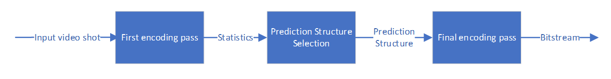
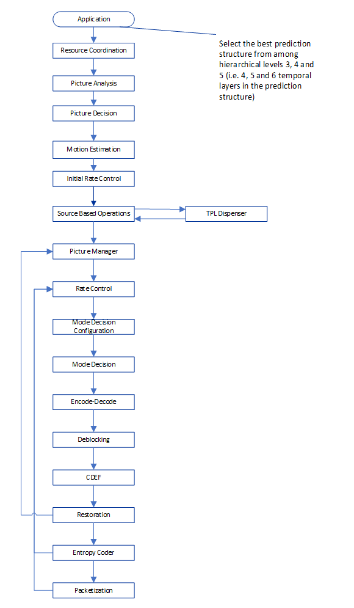

[Top level](../README.md)

# Shot-based Adaptive Prediction Structure

## 1. Description of the algorithm

In shot-based encoding, a video sequence is split into relatively short
segments that are typically few seconds long and that have uniform
spatio-temporal characteristics. Such segments are referred to as shots. Each
segment is encoded on its own using a closed GoP configuration with only one
key frame at the beginning of the shot. When shots are encoded using a
multi-pass encoding approach, data from earlier passes are used to make
decisions about the encoding settings for subsequent passes. An example of such
decisions is the prediction structure to consider in subsequent passes. In
SVT-AV1, the shot-based adaptive prediction structure algorithm makes use of
information received from the first encoding pass to decide on a suitable
prediction structure for the shot being encoded, as illustrated in Figure 1.
Moreover, the first encoding pass is configured to use an IPP flat prediction
structure.



##### Figure 1. Block diagram of the two-pass shot-based encoding process.

## 2. Implementation of the algorithm

### 2.1. Adaptive prediction structure inputs/outputs

**Input to set_max_mini_gop_size**: Generated statistics from previous encoding pass.

**Output of set_max_mini_gop_size**: Prediction structure for the shot.

### 2.2. Adaptive Prediction Structure API

Table 1 below summarises the invoked functions when Adaptive Prediction
Structure is enabled. The process where each function is called is also
indicated as well as a brief description of each function.

##### Table 1. Main function calls associated with the Adaptive Prediction Structure algorithm.

|**File**|**Function**|**Purpose**|
| --- | --- | --- |
| EbEncHandle | set_mini_gop_size_controls | Set the mini gop size controls |
| EbEncHandle | set_max_mini_gop_size | Select the suitable prediction structure for the input video shot |

### 2.3 Control flags:

The Adaptive Prediction Structure algorithm is a threshold-based algorithm. All
used thresholds are grouped under one control function called
```set_mini_gop_size_controls```. Table 2 below summarizes the control
parameters for this feature.

##### Table 2. Control flags associated with the Adaptive Prediction Structure algorithm.

|**Flag**|**Level (Sequence/Picture)**|**Description**|
| --- | --- | --- |
| adaptive_enable | Sequence | 0: Off, 1: Switch at clip level, 2: Switch at GOP level |
| short_shot_th | Sequence | Threshold to determine short scene |
| animation_type_th | Sequence | Threshold to determine animation scene |
| lm_th | Sequence | Threshold to determine low motion scene |
| hm_th | Sequence | Threshold to determine high motion scene |
| lfr_th | Sequence | Threshold to determine low frame rate scene |
| hsa_th | Sequence | Threshold to determine high static area scene |
| hmv_di_th | Sequence | Threshold to determine high mv direction scene |
| lmv_di_th | Sequence | Threshold to determine low mv direction scene |

### Details of the implementation

The adaptive prediction structure is invoked at the entry point of the final
encoding pass as depicted in Figure 2.



##### Figure 2. Diagram showing where the Adaptive Prediction Structure algorithm is used in the encoder pipeline for the shot-based final encoding pass.

The Adaptive Prediction Structure algorithm aims at selecting the maximum
mini-GoP-size based on the average collected statistics (generated by the IPP
pass) over all input frames in the shot. The algorithm consists of the
following steps:

1.  Run the IPP pass over the whole shot and collect statistics for each frame.
2.  Generate average statistics over the whole shot.
3.  Select the best mini-GoP size based on the collected statistics.

The algorithm tends to select a large mini-GoP size (32 frames) for low motion
clips, a small mini-GoP size (8 frames) for high motion clips and the default
mini-gop-size (16 frames) otherwise.

The selection of the mini-gop-size is performed as follows:

```
if ((low_motion_clip > lm_th) && !avoid_long_gop) then max-min_gop_size = 32
elseif (low_motion_clip > hm_th) then max-min_gop_size = 16
else max-min_gop_size = 8
```

where:
-  low_motion_clip is the percentage of non-moving area in the shot and is determined as follows:
   ```
   low_motion_clip = (pcnt_inter - pcnt_motion) / (number_of_frames)
   ```
   where:
   - `pcnt_inter` is the sum over all frames in the shot of the frame-based area percentage
      of blocks with inter prediction error smaller than intra prediction error.
   - `pcnt_motion` is the sum over all frames in the shot of the frame-based area percentage
      of blocks with inter prediction error smaller than intra prediction error and with non-zero motion vectors.
      The prediction errors are generated in the IPP pass.
   - `lm_th` and `hm_th` are defined in Table 2 above.
   - `avoid_long_gop` is a flag to indicate corner cases where a large mini-gop-size may hurt
     the quality although it might be a very low motion shot as is the case with short shots
     or animation shots.

## 3. Optimization of the algorithm

The Adaptive Prediction Structure is enabled by default only in the case of multi-pass encoding
(i.e., when the `TWO_PASS_IPP_FINAL` multi-pass encoding mode is used).

## Notes

The feature settings that are described in this document were compiled at
v1.7.0 of the code and may not reflect the current status of the code. The
description in this document represents an example showing how features would
interact with the SVT architecture. For the most up-to-date settings, it's
recommended to review the section of the code implementing this feature.

## References

<a name = "ref-1"> </a>

