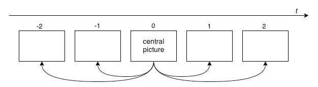
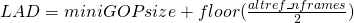
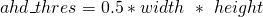
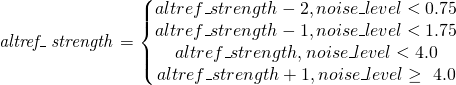
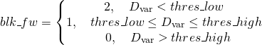
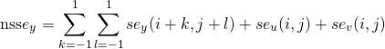
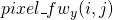
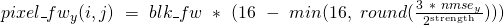
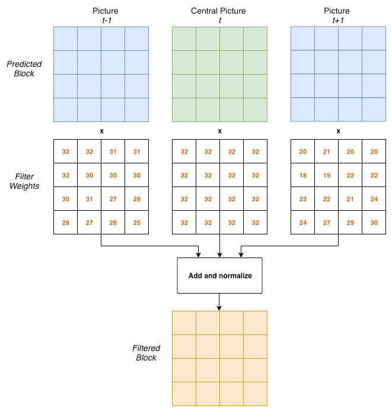
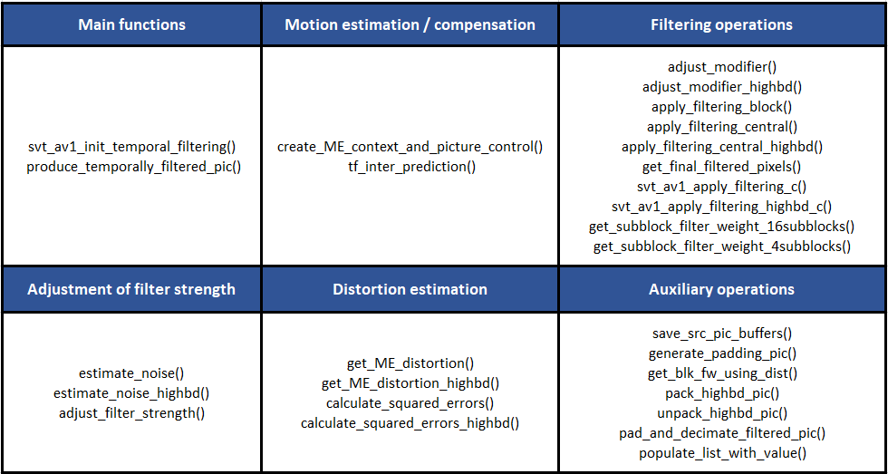

# ALTREF Pictures - Temporal filtering Appendix

## 1. Description of the algorithm

ALTREFs are non-displayable pictures that are used as reference for
other pictures. They are usually constructed using several source frames
but can hold any type of information useful for compression and the
given use-case. In the current version of SVT-AV1, temporal filtering of
adjacent video frames is used to construct some of the ALTREF pictures.
The resulting temporally filtered pictures will be encoded in place of
or in addition to the original sources. This methodology is especially
useful for source pictures that contain a high level of noise since the
temporal filtering process will produce reference pictures with reduced
noise level.

Temporal filtering is currently applied to the base layer picture of
each mini-GOP (e.g. source frame position 16 in a mini-GOP in a 5-layer
hierarchical prediction structure). In addition, filtering of the
key-frames and intra-only frames is also supported.

Two important parameters control the temporal filtering operation:
```altref_nframes``` which denotes the number of pictures to use for
filtering, also referred to as the temporal window, and
```altref_strength``` which denotes the strength of the filter.

The diagram in Fig. 1 illustrates the use of 5 adjacent pictures
(```altref_nframes = 5```), 2 past, 2 future and one central pictures, in
order to produce a single filtered picture. Motion estimation is applied
between the central picture and each future or past pictures generating
multiple motion-compensated predictions. These are then combined using
adaptive weighting (filtering) to produce the final noise-reduced
picture.




##### Fig. 1. Example of motion estimation for temporal filtering in a temporal window consisting of 5 adjacent pictures

Since a number of adjacent frames are necessary (identified by the
parameter *altref_nframes*) the Look Ahead Distance (LAD) needs to be
adjusted according to the following relationship:



For instance, if the ```miniGOPsize``` is set to 16 pictures, and
```altref_nframes``` is 7, a ```LAD``` of 19 frames would be required.

When applying temporal filtering to ALTREF pictures, an Overlay picture
is usually necessary. This picture corresponds to the same original
source picture but can use the temporally filtered version of the source
picture as a reference.

### Steps of the temporal filtering algorithm:

#### Step 1: Building the list of source pictures

As mentioned previously, the temporal filtering algorithm uses multiple
frames to generate a temporally denoised or filtered picture at the
central picture location. If enough pictures are available in the list
of source picture buffers, the number of pictures used will generally be
given by the ```altref_nframes``` parameter, unless not enough frames are
available (e.g. end of sequence). This will correspond to ```floor(altref_ nframes/2)``` past pictures and ```floor((altref_ nframes - 1)/2)``` future pictures in addition to
the central picture. Therefore, if the ```altref_nframes``` is an even
number, the number of past pictures will be larger than the number of
future pictures. Therefore, non-symmetric temporal windows are allowed.

However, in order to account for illumination changes, which might
compromise the quality of the temporally filtered picture, an adjustment
of the ```altref_nframes``` is conducted to remove cases where a
significant illumination change is found in the defined temporal window.
This algorithm first computes and accumulates the absolute difference
between the luminance histograms of adjacent pictures in the temporal
window, starting from the first past picture to the last past picture
and from the first future picture to the last future picture. Then,
depending on a threshold, ```ahd_thres```, if the cumulative difference
is high enough, edge pictures will be removed. The current threshold is
chosen based on the picture width and height:



After this step, the list of pictures to use for the temporal filtering
is ready. However, given that the number of past and future frames can
be different, the index of the central picture needs to be known.

#### Step 2: Source picture noise estimation and strength adjustment

In order to adjust the filtering strength according to the content
characteristics, the amount of noise is estimated from the central
source picture. The algorithm considered is based on a simplification of
the algorithm proposed in [\[1\]](#ref-1). The standard deviation (sigma) of the
noise is estimated using the Laplacian operator. Pixels that belong to
an edge (i.e. as determined by how the magnitude of the Sobel gradients
compare to a predetermined threshold), are not considered in the
computation. The current noise estimation considers only the luma
component.

The filter strength is then adjusted from the input value,
```altref_strength```, according to the estimated noise level, ```noise_level```.
If the noise level is low, the filter strength is decreased. The final
strength is adjusted based on the following conditions:



#### Step 3: Block-based processing

The central picture is split into 64x64 pixel non-overlapping blocks.
For each block, ``` altref_nframes - 1``` motion-compensated
predictions will be determined from the adjacent frames and weighted in
order to generate a final filtered block. All blocks are then combined
to build the final filtered picture.

#### Step 4: Block-based motion estimation and compensation

For each block and each adjacent picture, hierarchical block-based
motion estimation (unilateral prediction) is performed. A similar
version of the open-loop Hierarchical Motion Estimation (HME), performed
in subsequent steps in the encoding process, is applied. The ME motion
estimation produces ¼-pel precision motion-vectors on blocks from 64x64
to 8x8 pixels. After obtaining the motion information, sub-blocks of
size 16x16 are compensated using the AV1 normative interpolation.
Finally, during this step, a small refinement search using 1/8-pel
precision motion vectors is conducted on a 3x3 search window. Motion is
estimated on the luma channel only, but the motion compensation is
applied to all channels.

#### Step 5: Determination of block-based weights

After motion compensation, distortion between the original ()
and predicted (()) sub-blocks of size 16x16 is computed
using the non-normalized variance () of the residual
(), which is computed as follows:

=B_{p}(i,j)-B_{s}(i,j))

}{H*W})

-\mu)^2)

Based on this distortion, sub-block weights, ```blk_fw```, from 0 to 2 are
determined using two thresholds, ```thres_low``` and ```thres_high```:



Where ```thres_low = 10000``` and ```thres_high = 20000```.

For the central picture, the weights are always 2 for all blocks.

#### Step 6: Determination of pixel-based weights

After obtaining the sub-block weights, a further refinement of the
weights is computed for each pixel of the predicted block. This is based
on a non-local means approach.

First, the Squared Errors, ), between the predicted
and the central block are computed per pixel for the Y, U and V
channels. Then, for each pixel, when computing the Y pixel weight, a
neighboring sum of squared errors, , corresponding
to the sum of the Y squared errors on a 3x3 neighborhood around the
current pixel plus the U and V squared errors of the current pixel is
computed:



The mean of the ,  is then
used to computed the pixel weight  of the current
pixel location (i,j), which is an integer between {0,16}, and is
determined using the following equation:



Where strength is the adjusted *altref\_strength* parameter. The same
approach is applied to the U and V weights, but in this case, the number
of (se) values added from the Y channel depends on the chroma
subsampling used (e.g. 4 for 4:2:0).

As can be observed from the equation above, for the same amount of
distortion, the higher the strength, the higher the pixel weights, which
leads to stronger filtering.

The final filter weight of each pixel is then given by the
multiplication of the respective block-based weight and the pixel
weight. The maximum value of the filter weight is 32 (2\*16) and the
minimum is 0.

In case the picture being processed is the central picture, all filter
weights correspond to the maximum value, 32.

#### Step 7: Temporal filtering of the co-located motion compensated blocks

After multiplying each pixel of the co-located 64x64 blocks by the
respective weight, the blocks are then added and normalized to produce
the final output filtered block. These are then combined with the rest
of the blocks in the frame to produce the final temporally filtered
picture.

The process of generating one filtered block is illustrated in diagram
of Fig. 2. In this example, only 3 pictures are used for the temporal
filtering ```altref_nframes = 3```. Moreover, the values of the filter
weights are for illustration purposes only and are in the range {0,32}.



##### Fig. 2. Example of the process of generating the filtered block from the predicted blocks of adjacent picture and their corresponding pixel weights.

## 2. Implementation of the algorithm

**Inputs**: list of picture buffer pointers to use for filtering,
location of central picture, initial filtering strength

**Outputs**: the resulting temporally filtered picture, which replaces
the location of the central pictures in the source buffer. The original
source picture is stored in an additional buffer.

**Control macros/flags**:

| **Flag**         | **Level (sequence/Picture)** | **Description**    |
| ---------------- | ------------- | ------------ |
| enable\_altrefs  | Sequence                     | High-level flag to enable/disable temporally filtered pictures (default: enabled)                              |
| altref\_nframes  | Picture                      | Number of frames to use for the temporally filtering (default: 7, {0, 10}) - Can be modified on a frame-basis  |
| altref\_strength | Picture                      | Filtering strength to use for the temporally filtering (default: 5, {0, 6}) - Can be modified on a frame-basis |
| enable\_overlays | Sequence                     | Enable overlay frames (default: on)      |


### Implementation details

The current implementation supports 8-bit and 10-bit sources as well as
420, 422 and 444 chroma sub-sampling. Moreover, in addition to the C
versions, SIMD implementations of some of the more computationally
demanding functions are also available.

Most of the variables and structures used by the temporal filtering
process are located at the picture level, in the PictureControlSet (PCS)
structure. For example, the list of pictures is stored in the
```temp_filt_pcs_list``` pointer array.

For purposes of quality metrics computation, the original source picture
is stored in ```save_enhanced_picture_ptr``` and
```save_enhanced_picture_bit_inc_ptr``` (for high bit-depth content)
located in the PCS.

The current implementation disables temporal filtering on key-frames if
the source has been classified as screen content (```sc_content_detected```
in the PCS is 1).

Due to the fact that HME is open-loop, which means it operates on the
source pictures, HME can only use the source picture which is going to
be filtered after the filtering process has been finalized. The strategy
for synchronizing the processing of the pictures for this case is
similar to the one employed for the determination of the prediction
structure in the Picture Decision Process. The idea is to write to a
queue, the ```picture_decision_results_input_fifo_ptr```, which is
consumed by the HME process.

### Memory allocation

Three uint8_t or uint16_t buffers of size 64x64x3 are allocated: the
accumulator, predictor and counter. In addition, an extra picture buffer
(or two in case of high bit-depth content) is allocated to store the
original source. Finally, a temporary buffer is allocated for high-bit
depth sources, due to the way high bit-depth sources are stored in the
encoder implementation (see sub-section on high bit-depth
considerations).

### High bit-depth considerations

For some of the operations, different but equivalent functions are
implemented for 8-bit and 10-bit sources. For 8-bit sources, uint8_t
pointers are used, while for 10-bit sources, uint16_t pointers are
used. In addition, the current implementation stores the high bit-depth
sources in two separate uint8_t buffers in the EbPictureBufferDesc
structure, for example, ```buffer_y``` for the luma 8 MSB and
```buffer_bit_inc_y``` for the luma LSB per pixel (2 in case of 10-bit).
Therefore, prior to applying the temporal filtering, in case of 10-bit
sources, a packing operation converts the two 8-bit buffers into a
single 16-bit buffer. Then, after the filtered picture is obtained, the
reverse unpacking operation is performed.

### Multi-threading

The filtering algorithm operates independently in units of 64x64 blocks
and is currently multi-threaded. The number of threads used is
controlled by the variable ```tf_segment_column_count```, which depending
the resolution of the source pictures, will allocate more or less
threads for this task. Each thread will process a certain number of
blocks.

Most of the filtering steps are multi-threaded, except the
pre-processing steps: packing (in case of high bit-depth sources) and
unpacking, estimation of noise, adjustment of strength, padding and
copying of the original source buffers. These steps are protected by a
mutex, ```temp_filt_mutex```, and a binary flag, ```temp_filt_prep_done``` in
the PCS structure.

### Relevant files and functions in the codebase

The main source files that implement the temporal filtering operations
are located in Source/Lib/Encoder/Codec, and correspond to:

  - EbTemporalFiltering.c

  - EbTemporalFiltering.h (header file)

In addition, the logic to build the list of source pictures for the
temporal filtering is located in Source/Lib/Encoder/Codec:

  - EbPictureDecisionProcess.c

The table below presents the list of functions implemented in
EbTemporalFiltering.c, grouped by tasks.



## 3. Optimization of the algorithm

The current algorithm provides a good trade-off between compression
efficiency and complexity, and therefore is enabled by default for all
encoding presets, enc-modes, from 0 to 8. No optimizations for higher
speed presets are performed.

## 4. Signaling

If the temporally filtered picture location is of type ```ALTREF_FRAME``` or
```ALTREF2_FRAME```, the frame should not be displayed with the
```show_existing_frame``` strategy and should contain an associated Overlay
picture. In addition, the frame has the following field values in the
frame header OBU:

  - ```show_frame = 0```

  - ```showable_frame = 0```

  - ```order_hint``` = the index that corresponds to the central picture of the ALTREF frame

In contrast, the temporally filtered key-frame will have ```showable_frame```
= 1 and no Overlay picture.

## References

<a name = "ref-1"> </a>
\[1\] Tai, Shen-Chuan, and Shih-Ming Yang. "A fast method for image
noise estimation using Laplacian operator and adaptive edge detection."
In *2008 3rd International Symposium on Communications, Control and
Signal Processing*, pp. 1077-1081. IEEE, 2008.
