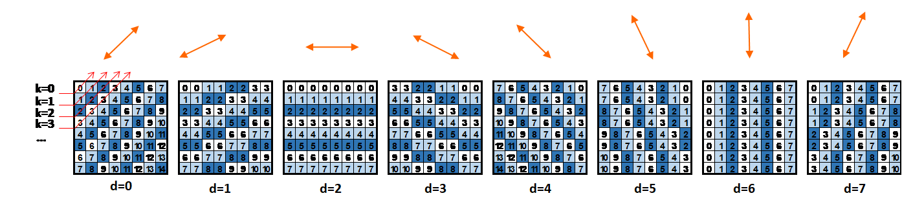
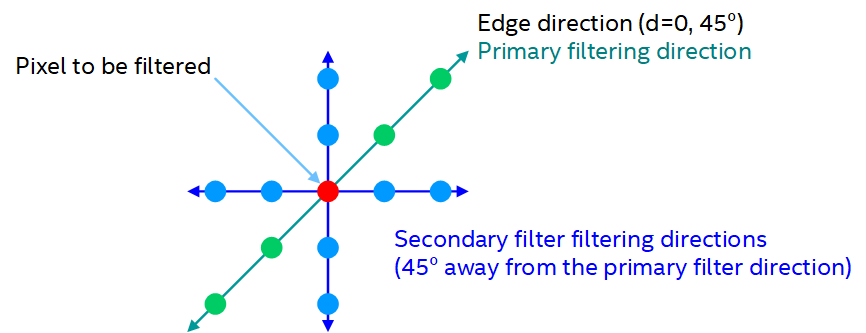
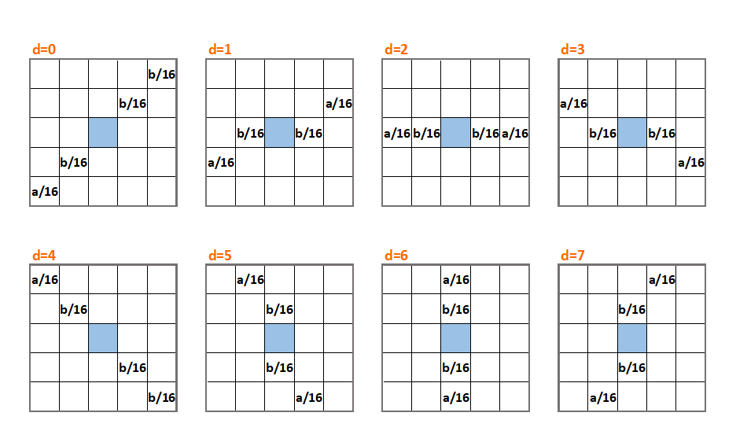
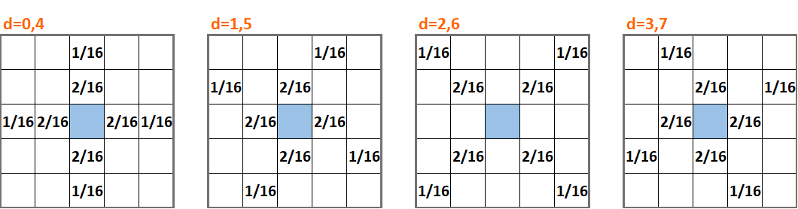
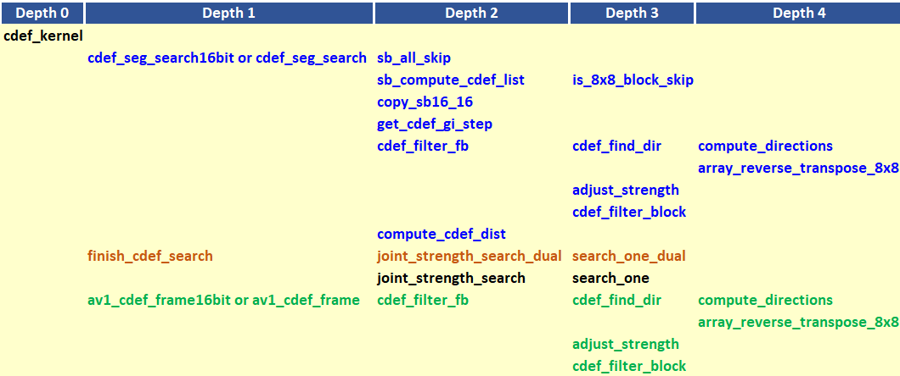

# Constrained Directional Enhancement Filter (CDEF) Appendix

## 1.  Description of the algorithm

The constrained directional enhancement filter (CDEF) is applied after
the deblocking filter and aims at improving the reconstructed picture by
addressing ringing artifacts. CDEF is a combination of the directional
de-ringing filter from the Daala codec (Mozilla) and the Constrained Low
Pass Filter (CLPF) from the Thor codec (Cisco).

Filtering is applied on an 8x8 block level, which is a large enough
block size to reliably detect edges, but small enough block size to
accurately detect edge directions. Filtering is applied to both luma and
chroma samples. For a given block, the algorithm consists of the two
main steps outlined below:

1. Identify the direction **d** of the block (i.e. direction of edges). Eight directions {0,…,7} could be identified.

2. Filtering
    * Apply a nonlinear filter along the edge in the identified direction. Filter taps are aligned in the direction of the block. The main goal is to address ringing artifacts.

    * Filter mildly along a 45 degrees direction from the edge.

The two steps are outlined in more detail in the following.

***Step 1 – Identification of edge direction***. Eight edge directions
could be considered. The directions are indexed with d=0,…,7 as
indicated in Figure 1 below.



##### Figure 1. Block directions.

For a given input block, the identification of edge direction is
performed as follows:

  - Input pixels along each of the lines k=0,1,… are averaged. The
    original sample values along each on the lines k=0,1,… are replaced
    by the average value of the samples on the line. The resulting block
    is referred to as the averaged block.

  - The variance of the error between the source block and the averaged
    block is computed.

  - The operations above are repeated for each of the eight directions.

  - The direction with the lowest variance is selected as the filtering
    direction.

The example in Figure 2 below illustrates this step for an 8x8 input block. In this
example, direction 0 resulted in the smallest error variance and hence
was selected as the block direction.


##### Figure 2. Example of block direction identification.

***Step 2 – Filtering***. The filtering operation consists of two main
steps, namely a primary filtering operation and a secondary filtering
operation. The primary filter acts along the identified block direction.
The secondary filter acts at  from the identified
direction. In the example shown in Figure 3 below, the block direction
is d=0 . The sample to be filtered is highlighted in
red. The samples to be considered when filtering the red sample in
primary filtering are highlighted in green (a total of four samples).
Those considered in the secondary filtering of the red sample are
located at  angle from the block direction and are
highlighted in blue (a total of eight samples).



##### Figure 3. Example of primary and secondary filtering directions.

The nonlinear low-pass filters used in the filtering process are given
by [\[1\]](#ref-1):

=p(i,j)+\sum_{m,n}w_{m,n}f(p(m,n)-p(i,j),S,D))

Where ) is the sample to be filtered,
) is the filtered value of
sample ),  are the filter weights,
 is a nonlinear constraint function,  is the
filter strength and  is the filter damping.

When -p(i,j)|) is small, -p(i,j),S,D)=p(m,n)-p(i,j)), implying that the filter
behaves as an FIR filter. When -p(i,j)|) is large,
-p(i,j),S,D)=0) and no filtering is applied to the sample. The function 
de-emphasizes neighboring pixels ) with large
contrast (i.e. large magnitude of -p(i,j))). The strength
 and damping  parameters control the attenuation of the large magnitude differences.


Filtering along the identified block direction is referred to as primary
filtering, and makes use of primary filtering strength and primary
damping values. The filter weights for primary filtering are shown in
Figure 4 below. The sample to be filtered is shown in blue. For even
strengths, a = 2 and b = 4, whereas for odd strengths a = 3 and b = 3.



##### Figure 4. Filter weights for primary filtering.

Filtering of samples that are at 45 degrees from the identified edge
direction for the block is referred to as secondary filtering. Secondary
filtering makes use of secondary strength and secondary damping values.
The filter weights for secondary filtering are indicated in Figure 5
below as a function of the block direction. The sample to be filtered is
shown in blue.



##### Figure 5. Filter weights for secondary filtering.


## 2.  Implementation

**Inputs to cdef\_kernel**: Output frame from the deblocking filter.

**Outputs of cdef\_kernel**: CDEF filtered frame, filter parameters.

**Controlling macros/flags**:

Control flags associated with CDEF are listed in Table 1 below.

##### Table 1. Control flags for CDEF.

| **Flag**                        | **Level**      | **Description**                                                                                                            |
| ------------------------------- | -------------- | -------------------------------------------------------------------------------------------------------------------------- |
| -cdef-mode                      | Configuration  | Command line option: 0: OFF, 1-5: ON with steps 2,4,8,16,64, -1: Auto mode (determined in code)                            |
| enable\_cdef                    | Sequence       | Indicates whether to use CDEF for the whole sequence.                                                                      |
| cdef\_filter\_mode              | Picture        | Indicates the level of complexity of the CDEF strength search as a function of the encoder mode (enc\_mode).               |
| use\_ref\_frame\_cdef\_strength | Picture        | If set, use the CDEF strength for the reference frame in optimizing the search for the CDEF strength in the current frame. |

**Implementation details**

Important function calls associated with CDEF are highlighted in Figure 6 below. The function calls are
organized according to the depth of the function call.



##### Figure 6. The main function calls associated with CDEF.

The main steps involved in the implementation of the algorithm are
outlined below, followed by more details on some of the important
functions.

Step 1 - Splitting the frame into segments

The frame to be filtered is divided into segments to allow for parallel
filtering operations on different parts of the frame. The segments are
set according to the following (see EbEncHandle.c)

```c

uint32_t meSegH = (((sequence_control_set_ptr->max_input_luma_height + 32) / BLOCK_SIZE_64) < 6) ? 1 : 6;

uint32_t meSegW = (((sequence_control_set_ptr->max_input_luma_width + 32) / BLOCK_SIZE_64) < 10) ? 1 : 10;

sequence_control_set_ptr->cdef_segment_column_count = meSegW;

sequence_control_set_ptr->cdef_segment_row_count = meSegH;

```

The segments are processed in ```cdef_kernel```. Each segment is split into
64x64 filter blocks.

Step 2: Perform CDEF search for each segment \[each running on a
separate thread\]. Each segment goes through a filter search operation
through the function (```cdef_seg_search```). For a given 64x64 filter block
in a segment, the main purpose of the search is to identify the
directions of the 8x8 blocks in the filter block, and the best filter
(Primary strength, Secondary strength) pair to use in filtering the
filter block. The primary filter strength takes value in {0,…,15},
whereas the secondary filter strength takes value in {0, 1, 2, 4}. The
(primary strength, secondary strength) pairs are then indexed and
ordered as indicated in Table 2 below:

##### Table 2. (primary strength, secondary strength) pairs.

| **Filter Strength Index** | **(Primary Strength, Secondary Strength) Pair** |
| ------------------------- | ----------------------------------------------- |
| 0                         | (0,0)                                           |
| 1                         | (0,1)                                           |
| 2                         | (0,2)                                           |
| 3                         | (0,4)                                           |
| 4                         | (1,0)                                           |
| 5                         | (1,1)                                           |
| …                         | (...,…)                                         |
| 63                        | (15,4)                                          |

The search for the best (Primary strength, Secondary strength) pair to
use is equivalent to the search for the index for such pair.

The primary and secondary luma damping values are set as a function of
the base qindex for the picture and are given by:

```c
pri_damping = 3 + (picture_control_set_ptr->parent_pcs_ptr->base_qindex >> 6);

sec_damping = 3 + (picture_control_set_ptr->parent_pcs_ptr->base_qindex >> 6);
```

Chroma damping values are always one less the luma damping value.

The CDEF search proceeds along the following steps.

  - Loop over all 64x64 filter blocks in the segment.

  - Loop over the picture planes

      - Set the range of filter strength index \[`start_gi`, `end_gi`\] to
        be considered in the best filter strength search. Details on how
        to set `start_gi` and `end_gi` are provided in the optimization
        section below.

      - Loop over the filter strengths in the filter strength index
        range \[`start_gi`, `end_gi`\]

          - Perform the following for each 8x8 non-skip block
            (`cdef_filter_fb`):

              - Find the direction for each 8x8 block (`cdef_find_dir`).

              - Filter the 8x8 block according to the identified
                direction using the set filter strength
                (`cdef_filter_block`, C only version
                `cdef_filter_block_c`. More details on
                `cdef_filter_block_c` are provided below.).

          - Compute the filtering mse for the filter block corresponding
            to the filter strength being considered
            (`compute_cdef_dist`).

Step 3: Select a subset of filter strengths to use in the final
filtering of the 64x64 filter blocks in the frame based on the filtering
results from step 2 (`finish_cdef_search`. More details on
`finish_cdef_search` are provided below.). This step is frame-based, and is performed by
only one thread.

Step 4: Complete the filtering of the frame based on the selected set of
filtering strengths from Step 3. (`av1_cdef_frame`. More details on
`av1_cdef_frame` are provided below.)

**More details about cdef\_filter\_block\_c**

For a given 8x8 block, filtering is applied to all samples in the 8x8
block. Filtering is to be applied according to the identified direction
for the 8x8 block. For a given sample to be filtered in the block, the
position of the neighboring samples to be considered in the filtering
operation are given by the array `cdef_directions` according to the
identified direction. The array is given by

```c
DECLARE_ALIGNED(16, const int32_t, cdef_directions[8][2]) = {

{ -1 * CDEF_BSTRIDE + 1, -2 * CDEF_BSTRIDE + 2 },

{ 0 * CDEF_BSTRIDE + 1, -1 * CDEF_BSTRIDE + 2 },

{ 0 * CDEF_BSTRIDE + 1, 0 * CDEF_BSTRIDE + 2 },

{ 0 * CDEF_BSTRIDE + 1, 1 * CDEF_BSTRIDE + 2 },

{ 1 * CDEF_BSTRIDE + 1, 2 * CDEF_BSTRIDE + 2 },

{ 1 * CDEF_BSTRIDE + 0, 2 * CDEF_BSTRIDE + 1 },

{ 1 * CDEF_BSTRIDE + 0, 2 * CDEF_BSTRIDE + 0 },

{ 1 * CDEF_BSTRIDE + 0, 2 * CDEF_BSTRIDE - 1 }

};
```
The primary and secondary filter coefficients are given by the array:

```c
const int32_t cdef_pri_taps[2][2] = { { 4, 2 }, { 3, 3 } };

const int32_t cdef_sec_taps[2][2] = { { 2, 1 }, { 2, 1 } };
```

where `cdef_pri_taps[0]` correspond to the case of even primary
strength, whereas `cdef_pri_taps[1]` correspond to the case of odd
primary strength.

**More details on finish\_cdef\_search in step 3**

For each 64x64 filter block, the output from step 2 is an array of
distortion values corresponding to different filter strength pairs
(Primary strength, Secondary strength). To reduce the overhead
associated with the signaling of the individual filter strength index
for each 64x64 filter block, only the a subset of the identified filter
strength pairs is selected. Final filtering of the 64x64 filter blocks
in the frame is then redone using the best among the selected subset of
filter strengths. The encoder needs to signal to decoder only the
selected subset of filter strengths for the decoder to use in the
filtering operation. The encoder could signal a set that consists of
only 1, 2, 4, or 8 different (Primary strength, Secondary strength)
pairs to be used for the frame. The specific pair to use for each 64x64
filter block is signaled separately. The search performed in
`finish_cdef_search` is to find the best RDO option (i.e. 1, 2, 4, or 8
filter strength pairs for the frame) to work with.

  - Loop over the cardinality of the set of the strength pair options (1
    then 2 then 4 then 8)

<!-- end list -->

  - Call the function `joint_strength_search_dual` to determine the
    best such set for each of the options based on filtering distortion
    (See below for details on the `joint_strength_search_dual` function
    that makes use of a greedy search algorithm). Compute the RDO cost
    of each of the options and keep track of the best option (i.e. the
    best number of bits and the corresponding set of best (Primary
    strength, Secondary strength) pairs. The latter are stored in the
    following arrays:

```c
 for (j = 0; j < 1 << nb_strength_bits; j++) {

    pPcs->cdef_strengths[j] = best_lev0[j];

    pPcs->cdef_uv_strengths[j] = best_lev1[j];

 }
```
  - Loop over the filter blocks in the frame and select for each filter
    block the best (Primary strength, Secondary strength) pair. The
    selected pair is signaled in
```c
picture_control_set_ptr->mi_grid_base[sb_index[i]]->mbmi.cdef_strength = (int8_t)best_gi;
```
  - Damping is stored in

```c
 pPcs->cdef_pri_damping = pri_damping;

 pPcs->cdef_sec_damping = sec_damping;
```
  - The most used filter strength pair in the filter blocks for the
    frame is then identified as the frame strength and its corresponding
    index is stored in `pPcs`->`cdef_frame_strength`.


**More details on joint\_strength\_search\_dual**

**Inputs:**

```c
*best_lev0,   /* Array of indices of selected luma strengths. */

*best_lev1, /* Array of indices of selected chroma strengths. */

nb_strengths, /* Number of selected (Luma_strength, Chroma_strength) pairs */

(**mse)[TOTAL_STRENGTHS], /* Array of luma and chroma filtering mse values */

sb_count,  /* Number of filter blocks in the frame */

fast, /* A flag indicating if fast search is to be performed */

start_gi, /* starting strength index for the search of the additional strengths */

end_gi /* End index for the for the search of the additional strengths */

 /* Determine nb_strengths (Luma_strength, Chroma_strength) pairs.
The list of nb_strengths pairs is determined by adding one such pair at
a time through the call to the function search_one_dual. When the
function search_one_dual is called, the search accounts for the
strength pairs that have already been added in the previous iteration of
the loop below. The loop below returns in the end best_tot_mse
representing the best filtering mse for the whole frame based on the
selected list of best (Luma_strength, Chroma_strength) pairs. */

for i = 0 to i = (nb_strengths-1) do

best_tot_mse = search_one_dual(best_lev0, best_lev1, i, mse, sb_count, fast, start_gi, end_gi);

/* Performing further refinements on the search based on the results
from the step above. */

for i = 0 to i = (4 * nb_strengths -1) do

    for j = 0 to j = (nb_strengths – 2) do

        best_lev0[j] = best_lev0[j + 1];

        best_lev1[j] = best_lev1[j + 1];

    end for

    best_tot_mse = search_one_dual(best_lev0, best_lev1, nb_strengths - 1, mse, sb_count, fast, start_gi, end_gi);

end for

return best_tot_mse;
```
**More details on search\_one\_dual\_c**

**Inputs:**
```c
*lev0 /* Array of indices of selected luma strength. */

*lev1, /* Array of indices of selected chroma strength. */

nb_strengths, /* Number of selected (Luma_strength, Chroma_strength) pairs */

(**mse)[TOTAL_STRENGTHS], /* Array of luma and chroma filtering mse values */

sb_count, /* Number of filter blocks in the frame */

fast, /* A flag indicating if fast search is to be performed*/

start_gi, /* starting strength index for the search of the additional strengths */

end_gi /* End index for the for the search of the additional strengths */

best_tot_mse = 1 << 63;

total_strengths = end_gi;

memset(tot_mse, 0, sizeof(tot_mse));

for i = 0 to (sb_count-1) do /*Loop over the filter blocks in the frame */

    best_mse = 1<< 63;

/* Loop over the already selected nb_strengths (Luma_strength,
Chroma_strength) pairs, and find the pair that has the smallest mse
(best_mse) for the current filter block. */

    for gi = 0 to gi = (nb_strengths-1) do

        curr = mse[0][i][lev0[gi]];

        curr += mse[1][i][lev1[gi]];

        if (curr < best_mse) then best_mse = curr;

    end for

/* Loop over the set of available (Luma_strength, Chroma_strength)
pairs, identify any that provide an mse better than best_mse from the
step above for the current filter block, and update any corresponding
total mse (tot_mse[j][k]). */

    for j = start_gi; j = (total_strengths-1) do

        for k = start_gi; k = (total_strengths-1) do

            best = best_mse

            curr = mse[0][i][j] + mse[1][i][k]

            if (curr < best) best = curr

                tot_mse[j][k] += best;

        end for

    end for

end for

/* Loop over the additionally searched (Luma_strength, Chroma_strength) pairs
from the step above, and identify any such pair that provided the best mse for
the whole frame. The identified pair would be added to the set of already selected pairs. */

for j = start_gi to j = (total_strengths-1) do /* Loop over the additionally searched luma strengths */

    for k = start_gi to k = (total_strengths-1) do /* Loop over the additionally searched chroma strengths */

        if (tot_mse[j][k] < best_tot_mse)

            best_tot_mse = tot_mse[j][k];

            best_id0 = j; /* index for the best luma strength */

            best_id1 = k; /* index for the best chroma strength */

        end if

    end for

end for

lev0[nb_strengths] = best_id0; /* Add the identified luma strength to the list of selected luma strengths */

lev1[nb_strengths] = best_id1; /* Add the identified chroma strength to the list of selected chroma strengths */

return best_tot_mse;

```

**More details on av1\_cdef\_frame**

Loop over the 64x64 filter blocks.

```c

/*Find the index of the CDEF strength for the filter block*/

mbmi_cdef_strength = pCs->mi_grid_base[MI_SIZE_64X64 * fbr * cm->mi_stride + MI_SIZE_64X64 * fbc]->mbmi.cdef_strength;

/*Primary luma strength*/

level = pCs->parent_pcs_ptr->cdef_strengths[mbmi_cdef_strength] / CDEF_SEC_STRENGTHS;

/*secondary luma strength*/

sec_strength = pCs->parent_pcs_ptr->cdef_strengths[mbmi_cdef_strength] % CDEF_SEC_STRENGTHS;

/*secondary luma strength takes values in {0, 1, 2, 4}. If sec_strength is equal to 3 from the step above, change it to 4. */

sec_strength += sec_strength == 3;

/*Primary chroma strength*/

uv_level = pCs->parent_pcs_ptr->cdef_uv_strengths[mbmi_cdef_strength] / CDEF_SEC_STRENGTHS;

/*secondary chroma strength*/

uv_sec_strength = pCs->parent_pcs_ptr->cdef_uv_strengths[mbmi_cdef_strength] % CDEF_SEC_STRENGTHS;

/*secondary luma strength takes values in {0, 1, 2, 4}. If sec_strength is equal to 3 from the step above, change it to 4. */

uv_sec_strength += uv_sec_strength == 3;

```
Loop over the three picture planes

Call `cdef_filter_fb` to filter the samples in the filter block.

## 3.  Optimization of the algorithm

The algorithmic optimization of the CDEF is performed by adjusting the
range of filter strength index used in the search for the best filter
strength pair for the 64x64 block. First, the encoder preset
(`picture_control_set_ptr`->`enc_mode`) is used to specify the CDEF
filter mode (`picture_control_set_ptr`->`cdef_filter_mode`) according
to Table 3 below.

##### Table 3. cdef_filter_mode as a function of encoder preset.


|**Encoder Preset (enc\_mode)** | **cdef\_filter\_mode (Case of sc\_content\_detected = 0)** | **cdef\_filter\_mode (Case of sc\_content\_detected = 1)** |
|--- |--- |--- |
|0|4|4|
|1|4|4|
|2|4|4|
|3|4|4|
|4|4|4|
|5|4|4|
|6|4|0|
|7|4|0|
|8|0|0|


The `cdef_filter_mode` specifies the parameter `gi_step` through the
function `get_cdef_gi_step`


`gi_step` = `get_cdef_gi_step`(`pPcs`->`cdef_filter_mode`);


`gi_step` represents half the width of the filter strength search
interval and is given in Table 4 below as a function of
`cdef_filter_mode`.

##### Table 4. gi_step as a function of cdef_filter_mode.


| **cdef\_filter\_mode** | **gi\_step** |
| ---------------------- | ------------ |
| **0**                  | OFF          |
| **1**                  | 1            |
| **2**                  | 4            |
| **3**                  | 8            |
| **4**                  | 16           |
| **5**                  | 64           |

The search `in cdef_seg_search` and in `finish_cdef_search` for the
filter strength is performed by considering a sub-interval of the filter
strength index \[0,63\]. The subinterval is given by
\[`cdef_ref_frame_strength` – `gi_step`, `cdef_ref_frame_strength` +
`gi_step`\], where `cdf_ref_frame_strength` is the filter strength for
the reference picture. The actual implementation is given below:

```c

gi_step = get_cdef_gi_step(pPcs->cdef_filter_mode);

mid_gi = pPcs->cdf_ref_frame_strength;

start_gi = pPcs->use_ref_frame_cdef_strength && pPcs->cdef_filter_mode == 1 ? (AOMMAX(0, mid_gi - gi_step)) : 0;

end_gi = pPcs->use_ref_frame_cdef_strength ? AOMMIN(total_strengths, mid_gi + gi_step) : pPcs->cdef_filter_mode == 1 ? 8 : total_strengths;

```

4.  **Signaling**

At the frame level, the algorithm signals the luma damping value and up
to 8 different filter strength presets to choose from. Each preset
includes luma primary preset, chroma primary preset, luma secondary
preset, a chroma secondary preset and the number of bits used to signal
the 64x64 level preset. Table 5 summarizes the parameters signaled at the frame level.

At the 64x64 filter block level, the algorithm signals the index for the
specific preset to work with for the 64x64 filter block from among the
set of presets specified at the frame level. Table 6 summarizes the parameters
signaled at the filter block level.

##### Table 5. CDEF parameters signaled at the frame level.

| **Frame level Parameters**                                        | **Values (for 8-bit content)** |
| ----------------------------------------------------------------- | ------------------------------ |
| Luma Damping D                                                    | {3, 4, 5, 6}                   |
| Number of bits used for filter block signaling                    | {0,..,3}                       |
| List of 1, 2, 4 or 8 presets. Each preset contains the following: |                                |
| Luma primary strength                                             | {0,…,15}                       |
| Chroma primary strength                                           | {0,…,15}                       |
| Luma secondary strength                                           | {0,1,2,4}                      |
| Chroma secondary strength                                         | {0,1,2,4}                      |

##### Table 6. CDEF parameters signaled at the filter block level.
| **Filter-Block-level Parameters**                                 | **Values**                     |
| ----------------------------------------------------------------- | ------------------------------ |
| Index for the preset to use                                       | Up to 7                        |


## References

<a name = "ref-1"> </a>
\[1\] Steiner Midtskogen and Jean-Marc Valin, The AV1 Constrained
Directional Enhancement Filter (CDEF), 2017.
