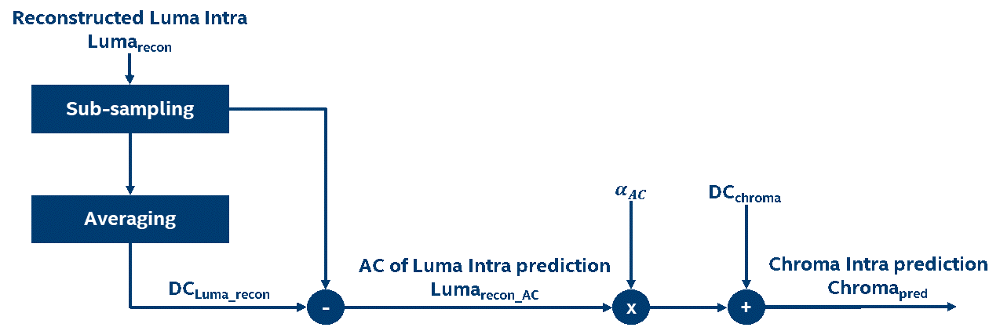
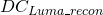
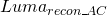
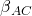
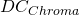
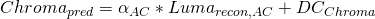
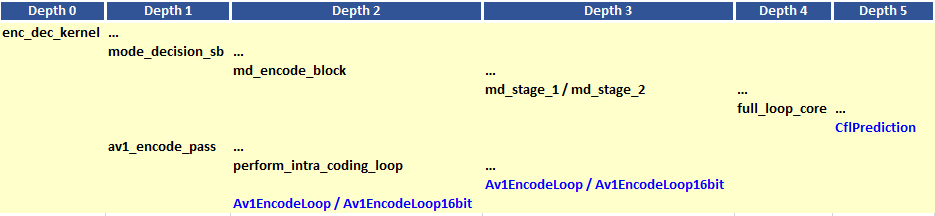
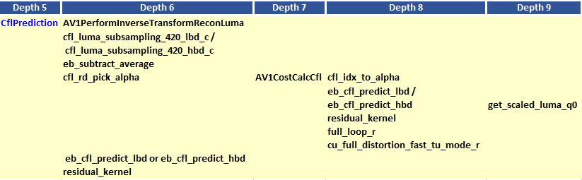
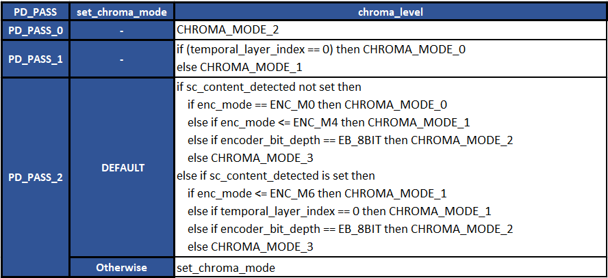

# Chroma from Luma Prediction Appendix

## 1.  Description of the algorithm

The general idea behind the chroma from luma (CfL) prediction feature is to exploit the
correlation between luma and chroma to express the Intra prediction of
chroma sample values as an affine function of the corresponding
reconstructed luma sample values, where the reconstructed luma samples are
sub-sampled to match the chroma sub-sampling. The chroma prediction is
given by


where   and  are predicted chroma
and reconstructed luma samples, respectively. The parameters  and  can be
determined (at least theoretically) using least squares regression. The feature provides gains in screen sharing
applications.

In practice, the CfL prediction is performed as illustrated in Figure 1 below.



##### Figure 1. Block diagram of the chroma from luma prediction process.

The steps illustrated in the diagram above can be summarized as follows:

  - Consider the reconstructed luma sample values.

  - Reconstructed luma samples are sub-sampled to match the chroma
    sub-sampling.

  - Calculate the  (i.e. average) of the
    reconstructed luma sample values.

  - Subtract the  from the reconstructed luma
    sample values to generate the AC reconstructed luma sample values,
     , which has a zero average.

  - Compute  and  using the
    AC reconstructed luma sample values.

  - Compute the intra DC mode chroma prediction, . The final chroma from
    luma prediction is then given by:



## 2.  Implementation of the algorithm

**Inputs**: Intra chroma code, luma inverse quantized residuals

**Outputs**: Best  and chroma residuals

**Control macros/flags**:

##### Table 1. Control flags related to the CfL prediction.
| **Flag**          | **Level**     | **Description**                                                                      |
| ----------------- | ------------- | ------------------------------------------------------------------------------------ |
| -dcfl             | Configuration | 0: OFF (do not disable), 1: ON (disable), -1: DEFAULT
| -chroma\_mode     | Configuration | Level: [0-3], -1: DEFAULT
| chroma\_level     | Picture       | Describes the Chroma level of the encoder. Indicates which Chroma modes are allowed. |

**Details of the implementation**



##### Figure 2. The main function calls leading to CfL prediction. The functions highlighted in blue are where CfL prediction takes place.




##### Figure 3. Continuation of Figure 2 showing the details of CfL processing in the function CfLPrediction.


CfL prediction takes place in MD through the function CflPrediction and in the encode pass through the function Av1EncodeLoop/Av1EncodeLoop16bit.
The details of the CfL prediction in the function CflPrediction are presented in Figure 3.
Similar flow is also followed in the function Av1EncodeLoop/Av1EncodeLoop16bit.
In the following, the details of the CfL processing in the function CflPrediction are presented.

For an intra coded block, the function CflPrediction is called when the intra_chroma_mode is set to UV_CFL_PRED. There are four steps in the function:

**Step 1**: Reconstruct the Luma samples (```AV1PerformInverseTransformReconLuma```)

The first step is to reconstruct
the luma samples, since the latter would be used to generate the chroma prediction.
At this stage in the encoder pipeline, the luma residuals are transformed,
quantized and inverse quantized. In this step, the inverse transform is
applied, and the reconstructed luma residuals are
added to the prediction to build the reconstructed samples.

**Step 2**: Compute the AC component of the luma intra prediction

In this step, the luma reconstructed samples are down sampled to match
the size of chroma samples using the ``` cfl_luma_subsampling_420 ```
function. Then the AC luma values are calculated by subtracting the DC luma
value using the ```eb_subtract_average``` function. The resulting AC values are stored
in the ```pred_buf_q3 buffer```.

**Step 3**: Find the best 

The best  values for the chroma components are calculated by
minimizing the overall full cost. The algorithm performs a search over the 16 possible
values of  and finds the best value that minimizes the joint prediction cost.
The search is performed in the context of a joint sign between the two chroma components.
After the best value for  is calculated, the joint cost is compared with the cost of DC prediction and the winner is selected.


**Step 4**: Generate the chroma prediction

After the best  is selected, the prediction using the
CfL mode is performed using the ```eb_cfl_predict``` function. The chroma
residuals are then calculated using the function ```residual_kernel```.

## 3.  Optimization of the algorithm

Finding the best  requires searching different
values in the set of allowed  values and calculating the cost
associated with each value. Performing this  search
process in MD for every luma mode and block size
at MD would be very complex. In order to find the best quality-speed
trade off, there is an option to perform the selection of the best
 at the encode pass and only on the final chosen intra coding mode.
This option is signaled using the ```evaluate_cfl_ep flag```. The flag depends on the chroma
level, which in turn depends on the chroma mode. The description of the chroma mode settings is given in Table 2.

##### Table 2. Chroma mode description.

| **chroma\_Mode** | **evaluate\_cfl\_ep**      |
| ----------------- | -------------------------- |
| CHROMA_MODE_0 (0)                 | Full chroma search @ MD, including CfL         |
| CHROMA_MODE_1 (1)                 | Fast chroma search @ MD, including CfL          |
| CHROMA_MODE_2 (2)                 | Chroma blind @ MD + CfL @ Encode Pass |
| CHROMA_MODE_3 (3)                 | Chroma blind @ MD + no CfL @ Encode Pass                |


The chroma_level settings as a function of the encoder settings are given in Table 3.

##### Table 3. chroma_level settings and description.



The settings of evaluate_cfl_ep as a function of chroma _level are as indicated in Table 4.

##### Table 4. Evaluate\_cfl\_ep as a function of chroma\_level.

| **chroma\_level** | **evaluate\_cfl\_ep**      |
| ----------------- | -------------------------- |
| 0                 | α selection at MD          |
| 1                 | α selection at MD          |
| 2                 | α selection at encode pass |
| 3                 | no CFL mode                |

As the ```chroma_level``` increases, so does the complexity of the feature
and the quality of the chroma prediction.

## 4.  Signaling

CfL is a chroma mode that is only allowed for blocks with height
and width of 32 or smaller. The entropy encoder signals the chroma
mode per block and if the mode is CfL, extra parameters are included in
the bit stream:

  - ```cfl_alpha_signs``` contains the sign of the alpha values for U and
    V packed together into a single syntax element with 8 possible
    values. (The combination of two zero signs is prohibited as it is
    redundant with DC Intra prediction.)

  - ```cfl_alpha_u``` contains the absolute value of alpha minus one for
    the U component.

  - ```cfl_alpha_v``` contains the absolute value of alpha minus one for
    the U component.

## References

[1] Luc N. Trudeau, Nathan E. Egge and David Barr,
“Predicting Chroma from Luma in AV1”, Data Compression Conference, 2017.
