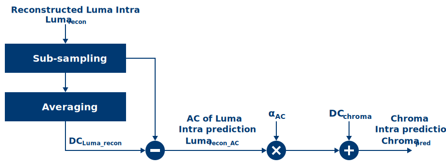

[Top level](../README.md)

# Chroma from Luma Prediction

## 1. Description of the algorithm

The general idea behind the chroma from luma (CfL) prediction feature is to
exploit the correlation between luma and chroma to express the Intra prediction
of chroma sample values as an affine function of the corresponding
reconstructed luma sample values, where the reconstructed luma samples are
sub-sampled to match the chroma sub-sampling. The chroma prediction is given by

$`Chroma_{pred}=\alpha*Luma_{recon}+\beta`$

where $`Chroma_{pred}`$ and
$`Luma_{recon}`$ are predicted chroma
and reconstructed luma samples, respectively. The parameters
$`\alpha`$ and
$`\beta`$ can be determined (at least
theoretically) using least squares regression. The feature provides gains in
screen sharing applications.

In practice, the CfL prediction is performed as illustrated in Figure 1 below.



##### Figure 1. Block diagram of the chroma from luma prediction process.

The steps illustrated in the diagram above can be summarized as follows:

  - Consider the reconstructed luma sample values.

  - Reconstructed luma samples are sub-sampled to match the chroma
    sub-sampling.

  - Calculate the $`DC_{Luma\_recon}`$ (i.e. average) of the
    reconstructed luma sample values.

  - Subtract the $`DC_{Luma\_recon}`$ from the reconstructed luma sample values to generate the AC reconstructed luma sample values, $`Luma_{recon\_AC}`$, which has a zero average.

  - Compute $`\alpha_{AC}`$ using the AC reconstructed luma sample values.

  - Compute the intra DC mode chroma prediction, $`DC_{chroma}`$. The final chroma
    from luma prediction is then given by:

$`Chroma_{pred} = \alpha_{AC} * Luma_{recon,AC} + DC_{Chroma}`$

## 2. Implementation of the algorithm

**Inputs**: luma inverse quantized residuals

**Outputs**: Best $`\alpha`$ and chroma residuals

**Control macros/flags**:

##### Table 1. Control flags related to the CfL prediction.
| **Flag**          | **Level**     | **Description**                                                                      |
| ----------------- | ------------- | ------------------------------------------------------------------------------------ |
| cfl_level         | Picture       | Describes the CfL level of the encoder.                                              |

**Details of the implementation**

CfL prediction takes place in MD through the ```cfl_prediction``` function
and in the encode pass through the ```Av1EncodeLoop/Av1EncodeLoop16bit``` function. The details of CfL processing in ```cfl_prediction``` are presented below.

For an intra coded block, the function ```cfl_prediction``` is called in MD stage 3 (the final stage) when CfL prediction is allowed and enabled for the block. There are four steps in the function:

**Step 1**: Generate the non-CfL cost (i.e. the cost of using a non-CfL chroma prediction mode).  If a chroma cost is already available from a previous chroma search, this step can be skipped.  The non-CfL cost is needed for deciding if CfL or non-CfL chroma prediction mode should be selected.

**Step 2**: If not already available, generate the DC chroma prediction (needed for CfL prediction).

**Step 3**: Compute the AC component of the luma intra prediction (compute_cfl_ac_components)

Reconstruct the Luma samples (av1_perform_inverse_transform_recon_luma)

The first step is to reconstruct the luma samples, since the latter would be used to generate the chroma prediction. At this stage in the encoder pipeline, the luma residuals are transformed, quantized and inverse quantized. In this step, the inverse transform is applied, and the reconstructed luma residuals are added to the prediction to build the reconstructed samples.

Compute the AC component of the luma intra prediction

In this step, the luma reconstructed samples are down sampled to match
the size of chroma samples using the ``` cfl_luma_subsampling_420 ```
function. Then the AC luma values are calculated by subtracting the DC luma
value using the ```svt_subtract_average``` function. The resulting AC values are stored
in the ```pred_buf_q3 buffer```.

**Step 4**: Find the best $`\alpha`$ (md_cfl_rd_pick_alpha)

The best $`\alpha`$ values for the chroma components are calculated by
minimizing the overall full cost. The algorithm performs a search over the 16 possible
values of $`\alpha`$ and finds the best value that minimizes the joint prediction cost.
The search is performed in the context of a joint sign between the two chroma components.
After the best value for $`\alpha`$ is calculated, the joint cost is compared with the cost of DC prediction and the winner is selected.


**Step 5**: Generate the chroma prediction

After selecting the best  $`\alpha`$ and generating the associated cost, set the chroma mode to be used for the block (either CfL or the best non-CfL mode, whichever has a lower cost). Generate the chroma prediction to be used later in the transform path.

## 3. Optimization of the algorithm

Finding the best $`\alpha`$ requires searching different
values in the set of allowed $`\alpha`$ values and calculating the cost
associated with each value. Performing this $`\alpha`$ search
process in MD for every luma mode and block size
at MD would be very costly. In order to find the best quality-speed
trade offs for the feature, CfL and UV (i.e. chroma) control signals are defined with multiple levels.
Table 2 shows the CfL control signals and their descriptions.
The CfL control signals are set in the function ```set_cfl_ctrls``` based on the ```cfl_level``` value.

##### Table 2. CfL control signals description.

| **Signal**        | **Description**                                                                                                                                                                                           |
| ----------------- | --------------------------------------------------------------------------------------------------------------------------------------------------------------------------------------------------------- |
| enabled           | 0/1: Disable/Enable CfL candidate injection                                                                                                                                                               |
| itr_th            | Threshold to indicate the minimum number of α values to try. However if a large enough number of α values are evaluated without improvements in the overall rate-distortion cost, the search would stop.  |

Table 3 shows the CfL-related UV control signal and its description. The signal is set in the function ```set_chroma_controls``` based on the chroma level ```uv_level```.

The CfL levels are set according to the encoder preset, PD_PASS, temporal layer index, slice type and screen content class.

## 4. Signaling

CfL is an Intra chroma mode that is allowed only for blocks with height and width of 32 or smaller.
The entropy encoder signals the chroma mode per block and if the mode is CfL,
extra parameters are included in the bit stream:

  - ```cfl_alpha_signs``` contains the sign of the alpha values for U and
    V packed together into a single syntax element with 8 possible
    values. (The combination of two zero signs is prohibited as it is
    redundant with DC Intra prediction.)

## Notes

The feature settings that are described in this document were compiled at
v2.2.0 of the code and may not reflect the current status of the code. The
description in this document represents an example showing how features would
interact with the SVT architecture. For the most up-to-date settings, it's
recommended to review the section of the code implementing this feature.

## References

[1] Luc N. Trudeau, Nathan E. Egge and David Barr,
“Predicting Chroma from Luma in AV1”, Data Compression Conference, 2017.
