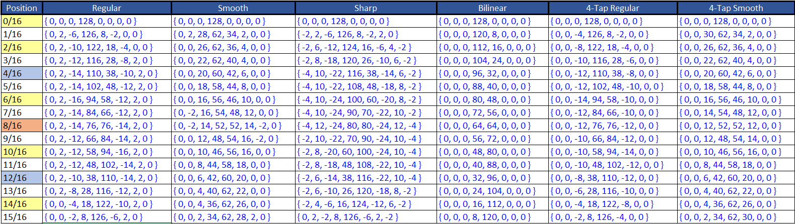
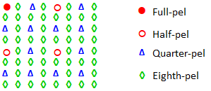
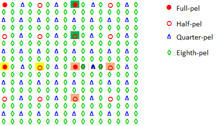
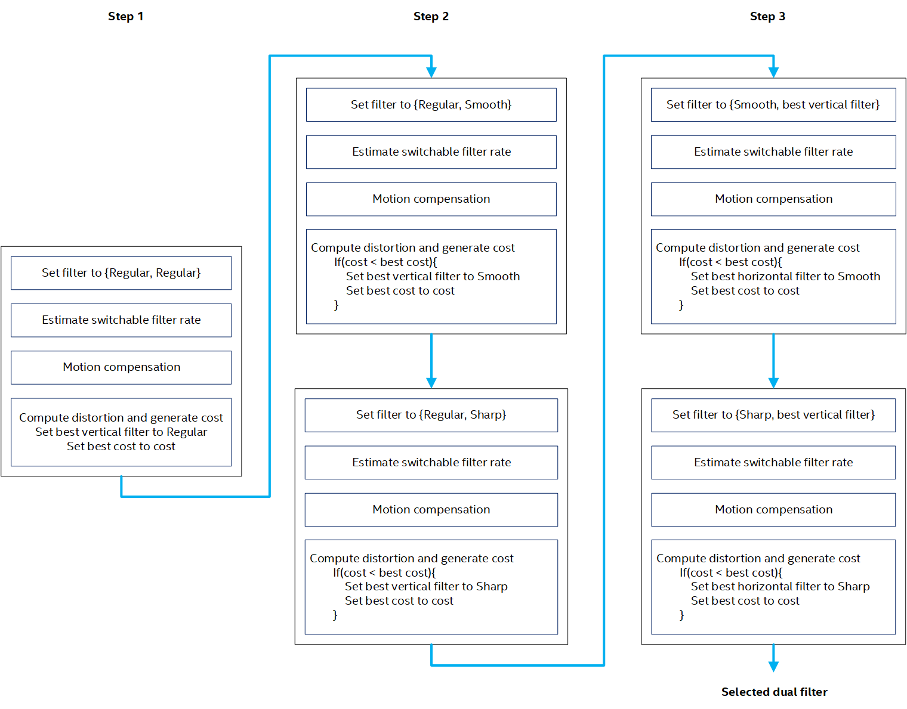
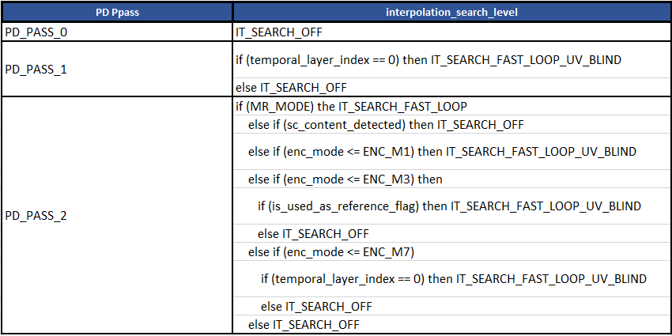

# Sub-pel Interpolation and Interpolation Filter Search

## 1. Description of the algorithm

Motion vectors in SVT-AV1 can be provided with up to eighth-pel accuracy
for luma. The main compliant interpolation filters in AV1 are the
following three 8-tap filters:

  - Regular

  - Sharp - Sharpens the prediction around the edges.

  - Smooth - Blurs the prediction.

Table 1 below lists the different compliant interpolation filters. The
8-tap filters (Regular, Smooth, Sharp) are used with large blocks sizes
(width \> 4). Bilinear filters are also used in fast interpolation
operations (i.e. a speed feature). The 4-tap filters (Regular/Sharp,
Smooth) are used with small block sizes (width \<= 4).

Vertical and horizontal interpolation can be performed using different
1D filters. Interpolation filter selection can be performed at the frame
level or at the block level. Luma filters are different from chroma
filters. As noted in Table 1 below, beyond  position,
filter coefficients are in reverse order as compared to the filter coefficients for the
mirror position before  position.

##### Table 1. Sub-pel interpolation filters.



To illustrate the process by which subpel samples are generated,
consider the diagram shown in Figure 1 below where All sub-pel positions
shown in the diagram are associated with the full-pel position (red
dot). All sub-pel positions are generated directly from full-pel values,
either in one step or in two steps.

  - Sub-pel positions in the row of full-pel pixels are generated using
    only horizontal filtering. The filter to use is deduced from the
    1/16th x offset of the sub-pel position from the full pel position.

  - Sub-pel positions in the column of full-pel pixels are generated
    using only vertical filtering. The filter to use is deduced from the
    1/16th y offset of the sub-pel position from the full pel position.

  - Diagonal sub-pel positions are generated in two steps using a
    combination of horizontal and vertical filters.

      - Horizontal filtering is performed first. The filter to use is
    deduced from the  offset of the sub-pel position
    from the full-pel position. The buffer for horizontal filtering is
    expanded in the y direction on both ends of the block to produce
    additional filtered rows that would be used in vertical filtering.

      - Vertical filtering is then performed. The filter to use is deduced
    from the  offset of the sub-pel position from the
    full-pel position.



##### Figure 1. Sub-pel positions.

An illustration of the interpolation process is given in the following
by considering the sub-pel positions illustrated in Figure 2 below.
Consider for example the case of generating half-pel samples around the
best full-pel position (in orange), and assume regular filters are used.
The steps involved in the process are outlined in the following:
  - All half-pel positions are generated using the 
    filter: **{** **0,** **2,** **-14,** **76,** **76,** **-14,**
    **2,** **0** **}**
  - Half-pel positions (orange and yellow) in the row of full-pel
    pixels:
      - Generated using only horizontal filtering.
      - The full-pel buffer used in the interpolation is pointed to by
        the full-pel position having the same color as the half-pel
        position being generated.
  - Half-pel positions (green and orange) in the column of full-pel
    pixels:
      - Generated using only vertical filtering.
      - The full-pel buffer used in the interpolation is pointed to by
        the full-pel position having the same color as the half-pel
        position being generated.
  - Diagonal sub-pel positions are generated using a combination of
    horizontal and vertical filters.
      - Horizontal filtering is performed first. The buffer for
        horizontal filtering is expanded in the y direction on both
        ends of the block to produce additional filtered rows that
        would be used in vertical filtering in the second step (e.g. 3
        lines of full-pel pixels are added at the top of the block and
        4 lines of full-pel pixels are added at the bottom of the
        block).
      - Vertical filtering is then performed on the intermediate
        results from horizontal filtering.



##### Figure 2. Example of sub-pel calculations.

## 2.  Implementation of the algorithm

**Inputs:**

  - Reference luminance samples.

  - Source luminance samples.

  - frame\_type\_neighbor\_array

  - interpolation\_type\_neighbor\_array

**Outputs**:

  - Predicted block.

**Control macros/flags**:

The control flags associated with interpolation filtering are indicated
in Table 2 below.

Table 2. Control flags for interpolation filtering.

| **Flag**                     | **Level (sequence/Picture)** | **Description**                                                                                     |
| ---------------------------- | ---------------------------- | --------------------------------------------------------------------------------------------------- |
| allow\_high\_precision\_mv   | Picture                     | When set, it indicates that eighth-pel MV precision is active.                                      |
| interpolation\_search\_level | Picture                      | Setting to decide on the tradeoff between complexity and performance in interpolation filter search |

## 3. Optimization of the algorithm

To account for the varying characteristics of the video picture in both the horizontal and vertical directions, the selection of the interpolation filter could be done independently for each of the two directions. The selection could be performed through an interpolation filter search, where in addition to the (Regular, Regular) vertical and horizontal filter pair, eight other combination pairs could be evaluated in motion compensation for the same motion vector.  The selection of the pair to work with is based on a rate-distortion cost where the filter combination that provides the lowest rate-distortion cost is selected as the best filter pair. The selected filter pair (which corresponds to the best filter combination) is used in the encode pass final motion compensation in the case where the associated candidate is selected as the best candidate in inter-depth decision.

  As depicted in the Figure 3 below, the interpolation filter search
  consists of three main steps:

<!-- end list -->

  - Step1: Test Regular filters for both vertical and
    horizontal directions.

  - Step2: Fix the horizontal filter to be Regular and
    search for the best vertical filter.

  - Step3: Fix the vertical filter to be the best filter from
    step 2 and search for the best horizontal filter.



##### Figure 3. Diagram illustrating the interpolation filter search process.

The optimization of the interpolation filter search is performed at
two levels. The first level concerns the block sizes where interpolation
search in invoked. The use of interpolation filter search could be
restricted according to block size using the
```interpolation_filter_search_blk_size``` flag as indicated in the
Table 3 and Table 4 below.

##### Table 3. Description of the different interpolation\_filter\_search\_blk\_size settings.

| **interpolation\_filter\_search\_blk\_size** | **Description**                                     |
| -------------------------------------------- | --------------------------------------------------- |
| 0                                            | Interpolation filter search ON for 8x8 and above.   |
| 1                                            | Interpolation filter search ON for 16x16 and above. |
| 2                                            | Interpolation filter search ON for 32x32 and above. |

##### Table 4. interpolation\_filter\_search\_blk\_size settings as a function of the encoder preset.

| **Encoder Preset** | **interpolation\_filter\_search\_blk\_size** |
| ------------------ | -------------------------------------------- |
| 0 to 4             | 0                                            |
| 5 to 8             | 1                                            |

The second level of optimization concerns where in the MD pipeline
interpolation filter search is used. The flag
```interpolation_search_level``` is used to indicate different levels of
quality-complexity tradeoff points in term of interpolation filter
search, as indicated in the Table 5 below.

##### Table 5. Description of the different settings of the interpolation\_search\_level flag.

| **interpolation\_search\_level**         | **Description**                                                                                                     |
| ---------------------------------------- | ------------------------------------------------------------------------------------------------------------------- |
| IT\_SEARCH\_OFF (0)                      | Disable interpolation search                                                                                        |
| IT\_SEARCH\_INTER\_DEPTH (1)             | Apply interpolation search at inter depth decision level on the best candidate if it is applicable                  |
| IT\_SEARCH\_FULL\_LOOP (2)               | Apply interpolation search at the full-loop level on the survived mode candidate from the fast-loop when applicable |
| IT\_SEARCH\_FAST\_LOOP\_UV\_BLIND (3)    | Apply interpolation in the fast-loop for luminance only when applicable                                             |
| IT\_SEARCH\_FAST\_LOOP (4)               | Apply interpolation in the fast-loop when applicable                                                                |

The ```interpolation_search_level``` is set as a function the PD\_PASS
as indicated in Table 6 below.

##### Table 6. Description of the interpolation\_search\_level as a function of the encoder preset.



## 4.  Signaling

Each of the vertical filter type and horizontal filter type are
signaled independently in the bitstream.

## References

\[1\] C. Chiang, J Han, S. Vitvitskyy, D. Mukherjee, and Y. Xu,
“Adaptive interpolation filter scheme in AV1,” International Conference on Image Processing, 2017.
