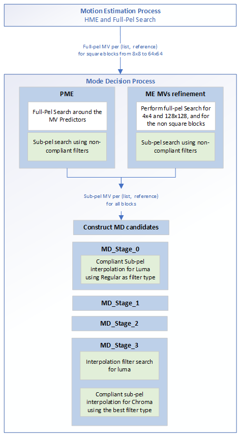

[Top level](../README.md)

# Sub-pel Interpolation and Interpolation Filter Search

## 1. Compliant Sub-Pel Interpolation
### 1.1 Introduction

Motion vectors in SVT-AV1 can be provided with up to eighth-pel accuracy
for luma. The main compliant interpolation filters in AV1 are the
following three 8-tap filters:

  - Regular

  - Sharp - Sharpens the prediction around the edges.

  - Smooth - Blurs the prediction.

Table 1 below lists the different compliant interpolation filters. The
8-tap filters (Regular, Smooth, Sharp) are used with large blocks sizes
(width \> 4). Bilinear filters are also used in fast interpolation
operations (i.e. a speed feature). The 4-tap filters (Regular/Sharp,
Smooth) are used with small block sizes (width \<= 4).

Vertical and horizontal interpolation can be performed using different
1D filters. Interpolation filter selection can be performed at the frame
level or at the block level. Luma filters are different from chroma
filters. As noted in Table 1 below, beyond $`8/16^{th}`$ position,
filter coefficients are in reverse order as compared to the filter coefficients for the
mirror position before $`8/16^{th}`$ position.

##### Table 1. Sub-pel interpolation filters.


To illustrate the process by which subpel samples are generated,
consider the diagram shown in Figure 1 below where All sub-pel positions
shown in the diagram are associated with the full-pel position (red
dot). All sub-pel positions are generated directly from full-pel values,
either in one step or in two steps.

  - Sub-pel positions in the row of full-pel pixels are generated using
    only horizontal filtering. The filter to use is deduced from the
    1/16th x offset of the sub-pel position from the full pel position.

  - Sub-pel positions in the column of full-pel pixels are generated
    using only vertical filtering. The filter to use is deduced from the
    1/16th y offset of the sub-pel position from the full pel position.

  - Diagonal sub-pel positions are generated in two steps using a
    combination of horizontal and vertical filters.

      - Horizontal filtering is performed first. The filter to use is
    deduced from the $`1/16^{th}`$ offset of the sub-pel position
    from the full-pel position. The buffer for horizontal filtering is
    expanded in the y direction on both ends of the block to produce
    additional filtered rows that would be used in vertical filtering.

      - Vertical filtering is then performed. The filter to use is deduced
    from the $`1/16^{th}`$ offset of the sub-pel position from the
    full-pel position.


##### Figure 1. Sub-pel positions.

An illustration of the interpolation process is given in the following
by considering the sub-pel positions illustrated in Figure 2 below.
Consider for example the case of generating half-pel samples around the
best full-pel position (in orange), and assume regular filters are used.
The steps involved in the process are outlined in the following:
  - All half-pel positions are generated using the $`8/16^{th}`$
    filter: **{** **0,** **2,** **-14,** **76,** **76,** **-14,**
    **2,** **0** **}**
  - Half-pel positions (orange and yellow) in the row of full-pel
    pixels:
      - Generated using only horizontal filtering.
      - The full-pel buffer used in the interpolation is pointed to by
        the full-pel position having the same color as the half-pel
        position being generated.
  - Half-pel positions (green and orange) in the column of full-pel
    pixels:
      - Generated using only vertical filtering.
      - The full-pel buffer used in the interpolation is pointed to by
        the full-pel position having the same color as the half-pel
        position being generated.
  - Diagonal sub-pel positions are generated using a combination of
    horizontal and vertical filters.
      - Horizontal filtering is performed first. The buffer for
        horizontal filtering is expanded in the y direction on both
        ends of the block to produce additional filtered rows that
        would be used in vertical filtering in the second step (e.g. 3
        lines of full-pel pixels are added at the top of the block and
        4 lines of full-pel pixels are added at the bottom of the
        block).
      - Vertical filtering is then performed on the intermediate
        results from horizontal filtering.


##### Figure 2. Example of sub-pel calculations.

### 1.2 Implementation of the sub-pel search
#### 1.2.1 Sub-pel search in the SVT-AV1 Encoder

Figure 3 illustrates the different encoder tasks that involve sub-pel search.
The Motion Estimation (ME) performs a Hierarchical Motion Estimation (HME) for
each single 64x64, and a Full-Pel search around the HME-MV for the square
blocks from 8x8 to 64x64. Those operations are performed at the Motion
Estimation Process where only source input pictures could be used as reference
pictures. In the Mode Decision Process, where the reconstructed pictures could
be used as reference pictures, full-pel MVs are derived for the 4x4, the
128x128 and the non-square bocks, a then sub-pel search could take place.

The sub-pel refinement could be performed at both partitioning decision pass 0
(PD_PASS_0) and the partitioning decision pass 1 (PD_PASS_1). However the
refinement accuracy is always higher at PD_PASS_1. The sub-pel refinement is
also considered in the Predictive Motion Estimation (PME) step.

The sub-pel search deploys non-compliant/short filters (e.g., 4-tap or
bilinear), and once all full-pel ME/PME MVs for a each given (list, reference)
are refined, the MD candidates are constructed and then placed into the MD
queue for evaluation through the different MD stages where the use of compliant
filters becomes necessary (e.g., at MD_Stage_0 towards an accurate prediction,
and at MD_Stage_3 towards compliant streams for the cases where the Encode-Pass
is bypassed).



Figure 3. Sub-pel calculations in the Mode Decision process.

#### 1.2.2 Search method

The Sub-pel search is a logarithmic search that keeps stepping at 1/2-Pel units
until no further block-error reduction, then repeats the same process for
1/4-Pel refinement and 1/8-Pel refinement. Along the way it skips many diagonal
positions.

#### 1.2.3 Sub-pel search control

##### Table 2. Sub-Pel search control signals.
| **Signal(s)**         | **Description**                                                                                                                                                                                                                                                                                                                                                    |
| -----------           | -----------------                                                                                                                                                                                                                                                                                                                                                  |
| enabled               | Specifies whether the sub-pel search will be performed or not (0: OFF, 1: ON).                                                                                                                                                                                                                                                                                     |
| subpel_search_type    | Specifies the interpolation filter tap (1: 2-tap filter, 2: 4-tap filter, 3: 8-tap filter).                                                                                                                                                                                                                                                                        |
| max_precision         | Specifies the refinement precision (or number of rounds) (0: 1/8-pel (3 rounds), 1: 1/4-pel (2 rounds), 2: 1/2-pel (1 round), 3: Full-pel-no refinement (0 round)).                                                                                                                                                                                                |
| subpel_search_method  | Specifies whether pruning will be applied to 1/2-pel position(s) or not (SUBPEL_TREE: No, SUBPEL_TREE_PRUNED: YES).                                                                                                                                                                                                                                                |
| subpel_iters_per_step | Specifies the maximum number of steps in the logarithmic sub-pel search before giving up.                                                                                                                                                                                                                                                                          |
| pred_variance_th      | Specifies the full-pel prediction-block-variance threshold under which the sub-pel search is not performed; do not perform sub-pel if the variance of the full-pel prediction-block is low (where interpolation would unlikely modify the full-pel samples).                                                                                                       |
| abs_th_mult           | Specifies the full-pel prediction-block-error-threshold below which sub-pel search is not performed; do not perform sub-pel if the prediction-block-error is already low.                                                                                                                                                                                          |
| round_dev_th          | Specifies the prediction-block-error deviation threshold between round-(N-1) and round-(N-2) under which the refinement is paused; pause the refinement if the prediction-block-error is not getting better through the process (the check takes place at only the 2nd round (prior to the 1/4-Pel refinement) or the 3rd round (prior to the 1/8-Pel refinement). |
| skip_diag_refinement  | Specifies the refinement accuracy for diagonal position(s).                                                                                                                                                                                                                                                                                                        |
| skip_zz_mv            | Specifies whether the sub-pel search will be performed around (0,0) or not (0: OFF, 1: ON).                                                                                                                                                                                                                                                                        |
| min_blk_sz            | Minimum block size subpel is searched.  Below this size, subpel is skipped.                                                                                                                                                                                                                                                                        |
| Mvp_th            | When greater than 0, use MVP vs. ME distortion information to skip quarter-pel and eighth-pel search.                                                                                                                                                                                                                                                                        |

## 2. Interpolation Filter Search
### 2.1 Search Method

To account for the varying characteristics of the video picture in both the
horizontal and vertical directions, the selection of the interpolation filter
could be done independently for each of the two directions. The selection could
be performed through an interpolation filter search, where in addition to the
(Regular, Regular) vertical and horizontal filter pair, eight other combination
pairs could be evaluated in motion compensation for the same motion vector. The
selection of the pair to work with is based on a rate-distortion cost where the
filter combination that provides the lowest rate-distortion cost is selected as
the best filter pair. The selected filter pair (which corresponds to the best
filter combination) is used in the Encode Pass final motion compensation in the
case where the associated candidate is selected as the best candidate in
inter-depth decision.

As depicted in the Figure 4 below, the interpolation filter search consists of three main steps:
- Step1: Test Regular filters for both vertical and horizontal directions.
- Step2: Fix the horizontal filter to be Regular and search for the best vertical filter.
- Step3: Fix the vertical filter to be the best filter from step 2 and search for the best horizontal filter.


Figure 4. Diagram illustrating the interpolation filter search process.

In the current implementation, the dual option is not active in any of the
presets. Only (Regular, Regular), (Smooth, Smooth) and (Sharp, Sharp) are
available.

### 2.2 Optimization of the Interpolation Filter Search

Various signals are used to specify the interpolation filter search settings.
The following table presents a brief description for each signal. These
parameters are decided by ```interpolation_search_level```, which is also
function of the enc_mode, input resolution, and skip selection at the reference
frame(s) if available (for temporal layer 1 and higher). Basically, the higher
the resolution and the skip selection at the reference frame(s), the higher is
```interpolation_search_level``` towards a faster interpolation filter search.

The ```interpolation_search_level``` is set at the Mode Decision Configuration
Process, while ```set_interpolation_search_level_ctrls()``` is called at the
Mode Decision Process for only the second Partitioning Decision Pass
(PD_PASS_1) as the interpolation filter search is not used in the first
Partitioning Decision Pass (PD_PASS_0) (i.e. (Regular, Regular) is used for all
candidates).

##### Table 3. Control flags for the interpolation filter search.
| **Signal(s)**                  | **Description**                                                                                                                                                                                                                        |
| -----------                    | -----------------                                                                                                                                                                                                                      |
| Level                          | Specifies the MD Stage where the interpolation filter search will take place (IFS_MDS0, IFS_MDS1, IFS_MDS2, or IFS_MDS3 for MD Stage 0, MD Stage 1, MD Stage 2, and MD Stage 3, respectively).                                         |
| subsampled_distortion          | Specifies whether sub-sampled input/prediction will be used at the distortion computation (0: OFF, 1: ON, NA for block height 16 and lower).                                                                                           |
| skip_sse_rd_model              | Specifies whether a model will be used for rate estimation or not (0: NO (assume rate is 0), 1: estimate rate from distortion).                                                                                                        |

## 3. Signaling

Each of the vertical filter type and horizontal filter type can be signaled
independently in the bitstream when enable_dual_filter, under the sequence header, is true.  Otherwise, only one filter type is signaled, and will be the horizontal and vertical filter type.

## Notes

The feature settings that are described in this document were compiled at
v2.1.0 of the code and may not reflect the current status of the code. The
description in this document represents an example showing how features would
interact with the SVT architecture. For the most up-to-date settings, it's
recommended to review the section of the code implementing this feature.

## References

[1] Ching-Han Chiang, Jingning Han, Stan Vitvitskyy, Debargha Mukherjee, and Yaowu Xu, “Adaptive interpolation filter scheme in AV1,” International Conference on Image Processing, 2017.

[2] Jingning Han, Bohan Li, Debargha Mukherjee, Ching-Han Chiang, Adrian Grange, Cheng Chen, Hui Su, Sarah Parker, Sai Deng, Urvang Joshi, Yue Chen, Yunqing Wang, Paul Wilkins, Yaowu Xu, James Bankoski, “A Technical Overview of AV1,” Proceedings of the IEEE, vol. 109, no. 9, pp. 1435-1462, Sept. 2021.
