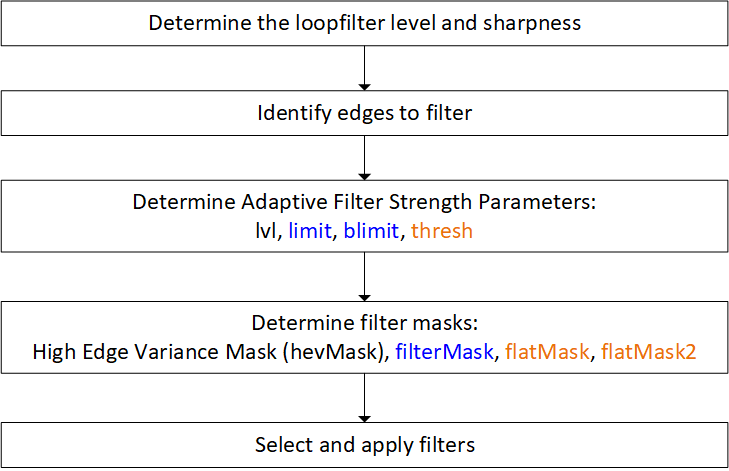
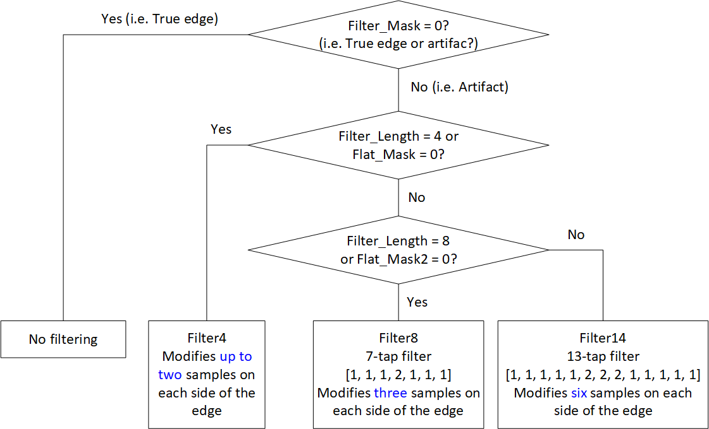
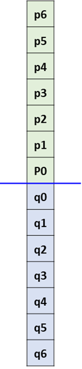
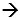
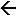
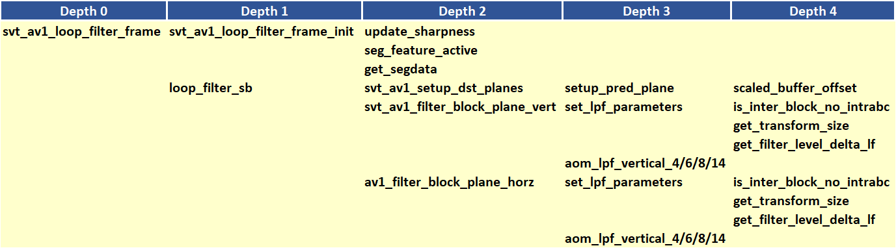
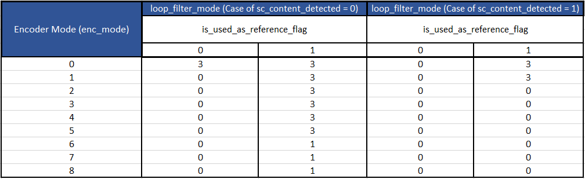

# Deblocking Loop Filter Appendix

## 1.  Description of the algorithm

The deblocking loop filter is used to address blocking artifacts in
reconstructed pictures. The filter was developed based on VP9 deblocking
filter. The filter switches between multiple filters according to the
minimum transform size across the edge and according to whether the
areas around the edge are relatively flat. For a given block, vertical
edges are filtered first, followed by the filtering of the horizontal
edges. The main idea behind the filter can be summarized as follows:

  - Pixels on either side of the boundary are not filtered if they show
    a clear difference in values, i.e. the edge is most likely a true
    edge and not a blockiness artifact.

  - If the pixels on both sides of the boundary are to be filtered, the
    selection of the filter is performed according to the
    guidelines presented in Table 1:

##### Table 1. Summary of the loop filter decisions.

|**Min TX size across the edge**|**Flat areas around the edge**|**Filter (Luma)**|**Filter_Size (Luma)**|**Filter (Chroma)**|**Filter_Size (Chroma)**|
|--- |--- |--- |--- |--- |--- |
|>=TX_8x8|Yes|Filter14 (13-tap)|14|Filter6 (5-tap)|6|
||No|Filter8 (7-tap)/ Filter4|4|Filter4|4|
|TX_8x8|Yes|Filter8 (7-tap)|8|Filter6 (5-tap)|6|
||No|Filter4|4|Filter4|4|
|TX_4x4|-|Filter4|4|Filter4|4|


A block diagram illustrating the flow of the different steps involved in
filtering is given in Figure 1 below.



##### Figure 1. Steps in the loop filter decisions making process.

The steps shown in the block diagram above are now discussed in more
detail.

### Determine the loopfilter level and sharpness

Both the loop filter level and sharpness are frame-level parameters.

  - Loop filter level: The loop filter level takes value in \[0, 63\]
    and can be set using different methods: (see the functions
    ```av1_pick_filter_level``` and ```search_filter_level```)

<!-- end list -->

  - Set to 0 to disable filtering.

  - Set as a function of AC quantization step size.

  - Set through the evaluation of filtering using different level values
    and selecting the level that yields the lowest distortion in the
    filtered frame.

<!-- end list -->

  - Sharpness: The sharpness parameter takes value in \[0, 7\] and is an
    input parameter to the encoder (--sharpness).

### Filter Strength Parameters: lvl, limit, blimit, thresh

  - lvl: At the block level, the loopfilter level is referred to as
    lvl. The parameter lvl builds on the loopfilter level for the
    frame and includes refinements based on segmentation, coding mode
    and reference picture. The lvl parameter is computed as follows:

    *lvl = (filter\_level for the frame) + (segment delta) + (mode delta) + (reference delta)*

where

  - ```filter_level``` is the loopfilter level for the frame that has
    already been determined.
  - Segment delta is specified on an 8x8 basis for each of the eight
    segments.
  - Mode delta and reference delta are determined as follows:
  - Define ```scale = 1 << (((filter_level for the frame) + (segment
    delta)) >>5 )```
  - ```mode delta = mode_deltas * scale```, where ```mode_deltas``` is
    obtained from Table 2.
  - Reference delta = ```ref_deltas * scale```, where ```ref_deltas``` is
    obtained from Table 3 below.

##### Table 2. Mode deltas for the loop filter level.

| **Intra modes** | **mode\_deltas** | **Inter modes**    | **mode\_deltas** |
| --------------- | ---------------- | ------------------ | ---------------- |
| DC\_PRED        | 0                | NEARESTMV          | 1                |
| V\_PRED         | 0                | NEARMV             | 1                |
| H\_PRED         | 0                | GLOBALMV           | 0                |
| D45\_PRED       | 0                | NEWMV              | 1                |
| D135\_PRED      | 0                | NEAREST\_NEARESTMV | 1                |
| D113\_PRED      | 0                | NEAR\_NEARMV       | 1                |
| D157\_PRED      | 0                | NEAREST\_NEWMV     | 1                |
| D203\_PRED      | 0                | NEW\_NEARESTMV     | 1                |
| D67\_PRED       | 0                | NEAR\_NEWMV        | 1                |
| SMOOTH\_PRED    | 0                | NEW\_NEARMV        | 1                |
| SMOOTH\_V\_PRED | 0                | GLOBAL\_GLOBALMV   | 1                |
| SMOOTH\_H\_PRED | 0                | NEW\_NEWMV         | 1                |
| PAETH\_PRED     | 0                |                    |                  |

##### Table 3. Reference deltas for the loop filter level.

| **Reference Picture** | **Default ref\_deltas** |
| --------------------- | ----------------------- |
| INTRA\_FRAME          | 1                       |
| LAST\_FRAME           | 0                       |
| LAST2\_FRAME          | 0                       |
| LAST3\_FRAME          | 0                       |
| BWDREF\_FRAME         | 0                       |
| GOLDEN\_FRAME         | \-1                     |
| ALTREF2\_FRAME        | \-1                     |
| ALTREF\_FRAME         | \-1                     |

  - shift: The shift parameter is computed as follows:

      - If sharpness \> 4, shift = 2.
      - Otherwise, if sharpness \> 0, shift = 1.
      - Otherwise, shift = 0.

  - limit

      - If sharpness \> 0, limit = Clip3( 1, 9 - sharpness, lvl \>\>
        shift ).
      - Otherwise, limit = Max( 1, lvl \>\> shift ).
  - blimit = 2 \* (lvl + 2) + limit.
  - Thresh = lvl \>\> 4.

### Identify edges to filter

The edges to filter should satisfy the following conditions:

  - Transform unit edges AND

  - (non-zero level on either side of the edge) AND ((Non-skip inter
    blocks on either side of the edge) OR CU edge).

### Filtering Process for luma

The decisions on the filtering operation is based on a number of masks
used to evaluate the level of difference between the samples across the
edge to be filtered. The filtering masks are outlined first, followed by a
description of the filtering decision making process.

*Filter Masks.* The filter masks to be discussed are Filter\_Mask, High
Edge Variance Mask (Hev\_Mask), Flat\_Mask, Flat\_Mask2

  - Filter\_Mask: Indicates whether the edge is a true edge or an
    artifact, and consequently whether the tested samples are to be
    filtered or not. (See the functions ```filter_mask3_chroma``` and
    ```filter_mask```)

    Original idea:

    - Let n = 2 when filter\_length = 6 and n = 3 when filter\_length = 8 or 14.

        If

        - (ABS(  –  ) \> limit, i=1,…,n; OR

        - (ABS(  –  ) \> limit, i=1,…,n; OR

        - (ABS(  -  ) \* 2 + ABS(  -
         ) / 2 \> blimit)

        then the edge is most likely a true edge. In that case, do not filter
        the tested samples and set Filter\_Mask to zero. Otherwise,
        Filter\_Mask is set to 1 and the tested samples are to be filtered.

  - Hev\_Mask: Used to identify edges with large change in pixel values
    on either side of the edge. (See the function ```hev_mask```)

       If ABS(p1-p0) \> thresh OR ABS(p1-p0) \> thresh, then Hev\_Mask = 1,
       else Hev\_Mask = 0.

  - Flat\_Mask: Considered when Filter\_Length \>= 6. Indicates whether
    samples 0,…,n on each side of the boundary belong to relatively flat
    areas, where n = 2 for Filter\_length = 6 and n=3 when
    Filter\_length = 8 or 14

    Flat\_Mask = 1 when the following conditions are true:

    - abs( - ) \<= thresh, i=1,…,n; AND

    - abs( - ) \<= thresh, i=1,…,n

    Otherwise, Flat\_Mask = 0.

  - Flat\_Mask2: Considered when Filter\_Length = 14. Indicates whether
    samples 4, 5 and 6 on each side of the boundary belong to relatively
    flat areas.

    Flat\_Mask2 = 1 when the following conditions are true:
    ABS( - ) \<= thresh, i=4,…,6; AND
    ABS( - ) \<= thresh, i=4,…,6. Otherwise,
    Flat\_Mask2 = 0.

### Filtering decision making process

The steps involved in the filtering operation are as follows:

  - Determine min\_ts = The smaller of the two transform sizes on either
    side of the edge (e.g. min(TX\_16x16, TX\_8x8) = TX\_8x8)

  - Determine filter masks: hevMask, filterMask, flatMask and flatMask2.

  - If filterMask == 0, no filtering takes place.

  - Otherwise, if ((min\_ts == TX\_4x4) OR (flatMask == 0)), then use
    filter4.

  - Otherwise, if ((min\_ts == TX\_8x8) OR (flatMask2 == 0)), then use
    filter8.

  - Otherwise, use filter14.

The filtering decisions are outlined in the diagram shown in Figure 2 below.



##### Figure 2. Flow of the loop filter decision making process.

The different filters that could be considered in the filtering
operation are outlined below. Figure 3 below indicates the positions
of the samples across the horizontal edge to be filtered, with similar
arrangement of the samples for the case of a vertical edge.



##### Figure 3. Sample positions across the horizontal edge to be filtered.

*Filter4:* Modifies up to two samples on each side of the boundary,
  depending on High Variance Edge Mask (Hev\_Mask). Rough outline of
  the main idea:
  - Hev\_Mask = 1  only q0 and p0 are filtered.
      - Delta = (( – ) + 3(-))/8
      - q0  q0 – Delta; p0  p0 + Delta
  - Hev\_Mask = 0  q0, q1, p0 and p1 are filtered.
      - Delta = 3(q0-p0)/8
      - q0  q0 - Delta; p0  p0 + Delta
      - q1  q1 - Delta/2; p1  p1+Delta/2

      clamp(x) clamps the value of x to within the interval -128 to 127.
      Round2(x,1) returns (x+1)\>\>1.

      Implementation (see the function filter4)

        ps0 = p0 - 128; ps1 = p1 - 128
        qs0 = q0 - 128; qs1 = q1 - 128
        filter = clamp( ps1 - qs1 ) if hev_Mask = 1; else 0.
        filter = clamp( filter + 3 * (qs0 - ps0) )
        filter1 = clamp( filter + 4 ) >> 3
        filter2 = clamp( filter + 3 ) >> 3
        q0 = clamp( qs0 - filter1 ) + 128
        p0 = clamp( ps0 + filter2 ) + 128
        if (Hev_Mask == 0)
          filter = Round2( filter1, 1 )
          q1 = clamp( qs1 - filter ) + 128
          p1 = clamp( ps1 + filter ) + 128

*Filter6*

- 5-tap filter: \[1, 2, 2, 2, 1\]
- Applies to chroma planes only.
- Modifies two samples on each side of the edge. (See the function
filter6)
  - p1  (p2 \* 3 + p1 \* 2 + p0 \* 2 + q0 + 4)\>\>3;
  - p0  (p2 + p1 \* 2 + p0 \* 2 + q0 \* 2 + q1 + 4)\>\>3;
  - q0  (p1 + p0 \* 2 + q0 \* 2 + q1 \* 2 + q2 + 4)\>\>3;
  - q1  (p0 + q0 \* 2 + q1 \* 2 + q2 \* 3 + 4)\>\>3;

*Filter8*
- 7-tap filter: \[1, 1, 1, 2, 1, 1, 1\]
- Applies to luma plane only.
- Modifies three samples on each side of the edge. (See the function
filter8)
  - p2  (p3 + p3 + p3 + 2 \* p2 + p1 + p0 + q0 + 4)\>\>3;
  - p1  (p3 + p3 + p2 + 2 \* p1 + p0 + q0 + q1 + 4)\>\>3;
  - p0  (p3 + p2 + p1 + 2 \* p0 + q0 + q1 + q2 + 4)\>\>3;
  - q0  (p2 + p1 + p0 + 2 \* q0 + q1 + q2 + q3 + 4)\>\>3;
  - q1  (p1 + p0 + q0 + 2 \* q1 + q2 + q3 + q3 + 4)\>\>3;
  - q2  (p0 + q0 + q1 + 2 \* q2 + q3 + q3 + q3 + 4)\>\>3;

*Filter14*

- 13-tap filter: \[1, 1, 1, 1, 1, 2, 2, 2, 1, 1, 1, 1, 1\]
- Applies to luma plane only.
- Modifies six samples on each side of the edge. (See the function
filter14)
  - p5  (p6 \* 7 + p5 \* 2 + p4 \* 2 + p3 + p2 + p1 + p0 + q0 + 8)\>\>4,
  - p4  (p6 \* 5 + p5 \* 2 + p4 \* 2 + p3 \* 2 + p2 + p1 + p0 + q0 + q1 +
    8)\>\>4
  - p3  (p6 \* 4 + p5 + p4 \* 2 + p3 \* 2 + p2 \* 2 + p1 + p0 + q0 + q1 +
    q2 + 8)\>\>4
  - p2  (p6 \* 3 + p5 + p4 + p3 \* 2 + p2 \* 2 + p1 \* 2 + p0 + q0 + q1 +
    q2 + q3 + 8)\>\>4
  - p1  (p6 \* 2 + p5 + p4 + p3 + p2 \* 2 + p1 \* 2 + p0 \* 2 + q0 + q1 +
    q2 + q3 + q4 + 8)\>\>4
  - p0  (p6 + p5 + p4 + p3 + p2 + p1 \* 2 + p0 \* 2 + q0 \* 2 + q1 + q2 +
    q3 + q4 + q5 + 8)\>\>4
  - q0  (p5 + p4 + p3 + p2 + p1 + p0 \* 2 + q0 \* 2 + q1 \* 2 + q2 + q3 +
    q4 + q5 + q6 + 8)\>\>4
  - q1  (p4 + p3 + p2 + p1 + p0 + q0 \* 2 + q1 \* 2 + q2 \* 2 + q3 + q4 +
    q5 + q6 \* 2 + 8)\>\>4
  - q2  (p3 + p2 + p1 + p0 + q0 + q1 \* 2 + q2 \* 2 + q3 \* 2 + q4 + q5 +
    q6 \* 3 + 8)\>\>4
  - q3  (p2 + p1 + p0 + q0 + q1 + q2 \* 2 + q3 \* 2 + q4 \* 2 + q5 + q6
    \* 4 +8)\>\>4
  - q4  (p1 + p0 + q0 + q1 + q2 + q3 \* 2 + q4 \* 2 + q5 \* 2 + q6 \* 5 +
    8)\>\>4
  - q5  (p0 + q0 + q1 + q2 + q3 + q4 \* 2 + q5 \* 2 + q6 \* 7 + 8)\>\>4


## 2.  Implementation

**Inputs to dlf\_kernel**: Reconstructed picture from the encode pass.

**Outputs of dlf\_kernel**: Filtered frame, filter parameters.

**Controlling macros/flags**:

##### Table 4. List of loop filter control flags.

| **Flag**                | **Level** | **Description**                                                                                                                                                                                                                                                                                         |
| ----------------------- | --------- | ------------------------------------------------------------------------------------------------------------------------------------------------------------------------------------------------------------------------------------------------------------------------------------------------------- |
| loop\_filter\_mode      | Picture   | Sets the loop filter complexity-performance tradeoff                                                                                                                                                                                                                                                    |
| combine\_vert\_horz\_lf | Picture   | When set, it implies performing filtering of vertical edges in the current SB followed by filtering of horizontal edges in the preceding SB in the same SB row. When OFF, it implies performing filtering of vertical edges in the current SB followed by filtering of horizontal edges in the same SB. |

The main steps involved in the implementation of the algorithm are
outlined below, followed by more details on some of the important
functions.

The loop filtering operation consists of the following three main steps:

  - Initializing the loop filter parameters (limits and thresholds).

  - Choosing the optimal loop filter levels

  - Applying loop filtering to the frame

The steps above are performed only when (```loop_filter_mode >= 2```).
Otherwise, loop filtering is not applied to the frame. The details of
the three steps mentioned above are outlined in the following.

**Step 1**: Initialize the loop filter limits and thresholds
(```av1_loop_filter_init```)

- Initialize ```lfi->lfthr[lvl].lim = block_inside_limit```, for
0\<=lvl\<=63 (update\_sharpness)
- Initialize ```lfi->lfthr[lvl].mblim = *2 * (lvl + 2) +*
block_inside_limit```, for 0\<=lvl\<=63 (```update_sharpness```)
- Initialize ```lfi->lfthr[lvl].hev_thr = (lvl >> 4)```, for 0\<=lvl\<=63
  where block\_inside\_limit is given by
  - If sharpness\_lvl \> 0, block\_inside\_lim = Clip3(1, 9 –
    sharpness\_lvl, lvl \>\> shift).
  - Otherwise, block\_inside\_limit = Max(1, lvl \>\> shift ).

  Moreover, ```lf->combine_vert_horz_lf = 1```, implying that both
vertical and horizontal filtering are to be considered.

**Step 2**: Choosing the optimal loop filter levels
(```av1_pick_filter_level```)

In this step, a search is performed for the best loop filter level to
work with. The loop filter levels are:

```filter_level[0]```: Loop filter level for luma vertical edge filtering.

```filter_level[1]```: Loop filter level for luma horizontal edge filtering.

```filter_level_u```: Loop filter level for Cb edge filtering.

```filter_level_v```: Loop filter level for Cr edge filtering.


- if method == LPF\_PICK\_MINIMAL\_LPF
  - Set filter\_level\[0\] = filter\_level\[1\] = 0;
- else if method \>= LPF\_PICK\_FROM\_Q

  - generate ```filt_guess``` based on the quantization parameter, the encoder
  bit depth, the frame type and the picture plane. Update
  ```filter_level[0], filter_level[1], filter_level_u, filter_level_v```;

- else {

  - Get the last frame filter levels ```filter_level[0],
    filter_level[1], filter_level_u, filter_level_v```.

  - For each of the picture data planes, perform a search for the best
    filter level for the picture data plane (search\_filter\_level)

    - Set the filter level ```filt_mid``` to the frame level for the last frame,
and the filter search step to 4 if (```fil\_mid < 16```), otherwise it is
set to ```filt_mid/4```.

    - Filter the frame with filter level set to filt\_mid and evaluate the
SSE for the filtered frame (```try_filter_frame``` and then
```eb_av1_loop_filter_frame```. See below for more details on the two
functions), update the best SSE ```best_err``` and corresponding filter
level ```filt_best```.

    - If (```loop_filter_mode <= 2```),

      - **Search Method 1**: filter the frame with filter level set to
(```filt_mid-2```) and evaluate the SSE for the filtered frame
(```try_filter_frame```), update the best SSE ```best_err``` and corresponding
filter level ```filt_best```. Redo the same with filter level set to
(```filt_mid+2```) and update ```best_err``` and ```filt_best```.

    - else

      - **Search Method 2**: Iterate the search for the best filter level,
starting with filter level (```filt_mid-filter_step```) or
(```filt_mid+filter_step```), depending on the search direction
(```try_filter_frame```). Keep track of the best filtering SSE and filter
level, as well as the search direction. At each iteration, the best
filter level becomes the search starting point for the next iteration.
If the best filter level in the current iteration is the same as in
the previous iteration, halve the ```filter_step```.

    - Return the best filter level and corresponding cost.

**Step 3**: Applying loop filtering to the frame based on the selected
loop filter parameters (```eb_av1_loop_filter_frame```).

**More details on** (```try_filter_frame```)

(```try_filter_frame```) is just an intermediate function to prepare for
(```eb_av1_loop_filter_frame```), mainly setting the filter levels,
computing the filtering sse, and resetting the recon buffer. Returns the
filtering SSE.

**More details on** (```eb_av1_loop_filter_frame```)

The function calls that start at ```eb_av1_loop_filter_frame``` are
indicated in Figure 4 below according to the depth of the function
call.



##### Figure 4. Function calls starting at eb\_av1\_loop\_filter\_frame.

The main steps involved in are outlines as follows.

1.  (```eb_av1_loop_filter_frame_init```)

    - For the given plane, loop over all segments (i.e. segments as defined
by the segmentation feature in AV1 specifications) in the picture
      - Loop over the filtering directions (vertical and horizontal)
        - Adjust the level calculations for each segment to account for the
level deltas related to each segment, reference pictures, encoding
modes (intra or inter).

2.  Loop over all superblocks in the picture and filter each superblock
    (```loop_filter_sb```)

    - Perform combined filtering of both vertical edges in the current
superblock and filtering of horizontal edges in the *preceding*
superblock in the same superblock row **OR** Perform filtering of all vertical edges in the superblock followed by
filtering all the horizontal edges in the *same* superblock.
(```av1_filter_block_plane_vert```) and
(```av1_filter_block_plane_horz```).
    - (``av1_filter_block_plane_vert``) \[The description for
(```av1_filter_block_plane_horz```) is similar, except that the
filtering would be applied to horizontal edges\].
      - Loop over rows of 4x4 blocks in the superblock
        - For each block that intersects the current row of 4x4 blocks
(```set_lpf_parameters```)
          - Determine the transform size to work with for the vertical edges.
(```get_transform_size```)
            - For luma plane, If inter block, then ```tx_size =
tx_depth_to_tx_size[0][mbmi->block_mi.sb_type]```, else
```tx_size = tx_depth_to_tx_size[mbmi->tx_depth][mbmi->block_mi.sb_type]```.
Otherwise, ```tx_size``` is determined through the function call
(```av1_get_max_uv_txsize```).
            - For luma plane, If inter block and no skip, then ```tx_size =
tx_depth_to_tx_size[mbmi->tx_depth][mbmi->block_mi.sb_type]```
            - ```tx_size``` is ultimately set to the width the transform block.

          - Determine the loop filter level to use (```get_filter_level```), which
accounts for the loop filter level deltas associated with
segmentation, reference pictures and encoding modes.

          - If not at the picture left or top boundaries, filtering is to be
considered if the filter level for the current or the previous 4x4
blocks are non-zero, and \[the current or the previous 4x4 blocks are
inter non-skip blocks, or the edge is a CU edge\]. Under these
conditions, min\_ts, the minimum of the transform sizes associated
with the current and previous 4x4 blocks, is considered. The selection
of the filter length depends on the data plane and min\_ts, as
indicated in the Table above.

      - Apply the selected filter to the four samples along the vertical edge.

3.  Return the frame filtering sse for the loop filter level and the
    picture data plane being considered.

<!-- end list -->

## 3.  Optimization of the algorithm

The algorithmic optimization of the loop filter is performed by
considering different loop filter search methods. First, the encoder
mode (```picture_control_set_ptr->enc_mode```) is used to specify the
loop filter mode
(```picture_control_set_ptr->parent_pcs_ptr->loop_filter_mode```)
according to Table 5 below.

##### Table 5. Loop filter mode as a function of the encoder mode.



The ```loop_filter_mode``` is used to specify the filter level search method
in (```av1_pick_filter_level```), either Search Method 1 or Search Method
2. Search Method 2 is more exhaustive than Method 1, and therefore
involves more filtering operations, but could possibly provide better
filtering results. The settings of the filter level search mode as a function
of the ```loop_filter_mode``` are summarized in Table 6.

##### Table 6. Filter Level search Method as a function of the loop\_filter\_mode.

| **loop\_filter\_mode** | **Filter Level Search Method** |
| ---------------------- | ------------------------------ |
| 0                      | Loop filter OFF                |
| 1                      | Loop filter OFF                |
| 2                      | 1                              |
| 3                      | 2                              |

## 4.  Signaling

The loop filter parameters are signaled at the frame level and include
the following parameters: ```filter_level[0]```, ```filter_level[1]```,
```filter_level_u```, ```filter_level_v``` and ```sharpness_level```,
seen in Table 7.

##### Table 7. Frame level loop filter parameters signaled in the bitstream.

| **Parameters**     | **Values** |
| ------------------ | ---------- |
| filter\_level\[0\] | {0,…,63}   |
| filter\_level\[1\] | {0,…,63}   |
| filter\_level\_u   | {0,…,63}   |
| filter\_level\_v   | {0,…,63}   |
| sharpness\_level   | {0,…,7}    |

## References

\[1\] Zhijun Lei, Srinath Reddy, Victor Cherepanov, and Zhiping Deng,
“GPGPU Implementation of VP9 Inloop Deblocking Filter and Improvements
for AV1 CODEC,” International Conference on Image Processing, pp.
925-929, 2017.
