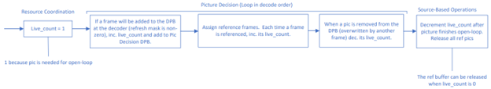
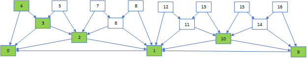

[Top level](../README.md)

# Dynamic Mini-GoP

SVT-AV1 supports multiple hierarchical prediction structures, including 5-layer and 6-layer prediction structures. Working with a fixed hierarchical prediction structure can lead
 to a significant degradation in compression efficiency for some clips depending on the complexity of the motion. To avoid this type of performance degradation, it is desired to
 consider a dynamic hierarchical prediction structure that adapts to the temporal complexity of the clip being encoded. SVT-AV1 achieves this objective by modifying the prediction
 structure at the mini-GoP level. In the following, a description of reference frame management in SVT-AV1 is presented, followed by an outline of the mini-GoP level decision making
 with regard to the hierarchical prediction structure.

## I. Reference Frame Management

AV1 allows up to 8 pictures to be stored in a decoded picture buffer (DPB) to be used as reference frames by future frames (future meaning decoded after).  SVT-AV1 tracks references
 using a similar DPB structure.   Frames are added to the DPB through a non-zero refresh_frame_mask.  A frame in DPB will be released from the DPB only when it is overwritten by
 another frame (or the end of sequence is reached).

### Open Loop (Mostly in Picture Decision)

##### **Figure 1:** Open-loop reference tracking.

When a frame is first processed in the resource coordination kernel, an open loop reference buffer (i.e.  a reference buffer where source pictures serve as reference pictures)
 for the frame will be assigned; the live count of the buffer will be set to 1 (because the frame is required to process itself).  Open loop references are tracked in the picture
 decision kernel, where reference frames are assigned.  Reference frames/buffers are tracked by looping over pictures in decode order (as they would be in the decoder).
 When a frame is added to the DPB, its live count will be incremented by 1 and it will be marked as a reference frame so that a reference buffer will be available to it in the closed loop.
 Future frames that reference a DPB frame will increment the DPB frame’s live count by 1 (representing the number of pictures that require using that frame as a reference).
 When a frame is overwritten in the DPB, it will no longer be available to be used as a reference, so it can be removed from the DPB (i.e. released, which involves decrementing
 its live count by 1 since it is no longer referenced by the DPB).  Each picture will keep track of the frames it overwrites in the DPB, which is necessary for releasing pictures that are processed
 out of decode order in the closed loop (see “Closed Loop” section for more details).  Open-loop reference buffers will be released once the live count is 0 (once the picture itself has completed
 the open loop (i.e. , all pictures referencing that picture have completed the open-loop, and once the picture has been removed from the DPB, making it inaccessible to any future frames).

### Closed Loop

In the closed loop, frames may be processed in non-decode order.  Therefore, it is necessary to introduce a consecutive decode order: the maximum consecutive
 picture that has been started by the picture manager process (measured in decode order).

##### **Figure 2:** Two 4L mini-GOP structures, with each picture labeled with its decode order.  The green pictures represent the pictures that have been started by the picture manager.  In the example, the consecutive decode order is 4.  Since picture 9 and 10 rely only on picture 1 (previous base) they can be started (i.e. start encoding them in the closed loop) but they will not impact the consecutive decode order until picture 8 starts.

When a reference frame enters the closed loop (picture manager process) it will be assigned a recon buffer and added to a list tracking the closed
 loop references (its live count will be 2: one because the frame has yet to be processed, and another one because it will be kept in the list for
 future frames to reference it).  When a frame is referenced by another picture, its live count will again be incremented by 1.  When the consecutive
 decode order is larger or equal to the picture (say picture_1) that releases a reference (say picture_2) from the DPB (this picture_1 is set at the open loop),
 then all frames that can reference that picture_2 have had a chance to use it as a reference (they have all been assigned their references and began encoding).
 Therefore, the live count of that reference (i.e. picture_2) can be decremented, and the reference released from the recon reference list.
 The recon buffer for reference (picture_2) will be released once the live count is 0 for the reference (once the picture itself has completed the closed loop,
 all pictures referencing that picture have completed the closed loop, and once the picture has been removed from the DPB, making it inaccessible to any future frames).

## II. Mini-GoP Prediction Structure Selection

### Early motion analysis

Motion analysis  is a key step towards the selection of the optimal prediction structure. However, the implementation of the prediction structure
 happens at an early stage of the encoding flow at the Picture Decision (PD) process, and before the ME process. The latter  performs an exhaustive
 motion search  for the best selected prediction structure out of the PD process.

Calling the ME process for each single prediction structure candidate is possible, but that will cause a significant performance drop because
 of the speed cost of ME (especially for the fast modes where ME represents ~25% of the total encoding time).
The proposed method to decide on temporal complexity is to analyze motion for only the potential  base layer (i.e. temporal layer 0) frame(s), for
 only the closest past reference, per SB, and using the 1/16th resolution input frame(s) (i.e. source frames) as reference frame(s).
 For each target base layer frame, this early-ME search returns the normalized distortion, the percentage of complex SB(s),
 the percentage of active SB(s), and the MV(s) in/out count (i.e. MVs pointing into or out of the picture).

|**Configuration(s)***|**Number of early-ME searches per 6L mini-GOP**|**(base layer picture, reference) pairs**|
|--- |--- |--- |
|5L/6L Switch|1 + 2 = 3|(31,0), (15,0), (31, 15)|
|4L/5L/6L switch|1 + 2 + 4 = 7|...|
|3L/4L/5L/6L switch|1 + 2 + 4 + 8 = 15|...|
- nL refers to an n layer prediction structure.

For example, when deciding between a six layer (6L) prediction structure and a five-layer (5L) prediction structure for the fist mini-GoP in a clip,
 a fist early motion search is performed using the (base layer picture, reference) pair (31, 0), which represents one search, followed by two searches
 based on the 5L prediction structure using pairs (15,0) and (31, 15), for a total of three searches.

### Prediction structure selection

For the case of switching between 5L and 6L, let top_mini_gop refer to the 6L mini-GoP, and sub_mini_gop_0  and sub_mini_gop_1 refer to the 5L mini-GoPs
 that result from splitting the 6L min-GoP into two 5L mini-GoPs. Three sets of temporal statistics are available based on the early motion analysis:

- One for the default 6L mini-Gop (e.g. based on the (31,0) early motion analysis). Let top_mini_gop_dist the frame distortion resulting from such analysis.
- One for each of the two 5L sub_min_gops (e.g. based on the (15,0) and (31,15) early motion analysis). Let sub_mini_gop_0_dist and  sub_mini_gop_1_dist
 denote the corresponding frame distortions resulting from such analysis.

The subdivision of the default 6L into two 5L mini-GoPs will happen if:
- (((sub_mini_gop_0_dist + sub_mini_gop_1_dist) / 2) < ((bias * top_mini_gop_dist) / 100))), where bias is added to simulate the rate advantage of the top mini-GoP.
- High top_mini_gop activity, while both sub_mini_gop_0 and sub_mini_gop_1have similar activities. Activity is defined as non-zero motion vector for each block.
- High top_mini_gop block complexity and low sub_mini_gop_0 and sub_mini_gop_1 complexity. Complexity is defined using the motion estimation distortion of each block.
- High zoom out activity in both sub_mini_gop_0 and sub_mini_gop_1. Zoom out activity is defined using the motion vector(s) direction.

## Notes

The feature settings that are described in this document were compiled at
v1.7.0 of the code and may not reflect the current status of the code. The
description in this document represents an example showing how features would
interact with the SVT architecture. For the most up-to-date settings, it's
recommended to review the section of the code implementing this feature.
