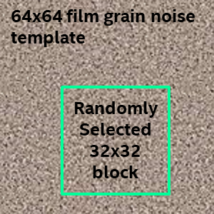
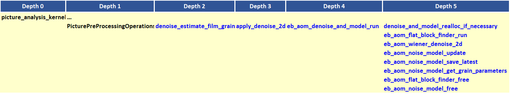

# Film Grain Synthesis Appendix

## 1.  Description of the algorithm

The film grain synthesis algorithm involves two key steps. In the first
step, the input pictures are denoised and the resulting denoised version
of the input pictures are used in the encoding process. In the second
step, a model of the film grain in the source picture is estimated at
the encoder side, and the noise model parameters are included in the bit
stream for the decoder to reproduce the noise and add it in the
reconstructed pictures. A block diagram showing the main components of
the feature is included in Figure 1 below.


##### Figure 1. Block diagram of the film grain modeling process.

Following the denoising of the input pictures, the main steps involved
in the algorithm consist of identifying suitable areas in the picture to
use in estimating the noise model parameters, and then generating those
parameters based on the difference between the source and denoised
picture.

**Identification of flat areas in the input picture**

The estimation of noise model parameters is performed in smooth areas of
the input picture. Identification of flat blocks in the denoised picture
is performed to make sure the edges and texture do not affect the film
grain estimation.

**Denoising of the input pictures**

The denoising of the input picture is performed using a Wiener filter.

**Film gain model**

The noise model parameters are estimated by considering the difference
between the input picture and its denoised version, in the areas that
are identified as suitable areas to include in the noise model
estimation process, as outlined above. An autoregressive model driven by
a unit variance Gaussian noise is used to model the film grain. The
model is defined over a causal neighborhood of lag L around the current
pixel at position (x,y):

) +a_{1}n(x-1,y-2)+a_{2}n(x,y-2)+...+a_{N}n(x-1,y)+z)

where n refers to the film grain, z is unit variance Gaussian noise and
N=2L(L+1). The same set of unit variance Gaussian noise samples that
would drive the film grain model are stored at both the encoder and
decoder sides. N can take values from 0 to 3.

To account for film gain strength, samples in the reconstructed image
are adjusted as follows:

Y’(x,y) = Y(x,y) + f(Y)\*n(x,y)

where:

  - Y’(x,y) is the luma sample value after addition of film grain

  - Y(x,y) is the luma sample value before the addition of the film
    grain sample

  - f(Y(x,y)) is the scaling function that adjusts the value of the film
    grain as a function of the luma value of the sample in the
    reconstructed picture. A similar operation is performed for the
    chroma samples.

The film grain strength is signaled using a piece-wise linear function,
represented as a set of points mapping the signal intensity (or other
input) and the corresponding film grain scaling.

The chroma film grain scaling is based on the linear combination of the
corresponding luma and chroma value to account for the luma effect on
the chroma grain:

G_{cb}),

,

where *u* is the index into the look-up table that corresponds to a Cb
component scaling function.

**Re-noising at the decoder side**

The film grain is regenerated at the decoder side based on the
transmitted film gain model parameters and the set of unit variance
Gaussian noise samples. A 64x64 film grain template for luma and two
32x32 templates for chroma are generated and used to re-noise the
reconstructed picture.

For luma, re-noising is performed on 32x32 basis by

  - Randomly selecting 32x32 block from the 64x64 film grain template
    (see the example in Figure 2 below).

  - Re-scaling the film grain sample in the 32x32 block as a function of
    the corresponding reconstructed pixel luma values.

  - Adding the scaled film grain values to the reconstructed samples.

A similar operation is performed for the collocated 16x16 chroma blocks.



##### Figure 2. Example of film grain noise template.

An optional block overlap can be applied to the film grain as well. The
block overlap attenuates potential artifacts at the film grain block
boundaries.

## 2.  Implementation of the algorithm

**Inputs**:

- Source video frame

**Outputs**:

- Denoised video frame, to be further encoded by the encoder.

- Set of film grain parameters estimated for the input frame.

**Control macros/flags**:

The control flags for the film grain feature are summarized in Table 1.

##### Table 1. Film grain control flags.

| **Flag**                       | **Level (sequence/Picture)** | **Description**                                                                                                                                              |
| ------------------------------ | ---------------------------- | ------------------------------------------------------------------------------------------------------------------------------------------------------------ |
| film\_grain\_denoise\_strength | Sequence                     | Takes values from 0 to 50 and determines strength of film grain used in grain filtering and estimation. 0 – film grain is turned off, 50 – maximum strength. |
| film\_grain\_params            | Picture                      | Film grain parameters for a reference frame                                                                                                                  |
| apply\_grain               | Picture                      | Apply grain for to the current frame.                                                                                                                        |

**Details of the film grain parameters estimation**

The main function calls associated with the film grain parameter
estimation are included in Figure 3 below.



##### Figure 3. Main function calls associated with the film grain model parameter estimation process.

The film grain parameters estimation is performed in
```picture_analysis_kernel```. When the flag
film\_grain\_denoise\_strength is set to 1, a series of function calls
leads to the function ```eb_aom_denoise_and_model_run```, which is the
main function that performs denoising and film grain parameters
estimation. The function consecutively runs flat block estimation, 2D Wiener denoising on the
copy of the input data, flat blocks estimation, and film grain
parameters estimation.

  - Identification of flat blocks: ```eb_aom_flat_block_finder_run```

  - Denoise the input pictures: Denoising is performed using a 2D wiener
    filter. ```eb_aom_wiener_denoise_2d```

  - Generate noise model parameters: Noise in the picture is derived by
    taking the difference between the source picture and the denoised
    picture. The resulting noise in the identified flat blocks is used
    to generate the noise model parameters.
  ```eb_aom_noise_model_update```

Once the noise model has been estimated, the algorithm sets the
apply\_grain flag equal to 1 in the frame film grain parameters, writes
the film grain parameters to a structure ```aom_film_grain_t``` associated
with the frame and replaces the original source frame with its denoised
version. This denoised version is later used to estimate the encoding statistics
and to calculate the PSNR. This is done intentionally since one
can consider the film grain estimation process as a process outside the
video encoder. The film grain parameters are later signaled in the frame
header.

**Details of the film grain synthesis application**

Once the encoder generates film grain parameter estimates, the film
grain is added to the reconstructed (output) frames. The film grain is
applied to a frame before the output process since reference frames do
not contain film grain (this was specified in AV1 codec to improve the
compression efficiency).

In the ```ReconOutput``` function in EbEncDecProcess.c, if the
```film_grain_params_present``` flag in the sequence header is set to 1,
the film grain function ```eb_av1_add_film_grain``` is invoked, with
parameters ```recon_ptr```, intermediateBufferPtr, and ```film_grain_ptr```. The
reconstructed picture is copied into the intermediateBuffer, film grain
is applied to the intermediate buffer, and the ```recon_ptr``` is set to the
intermediateBuffer, which follows by the output process.

The film grain application is performed by the
```eb_av1_add_film_grain_run``` in grainSynthesis.c.

## 3.  Optimization of the algorithm

The algorithm is implemented in a parallel manner. This means that
estimation of the film grain parameters is performed independently
for each frame, using the same filtering strength. Independence of
film grain parameter estimation for every frame is maintained to
enable film grain model parameter estimation for any number of
frames in parallel. If film grain parameters are estimated for
pictures in display order, it would be possible to smooth changes of
the parameters over time and possibly improve parameters
signaling.

Using 2D filtering for film grain denoising may result in somewhat
worse denoising and consequently less accurate film grain parameter
estimation, but makes parallelization easier since only the current
frame is used to obtain the film grain parameters.

## 4.  Signaling

The signaling part of the film grain parameters algorithm is
implemented as follows. The film grain is called from
```WriteUncompressedHeaderObu```, which writes the frame header. The film
grain parameters are written to bitstream by function
```write_film_grain_params``` according to the AV1 specification.

The parameters listed in Table 2 are signaled for a frame in the
frame header.

##### Table 2. Film grain signaled parameters.

|**Parameter**|**Description**|
|--- |--- |
|apply_grain|Apply film grain for this frame|
|update_parameters|Update parameters if flag is equal to 1, If equal to zero, a reference frame index is signaled, from which the parameters are copied.|
|||
|scaling_points_y[14][2]|Scaling points function coordinates for luma|
|num_y_points|Number of luma points: value: 0...14|
|||
|scaling_points_cb[10][2]|Scaling points function coordinates for Cb|
|num_cb_points|Number of Cb points: value: 0...10|
|||
|bit values||
|scaling_points_cr[10][2]|Scaling points function coordinates for Cr|
|||
|num_cr_points|Number of Cb points: value: 0...10|
|scaling_shift|shift for the scaling function: 8..11|
|ar_coeff_lag|AR coefficients lag, determines the filter support|
|||
|ar_coeffs_y[24]|AR coefficients for luma|
|ar_coeffs_cb[25]|AR coefficients for Cb|
|ar_coeffs_cr[25]|AR coefficients for Cr|
|ar_coeff_shift|Shift value: determines AR coeffs range 6: [-2, 2) 7: [-1, 1) 8: [-0.5, 0.5) 9: [-0.25, 0.25)|
|||
|cb_mult|multiplication factor for Cb scaling function input|
|cb_luma_mult|8 bits, luma multiplication factor for Cb scaling function input|
|cb_offset|9 bits, offset for multiplication factor for Cr scaling function input|
|||
|cr_mult|8 bits, multiplication factor for Cb scaling function input|
|cr_luma_mult|8 bits, luma multiplication factor for Cb scaling function input|
|cr_offset|9 bits, offset for multiplication factor for Cr scaling function input|
|||
|overlap_flag|optional 2 sample over between film grain blocks|
|clip_to_restricted_range|clip the film grain output to the restricted range|
|||
|chroma_scaling_from_luma|Chroma film grain uses luma scaling function,|
|grain_scale_shift|Scaling factor for the film grain generation|
|random_seed|initializer for the pseudo-random numbers generator|


If the frame is ```INTER_FRAME```, the encoder checks whether the parameter
set estimated for this frame is already present in one of the reference
frames. If such film grain parameters are not found, the parameters for
the current frame are signaled, otherwise, a reference frame index of a
frame that contains the same parameters as the current frame is written
to the bitstream.

## References

[1] Andrey Norkin and Neil Birkbeck, “Film grain synthesis for AV1 video
codec”, Data Compression Conference, 2018.
