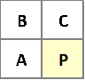
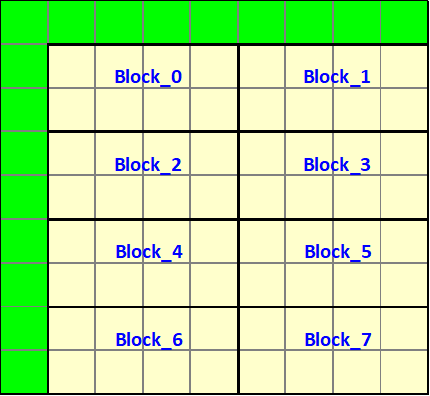
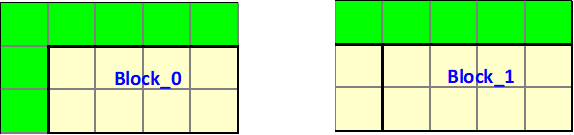
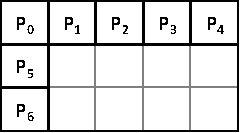
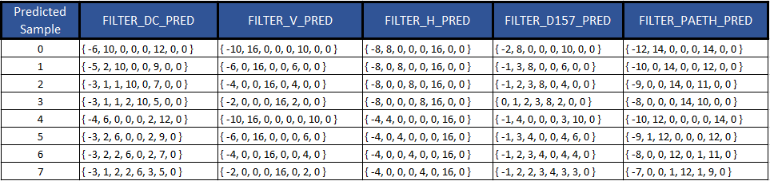
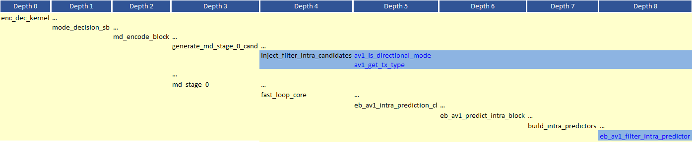

# Filter Intra Prediction

## 1.  Description of the algorithm

Filter intra mode involves generating intra sample prediction in a
raster scan order based on a set of neighboring predicted samples. As an
illustration of the basic idea consider the sample P shown in Figure 1
below. The intra prediction for sample P is the weighted sum of samples
A, B and C. The latter could be reference pixels for the block and/or
already predicted (i.e. filtered) samples within the same block.



##### Figure 1. Prediction of the sample P using the neighboring samples A, B and C.

The prediction procedure is outlined as follows:

  - The predicted block is divided into 4x2 sub-blocks. Example: An 8x8
    block is divided into 8 4x2 blocks. See the example of the 8x8 block
    in Figure 2 below.



##### Figure 2. Splitting a block into 4x2 blocks.

  - For each 4x2 sub-block:

      - An array of 7 neighboring samples is prepared. For example, as shown
    in Figure 3, the 7 neighboring samples for Block\_0 are reference
    samples for the 8x8 block. For Block\_1, the above 5 neighboring
    samples are reference sample for the 8x8 block, the left neighboring
    samples are filtered samples from Block\_0.



##### Figure 3. Example of reference samples for 4x2 blocks.

  - The predicted pixels in the 4x2 sub-block are obtained by filtering
    the array of 7 neighboring pixels using the filtering methods. To
    illustrate the procedure, consider the 4x2 block shown in Figure 4
    below:



##### Figure 4. Reference sample around a 4x2 block.

The predicted  pixels, k=0,…,7, in the 4x2 block is given
by:

av1_filter_intra_taps[mode][k][0] * P0 + av1_filter_intra_taps[mode][k][1] * P1 +\
av1_filter_intra_taps[mode][k][2] * P2 + av1_filter_intra_taps[mode][k][3] * P3 +\
av1_filter_intra_taps[mode][k][4] * P4 + av1_filter_intra_taps[mode][k][5] * P5 +\
av1_filter_intra_taps[mode][k][6] * P6

where mode refers to one of the five supported filter intra modes listed in the table below:

##### Table 1. Filter intra modes.

| **filter\_intra\_mode index** | **Filter intra mode** |
| ----------------------------- | --------------------- |
| 0                             | FILTER\_DC\_PRED      |
| 1                             | FILTER\_V\_PRED       |
| 2                             | FILTER\_H\_PRED       |
| 3                             | FILTER\_D157\_PRED    |
| 4                             | FILTER\_PAETH\_PRED   |

The filter coefficients are listed in Table 2 as a function of the intra prediction mode and predicted sample.

##### Table 2. Filter coefficients as a function of the intra prediction mode and the predicted sample.



The best filtering mode (i.e. set of weights) is selected through, for
example, a rate distortion performance measure.

The 4x2 blocks can be processed in a wavefront manner. For the 8x8 block
example shown in Figure 2, the order of processing the 4x2 blocks could
be: Block\_0, then Block\_1 and Block\_2, then Block\_3 and Block\_4, then
Block\_5 and Block\_6.

The Filter Intra feature is applicable only to luma intra prediction and
to blocks that have width and height less than or equal to 32.

## 2.  Implementation of the algorithm

##### Control macros/flags

the control flags associated with the filter intra flag are listed in Table 3 below.

| **Flag**                 | **Level (sequence/picture)** | **Description**                                    |
| ------------------------ | ---------------------------- | -------------------------------------------------- |
| enable\_filter\_intra    | sequence                     | Enable/disable the feature at the sequence header. |
| pic\_filter\_intra\_mode | picture                      | Enable/disable the feature at the picture level.   |

### Main function calls

A diagram of the main function calls associated with the filter intra
algorithm is shown in Figure 5 below. The functions are shown according
to the depth of the function call.



##### Figure 5. Main function calls associated with the filter intra algorithm.

### Candidate Injection

The function ```inject_filter_intra_candidates``` is responsible of
injecting all Filter intra candidates in MD. Candidates are injected for
a given block if the flag ```pic_filter_intra_mode``` is not zero,
```enable_filter_intra``` is set to 1, and both the block width and block
height are smaller than or equal to 32.

A total of 5 intra based candidates are injected where the candidate
field ```filter_intra_mode``` is assigned a value from the following list:
```FILTER_DC_PRED``` / ```FILTER_V_PRED``` / ```FILTER_H_PRED``` /
```FILTER_D157_PRED``` / ```FILTER_PAETH_PRED```. For other regular intra
candidates ```filter_intra_mode``` is assigned a special value
(```FILTER_INTRA_MODES```) to make sure it is not a filter intra candidate.
A special class is assigned to all Filter Intra candidates.

Note that when inter-intra compound is used, no filter intra modes are
allowed in the intra part of the prediction.

### Generation of the filter intra prediction

The generation of the filter predictions is performed in the function
```eb_av1_filter_intra_predictor```. The generation of the prediction is
performed as described above. The block is split into 4x2 blocks and the
predictions for the 4x2 blocks are generated in a raster scan order.

## 3. Optimization of the algorithm

To reduce the complexity associated with the filter intra feature, the latter
is enabled only for base layer pictures when the feature is enabled at the
sequence level (i.e. ```enable_filter_intra``` is set to 1) and ```sc_content_detected```
is zero (i.e. normal video content).

## 4.  Signaling

At the sequence header the flag ```enable_filter_intra``` will enable filter
intra in the bit-stream.

When filter intra mode is selected:

  - The intra mode that is sent to the decoder is ```DC_PRED```.

  - There is no need to send intra angular information in the block info
    part of the bit-stream.

  - Palette prediction should be disabled.
