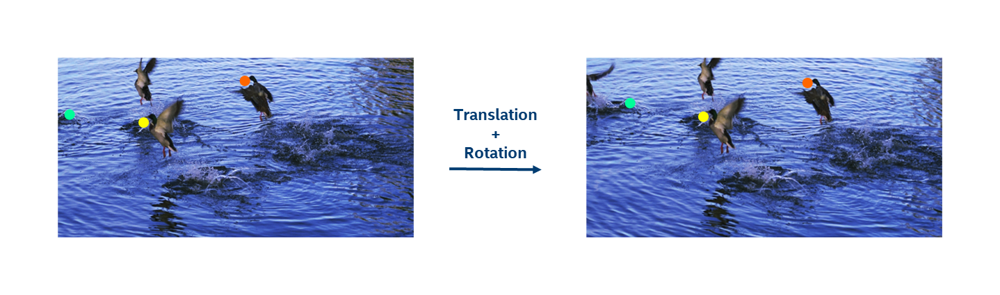
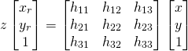
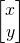
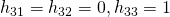
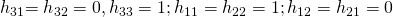
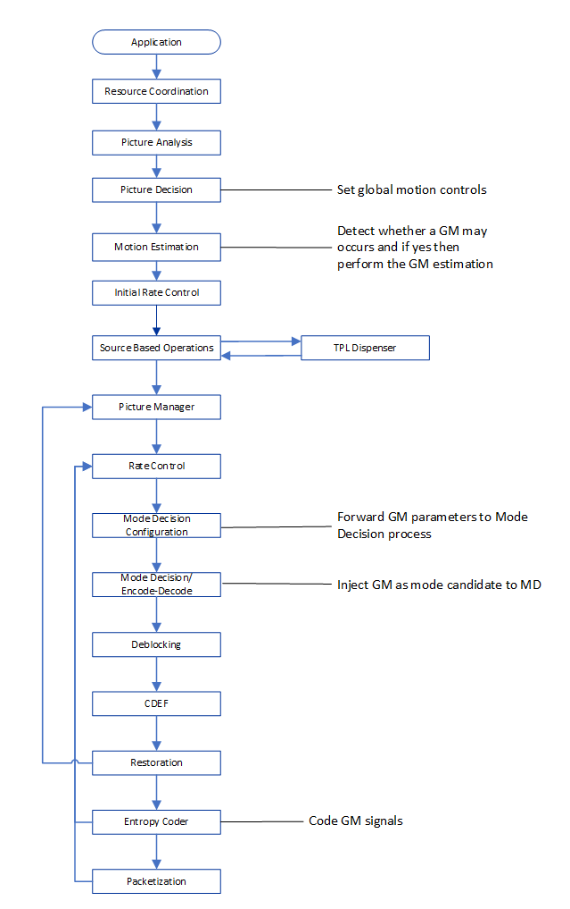
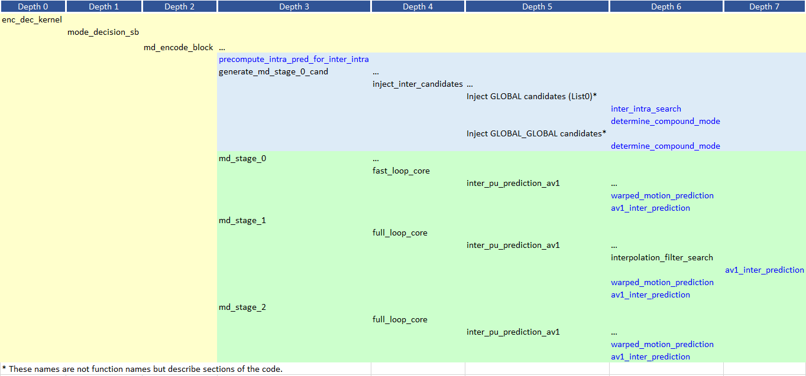

# Global Motion Compensation Appendix

## 1. Description of the algorithm

Global motion compensation concerns the estimation and compensation of
motion characteristics that affect the whole frame, as for example in
video clips shot using a hand-held camera. In the example shown in the
Figure 1 below, matched features in the two images below indicate a
translation and rotation motion between the two pictures. In general,
the key steps involved in estimating global motion comprise identifying
features in both images, matching the identified features, and
estimating global motion parameters based on the matched features.



##### Figure 1. Example of global motion between two frames involving translation and rotation motion.

The general motion model is given by:



where  and  are the pixel coordinates in the current and reference
frames, respectively. The supported motion models include:

  - Affine projection: . This
    transformation preserves parallelism and has six parameters to
    estimate.

  - Rotation-zoom projection: , which
    corresponds rotation + scaling. This transformation preserves
    angles and has four parameters to estimate.

  - Translation:  . This transformation
    preserves orientation and size and has two parameters to estimate.

The global motion estimation involves two main steps. The first step
concerns feature matching where the objective is to identify features
that are present in both the source and reference pictures. The second
step concerns model identification, where the identified features are
used to estimate the motion model parameters. In SVT-AV1, the global
motion parameters are computed for each reference frame using feature
matching followed by applying the random sample consensus (RANSAC) algorithm. The
estimated parameters are sent in the bitstream.

### Feature matching

To identify features that are common to both the source and reference
pictures, the features from the Accelerated Segment Test (FAST) algorithm are
used as a feature detector. The Fast algorithm identifies *corner
points* by examining a circle of 16 pixels (Brensenhan circle of radius
3) around the pixel p of interest. If out of the 16 pixels, 12
contiguous pixels all have values above the pixel p by at least a given
threshold or all have values below that of p by at least a given
threshold, then the pixel is considered a feature (corner point) in the
image. Such features are robust to motion and brightness changes. Once
features on the source frame and on the reference frame are identified,
feature matching is performed by computing the normalized
cross-correlation function between the two sets of features. A feature
(i.e. corner point) is selected if:

  - The feature on the reference frame is located within a pre-specified
    distance from the feature in the source frame.

  - The correlation between the point in the reference frame and that in
    the source frame is highest.

### Model identification

The model is identified based on the matched feature points from the
feature matching step. A least squares estimation is performed to
compute the model parameters using the matched feature points. The
RANSAC (Random Sample Consensus) algorithm is used in the estimation.
The algorithm minimizes the impact of noise and outliers in the data.
The set of parameters to be estimated depends on the motion model
(Translation, rotation-zoom, affine) specified. The identified
parameters are included in the bitstream.

The RANSAC algorithm finds model parameters that yield the best match to
the motion of the identified features. The steps involved in the
algorithm are as follows:

  - A small number of matched features (corner points) are used in the
    model parameter estimation (as dictated by the number of
    parameters to estimate).

  - The remaining features are used to evaluate the fitness of the
    model by counting the number of those matched features where the
    model yields a small error (inliers). The remaining tested
    features are considered outliers.

  - Steps 1 and 2 are repeated based on another small set of matched
    features and the number of resulting outliers is recorded.

  - The process stops when the number of outliers is below a specified
    threshold.


## 2.  Implementation of the algorithm

**Input to motion\_estimation\_kernel**: Input frames of the stream.

**Outputs of motion\_estimation\_kernel**: Estimated global motion
models per frame with their references.

**Input to enc\_dec\_kernel**: Estimated global motion models.

**Outputs of enc\_dec\_kernel**: Encoded frame with global motion
encoded blocks if they provide a cost advantage.

**Control macros/flags**:


##### Table 1. Control flags associated with global motion compensation.

|Flag|Level (Sequence/Picture)|Description|
|--- |--- |--- |
|GLOBAL_WARPED_MOTION|Compilation time macro|Macro to enable global warped motion estimation and mode insertion. When disabled, it restores the previous global motion implementation which only supports the TRANSLATION mode.|
|compute_global_motion|Sequence|Controls whether global motion parameters should be computed.|
|global_mv_injection|Sequence|Controls whether global motion candidates should be estimated.|

### Details of the implementation

The global motion tool consists of two parts, namely global motion
estimation and mode decision.

#### Global motion estimation



##### Figure 2. Main function calls associated with global motion estimation.

This process is executed by the ```global_motion_estimation``` function. This function
is called only for the first segment of each frame in the ```motion_estimation_kernel```
but it computes the global motion for the whole frame. The function involves a loop
that runs over all reference frames.

To compute the global motion between two frames, the FAST features of the reference
frames are extracted and matched to those of the current frame in the ```svt_av1_fast_corner_detect```
function, thanks to the fastfeat third-party library. The ```svt_av1_fast_corner_detect``` function
is first called to determine the features in the source picture. Then it is called again
from the function ```svt_av1_compute_global_motion``` to determine the features in the reference picture.

Once the features have been extracted, they are matched. This is done in the
```svt_av1_determine_correspondence``` function by two nested loops over the features of the
reference frame and the current frame. A current frame feature is matched to a reference
frame feature that maximizes their cross-correlation computed by ```svt_av1_compute_cross_correlation_c```.
However, the match is kept only if the cross-correlation is superior to the ```THRESHOLD_NCC```
threshold multiplied by the variance of the current feature patch.

The matched feature positions are further refined in the ```improve_correspondence``` function.
This function performs a double iteration to look for the best match in a patch of size
```SEARCH_SZ``` located around the previously found match position.

The rotation-zoom and affine global motion models are tested with the ```RANSAC``` algorithm
by the ransac function. This function takes as argument three function pointers:
```is_degenerate```, ```transformation``` and ```projectpoints```. They are set according to the type
of transformation that is estimated.

The minimum number of transformation estimation trials is defined by the ```MIN_TRIALS``` macro.
For each trial, the algorithm selects random feature match indices with the ```get_rand_indices``` function.

It first checks if the current match selection does not lead to a degenerated version of
the transformation with the ```is_degenerate``` function pointer. The parameters of the
transformation are then estimated by the ```find_transformation``` function pointer.
The positions of the feature matches that have not been used to compute the transformation
parameters are projected with the ```projectpoints``` function pointer. Finally, the number of
inliers and outliers of the current transformation are counted. A feature match is considered
as an outlier if its distance with its position calculated with the transformation is
superior to the ```INLIER_THRESHOLD``` macro.

The parameters of the top ```RANSAC_NUM_MOTIONS``` transformations that have the greatest
numbers of inliers and smallest position variance are kept. These transformations are
then ranked by their number of inliers and their parameters are recomputed by using
only with the inliers.

The transformation parameters are refined in the ```svt_av1_refine_integerized_param``` function.
It uses the ```svt_av1_warp_error``` function to estimate the error between the reference frame
and the current frame in order to select the model with the smallest error.

As saving global motion parameters takes space in the bit stream, the global motion model
is kept only if the potential rate-distortion gain is significant. This decision is made
by the ```svt_av1_is_enough_erroradvantage``` function thanks to the computed frame error, the storage
cost of the global motion parameters and empirical thresholds.


The AV1 specifications define four global motion types:

  - IDENTITY for an identity model,

  - TRANSLATION for a translation model,

  - ROTZOOM for a rotation and zoom model,

  - AFFINE for an affine model.

In the ```DetectGlobalMotion``` function, only the ROTZOOM and AFFINE models
are considered. The evaluation of the TRANSLATION model is not very
useful since translations can already be well captured by other local
predictors.

#### Mode decision

A summary of the main function calls associated with global motion
compensation in MD is given in Figure 3.



##### Figure 3. Main function calls associated with global motion compensation in MD.

Each block that is 8x8 or larger in size can be a candidate for local or
global warped motion. For each block, we insert in the
```inject_inter_candidates``` function global motion candidates for the
simple and compound modes for the ```LAST_FRAME``` and the ```BWDREF_FRAME```
frame types. The compound mode implementation only mixes global warped
motions for both references.

To identify global warped motion candidates, the
```warped_motion_prediction``` function has been modified to support the
compound mode for warped motions for the case where high bit-depth is
enabled and for the case where it is not.

The two main steps involved in MD are the injection of GLOBAL and GLOBAL_GLOBAL candidates, and the processing of those candidates through MD stages 0 to 2. The conditions for the injection of GLOBAL candidates are as follows:
For the case where gm_level <= GM_DOWN:
1.  The global motion vector points inside the current tile AND
2.  (((Transformation Type > TRANSLATION AND block width >= 8 AND  block height >= 8) OR Transformation type <= TRANSLATION))

Otherwise, only condition 1 above applies.

The conditions for the injection of GLOBAL_GLOBAL candidates are as follows:

For the case where gm_level <= GM_DOWN:

1.  isCompoundEnabled (i.e. compound reference mode) AND
2.  allow_bipred (i.e. block height > 4 or block width > 4) AND
3.  (List_0 Transformation type > TRANSLATION AND List_1 Transformation type > TRANSLATION))

Otherwise, only conditions 1 and 2 above apply.

It should be noted that for the case of compound mode prediction, only GLOBAL_GLOBAL
candidates corresponding to compound prediction modes MD_COMP_AVG and MD_COMP_DIST are injected.

The three main functions associated with the injection of GLOBAL_GLOBAL candidates are
```precompute_intra_pred_for_inter_intra```, ```inter_intra_search``` and ```determine_compound_mode```.
The first two are related to the generation of inter-intra compound candidates. The third
is related to the injection of inter-inter compound candidates.

With respect to ranking the global motion candidates, the current implementation
uses the specific class (```CAND_CLASS_8```) that adds a dedicated path for those candidates.
This allows some of the those candidates to survive until the last and most costly stage
of the mode decision process.


## 3.  Optimization of the algorithm

In the motion estimation process, the flag compute_global_motion is used to enable global
motion search according to the encoder preset, as indicated in Table 2.

##### Table 2. compute_global_motion as a function of the encoder preset.

| **Encoder Preset (enc_mode)** | **compute_global_motion**              |
| ----------------------------- | -------------------------------------- |
| M0                            | if enable_global_motion then 1, else 0 |
| OTHERWISE                     | 0                                      |

To provide a tradeoff between complexity and quality, the flag gm_level to
specify whether the global motion search should be performed using the full
resolution source and reference pictures (GM_FULL), whether quarter resolution
source and reference pictures are used in the search (GM_DOWN), and whether on
TRANSLATION mode is considered (GM_TRAN_ONLY). The settings are summarized in Figure 3.
The flag gm_level is set to GM_FULL.

##### Table 3. Description of the gm_level settings.

| **gm_level**      | **Description**                                                          |
| ----------------- | ------------------------------------------------------------------------ |
| GM_FULL (0)       | Exhaustive search mode.                                                  |
| GM_DOWN (1)       | Downsampled resolution with a downsampling factor of 2 in each dimension.|
| GM_TRAN_ONLY (2)  | Translation only using ME MV.                                            |

The injection of global motion candidates in MD is controlled by the flag global_mv_injection.
The settings of the flag depend on the PD pass, as summarized in Table 4.

##### Table 4. global_mv_injection as a function of the PD_Pass and encoder preset.

| **PD_PASS** | **global_mv_injection**                                                              |
| ----------------------------- | ------------------------------------------------------------------ |
| 0 or 1                        | 0                                                                  |
| OTHERWISE                     | if (enable_global_motion AND (enc_mode == ENC_M0)) then 1, else 0. |


## 4.  Signaling

The global motion parameters are written in the bitstream for each
encoded frame with their corresponding references.

Boolean parameters encode the type of global motion models among the
four available: IDENTITY, TRANSLATION, ROTZOOM or AFFINE (See Table 5).

##### Table 5. Global motion types signaled in the bitstream.

| **Frame level** | **Values** | **Number of bits** |
| --------------- | ------------------------------ | ------------------ |
| is\_global      | {0, 1}                         | 1                  |
| is\_rot\_zoom   | {0, 1}                         | 1                  |
| is\_translation | {0, 1}                         | 1                  |

Depending on the model complexity, several parameters are also encoded (See Table 6). Each one
of them corresponds to coefficients of the affine transformation matrix.

##### Table 6. Global motion parameters signaled in the bitstream.

|**Frame level**|**Number of bits**|
|--- |--- |
|Global motion parameters:|Up to 12|
|0 parameter for IDENTITY|Up to 12|
|2 parameters for TRANSLATION|Up to 12|
|4 parameters for ROTZOOM|Up to 12|
|6 parameters for AFFINE|Up to 12|

## References

[1] Sarah Parker, Yue Chen, David Barker, Peter de Rivaz, Debargha
  Mukherjee, “Global and Locally Adaptive Warped Motion Compensation in
  Video Compression,” International Conference on Image Processing, pp.
  275-279, 2017.

[2] Peter de Rivaz and Jack Haughton, “AV1 Bitstream & Decoding Process
  Specification”, 2019
