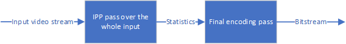
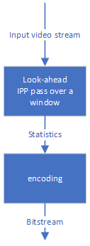
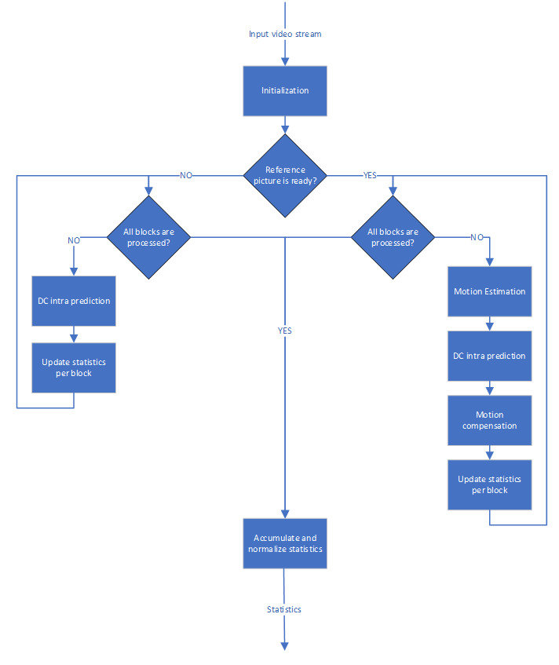
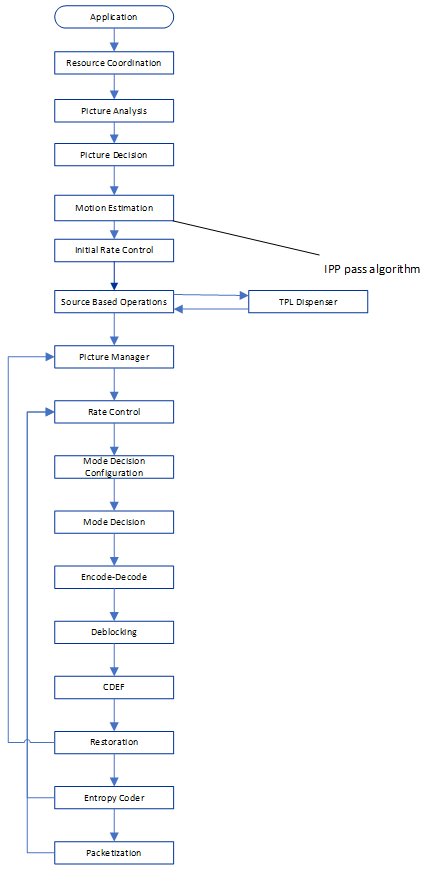

[Top level](../README.md)

# IPP Encoding Pass Appendix

## 1. Description of the Algorithm

The IPP encoding pass of SVT-AV1 encoder is a light encoding process that
processes all of the input video pictures and collects statistics while
consuming negligible time as compared to the time it takes to run the final
encoding. The IPP pass makes use of a flat IPP… prediction structure where the
input pictures are used as reference pictures. The IPP encoding pass can be
used as a first pass in the multi-pass encoding mode as shown in Figure 1, or
as a statistics generation tool based on a lookahead window when it is enabled
in the single pass encoding mode as shown in Figure 2. In both encoding modes,
when IPP pass is enabled, the input data from the source clip is analyzed and
stored in a local buffer. The collected data from the IPP pass is then used to
achieve the best encoding complexity-quality trade-offs. The collected data may
be used to select the suitable prediction structure for the next encoding pass
or may be used to improve the rate control behavior.

##### Figure 1. Multi-pass encoding mode with IPP pass.

##### Figure 2. Single pass encoding mode with look-a-head.

## 2. Implementation of the Algorithm

### 2.1. IPP Pass Inputs/Outputs

**Input to open_loop_first_pass**: Source streams.

**Outputs of open_loop_first_pass**: Statistics per frame.

Table 1 summarises the output statistic variables.

##### Table 1: Frame-level IPP pass output statistics.
| **Parameter**        | **Description**                                                                                |
| -----------          | -----------------                                                                              |
| intra_error          | Intra prediction error                                                                         |
| coded_error          | Best of intra pred error and inter pred error using last frame as ref.                         |
| sr_coded_error       | Best of intra pred error and inter pred error using golden frame as ref.                       |
| mv_count             | Count of motion vector                                                                         |
| inter_count          | Count of blocks that pick inter prediction (inter pred error is smaller than intra pred error) |
| second_ref_count     | Count of blocks that pick second ref (golden frame)                                            |
| neutral_count        | Count of blocks where the inter and intra prediction distortions are very close and small      |
| intra_skip_count     | Count of blocks where the intra prediction error is very small                                 |
| image_data_start_row | Start row                                                                                      |
| sum_in_vectors       | Sum of inward motion vectors                                                                   |
| sum_mvc              | Sum of motion vector x component                                                               |
| sum_mvr_abs          | Sum of absolute value of motion vector y component                                             |
| sum_mvc_abs          | Sum of absolute value of motion vector x component                                             |
| intra_factor         | A factor calculated using intra pred error                                                     |
| brightness_factor    | A factor that measures brightness                                                              |

### 2.2. IPP Pass API

Table 2 summarises the invoked functions when IPP pass is enabled. The process
where each function is called is indicated as well as a brief description of
each function.

##### Table 2: IPP pass main function calls.
| **Process**              | **Function**             | **Purpose**                                             |
| -----------              | -----------------        | -----------------                                       |
| motion_estimation_kernel | setup_firstpass_data_seg | Initialize the IPP data                                 |
| motion_estimation_kernel | first_pass_me            | Source-based Motion estimation                          |
| motion_estimation_kernel | first_pass_frame_seg     | Source-based Intra prediction and Motion compensation   |
| motion_estimation_kernel | first_pass_frame_end     | Normalize and accumulate statistics                     |
| motion_estimation_kernel | svt_av1_end_first_pass   | Output statistics when multi-pass encoding mode is used |

### Details of the Implementation

The IPP pass is enabled when a multi-pass encoding mode is used or when the lookahead is enabled. When the IPP pass is enabled, the following algorithmic steps are considered for each input picture:

1. Initialisation of all statistics structures and variables.
2. If a reference picture is not enabled yet, as in the example of the first picture in the input sequence, then an intra DC prediction takes place and the statistics are updated accordingly.
3. If at least one reference picture is available then, motion estimation takes place followed by an intra DC prediction and motion compensation. According to the generated prediction errors and the motion information, the prediction and coding statistics are updated for each block.
4. After processing all blocks within a picture, the generated statistics are accumulated, normalized and stored for further use.

Figures 3 and 4 summarises the data flow of the IPP pass.

##### Figure 3. IPP algorithm data flow.

##### Figure 4. IPP pass localisation in the encoder pipeline.

## 3. Optimization of the Algorithm

The IPP pass algorithm can be configured in different ways to achieve its best
quality-complexity tradoffs depending on the application. The control
parameters used to configure the IPP pass are described in Table 3.

##### Table 3: Control flags associated with the IPP pass.
| **Flag**              | **Level (Sequence/Picture)** | **Description**      |
| -----------           | -----------------            | -----------------    |
| skip_frame_first_pass | Sequence                     | 0: OFF, 1: Skip the processing of some frames in the IPP pass |
| ds                    | Sequence                     | 0: OFF, 1: Use down-sampled input picture in the IPP search algorithms |
| bypass_blk_step       | Sequence                     | 0: OFF, 1: Bypass every other row of blocks and every other column of blocks in the IPP search algorithm |
| dist_ds               | Sequence                     | 0: OFF, 1: Use down-sampled distortion in the IPP search algorithms |
| bypass_zz_check       | Sequence                     | 0: OFF, 1: Bypass the (0,0)_MV check against HME_MV before performing motion estimation |
| use8blk               | Sequence                     | 0: OFF, 1: Use 8x8 blocks instead of 16x16 blocks in the IPP search algorithms |
| reduce_me_search      | Sequence                     | 0: OFF, 1: Reduce HME and ME search area size |

Note that in the multi-pass encoding mode, the encode pipeline of the IPP pass
has been modified to involve only the necessary encoder kernels, such motion
estimation kernel, and all unnecessary kernels such as Rate Control, Mode
Decision, Encode-decode, Deblocking, CDEF, Restoration, Entropy Coder… are
bypassed.

## Notes

The feature settings that are described in this document were compiled at
v1.7.0 of the code and may not reflect the current status of the code. The
description in this document represents an example showing how features would
interact with the SVT architecture. For the most up-to-date settings, it's
recommended to review the section of the code implementing this feature.
