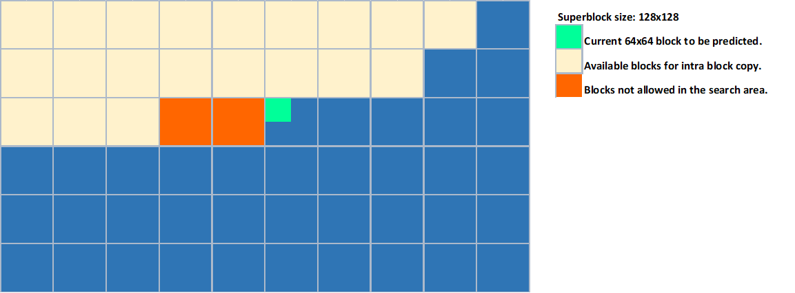
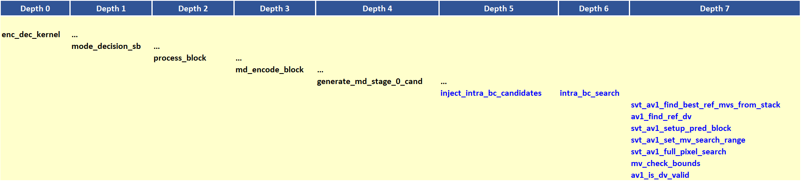

# Intra Block Copy

## 1.  Description of the algorithm

In intra frames, intra block copy (IBC) allows for the prediction of a
given Intra coded block to be a copy of another intra coded block in the
same frame (i.e. from the reconstructed part of the current frame). The
copied block is specified using a displacement vector (DV). Only integer
DVs are allowed since ```force_integer_mv``` will be equal to 1 for intra
frames. Bilinear interpolation is considered for chroma prediction in
the case of odd DVs. IBC is applicable only to key frames and intra-only
non-key frames. When IBC is active, all in-loop filtering is disabled
for the whole frame, including deblocking filter, CDEF and restoration
filter. The prediction is generated from the reconstructed intra pixels,
where the latter would not have been processed by the in-loop filters
since they are disabled. The predicted block is considered an inter
predicted block using a single reference frame (the current intra
frame), and where the DV is full-pel. Only single-reference mode is
allowed.

A 256 pixels wide area just before the block being predicted is excluded
from the block copy intra search area, i.e. the valid region of the
frame consists of already reconstructed blocks that are 256 pixels away
(in a raster scan order) from the current block. Figure 1 below
illustrates the allowed search area.



##### Figure 1. Diagram showing blocks not allowed in the search area.

The IBC feature is useful in encoding screen content that involves
repeated patterns, text and texture in the same frame.

## 2.  Implementation of the algorithm

### Main function calls

A diagram of the main function calls associated with the IBC algorithm
is shown in Figure 2 below. The functions are shown according to the
depth of the function call.



##### Figure 2. Main function calls associated with the IBC algorithm.

### Candidate Injection

In the function ```inject_intra_bc_candidates``` , up to 2 intra candidates
are injected as IBC modes. These modes are considered ```DC_PRED``` modes
when coding the block mode information in the bit stream. Simple
translation is used and no fractional DVs are allowed for this case. For
Chroma, bi-linear interpolation is used to produce predicted pixels. The
two candidates are determined through the ```intra_bc_search``` function
call, which is discussed next.

### DV Search

The function ```intra_bc_search``` performs a search within the current
picture (already decoded reconstructed area). The search is a
combination of a classic Diamond search followed by Hash search (CRC is
used as Hash metric). The search is only performed in full pel
resolution as sub-pel displacements are not allowed in the IBC tool in
AV1.

The decoded reconstructed area is divided into two search areas: Top and
Left. As explained above, due to HW constraints, not all of Top
reconstructed area is used to derive DV vectors. To support wavefront
like SW based processing, more constraints are added to only consider
the valid SBs in such scenario.

More detailed steps involved in the DV search are listed below:

1.  Set the reference frame to ```INTRA_FRAME```.

2.  Get nearest and near MVs from MV stack for the specified reference
    frame. See (```svt_av1_find_best_ref_mvs_from_stack```)

3.  Set ```dv_ref``` to either nearest or near.

4.  Constrain the ```dv_ref``` mv to be at least a block size away from the
    current block, and also to point at least 256 samples away to the
    left in the x direction when too close to the tile top boundary.
    (```av1_find_ref_dv```)

5.  Two types of searches could be performed: Search above the current
    block (```IBC_MOTION_ABOVE```) only or search above and to the left of
    the current block (```IBC_MOTION_ABOVE``` and ```IBC_MOTION_LEFT```),
    depending on the setting of ```ibc_mode```. Up to two dv candidates could
    be generated.

6.  Limits on mv sizes are computed and refined
    (```svt_av1_set_mv_search_range```).

7.  Perform full-pel diamond search followed by hash search
    (```svt_av1_full_pixel_search```).

8.  Make sure returned mv is within the specified mv bounds
    (```mv_check_bounds```)

9.  Make sure the returned mv meets HW and SW constraints
    (```av1_is_dv_valid```)

### Control macros/flags

The Intra block copy algorithm is enabled only when screen content is
detected. Alternatively, there is a manual mode where the user can
configure the encoder to enable or disable IBC via –scm 0/1 in the
encoder command line instruction. With -scm 1, IBC will be used
regardless of the value of the SC detector. Command line option `-intrabc-mode` allows to specify intraBC mode as per table below.

The control flags associated with the IBC feature are listed in Table 1
below.

##### Table 1. Control flags for IBC.

|**Flag**|**Level(Sequence/Picture)**|**Description**|
|--- |--- |--- |
|-scm|Sequence|Command line token. 0: No IBC, 1: IBC ON 2:Auto mode (detector based)|
|-intrabc-mode|Configuration|To specify intraBC mode on command line. 0: OFF, 1-3: IBC ON with complexity as below, -1: Default behavior|
|ibc_mode|Picture|Controls the complexity-quality tradeoff of the feature. 0: OFF, 1: Slow mode, 2: Faster, 3: Fastest|
|allow_intrabc|Picture|For intra pictures and for encoder presets 0 to 5, allow_intrabc setting is the same as the sc_content_detected setting; otherwise, it is set to 0.|

## 3.  Optimization of the algorithm

The complexity-quality tradeoffs in the IBC feature are controller
using the ```ibc_mode``` flag. The description of the flag settings is given
in Table 2 below.

##### Table 2. Description of the ibc\_mode settings.

| **ibc\_mode** | **Description**                                                                                                 |
| ------------- | --------------------------------------------------------------------------------------------------------------- |
| 0             | OFF                                                                                                  |
| 1             | Slow mode.                                                                                                  |
| 2             | Fast mode. A more relaxed threshold is used to enable an early exit in the DV search for Nx4 or 4xN blocks. |
| 3             | Faster mode. Only Above search area is considered in the search algorithm                                   |

The settings for ```ibc_mode``` are a function of the encoder preset and
are given in Table 3 below.

##### Table 3. ibc\_mode as a function of the encoder preset.

| **Encoder preset (enc\_mode)** | **ibc\_mode** |
| ------------------------------ | ------------- |
| 0 to 2                         | 1        |
| 3 to 8                         | 2        |

## 4.  Signaling

The main signal that is sent in the bitsream to enable IBC is
```allow_intrabc``` that is sent in the frame header. Note that IBC is only
allowed for Intra coded frames. At the sequence header screen content
tools have to be enabled in order to use IBC at the frame level.
