# Local Warped Motion Compensation Appendix

## 1.  Description of the algorithm

Warped motion modes are inter-prediction modes where the prediction
is generated by applying an (affine) transform to the reference. AV1
has two affine prediction modes: global warped motion and local
warped motion (LW). The latter is discussed in more detail in the following.

AV1 has three types of motion modes that specify the motion of a
block, namely SIMPLE, OBMC and LW. LW motion estimation provides a description
of the type of local motion. Minimal signaling overhead
is realized by signaling one flag in the inter block mode info, and
that only under some conditions. LW cannot be combined with OBMC.

Warped motion compensation concerns the estimation and compensation of small
local motion for a given block. The feature makes use of motion vector information
for neighboring blocks to extract the local motion model parameters. The general
motion model for local warped motion is given by

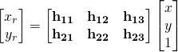

where 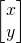 and 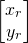  represent the sample pixel coordinates in the current
and reference frames, respectively. The decoder performs the same model
estimation, so the encoder needs only to signal whether local warped
motion is the selected mode for the current block and the corresponding
translational model parameters  and
, i.e. the rest of the model parameters are
not signaled in the bitstream.

To simplify the model estimation,  and
 are assumed to represent the entries in the
current block motion vector (**MV** in the Figure 1 below).

Let **MV**=
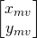. Then the above implies 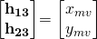. The remaining parameters ,
and  are estimated using a least squares approach.

To illustrate the estimation of the parameters
 and
 using a
least squares approach, consider the example shown in Figure 1 below.

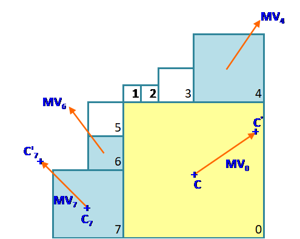

##### Figure 1. Current block in yellow is a 32x32 block. Neighboring blocks that refer to the same reference picture as the current block are in blue. MVs (in orange) for the current block and the blue blocks are used to infer the local warp motion of the yellow block.

In the following, assume the x and y coordinates are specified with
reference to the top left corner of the yellow block. Let
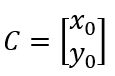 be the center of the current block, and
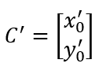 the projection of (C) onto the reference frame using
the motion vector **MV** for the current block. According to the motion
model:

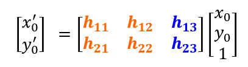

For block 6, define 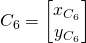 to be the center of block 6, and
 to be the projection of  onto the reference
frame using the mv  for block 6. Assuming the same
motion model as above, it follows that:

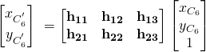

Taking the difference between the two equations above:

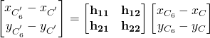

The local warp transformation defines how the vector relating  and
 in the source frame is projected into the vector relating  and  in the reference frame.

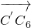 = 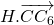 where 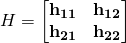

The vectors 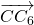 and
 are shown in purple in Figure 1.
The steps above are then repeated for blocks 5 and 3. The least squares
minimization problem is then broken into two estimation problems: One of the estimation problems is to determine
the parameters 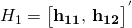 and the other is to estimate the parameters
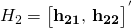 such that

 and 
where the matrices  and 
are constructed from the data above. The solutions to the least squares
estimation problems are then given as
^{-1}A_1B_1) and ^{-1}A_2B_2)

For implementation purposes, the local warp transform is implemented as
two shears: A horizontal shear and vertical shear. The model matrix H is
then decomposed as follows:

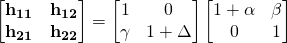

where  are shear
model parameters. The Vertical shear is given by the following model:

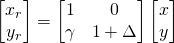

whereas the horizontal shear is given by:

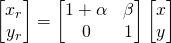

The combined transform is given by:

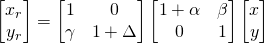

The shear parameters  are determined based on the parameters
 and
. Subpel displacements that results from the application of
the horizontal and vertical shears are evaluated using 8-tap
interpolation filters with  pel precision.

The final warped motion model is applied on an 8x8 basis in the source
frame. The predicted block is constructed by assembling the 8x8
predicted warped blocks from the reference picture.

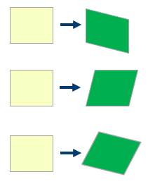

##### Figure 2. The horizontal, vertical, and combined shears respectively.

At the decoder side, the affine transform parameters are derived at the
block-level using as input the motion vectors of the current and
neighboring blocks.

## 2.  Implementation of the algorithm

**Control macros/flags**:

LW can be enabled/disabled at the sequence and the picture level as
indicated in Table 1.

##### Table 1. Control flags/tokens associated with the LW feature.

| **Flag**                      | **Level (sequence/Picture)** | **Description**                            |
| ----------------------------- | ---------------------------- | ------------------------------------------ |
| \-local-warp                  | Config / Sequence            | Encoder configuration parameter to enable/disable LW |
| allow\_warped\_motion         | Picture                      | Enable/disable LW                          |


**Details of the implementation**

As with other prediction mode candidates in the encoder, candidates
for the LW mode are first injected into MD and then processed through
several MD stages of RD optimization. A high-level diagram of the
function calls relevant to the two main LW functions, namely
```inject_inter_candidates``` and ```warped_motion_prediction``` is given in
Figure 3 below.

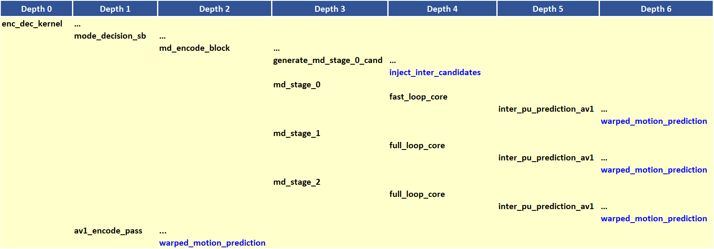

##### Figure 3. Function calls relevant to the two main LW functions highlighted in blue.

The two main steps involved in the LW processing in MD, namely the
injection of the LW candidates and the generation of the LW predictions
are outlined in the following.

**Step 1: Injection of the LW candidates.**

The injection is performed by the function ```inject_inter_candidates```.
A diagram of the relevant function calls is given in Figure 4.

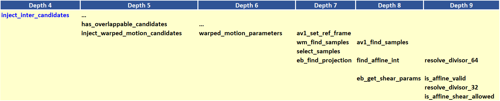

##### Figure 4. Continuation of Figure 3 with the function calls related to the injection of LW candidates.

1.  Check if the current block has overlappable blocks above and/or to
    the left of the current block (```has_overlappable_candidates```).
    Overlappable blocks are adjacent blocks above or to the left of the
    current block that are inter blocks with width \>= 8 and height \>=
    8.

2.  Inject warped candidate (function
    ```inject_warped_motion_candidates```) if the current block is such
    that width \>= 8 and height \>= 8 and warped\_motion\_injection is
    set.

    1.  Get an MV. The MV would be from List 0 and could correspond
        to NEAREST MV, NEAR MV or NEW MV.

    2.  Compute warped parameters (function
        *warped\_motion\_parameters*)

        1.  **Get warp samples**

            1.  Get MVs from overlappable neighboring blocks in the
                causal neighborhood, i.e. top and left of the current
                block. (```wm_find_samples```)

            2.  Generate the list of warp samples, i.e., selection
                of samples (```select_samples```). To perform the
                selection of samples, the difference between the MV
                for the current block and the MV of the neighboring
                block is computed. The sum of the absolute values of
                the x and y components of the difference are compared
                to a threshold. Neighboring blocks that result in a
                large sum are not considered. Stop if number of
                samples in the list is small, since the estimated
                warp motion parameters would be unreliable.

        2.  **Warp parameters estimation (function
            ```eb_find_projection```)**

            1.  Generate the warp motion parameters with the warp
                samples using the least squares fit
                (```find_affine_int```). Stop if parameters don’t fit
                threshold criteria.

            2.  Generate warp variables alpha, beta, gamma and delta
                for the two shearing operations (i.e., horizontal and
                vertical, which combined make the full affine
                transformation). (```eb_get_shear_params```). Stop if
                the shear parameters are not valid
                (```is_affine_shear_allowed```).

    3.  If not discarded, the LW candidate is added to the RD
        andidate list.

**Step 2: Evaluation of the LW candidates in MD**

The generation of the LW predictions in MD is performed using the
function *warped\_motion\_prediction*. A diagram of the associated
function call is shown in Figure 5 below.

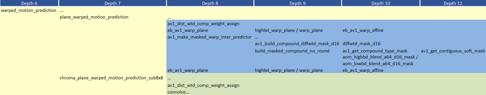

##### Figure 5. Continuation of Figure 3 with the function calls related to the evaluation of the LW predictions in MD.

The steps involved in the generation and evaluation of the predictions
are outlined below.

1.  Generate warped motion predicted samples for each plane
    (```plane_warped_motion_prediction```)

    1.  plane_warped_motion_prediction: Generates the luma and chroma warped
        luma predictions. The chroma predictions are generated for blocks that
        are 16x16 or larger.

        1.  ```av1_dist_wtd_comp_weight_assign```: Returns forward offset and
            backward offset for the case of compound reference candidates
            and where the inter-inter compound prediction mode is COMPOUND_DISTWTD.
            The forward offset and backward offset are used as weights in the generation
            of the final prediction.

        2.  ```av1_make_masked_warp_inter_predictor```: Called only in the case of compound
            reference candidate where the inter-inter compound type is COMPOUND_WEDGE or
            COMPOUND_DIFFWTD. Generates the predictions for both of those two compound types.  The
            first step is to build the mask for the case of the COMPOUND_DIFFWTD inter-inter compound
            type using the function ```av1_build_compound_diffwtd_mask_d16```. The next step is to generate
            the predictions using the function ```build_masked_compound_no_round``` as follows:

            1. The function ```av1_get_compound_type_mask``` is called and returns the mask
                for either the case of COMPOUND_DIFFWTD or for the case of COMPOUND_WEDGE.
               The function ```av1_get_contiguous_soft_mask``` returns the mask for the case of
                COMPOUND_WEDGE. For the case of COMPOUND_DIFFWTD, the mask is computed in
                the step above.

            2. The function ```aom_highbd_blend_a64_d16_mask```/```aom_lowbd_blend_a64_d16_mask```
                is the called to perform the blending of the two inter predictions using
                the generated mask.

        3. ```eb_av1_warp_plane``` is invoked in the case of BIPRED where inter-inter
            compound type is COMPOUND_DISTWTD. In this case the ```function highbd_warp_plane```
            / ```warp_plane``` is called and in turn calls the function ```eb_av1_highbd_warp_affine``` /
            ```eb_av1_warp_affine```. The latter applies the affine transform and generates the warped
            motion prediction using the forward offset and backward offset weights associated with the COMPOUND_DISTWTD mode.
            This last step is performed at the level of 8x8 blocks, until the prediction for the entire block is generated.

    2.  ```chroma_plane_warped_motion_prediction_sub8x8```: Generates chroma warped motion
        predictions for blocks that are smaller than 16x16. The function
        ```av1_dist_wtd_comp_weight_assign``` is first called to generate the mask for the
        COMPOUND_DISTWTD case. The appropriate function in the function array
        ```convolve[][][]``` / ```convolveHbd[][][]``` is then called to generate the prediction
        using the forward offset and the backward offset weights.

2.  Compute RD for the LW prediction. Rate includes the signaling of
    the syntax element ```motion_mode```

<!-- end list -->

**Step 3**: Generate the final warped motion predictions in the encode pass.
The main relevant function is warped_motion_prediction which is described above.

## 3.  Optimization of the algorithm

The injection of the LW motion candidates is performed if the following is true:
allow_warped_motion is set AND the block has overlappable candidates AND bwidth >= 8
AND bheight >= 8 AND warped_motion_injection is set. The flag warped_motion_injection
is set in signal_derivation_enc_dec_kernel_oq as shown in Table 2 below:

##### Table 2. warped_motion_injection as a function of encoder settings.
| **PD_PASS**                    | **warped_motion_injection**             |
| ------------------------------ | --------------------------------------- |
| PD_PASS_0                      | 0                                       |
| PD_PASS_1                      | 1                                       |
| Otherwise                      | if sc_content_detected then 0, else 1   |

In mode decision, the picture-level flag allow_warped_motion is set in
signal_derivation_mode_decision_config_kernel_oq as shown in Table 3 below.


##### Table 3. enable_wm setting as a function of encoder preset.

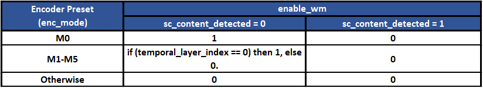

The final setting for allow_warped_motion is determined as follows: allow_warped_motion =
enable_wm AND not KEY_FRAME AND not INTRA_ONLY_FRAME and not error_resilient_mode.


## 4.  Signaling

The configuration flag *enable\_local\_warp\_flag* controls the
encoder use of LW at the sequence level. At frame level, the use of
LW is controlled by *allow\_warped\_motion*. At the block level, the
use of LW is signaled by the syntax element *motion\_mode,* which
indicates the type of motion for a block: simple translation, OBMC,
or warped motion.

## Reference
[1] Sarah Parker, Yue Chen, David Barker, Peter de Rivaz, Debargha Mukherjee,
“Global and Locally Adaptive Warped Motion Compensation in Video Compression,”  IEEE International Conference on Image Processing (ICIP), pp. 275-279, 2017.
