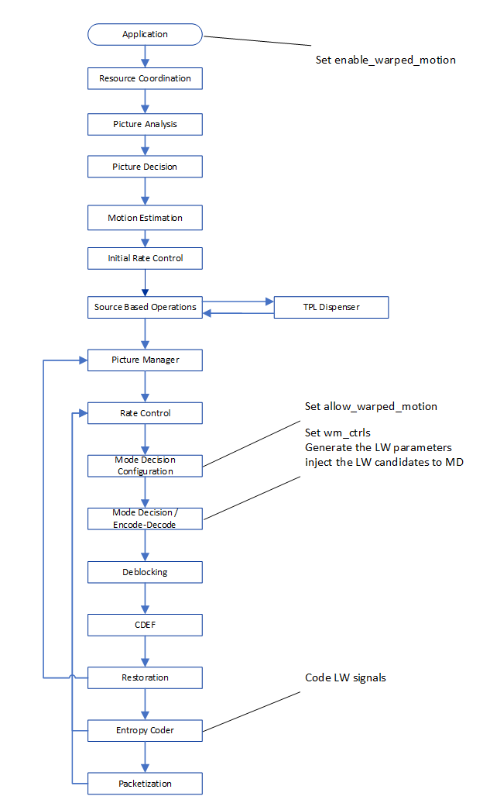
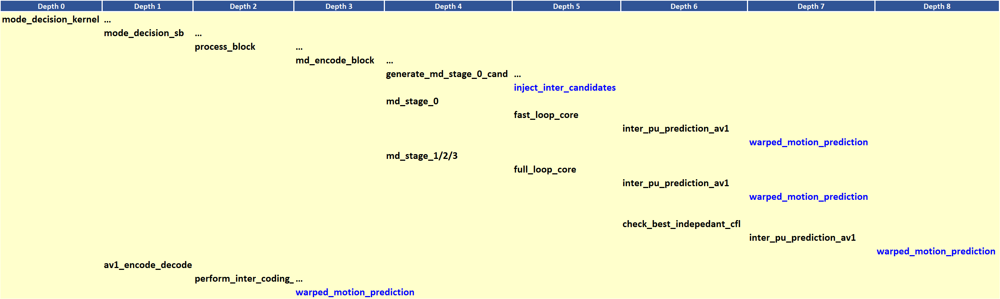
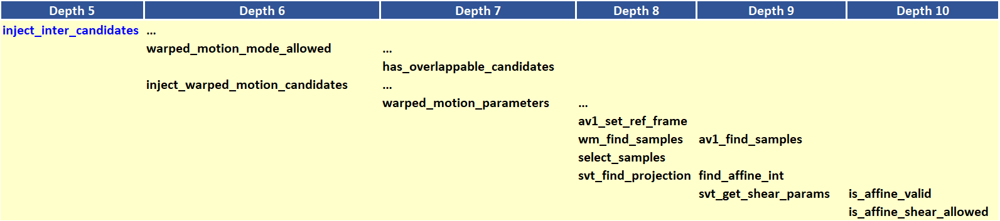

[Top level](../README.md)

# Local Warped Motion Compensation

## 1. Description of the algorithm

The warped motion mode is an inter-prediction mode where the prediction is
generated by applying an (affine) transform to the reference. AV1 has two
affine prediction modes: global warped motion and local warped motion (LW). The
latter is discussed in more detail in the following.

AV1 has three types of motion modes that specify the motion of a
block, namely SIMPLE, OBMC and LW. LW motion estimation provides a description
of the type of local motion. Minimal signaling overhead
is realized by signaling one flag in the inter block mode info, and
that only under some conditions. LW cannot be combined with OBMC.

Warped motion compensation concerns the estimation and compensation of small
local motion for a given block. The feature makes use of motion vector
information for neighboring blocks to extract the affine local motion model
parameters. The general motion model for local warped motion is given by

$`\begin{bmatrix}x_r \\ y_r\end{bmatrix}=
\begin{bmatrix}h_{11} & h_{12} & h_{13} \\ h_{21} & h_{22} & h_{23} \end{bmatrix}\begin{bmatrix}x \\ y \\ 1\end{bmatrix}`$

where $`\begin{bmatrix}x \\ y\end{bmatrix}`$ and $`\begin{bmatrix}x_r \\ y_r\end{bmatrix}`$ represent the sample pixel coordinates in the current
and reference frames, respectively. The decoder performs the same model
estimation, so the encoder needs only to signal whether local warped
motion is the selected mode for the current block and the corresponding
translational model parameters $`\mathbf{h_{13}}`$ and $`\mathbf{h_{23}}`$, i.e.
the rest of the model parameters are not signaled in the bitstream.

Model parameters $`\mathbf{h_{13}}`$ and $`\mathbf{h_{23}}`$
represent the entries in the current block motion vector ( $`\mathbf{MV_0}`$) in Figure 1 below).

Let $`\mathbf{MV_0} = \begin{bmatrix}x_{mv} \\ y_{mv}\end{bmatrix}`$\
Then the above implies,\
$`\begin{bmatrix}h_{13} \\ h_{23}\end{bmatrix} = \begin{bmatrix}x_{mv} \\
y_{mv}\end{bmatrix}`$,\
The remaining parameters $`h_{11}, h_{12}, h_{21}, h_{22}`$ are estimated using a least squares approach.

To illustrate the estimation of these parameters, consider example shown in Figure 1 below.


##### Figure 1. Current block in yellow is a 32x32 block. Neighboring blocks that refer to the same reference picture as the current block are in blue. MVs (in orange) for the current block and the blue blocks are used to infer the local warp motion of the yellow block.

Let $`C = \begin{bmatrix}x_0 \\ y_0\end{bmatrix}`$ be the center of the current
block, and $`C' = \begin{bmatrix}x'_0 \\ y'_0\end{bmatrix}`$
be the projection of $`(C)`$ onto the reference frame using
the motion vector $`\mathbf{MV_0}`$ for the current block. According to the
motion model: \
$`\begin{bmatrix}x'_0 \\ y'_0\end{bmatrix}=
\begin{bmatrix}\color{orange}{h_{11}} & \color{orange}{h_{12}} & \color{blue}{h_{13}} \\ \color{orange}{h_{21}} & \color{orange}{h_{22}} & \color{blue}{h_{23}}
\end{bmatrix}\begin{bmatrix}x_0 \\ y_0 \\ 1\end{bmatrix}`$

where the translational component
$`\begin{bmatrix}\color{blue}{h_{13}}\\\color{blue}{h_{23}}\end{bmatrix}`$ of
the motion model would correspond to the motion vector $`\mathbf{MV_0}`$ for the
current block. For block 7, define $`C_7 = \begin{bmatrix}x_7 \\
y_7\end{bmatrix}`$ to be the center of block 7, and $`C'_7 = \begin{bmatrix}x'_7
\\ y'_7\end{bmatrix}`$ to be the projection of
$`\mathbf{C}`$ onto the reference frame using the motion vector $`\mathbf{MV_7}`$ for block 7.

The local warp transformation defines how the vector relating $`\mathbf{C}`$ and $`\mathbf{C_7}`$ in the source frame is mapped into the vector relating
$`\mathbf{C'}`$ and $`\mathbf{C'_7}`$ in the reference frame.

$`\begin{bmatrix}x'_7-x'_0 \\ y'_7 - y'_0\end{bmatrix}=
\begin{bmatrix}\color{orange}{h_{11}} & \color{orange}{h_{12}} \\
\color{orange}{h_{21}} & \color{orange}{h_{22}}
\end{bmatrix}\begin{bmatrix}x_7-x_0 \\ y_7 - y_0 \end{bmatrix}`$

In addition to block 7, considering blocks 6 and 4 results in the following:
$`\begin{bmatrix}x'_4 - x'_0 & y'_4 - y'_0 \\ x'_6 - x'_0 & y'_6 - y'_0 \\ x'_7 - x'_0 & y'_7 - y'_0\end{bmatrix}=
\begin{bmatrix}x_4 - x_0 & y_4 - y_0 \\ x_6 - x_0 & y_6 - y_0 \\ x_7 - x_0 & y_7 - y_0\end{bmatrix}\begin{bmatrix}\color{orange}{h_{11}} & \color{orange}{h_{21}} \\
\color{orange}{h_{12}} & \color{orange}{h_{22}}
\end{bmatrix}`$

Define,
$`V_1 = \begin{bmatrix}x'_4 - x'_0 \\ x'_6 - x'_0 \\ x'_7 - x'_0\end{bmatrix},
V_2 = \begin{bmatrix} y'_4 - y'_0 \\ y'_6 - y'_0 \\  y'_7 - y'_0\end{bmatrix}, R=
\begin{bmatrix}x_4 - x_0 & y_4 - y_0 \\ x_6 - x_0 & y_6 - y_0 \\ x_7 - x_0 & y_7 - y_0\end{bmatrix}`$

it follows that:\
$`\begin{bmatrix}V_1 & V2\end{bmatrix} = R\begin{bmatrix}\color{orange}{h_{11}} & \color{orange}{h_{21}} \\
\color{orange}{h_{12}} & \color{orange}{h_{22}}
\end{bmatrix}`$


Solving a least square estimation for $`\begin{bmatrix}\color{orange}{h_{11}} & \color{orange}{h_{21}} \\ \color{orange}{h_{12}} & \color{orange}{h_{22}}\end{bmatrix}`$ yields:

$`\begin{bmatrix}\color{orange}{h_{11}} & \color{orange}{h_{21}} \\
\color{orange}{h_{12}} & \color{orange}{h_{22}}
\end{bmatrix} = (R^TR)^{-1}R^T\begin{bmatrix}V_1 & V_2\end{bmatrix}`$

For implementation purposes, the local warp transform is implemented as
two shears: A horizontal shear and vertical shear. The model matrix H is
then decomposed as follows:

$`\begin{bmatrix}\color{orange}{h_{11}} & \color{orange}{h_{12}} \\
\color{orange}{h_{21}} & \color{orange}{h_{22}}
\end{bmatrix} = \begin{bmatrix}1 & 0 \\
\gamma & 1+ \Delta
\end{bmatrix}\begin{bmatrix}1+\alpha & \beta \\
0 & 1
\end{bmatrix}`$

where $`\alpha,\beta,\Delta,\gamma`$ are shear model parameters. The Vertical shear is given by the following model:

$`\begin{bmatrix}x_r \\ y_r\end{bmatrix} =  \begin{bmatrix}1 & 0 \\
\gamma & 1+ \Delta
\end{bmatrix}\begin{bmatrix}x \\ y\end{bmatrix}`$


whereas the horizontal shear is given by, \
$`\begin{bmatrix}x_r \\ y_r\end{bmatrix} =  \begin{bmatrix}1 + \alpha & \beta \\
0 & 1 \end{bmatrix}\begin{bmatrix}x \\ y\end{bmatrix}`$


The combined transform is given by:
$`\begin{bmatrix}x_r \\ y_r\end{bmatrix} = \begin{bmatrix}1 & 0 \\
\gamma & 1+ \Delta
\end{bmatrix}\begin{bmatrix}1+\alpha & \beta \\
0 & 1
\end{bmatrix}\begin{bmatrix}x \\ y\end{bmatrix}`$

The shear parameters $`\alpha,\beta,\Delta,\gamma`$ are determined based on the parameters $`\mathbf{h_{11},h_{12},h_{21}}`$ and $`\mathbf{h_{22}}`$. Subpel displacements that results from the application of the horizontal and vertical shears are evaluated using 8-tap interpolation filters with $`1/64^{th}`$ pel precision.

The final warped motion model is applied on an 8x8 basis in the reference
frame. The predicted block is constructed by assembling the 8x8 predicted
warped blocks from the reference picture.


##### Figure 2. The horizontal, vertical, and combined shears respectively.

At the decoder side, the affine transform parameters are derived at the
block-level using as input the motion vectors of the current and
neighboring blocks.

## 2. Implementation of the algorithm

**Control tokens/flags**:

LW can be enabled/disabled at the sequence and the picture level as
indicated in Table 1.

##### Table 1. Control tokens/flags associated with the LW feature.

| **Flag**                      | **Level (sequence/Picture)** | **Description**                                                                                       |
| ----------------------------- | ---------------------------- | ------------------------------------------                                                            |
| enable_warped_motion          | Sequence                     | Encoder configuration parameter to allow/disallow LW in the encoding process  for the whole sequence. |
| allow\_warped\_motion         | Picture                      | Allow/disable LW at the picture level                                                                 |
| wm\_ctrls                     | Super-block                  | Control the number of LW candidates to be considered in the mode decision.                            |


**Details of the implementation**

Figure 3 below summarizes the data flow of the LW implementation.



##### Figure 3. Data flow for the LW feature.

As with other prediction mode candidates in the encoder, candidates for the LW
mode are first injected into MD and then processed through several MD stages of
RD optimization. A high-level diagram of the function calls relevant to the two
main LW functions, namely ```inject_inter_candidates``` and
```warped_motion_prediction``` is given in Figure 4 below.



##### Figure 4. Function calls relevant to the two main LW functions highlighted in blue.

The two main steps involved in the LW processing in MD, namely the
injection of the LW candidates and the generation of the LW predictions
are outlined in the following.

**Step 1: Injection of the LW candidates.**

The injection is performed by the function ```inject_inter_candidates```.
A diagram of the relevant function calls is given in Figure 5.



##### Figure 5. Continuation of Figure 3 with the function calls related to the injection of LW candidates.

1.  Check if the current block has overlappable blocks above and/or to
    the left of the current block (```has_overlappable_candidates```).
    Overlappable blocks are adjacent blocks above or to the left of the
    current block that are inter blocks with width \>= 8 and height \>=
    8.

2.  Inject warped candidate (function
    ```inject_warped_motion_candidates```) if the current block is such
    that width \>= 8 and height \>= 8 and warped\_motion\_injection is
    set.

    1.  Get an MV. The MV would be from List 0 and could correspond
        to NEAREST MV, NEAR MV or NEW MV.

    2.  Compute warped parameters (function
        *warped\_motion\_parameters*)

        1.  **Get warp samples**

            1.  Get MVs from overlappable neighboring blocks in the
                causal neighborhood, i.e. top and left of the current
                block. (```wm_find_samples```)

            2.  Generate the list of warp samples, i.e., selection
                of samples (```select_samples```). To perform the
                selection of samples, the difference between the MV
                for the current block and the MV of the neighboring
                block is computed. The sum of the absolute values of
                the x and y components of the difference are compared
                to a threshold. Neighboring blocks that result in a
                large sum are not considered. Stop if number of
                samples in the list is small, since the estimated
                warp motion parameters would be unreliable.

        2.  **Warp parameters estimation (function
            ```svt_find_projection```)**

            1.  Generate the warp motion parameters with the warp
                samples using the least squares fit
                (```find_affine_int```). Stop if parameters don’t fit
                threshold criteria.

            2.  Generate warp variables alpha, beta, gamma and delta
                for the two shearing operations (i.e., horizontal and
                vertical, which combined make the full affine
                transformation). (```svt_get_shear_params```). Stop if
                the shear parameters are not valid
                (```is_affine_shear_allowed```).

    3.  If not discarded, the LW candidate is added to the RD
        candidate list.

**Step 2: Evaluation of the LW candidates in MD**

The generation of the LW predictions in MD is performed using the
function ```warped\_motion\_prediction```. A diagram of the associated
function call is shown in Figure 6 below.


##### Figure 6. Continuation of Figure 4 with the function calls related to the evaluation of the LW predictions in MD.

The steps involved in the generation and evaluation of the predictions
are outlined below.

1.  Generate warped motion predicted samples for each plane
    (```plane_warped_motion_prediction```)

    1.  plane_warped_motion_prediction: Generates the luma and chroma warped
        luma predictions. The chroma predictions are generated for blocks that
        are 16x16 or larger.

        1.  ```av1_dist_wtd_comp_weight_assign```: Returns forward offset and
            backward offset for the case of compound reference candidates
            and where the inter-inter compound prediction mode is COMPOUND_DISTWTD.
            The forward offset and backward offset are used as weights in the generation
            of the final prediction.

        2.  ```av1_make_masked_warp_inter_predictor```: Called only in the case of compound
            reference candidate where the inter-inter compound type is COMPOUND_WEDGE or
            COMPOUND_DIFFWTD. Generates the predictions for both of those two compound types. The
            first step is to build the mask for the case of the COMPOUND_DIFFWTD inter-inter compound
            type using the function ```av1_build_compound_diffwtd_mask_d16```. The next step is to generate
            the predictions using the function ```build_masked_compound_no_round``` as follows:

            1. The function ```av1_get_compound_type_mask``` is called and returns the mask
                for either the case of COMPOUND_DIFFWTD or for the case of COMPOUND_WEDGE.
               The function ```av1_get_contiguous_soft_mask``` returns the mask for the case of
                COMPOUND_WEDGE. For the case of COMPOUND_DIFFWTD, the mask is computed in
                the step above.

            2. The function ```aom_highbd_blend_a64_d16_mask```/```aom_lowbd_blend_a64_d16_mask```
                is the called to perform the blending of the two inter predictions using
                the generated mask.

        3. ```svt_av1_warp_plane``` is invoked in the case of BIPRED where inter-inter
            compound type is COMPOUND_DISTWTD. In this case the ```function highbd_warp_plane```
            / ```warp_plane``` is called and in turn calls the function ```svt_av1_highbd_warp_affine``` /
            ```svt_av1_warp_affine```. The latter applies the affine transform and generates the warped
            motion prediction using the forward offset and backward offset weights associated with the COMPOUND_DISTWTD mode.
            This last step is performed at the level of 8x8 blocks, until the prediction for the entire block is generated.

    2. ```chroma_plane_warped_motion_prediction_sub8x8```: Generates chroma warped motion
        predictions for blocks that are smaller than 16x16. The function
        ```av1_dist_wtd_comp_weight_assign``` is first called to generate the mask for the
        COMPOUND_DISTWTD case. The appropriate function in the function array
        ```convolve[][][]``` / ```convolveHbd[][][]``` is then called to generate the prediction
        using the forward offset and the backward offset weights.

2. Compute RD for the LW prediction. Rate includes the signaling of
    the syntax element ```motion_mode```

<!-- end list -->

**Step 3**: Generate the final warped motion predictions in the encode pass.
The main relevant function is warped_motion_prediction which is described above.

## 3. Optimization of the algorithm

The injection of the LW motion candidates is performed if the following is
true: ```allow_warped_motion``` is set AND the block has overlappable
candidates AND ```bwidth >= 8``` AND ```bheight >= 8``` AND enable flag (in the
LW controls structure) is set to 1.

The injection of LW candidates is not allowed for ```PD_PASS_0```.

In mode decision, the picture-level flag wm_level controls the
complexity-quality tradeoffs associated with the LW feature. The flag is set is
set in ```signal_derivation_mode_decision_config_kernel_oq``` and control the
LW optimization signals listed in Table 2 below.

The wm_level is set to zero for Intra pictures or when
```error_resilient_mode``` is enabled or when ```frame_super-resolution``` is
enabled.

##### Table 2. Optimization signals associated with the LW feature.
|**Signal**|**Level**|**Description**|
|--- |--- |--- |
|enabled|Super-block|Allow/disallow the injection of LW candidates|
|use_wm_for_mvp|Super-block|Allow/disallow the injection of MVP-based LW candidates|
|num_new_mv_refinement|Super-block|Define the number of refinement positions around the NEW_MVs [0..12]|

## 4. Signaling

The configuration flag ```enable_local_warp_flag``` controls the encoder use of
LW at the sequence level. At the frame level, the use of LW is controlled by
```allow_warped_motion```. At the block level, the use of LW is signaled by the
syntax element ```motion_mode```, which indicates the type of motion for a
block: simple translation, OBMC, or warped motion.

## Notes

The feature settings that are described in this document were compiled at
v1.7.0 of the code and may not reflect the current status of the code. The
description in this document represents an example showing how features would
interact with the SVT architecture. For the most up-to-date settings, it's
recommended to review the section of the code implementing this feature.

## Reference
[1] Sarah Parker, Yue Chen, David Barker, Peter de Rivaz, Debargha Mukherjee,
“Global and Locally Adaptive Warped Motion Compensation in Video Compression,” IEEE International Conference on Image Processing (ICIP), pp. 275-279, 2017.

[2] Jingning Han, Bohan Li, Debargha Mukherjee, Ching-Han Chiang, Adrian Grange, Cheng Chen, Hui Su, Sarah Parker, Sai Deng, Urvang Joshi, Yue Chen, Yunqing Wang, Paul Wilkins, Yaowu Xu, James Bankoski,
“A Technical Overview of AV1,” Proceedings of the IEEE, vol. 109, no. 9, pp. 1435-1462, Sept. 2021.
