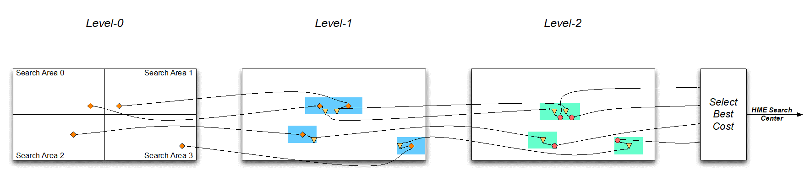
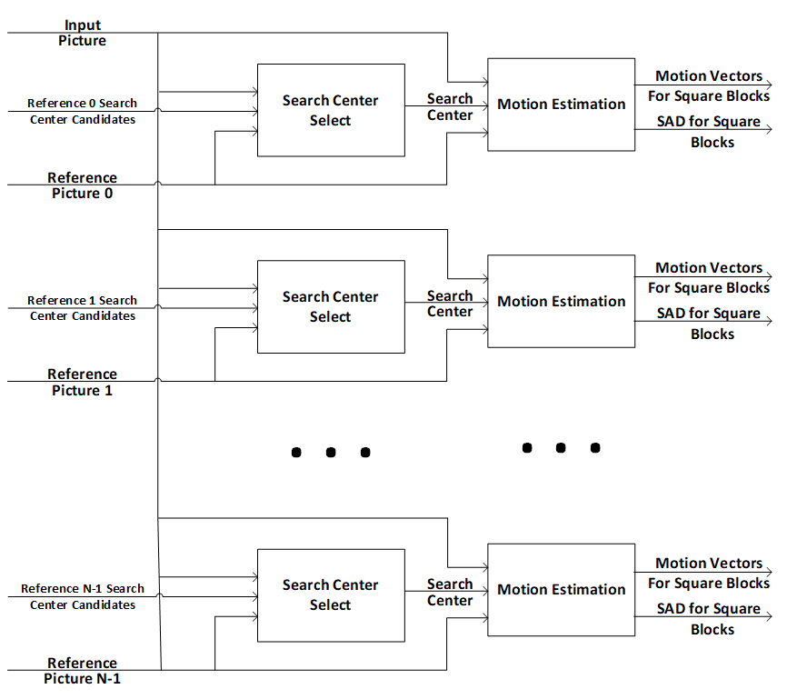
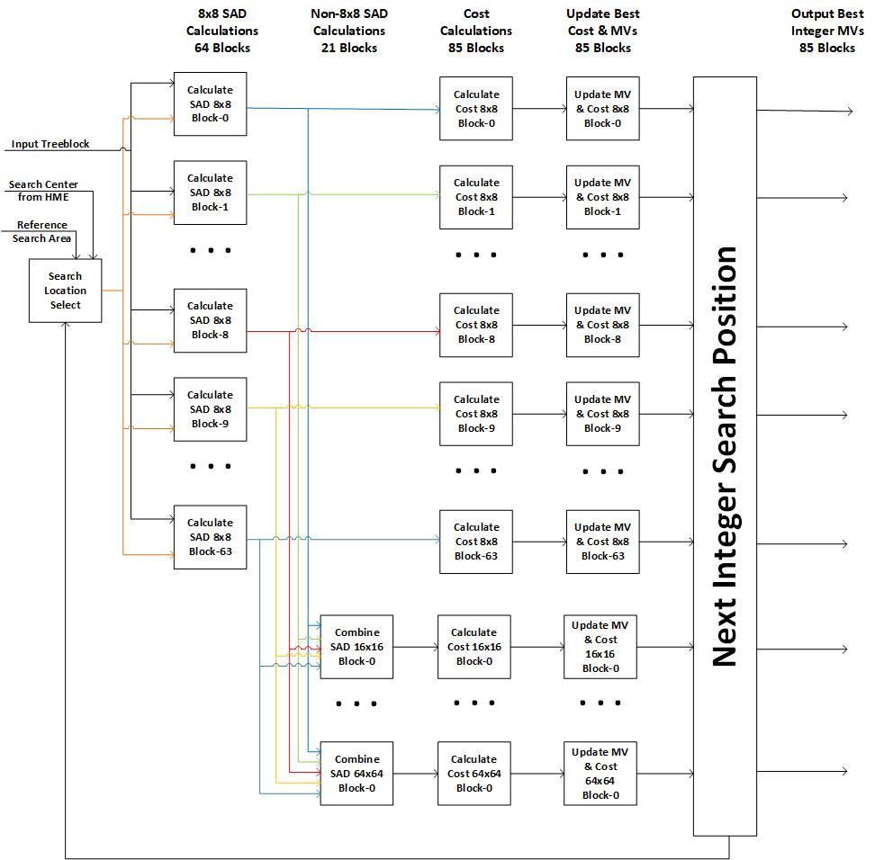
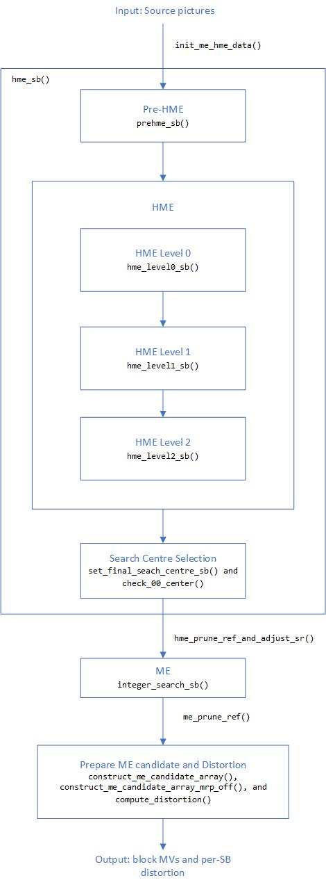

[Top level](../README.md)

# Open-Loop Motion Estimation

The Motion Estimation (ME) process generates inter-prediction candidates using
highly parallelizable, open loop, neighbor-independent methods. In the current
SVT-AV1 encoder, the ME process is based on the input pictures, i.e. the
reference pictures are replaced by the corresponding source pictures. As a
result, the ME is an open loop operation. The Motion Estimation (ME) process
has access to the current input picture as well as to the input pictures the
current picture uses as references according to the hierarchical prediction
structure under consideration. The ME process is multithreaded, so pictures can
be processed out of order as long as corresponding reference input pictures are
available. The ME process generates motion estimation information for all
square blocks starting at 8x8 size up to the superblock (SB) size. The motion
vector information is generated at full-pel precision. The candidates’ costs
generated in the ME processes are further refined in downstream processes and
as more neighbor information becomes available allowing for more accurate costs
to be calculated.

ME process involves four components: Pre-Hierarchical Motion Estimation
(pre-HME), Hierarchical Motion Estimation (HME), Search Center Selection, and
Motion Estimation (ME). The pre-HME/HME performs a quick search on down-sampled
pictures to converge to a candidate search center for full-pel motion
estimation search at the full picture resolution. Search center selection
selects a single search center from several pre-HME/HME candidates and external
search center candidates (in the current configuration (0,0) is always
considered as a search centre candidate). One goal of this design is to
eliminate the need for large search areas with search center selection and then
to fully search a smaller search area with the refinement stage. Motion
Estimation finds the best motion vector around the SB search center for each of
the partitions being considered.


## Description of the Algorithm

### Pre-Hierarchical Motion Estimation (pre-HME)

The goal of pre-HME is to catch very high motion along the horizontal or
vertical directions. A narrow, long search is performed along each direction on
the sixteenth-downsampled pictures (i.e. downsampling by a factor of 4 in each
direction) as shown in Figure 1.

The best overall pre-HME search centre/SAD pair is saved from the search. After
HME-level-0, if the best pre-HME result is better than any of the HME-level-0
search centres (based on SAD), the worst HME-level-0 search centre is replaced
by the best pre-HME result (to be considered in the next HME stages). As such,
HME-level-1 must be enabled to use pre-HME.


##### Figure 1. Example of a pre-HME search area around point X. The search region is long and narrow in the horizontal and vertical direction.

### Hierarchical Motion Estimation (HME)

Hierarchical Motion Estimation (HME) takes as input an enhanced input picture
and reference picture and produces a search center for each SB, to be searched
at ME. The enhanced input picture is the temporally filtered source picture.
The HME consists of up to three stages: a one-sixteenth resolution Level-0 full
search, a one-quarter resolution Level-1 refinement search, and a
base-resolution Level-2 refinement search as depicted in Figure 2. In addition,
the total search area is subdivided into N-search areas, where each of the
Level-0, Level-1, and Level-2 searches are performed independently to produce
N-search centers. Of the N-search centers, one search center is finally
selected. Having multiple search centers prevents the Level-0 and Level-1
searches from choosing local minima and missing the true center of motion
completely. Currently, N is 4 for all presets (the search region at HME-level-0
is divided into a 2x2 grid). All search and selection decisions are based on a
pure SAD distortion metric. Figure 3 depicts an example HME full search and
refinement data flow through Level-0, Level-1, and Level-2.


##### Figure 2: Illustration of the different search levels in HME.



##### Figure 3: Search center selection in HME.

### Search Centre Selection

Search Center Selection chooses the best SB search center for Motion Estimation
based on a SAD distortion metric. Search center candidates may be generated
from HME or other sources of candidate search centers. A diagram showing search
center selection and the Motion Estimation is given in Figure 4.



##### Figure 4: Search centre selection and motion estimation. Reference N search centre candidates come from HME (or other sources, if applicable).

### Motion Estimation (ME)

Motion Estimation (ME) takes as input an enhanced input picture, reference
picture, and search center for each SB. ME produces Motion Vectors (MVs), one
for each of the 8x8 and larger square blocks in an SB. ME is an integer full
search around the search centre on the full resolution picture and is performed
for square blocks only. The integer full search produces an integer MV
candidate for each 8x8 and larger square blocks and the SB SAD estimation using
the base 8x8 block SAD data. As shown in Figure 5, the ME search is performed
on 8x8 blocks, and the MV/SAD information for larger block sizes are derived
from the 8x8 results (by adding together all the 8x8 SADs that make up a given
block).



##### Figure 5: ME search for the case of a 64x64 SB. The SAD is computed for each 8x8 block. For larger square blocks, the 8x8 SADs are summed to produce the output SAD of the larger blocks.

## Implementation of the Algorithm

**Inputs**: Source pictures: the current frame and all its references in
one-sixteenth resolution, one-quarter resolution, and base resolution

**Outputs**: MVs for each 8x8 and larger square blocks and SB distortion (SAD)
values.

The flow of data in open-loop ME is illustrated in Figure 6, along with the
relevant functions that are associated with each part of the algorithm.



##### Figure 6: Open-loop ME flow diagram for each SB.


## Optimization

### Pre-HME Optimization

| **Signal**          | **Description**                                                                                                     |
| ------------------- | ------------------------------------------------------------------------------------------------------------------- |
| skip_search_line    | If true, skips every other search region line                                                                       |
| l1_early_exit       | Skip pre-HME search for list 1 references if the SAD from list 0 is low, or the list 0 MVs are small                |
| use_tf_motion       | Use TF motion to direct prehme searches (if TF motion is horizontal (vertical), search only horizontal (vertical))  |

### Search Area Sizes

The search areas of pre-HME, HME and ME can be adjusted for quality/complexity
trade-offs. Larger search areas will capture more motion, thereby improving
quality, while smaller search areas will require less computation and favour
speedups.

For ME and HME, a maximum and a minimum search area are specified. Closer
frames are expected to have less motion relative to the current frame, thus the
search areas are scaled-up more for distant frames. The actual area searched
for each reference frame depends on the distance of the reference frame to the
current frame (and will always be greater than or equal to the minimum area and
less than or equal to the maximum area). Closer frames are expected to have
less motion relative to the current frame, thus the search areas are scaled-up
more for distant frames.

Pre-HME level is set with ```prehme_level```, and the search areas are set in
```set_prehme_ctrls()```. ME and HME search areas are set in
```set_me_hme_params_oq()```.

### HME Level 0 Search Area Adjustment

The HME-level-0 search region can also be adjusted. HME adjustment is done
based on the distance of the reference frames and the results of previously
processed reference frames. Reducing the search area based on distance from the
current frame is controlled by ```distance_based_hme_resizing```.

Search region adjustment is also done based on the HME search centre chosen by
the first reference frame (list 0, index 0). Subsequent frames can see whether
the motion on the first reference frame was mainly vertical, mainly horizontal,
or still. If the motion is vertical (horizontal), the horizontal (vertical)
search area will be reduced. If the motion is still (i.e. low motion) then both
dimensions are reduced. The thresholds for characterising motion as vertical,
horizontal, or still are set by ```reduce_hme_l0_sr_th_min``` and
```reduce_hme_l0_sr_th_max```.

### ME Search Area Adjustment

The ME search region can be adjusted based on the HME results. Specifically, if
the HME distortions are low, the block is expected to have low motion, so the
ME search region is reduced. Similarly, if the HME output search centre is
close to (0,0) the ME search region can be reduced.

```
IF (HME_search_centre_x <= MV_TH &&
     HME_search_centre_y <= MV_TH &&
     HME_SAD < stationary_sad_th)
    Divide ME search width and height by stationary_divisor
ELSE IF (HME_SAD < general_sad_th)
    Divide ME search width and height by general_divisor
```

Where the variables in the pseudo-code above correspond to the following
signals in the code (set in ```set_me_sr_adjustment_ctrls()```):

| **Signal in code**                   | **Name in pseudo-code** | **Description**                                                                      |
| ------------------------------------ | ----------------------- | ------------------------------------------------------------------------------------ |
| reduce_me_sr_based_on_mv_length_th   | MV_TH                   | Reduce the ME search region if HME MVs and HME sad are small                         |
| stationary_hme_sad_abs_th            | stationary_sad_th       | Reduce the ME search region if HME MVs and HME sad are small                         |
| stationary_me_sr_divisor             | stationary_divisor      | Reduction factor for the ME search region if HME MVs and HME sad are small           |
| reduce_me_sr_based_on_hme_sad_abs_th | general_sad_th          | Reduce the ME search region if HME sad is small                                      |
| me_sr_divisor_for_low_hme_sad        | general_divisor         | Reduction factor for the ME search region if HME sad is small                        |


### HME/ME-based reference pruning

Reference frames can be pruned at early stages of open-loop ME to save the cost
of searching them at subsequent, more expensive stages and MD. Pruning is
performed on a per-SB basis after HME (before ME) and after ME (so that
candidates will not be passed to MD). Pruning decisions are based on the
relative SAD of each reference frame (relative to the best SAD), as follows:

$\frac{`Curr\_frame\_SAD - Best\_frame\_SAD`}{Best\_frame\_SAD}>TH$

Reference pruning controls are set in ```set_me_hme_ref_prune_ctrls()```, with
the following controls:

| **Signal**                              | **Description**                                                        |
| --------------------------------------  | ---------------------------------------------------------------------- |
| enable_me_hme_ref_pruning               |                                                                        |
| prune_ref_if_hme_sad_dev_bigger_than_th | TH used to prune references based on HME sad deviation                 |
| prune_ref_if_me_sad_dev_bigger_than_th  | TH used to prune references based on ME sad deviation                  |
| protect_closest_refs                    | If true, do not prune closest ref frames                               |


### ME Early Exit

If the (0,0) SAD is low, pre-HME and HME can be skipped, and the ME search area
can be reduced. The feature is controlled by ```me_early_exit_th```, which is
the threshold used to determine if the (0,0) SAD is low enough to apply the
optimizations.

## Notes

The feature settings that are described in this document were compiled at
v1.7.0 of the code and may not reflect the current status of the code. The
description in this document represents an example showing how features would
interact with the SVT architecture. For the most up-to-date settings, it's
recommended to review the section of the code implementing this feature.
