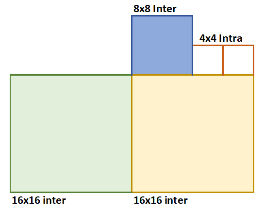
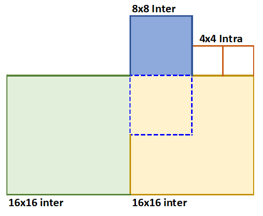
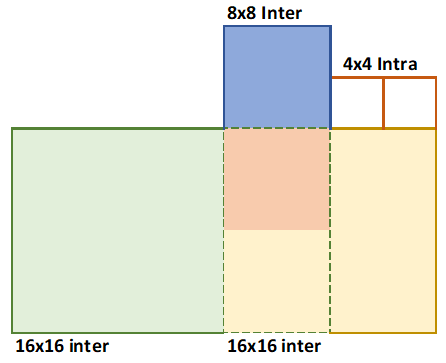
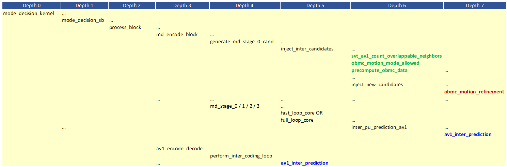

[Top level](../README.md)

# Overlapped Block Motion Compensation

## 1. Description of the algorithm

For a given block which uses single reference INTER prediction (i.e. a NEWMV
candidate), the idea behind OBMC is to consider additional predictors based on
neighboring block MVs, as those predictors may offer more accurate predictions
for pixels near the block boundary. A final inter prediction is generated using
a weighted sum of predictions based on the current block MV and predictions
based on neighboring block MVs. The weights favor the predictions based on the
neighboring block MVs near the block boundary and favor the predictions based
on the current block MV for the pixels away from the boundary.

In general, OBMC produces better and smoother predictions near the boundary and
*may help reduce blocking artifacts*. It may help also in the selection of
larger inter partitions. OBMC is enabled only for inter blocks with single MV
and with block sizes ≥ 8x8.

The prediction algorithm for a given block proceeds as follows:

- Generate the motion compensated prediction Prediction_0 for the current block.
- Consider the MVs from the N neighboring top and left inter coded blocks. For each of the N neighboring inter coded blocks B_i, i=1…N,
    - Define an overlap region, which is a region in the current block that extends along the boundary of the block B_i in one direction and extends half the current block width or height in the other direction.
    - Generate a prediction Prediction_i for the overlap area using the MVs for the block B_i.
    - Each pixel in the overlap area is computed as the weighted sum of the pixel in Prediction_0 and the pixel in Prediction_i, where the weights are generated using a raised cosine window function.

As an example, consider the yellow block shown in Figure 1 below. The 16x16 yellow block is the current block to be predicted. The 16x16 green and 8x8 blue blocks are inter coded neighboring blocks. The initial inter prediction for the yellow block is generated using regular inter prediction.



##### Figure 1. The yellow block in the figure is the inter block of interest.

Step 1: Vertical blending (see Figure 2 below)

- Consider now the area below the blue block and that extends half-way into the yellow block (The area inside the dotted blue line).
- Generate inter prediction for the blue dotted block using the inter mode for the blue block.
- Blend the inter predictions based on the blue block inter mode with that of the yellow block inter mode.
- The blending is performed using the mask {36, 42, 48, 53, 57, 61, 64, 64}, where the resulting sample value is given by:

    [(64-mask(i))*blue_prediction + mask(i)*yellow_prediction]/64,

  where the index i corresponds to the y position of the pixel in the block.



##### Figure 2. Vertical blending of the prediction based on the blue 8x8 inter block.

Step 2: Horizontal blending (See Figure 3 below)

- Consider now the area to the left of the light green block and that extends half-way into the yellow block (The area inside the dotted green line). Note that the orange area corresponds to the pixels that have already been updated in the vertical blending in step 1.
- Generate inter prediction of the dotted green block using the inter mode for the green block.
- Blend the inter prediction based on the green block inter mode with that of the yellow/orange block inter mode.
- The blending is performed using the mask {36, 42, 48, 53, 57, 61, 64, 64} and the final predicted pixel value is given by

    [(64-mask(i))*blue_prediction + mask(i)*yellow_prediction]/64 or

    [(64-mask(i))*blue_prediction + mask(i)*orange_prediction]/64

  where the index i corresponds to the x position of the pixel in the block.



##### Figure 3. Horizontal blending of the prediction based on the green inter block.

Notes:
- If the prediction mode for one of the neighboring blocks is inter-inter compound then only the first MV is considered to build the neighboring overlapping prediction.
- If the prediction mode for one of the neighboring blocks is inter-intra compound then only inter prediction is considered to build the neighboring overlapping prediction.
- If the prediction mode for one of the neighboring blocks is warped then simple motion is considered to build the neighboring overlapping prediction.
- OBMC requires the interpolation filter information to be stored as part of neighbor information.

## 2. Implementation of the algorithm

### Control flags:

Flags associated with the OBMC feature are listed in Table 1.

##### Table 1. Control flags for the OBMC feature.

| **Flag**                  | **Level (Sequence/Picture)**| **Description**                                                               |
| --------------------------| ----------------------------| ------------------------------------------------------------------------------|
| is_motion_mode_switchable | Picture                     | Picture-level signal to enable non-translation motion modes (e.g. WARP, OBMC) |
| pic_obmc_mode             | Picture                     | Picture based OBMC mode                                                       |
| md_pic_obmc_level         | SB                          | SB-based OBMC mode                                                            |
| obmc_ctrls                | SB                          | Struct containing optimization controls for OBMC-related features             |

### Candidate Generation:

A diagram of the OBMC-related function calls in MD and in the Encode Pass is given in Figure 5.



##### Figure 4. A diagram of the function calls leading to the generation and coding of OBMC candidates in MD and in the Encode Pass.

The function ```inject_inter_candidates``` is used to generate the OBMC
candidates to be injected in MD stage 0. The function
```av1_inter_prediction``` is used to generate OBMC prediction for each block
in the MD stages.

The steps involved in the generation of OBMC input candidates for MD stage 0
are as follows:

1. Determine the number of top blocks and the number of blocks to the left of
   the current block that overlap with the current block
   (```svt_av1_count_overlappable_neighbors```). A top block is considered to
   overlap with the current block if it is an inter block. Similar idea applies
   to blocks to the left of the current block.

2. Check if OBMC is allowed for the current block, based on the following criteria (```obmc_motion_mode_allowed```):
    - Block height and block width are both greater than or equal to 8.
    - The inter mode of the block is single-reference mode (i.e. single reference NEW/NEAR/ NEAREST).
    - There are overlapping blocks on top or to the left of the current block.

   If the above conditions are satisfied, MD candidates can be created with motion_mode field set to OBMC_CAUSAL.

3. Generate predictions for the current block based on the top and left blocks (```precompute_obmc_data```). The generation of these predictions is performed as follows:
    - For each of the overlapping top blocks, prediction candidate for the current block based on the MV of the top block is generated. (```build_prediction_by_above_preds```)
    - For each of the overlapping left blocks, prediction candidate for the current block based on the MV of the left block is generated. (```build_prediction_by_left_preds```)

   The predictions for the current block based on the MVs of the top blocks and
   those of the left blocks are prepared in the above steps to be used in
   subsequent stages when the actual OBMC prediction is computed.

The generation of OBMC predictions using the function
```av1_inter_prediction``` in each MD stage proceeds along the same lines as in
```precompute_obmc_data``` to compute predictions for the current block based
on MVs of the top and left blocks. Blending of those predictions is then
performed to construct the OBMC prediction (see
```av1_build_obmc_inter_prediction```).

Similarly, in the Encode Pass, the function av1_inter_prediction is called to
generate the final OBMC encodings based on the final partitioning and modes for
the neighboring blocks.

## 3. Optimization of the algorithm

The optimization of the OBMC algorithm is based on limiting the blocks where
OBMC prediction is considered and on reducing the complexity (accuracy) of the search.
The OBMC levels are controlled by the ```pic_obmc_mode``` flag.

## 4. Signaling

The flag ```is_motion_mode_switchable``` specifies if the motion mode can
change from one block to another. As a result, a block-based field called
```motion_mode``` is sent to indicate, when set, that the type of motion for
the block could be either SIMPLE_TRANSLATION, OBMC, or WARPED.

## Notes

The feature settings that are described in this document were compiled at
v2.1.0 of the code and may not reflect the current status of the code. The
description in this document represents an example showing how features would
interact with the SVT architecture. For the most up-to-date settings, it's
recommended to review the section of the code implementing this feature.

## References

\[1\] Yue Chen and Debargha Mukherjee, “Variable block-size overlapped block motion compensation in the next generation open-source video codec,” International Conference on Image Processing, pp. 938-942, 2017

\[2\] Jingning Han, Bohan Li, Debargha Mukherjee, Ching-Han Chiang, Adrian Grange, Cheng Chen, Hui Su, Sarah Parker, Sai Deng, Urvang Joshi, Yue Chen, Yunqing Wang, Paul Wilkins, Yaowu Xu, James Bankoski, “A Technical Overview of AV1,” Proceedings of the IEEE, vol. 109, no. 9, pp. 1435-1462, Sept. 2021.
