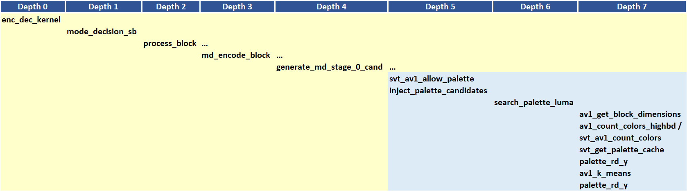
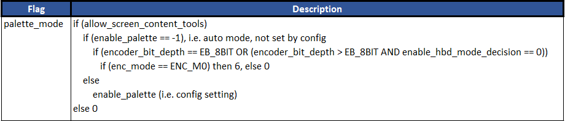

# Palette Prediction Appendix

## 1.  Description of the algorithm

A palette refers to a subset of the color space. Palette prediction is
used to reduce the redundancy in coding pixel information within a given
block. Palette prediction is suitable for applications where most colors
come from a very small subset of the color space (e.g. PC screen
content), there is little or no noise in the pictures, and where the
picture may involve repetitive patterns.

In AV1, a palette specifies the most likely colors present in a given
block. Palette prediction makes use of separate color index maps with 2
to 8 base colors for each of the Y, U and V planes, and is applicable
only to block sizes that are at least the size of 8x8 blocks and have dimensions
smaller than 128.

The context associated with each pixel in the block is used to encode
the palette index for that pixel. Wavefront processing of the pixels is
considered to allow for parallel processing. The bitstream includes the
number of base colors and the base colors used in encoding a given
block.

To illustrate the idea behind palette prediction, consider the 4x4 block
shown in the figure below. In this case the palette consists of three
colors with index 0, 1 and 2. Based on the selected palette, the index
map of the block can be generated as shown below. The encoding of the
indices then proceeds in a wavefront manner as indicated below.


#####  Figure 1. Example of a 4x4 source block, corresponding palette, index map and wavefront processing pattern. The 4x4 block is considered here only for illustration purposes, as the block size needs to be at least 8x8 for palette prediction to be allowed.</p>


The index for each pixel is encoded using the top and left encoded
indices as context, as shown in the table below.

##### Table 1. Context for the samples in the example in Figure 1.


| **Pixel** | **Context** |
| --------- | ----------- |
| 0         | -           |
| 1         | 0           |
| 2         | 0           |
| 3         | 1           |
| 4         | 1, 2        |
| 5         | 2           |
| 6         | 3           |
| …         |             |
| 15        | 13, 14      |

## 2.  Implementation of the algorithm

**Inputs**: Input source video

**Outputs**: Palette information (palette size, colors and map tokens)

**Control macros/flags**:

##### Table 2. Control flags for palette prediction.

|**Flag**|**Level (Sequence/Picture)**|**Description**|
|--- |--- |--- |
|--palette|Configuration|To enable palette from the command-line interface. 0: OFF; 1: Slow; … ; 6: Fastest. Auto mode=-1 if not set from the encoder configuration|
|palette_mode|Picture based|Set based on the configuration palette mode. For auto mode it is set to 6 for M0.|

The feature is currently active only:
  - For encoder mode 0.
  - Only when screen content encoding is active, either through
      - Setting screen content encoding to Auto mode, where
        creen-content-type of pictures are flagged based on detector
        information, or
      - Setting the screen content encoding to Manual mode, where
        the input sequence is encoded as screen content.

**Details of the implementation**

The main function calls associated with palette mode prediction are indicated in Figure 2 below.



##### Figure 2. Main function calls related to the injection of palette mode candidates.

The following steps are then considered in the generation of palette prediction candidates.

1.  In the function ```generate_md_stage_0_cand```, a candidate for palette prediction is
    first evaluated to determine if the palette mode is allowed (svt_av1_allow_palette).
    The use of palette prediction mode is allowed if (palette_mode different from 0 AND block
    width <= 64 AND block height <= 64 AND block size at least 8x8.)

2.  For blocks where palette prediction mode is allowed, the function ``` inject_palette_candidates``` is invoked to create and
    inject palette candidates.The candidates are signaled using the Intra DC mode. This function
    calls another function (```search_palette_luma```) in order to
    determine all palette candidates for luma. The palette prediction candidates are determined by performing two
    types of search, namely a search based on the most dominant colors and
    a search based on the K-means clustering of the colors in the block.

    1. **Most dominant colors search**: In this search, a histogram of the
       colors in the source block is generated. The number of the most used
       colors to select from the histogram depends on the number of colors it
       is desired to include in the palette, which ranges from a minimum of 2
       to a maximum of 8.

    2. **The K-means clustering of the colors**: A K-means clustering algorithm is used to
       cluster the set of input source block colors into a fixed number of colors.
       The number of clusters to consider depends on the number of colors it
       is desired to include in the palette. The algorithm goes through a
       maximum of 50 iterations to converge on the best clustering for a
       given number of clusters.

Given that the number of colors should be in the range from 2 to 8, up to
7 candidates can be generated from each of the two search methods described
above. In total, up to 14 candidates are created for each source
block.

In mode decision, palette prediction candidates are assigned to a special
MD candidate class.

## 3.  Optimization of the algorithm

The following quality complexity trade-offs are present in the
code. The tradeoff is realized by adjusting the number of input
candidates (NIC) in the last MD stage and by restricting the search
options for the best number of colors. The NIC is expressed as a
triplet x/y/z corresponding to the case of a base layer picture,
reference pictures and non-reference picture, respectively (e.g. the
number of input palette prediction candidates for reference pictures
at the last MD stage is y). The input candidates could be a mix of
candidates generated based on the two candidate search methods
outlined above.

##### Table 3. palette\_mode settings.

| **palette\_mode** | **Description**                                                                         |
| ----------------- | --------------------------------------------------------------------------------------- |
| 1 (Slow)          | NIC=7/4/4                                                                           |
| 2                 | NIC=7/2/2                                                                           |
| 3                 | NIC=7/2/2 + No K-means injection for non-reference pictures                           |
| 4                 | NIC=4/2/1                                                                          |
| 5                 | NIC=4/2/1 + No K-means for Inter frames                                          |
| 6 (Fastest)       | NIC=4/2/1 + No K-means for non-base + step\_2 for non-base for most dominant colors |

For ```palette_mode``` 6, step\_2 refers to a method of selecting the subset
of the most dominant colors to include in the palette. For example, if
the block involves 7 colors, then only three candidates with palettes
based on the most dominant 7, 5 and 3 colors are injected, and the
candidates based on the most dominant 6 and 4 colors are discarded.

The settings for palette_mode as a function of the encoder preset and other encoder settings are
indicated in Table 4 below.

##### Table 4. palette\_mode as a function of encoder presets.



## 4.  **Signaling**

The most important signals/parameters which are sent in the bit
stream regarding palette prediction:
- Size of the palette: The number of colors used for the current
  block.
- The palette colors:
  - Special techniques are used to code the colors in the
    bit-stream;
  - The encoder and decoder maintain a cache of colors computed
    based on the neighboring colors. Information on whether some
    colors could be re-used from the cache is sent in the bit-stream
    using fewer bits as compared to signaling the colors directly.
  - Moreover, in the search, some colors are changed to use one of
    the cache elements if they are close to each-others.
 - The palette indices map
