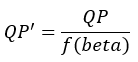

# High Level Description of Rate Control in SVT-AV1

## Table of Contents
1. [Introduction](#introduction)
2. [High Level Idea](#high-level-idea)
  * 1-PASS VBR + Look Ahead
  * 1-PASS VBR + Look Ahead
3. [Rate Control Flow](#rate-control-flow)
  * CRF IPP Pass
  * Middle-Pass: CRF Encoding based on the Final Prediction Strucutre
  * Final Pass
4. [Final Pass RC Algorithm in Detail](#final-pass-rc-algorithm-in-detail)
  * GoP-Level Bit Assignment (get_kf_group_bits())
    * 1-Pass VBR + LAD with look ahead shorter than GoP size
    * 1-Pass VBR + LAD with look ahead longer than GoP size
    * 3-Pass VBR
  * Mini-GoP Level Bit Assignment (calculate_total_GF_group_bits())
    * 1-Pass VBR + LAD
    * 3-Pass
  * Frame Level Bit Assignment
    * 1-Pass VBR + LAD
    * 3-Pass
  * SB-based QP_Modulation Algorithm
  * Block-basd Lambda Modulation Algorithm
  * Re-encoding
  * Post Encode RC Update
- Appendix A: Final-Pass Rate Control Functions
- Appendix B: Speed Optimization of the IPP Pass
- Appendix C: Speed Optimization of the Middle Pass
- Appendix D: Capped CRF

## Introduction

Rate control is responsible for adjusting the size of the encoded bit stream corresponding to the input video pictures to achieve a certain behavior in the encoded sequence bitrate. The rate control algorithm adjusts the quantization parameter qindex per frame and per SB, as well as adjusting the lambda parameter used in the RD cost calculations per block to achieve a desired bitrate behavior specified by the application. Using  statistics generated based on  the analysis of frames in the look ahead window or from previous encode passes, the sequence target rate is translated to a target bits per GoP, mini-GoP and then per frame. The frame rate is then mapped to qindex for each frame. Feedback from packetization which includes the actual number of bits per pictures is also used to update the rate control model, correct the target bit estimates and provide better quantization parameter assignment.

## High Level Idea

In SVT-AV1, the rate control process sits after the Picture Manager and before Mode Decision Configuration kernels. There are two inputs to the rate control kernel, one coming from the Picture Manager process (forward) and one from the Packetization process (feedback) as shown below. Based on the provided inputs, the rate control algorithm decides on the best QP/qindex for each frame and SB to match the target rate constraints. In the Mode Decision kernel, there is an option to perform re-encoding using a new QP to achieve better bit rate matching. After each frame is completely coded, the packetization kernel sends the corresponding actual number of bits for the encoded frame back to the rate control algorithm to update the internal model and decide on future QPs.


###### Figure 1. High-level encoder process dataflow.

The inputs to the rate control algorithm vary based on the application and rate control mode. The input could be analysis statistics from an IPP processing of frames in the look ahead window, or statistics coming from previous passes. However, in all cases, the Temporal Dependency Model (TPL) data is used to calculate the boosts for frame-level QP assignment, SB QP modulation and lambda modulation per block.

In SVT-AV1, there are different options for VBR encoding. Based on the application requirements. These option range from an adjustable latency algorithm (1 PASS + adjustable look ahead) for low to medium latency applications to a multi-pass algorithm for VOD applications. Having access to more pictures in future, which translates to higher latency, generally helps the rate control algorithm, however the performance benefits saturate after a long enough lookahead window. The available options are listed below.

### 1-PASS VBR + Look Ahead

In this mode, the latency is controlled by the size of the look ahead. The CRF IPP processing is performed for the frames in the look ahead window and the collected analysis data is used in the rate control algorithm. The default size of the look ahead is around 60 frames, but it can be increased to 120 frames.

### 3-PASS VBR (CRF IPP first pass + CRF middle pass with same Prediction structure as final pass + final VBR pass)

The multi-pass mode can only be used in applications where latency is not a concern. This mode provides the best BD-rate and rate matching performance. In the first pass, the encoder runs in IPP CRF mode with simple prediction modes. The collected statistics are stored in memory or file and are passed to the encoder in the next pass. The middle pass has the same prediction structure as the final pass. Using similar prediction structure helps significantly in rate assignment. The data from the first pass is used to estimate the sequence QP for the middle pass. Having a middle pass with closer rate to the target rate helps in matching the target rate considerably. Finally, the last pass uses the data from the previous passes to achieve the best performance. A block diagram of the encoder with three passes is shown in Figure 2.


###### Figure 2. Block diagram of multi-pass encoder.

## Rate Control Flow

### CRF IPP Pass

The IPP pass is used to generate statistics to be used in the final pass in a one-pass + LAD encoder or in subsequent passes in a multi-pass encoder. It is a simple and fast processing of the source input pictures that is based only on the source pictures (i.e. the reference pictures are also source input pictures) and makes use of a flat prediction structure where any given picture would reference at most the two preceding pictures in display order. Pictures are divided into 16x16 blocks and simple ME and Intra DC predictions are performed. The inter and intra prediction residuals are used in the calculations of the prediction distortion but not processed through transform/quantization steps. The collected data includes:  Intra error (distortion), Inter error (distortion), coded error (distortion) of the best mode, percentage of Inter blocks, percentage of zero motion blocks, and information about motion vectors. The coded error of each mini-GoP or GoP is used in the final pass to allocate the rate for each section of the clip. Note that the results from the IPP pass can be used in other decision-making steps, such as the dynamic GoP decisions, in the subsequent encode pass. The calculated data is stored in *FRAME_STATS* per block and then converted to *FIRSTPASS_STATS* per frame in *update_firstpass_stats()*. To keep the cost of running the IPP pass low, a number of optimization ideas are introduced and are summarized in Appendix B.

### Middle-Pass: CRF Encoding based on the Final Prediction Structure

A robust rate control would require accurate statistical information to properly distribute the rate budget and meet the constraints imposed by the application. Even though the IPP pass provides useful information for the subsequent encode passes, the corresponding statistics are not accurate enough to make good rate distribution decisions in the final encode pass. Using a CRF pass with the same prediction structure as the final pass provides accurate enough estimates upon which to base the final encoding pass rate control decisions. This newly added middle pass is a fast version of the final pass with similar prediction structure as the final pass. In order to improve the accuracy of information, we use the statistics from the IPP pass to estimate the input QP of the Middle-Pass to get closer to the target rate. This process results in substantially better rate matching in the multi pass rate control. The middle pass stores the following data per frame (See StatStruct structure): Picture number, total number of bits, qindex for the frame, qindex for the sequence.

In order to reduce the speed overhead of the middle pass, a faster preset of the encoder is considered in the middle pass. For example, if the final pass preset is set to M5, the preset of the middle pass is chosen to be M11. To make the middle pass even faster, some additional speed optimizations are considered and are briefly described in Appendix C.

### Final Pass

The following presents a very high-level description of the steps involved in the rate control algorithm in the final encode pass. The flowchart is shown in Figure 3. A more detailed presentation of these steps is provided in the next section.

The rate control algorithm in the final pass includes the following main steps:
1) For each GoP/KF_group assign the target number of bits (*find_next_key_frame()*).
2) For each mini-GoP or GF_group assign the target number of bits per frame (*define_gf_group()*).
3) Update the target number of bits per frame based on the feedback and internal buffers (*av1_set_target_rate()*).
4) Assign qindex per frame based on tpl boost and the target number of bits (*rc_pick_q_and_bounds()*)
5) SB-level QP modification and block-level lambda generation based on TPL (*sb_qp_derivation_tpl_la()*).
6) Decide to perform re-encode (if applicable) at the end of the Mode Decision process (*recode_loop_decision_maker*).
7) Update post-encode VBR data after receiving the feedback (*av1_rc_postencode_update()*).


###### Figure 3. Flowchart of rate control in the final pass.

## Final Pass RC Algorithm in Detail

This section provides a more detailed description of the main steps involved in the Final Pass RC algorithm

### GoP-level Bit Assignment (get_kf_group_bits())

Based on the mode of the VBR algorithm, different GoP bit assignments are used.

#### 1-Pass VBR + LAD with Look Ahead Shorter than GoP size

In this case, the look ahead is not long enough to cover the GOP. So, a uniform rate distribution is used.

___kf_group_bits = number of frames in GoP * avg_bits_per_frame___

where *avg_bits_per_frame* represents the average number of bits per frame.

#### 1-Pass VBR + LAD with Look Ahead Longer than GoP size

When first pass statistics are available for one GoP or more, the frame errors are used to allocate bit for the GoP as follows:

___kf_group_bits = bits left * (kf_group_err / modified_error_left)___

where:
- *bits* left refers to the bit budget left for the clip.
- *kf_group_err* is the calculated error for the GoP as the sum of frame errors in the GoP.
- *modified_error_left* is the calculated error over the remaining frames in the clip.

In the above definitions, error is defined as function of the best Inter vsIntra error from the first pass.

#### 3-Pass VBR:

In this case, the error is replaced by the actual number of bits in the previous pass.

___kf_group_bits = bits left * (kf_group_rate_in_ref / rate_in_ref_left)___

where *kf_group_rate_in_ref* is the sum over the corresponding frames in the GoP of the actual number of bits from the previous CRF pass, and where *rate_in_ref_left* is the sum of the actual bits of the remaining frames.

### Mini-GoP level Bit Assignment (calculate_total_GF_group_bits())

The concept of rate allocation for the mini-GoP is similar to the rate allocation of the GoP. Based on the VBR mode, we have the following scenarios.

#### 1-Pass VBR + LAD

___GF_group_bits = kf_bits_left * (GF_group_err / kf_error_left)___

*kf_bits_left* refers to the remaining bit budget in the GoP. *GF_group_err* is the calculated error for the gf group as the sum of frame errors in the gf group and *kf_error_left* is the calculated error for the remaining frames in the GoP. Error is defined as best inter vsintra error from the first pass for the mini-GoP.

#### 3-Pass

In this case, the error is replaced by the actual number of bits in the previous pass.

___GF_group_bits = kf_bits left * (GF_group_rate_in ref / rate_in_ref_kf_left)___

*GF_group_rate_in* ref is the sum over the corresponding frames in the gf group or mini-GoP of the actual number of bits from the previous CRF pass. *rate_in_ref_kf_left* is the sum of actual bits of the frames in the remaining mini-GoPs in the GoP.

### Frame Level Bit Assignment

After calculating the rate per GoP and mini-GoP, the rate control algorithm computes the base target bits for each frame.  The data is stored in *GF_group->bit_allocation[]* for all pictures in the mini-GoP and then copied to *base_frame_target* under *PCS* structure.

#### 1-Pass VBR + LAD

The total number of bits in each mini-GoP are distributed among all frames based on the number of frames in each layer and a *layer_fraction* table in *allocate_GF_group_bits()* function. The main idea behind the distribution is to allocate more budget to frames in lower temporal layers. For Key and base layer frames, the boost factor is used as a factor to adjust the number of bits, where frames with higher boost factor are assigned higher bits (*calculate_boost_bits()*).

#### 3-Pass

In this case, the actual rate data of each picture from the preceding pass is used to calculate the bit budget per frame as follows:

___bit_allocation = GF_group_bits * total_num_bits / gf_stats.GF_group_rate___

*total_num_bits (stat_struct[i].total_num_bits)* refers to actual number of bits for the current frame in the previous pass, and *GF_group_rate (gf_stats.GF_group_rate)* is the total number of bits allocated in the preceding pass to the mini-GoP or GF group to which the current frame belongs.

After the base target bits per frame are calculated using the information from the look ahead or previous passes (base_frame_target), the rate control updates the target budget  based on the feedback received from packetization.

___this_frame_target = base_frame_target + (vbr_bits_off_target >= 0) ? max_delta : -max_delta___

where this_frame_target is the updated target number of bits and *vbr_bits_off_target* is calculated as:

___vbr_bits_off_target += base_frame_target - actual_frame_size;___

*vbr_bits_off_target* > 0 means we have extra bits to spend and *vbr_bits_off_target* < 0 means we are currently overshooting. The *max_delta* is calculated based on the *vbr_bits_off_target* and the number of remaining frames (i.e. *max_delta=vbr_bits_off_target* /(number of remaining frames)).

### Frame Level QP assignment

In the following, qindex is 4xQP for most of the QP values and represents the quantization parameter the encoder works with internally instead of QP. Given the target bit allocation for a given frame, it is now desired to find a qindex to use with the frame that would result in an encoded frame size that is as close as possible to the allocated number of bits for the frame. To achieve this objective, a range of candidate qindex values is first defined based on data from TPL, state of the rate control buffers and statistics from the IPP pass and possibly the middle pass when applicable. Using predefined lookup tables that relate qindex information to encoding bits, the qindex that yields the best matching rate is selected for the frame.

#### Identifying the Subset of Qindex Values to work with

The range of qindex values is between the active_worst_quality and the active_best_quality variables. The calculation of each of those two variables is outlined in the following.

##### Calculation of Active_Worst_Quality

active_worst_quality refers to the highest qindex that can be assigned in each mini-GoP and is usually associated with the qindex for the non-reference frames. It is calculated per mini-GoP using data from the previous pass and is updated later based on internal rate control buffers. First, the target number of bits per mini-GoP is calculated and then using the number of frames in the mini-GoP and the number of 16x16 blocks in each picture, the target number of bits per 16x16 block is calculated.  The algorithm then loops over the *qindex values* and estimates the number of bits per 16x16 block using predefined lookup tables that map qindex to number of bits and a *correction_factor*. The *qindex* that yields the number of bits closest to the target number of bits is chosen as the final qindex of the picture. (see *av1_rc_regulate_q()* and *get_twopass_worst_quality()*)

##### Calculation of Active_Best_Quality

The variable active_best_quality represents the lowest qindex that can be assigned per picture given the the value of active_worst_quality. The picture *qindex* in VBR mode is computed in the *rc_pick_q_and_bounds()* function. The details of each step are described in this section.

The calculation of active_best_quality is a function of active_worst_quality and of data collected from TPL. Similar to CRF, ordinary QP scaling based on TPL is used to improve the performance of a hierarchical prediction structure where smaller quantization parameters (QP) are assigned to frames in the lower temporal layers, which serve as reference pictures for the higher temporal layer pictures. In the TPL algorithm, the propagation factor r0 is used to improve the base layer picture QP assignment.  The main idea is that the lower r0 is the more improvements the picture would need. A summary of the QPS adjustment ideas is presented below. For more details, refer to Temporal Dependency Model (TPL) document.

- Intra pictures: *The active_best_quality* for both Intra Key Frames (IDR) and non-Key frames (CRA) is generated using similar approaches with slightly different tuning.  A lower *active_best_quality* is assigned to the pictures with small r0 values. The main idea behind the adjustment of the *active_best_quality* for a given picture is as follows:
  * Compute *kf_boost* based on the r0 for the picture, where *kf_boost* is inversely proportional to r0. A range for allowed *kf_boost* values is defined by *kf_boost_low* = 400 and *kf_boost_high* = 5000.
  * The range of *active_best_quality* adjustment is defined by two lookup tables that associate to *active_worst_quality* an upper bound (*high_motion_minq*) and a lower bound (*low_motion_minq*) to the *active_best_quality* adjustment interval.  *high_motion_minq* and *low_motion_minq* are shown in Figure 4.


###### Figure 4. Range of active_best_quality adjustment for Intra pictures.

  * The adjusted active_best_quality is given by:
  ___active_best_quality = low_motion_minq[active_worst_quality] + adjustment___
  where
  ___adjustment = ((kf_boost_high – kf_boost)/ (kf_boost_high – kf_boost_low))* qdiff___
  and where
  ___qdiff = (high_motion_minq[active_worst_quality] - low_motion_minq[active_worst_quality])___

- Inter pictures
  * Base layer pictures: The idea for base layer pictures is similar to that described above for intra pictures, except that the *gf_boost* is used instead of *kf_boost* and the adjustment interval bounds are different. *arfgf_high_motion_minq* and *arfgf_low_motion_minq* are shown in Figure 5.


###### Figure 5. Range of active_best_quality adjustment for inter pictures

  * non-base-layer pictures: The tpl data is not used in this case. The *active_best_quality* is calculated as the average of the *active_best_quality* of the previous layer frame + 1 and the *active_worst_quality*.

#### Identifying the Best Qindex

Once the *active_best_quality* and *active_worst_quality* variables are calculated, the algorithm finds the qindex in the range from active_worst_quality and active_best_quality that has the closest rate to the target rate (see *av1_rc_regulate_q()*). First, the target rate per 16x16 blocks is calculated, then the algorithm loops over the qindex values and estimates the rate per 16x16 block using  predefined lookup tables that map qindex to number of bits and a *correction_factor*. The *qindex* with the closest rate to the target is chosen as the final *qindex* of the picture.


### SB-based QP-Modulation Algorithm

The SB-based QP-modulation algorithm is based on TPL and is the same between the VBR and the CRF modes. In TPL, the parameter beta plays the same role at the SB-level as that of r0 at the picture level. Therefore, a large beta for a given SB implies that quality of that SB should be improved.
For each SB, the main idea in QP modulation is that a new QP value is determined based on the corresponding beta value using the following equation:



where f = sqrt(.) for intra_picture or when beta < 1, and  f=sqrt(sqrt(.)) otherwise. The idea then behind the TPL QP modulation is as follows:
- If beta > 1 -> rk<r0 -> SB does not have a good quality as compared to average picture quality -> Reduce QP for the SB, e.g. QP'=QP/sqrt(beta) or QP'=QP/sqrt(sqrt(beta)). Since beta > 1, QP'<QP.
- If beta <1 -> rk>r0 -> SB has better quality than average picture quality -> Can increase the QP for the SB, e.g. QP'=QP/sqrt(beta). QP' would then be larger than QP since beta <1.

For the case of beta > 1, QP modulation for intra pictures and inter pictures is given by QP’=QP/sqrt(beta) and QP’=QP/sqrt(sqrt(beta)), respectively. This implies that for a given beta value, the resulting QP’for intra picture SB is smaller as compared to that for and inter picture SB, i.e. better quality for the intra picture SB. When beta < 1, QP’=QP/sqrt(beta) in both intra and inter pictures.

### Block-based Lambda Modulation Algorithm

The block-based lambda modulation algorithm is based on TPL and is also the same between the VBR and the CRF modes.

- Update the tpl_rdmult_scaling_factors for the 16x16 blocks in a given SB


where
  * geom_mean_tpl_rdmult_scaling_factors: Geometric mean of the tpl_rdmult_scaling_factors values for the 16x16 blocks within the SB.
  * orig_rdmult: Lambda corresponding to the original frame qindex.
  * new_rdmult: Lambda corresponding to the modified SB qindex.
  The above scaling factor is then the original lambda scaling factor (new_rdmult/ orig_rdmult) modified using the factor (tpl_rdmult_scaling_factors/geom_mean_tpl_rdmult_scaling_factors). The latter represents the relative size of the original tpl_rdmult_scaling_factors for a 16x16 block as compared to the geometric mean for that variable over the SB.

- Compute the rdmult corresponding to a given block in the SB
  * geom_mean_of_scale:
    * For blocks that are 16x16 or larger in size : Geometric mean of the tpl_sb_rdmult_scaling_factors values for the 16x16 blocks within the given block (for block that are 16x16 or larger in size),
    * For block sizes smaller than 16x16: The tpl_sb_rdmult_scaling_factors values for the 16x16 block to which belongs the block.
  * new_full_lambda: The updated lambda value for a given block.

  ___new_full_lambda = pic_full_lambda * geom_mean_of_scale + 0.5___

    where pic_full_lambda is the original lambda value based on the picture qindex.

### Re-encoding

The re-encoding mechanism is used to achieve the desired bitrate without much overshoot or undershoot. In SVT-AV1, the re-encoding decision is made at the end of Mode Decision and after the normative coding of the whole frame. Since the re-encode decision making takes place before entropy coding, the frame size is estimated inside Mode Decision instead of getting the actual frame size information from the packetization kernel. The estimated size is compared to the target rate and if it does not satisfy the rate constraints, the algorithm decides to re-encode the frame with a new qindex. In general, re-encoding can be very costly, however based on the flexible design of the SVT encoder, only the Mode Decision part is performed again and there is no need to redo other encoder pipeline tasks such as motion estimation, entropy coding or in-loop filtering. The flowchart in Figure 6 shows the high-level design of the re-encode decision mechanism.


###### Figure 6. Re-encode flowchart.

### Post Encode RC Update

After each frame is completely processed in the Packetization process, feedback information representing the size of the processed frame is sent to the rate control algorithm to update the internal buffers and variables that are used in the computation of *qindex* for future frames. Using this mechanism, the algorithm keeps track of the difference between the target number of bits and actual number of bits for the encoded frames (*vbr_bits_off_target*).

___vbr_bits_off_target += base_frame_target - projected_frame_size___

where projected_frame_size in this case refers to the actual frame size. Based on the sign of *vbr_bits_off_target*, a limited adjustment is made to the target rate of subsequent frames to push *vbr_bits_off_target* back towards its acceptable range of values. The acceptable range is specified as an input to the encoder using *undershoot_pct* and *overshoot_pct*, where the latter refer to the tolerable undershoot and overshoot percentages of deviation from the target rate.

*extend_minq* and *extend_maxq* are also two important variables that are used in *active_best_quality* and *active_worst_quality* adjustment. *extend_minq* and *extend_maxq* are updated by comparing *rate_error_estimate* and *undershoot_pct* and *overshoot_pct*:

___rate_error_estimate  = (vbr_bits_off_target * 100) / total_actual_bits___

The main idea is to update the range of qindex values which is between the active_best_quality and active_worst_quality  using the feedback information from the packetization. If *rate_error_estimate* > *undershoot_pct*, the encoder is undershooting, so the lower value of the range is reduced by extend_minq, hence allowing the encoder to reduce the qindex and increase the rate. If *rate_error_estimate* < *-overshoot_pct*, the higher value of the qindex range is increased by extend_maxq to reduce the overall bit rate (see svt_av1_twopass_postencode_update).

## Appendix A: Final-Pass Rate Control Functions

A description of the main relevant functions is shown in following tables:

Picture arriving from Motions Estimation kernel:

|Main Functions                          | Descriptions |
| -------------                          | ------------------------------ |
| if (pcs_ptr->picture_number == 0) {    |                                 |
|     set_rc_buffer_sizes();             | Buffers initialization at the beginning|
| av1_rc_init()                          | RC initialization at the beginning|
| }                                      |  |
| restore_param()                        | Populate the required parameters in RATE_CONTROL,  TWO_PASS and GF_GROUP structures from other structures|
|  svt_av1_get_second_pass_params()      | Read the stats, assign bits per KF (GoP), mini-GoP and frames|
| av1_set_target_rate()                  | Update the target rate per frame based on the provided feedback |
| store_param()                          | Store the required parameters from RATE_CONTROL,  TWO_PASS and GF_GROUP  structures to other structures|
| process_tpl_stats_frame_kf_gfu_boost() | Update the KF and GFU boosts based on tpl|
| rc_pick_q_and_bounds()                 | Assign qindex per frame|
| sb_qp_derivation_tpl_la()              | QPM: assign delta_qindex per SB and lambda per block based on tpl stat|

Picture arriving from Packetization kernel:

|Main Functions                                                  | Descriptions |
| ------------------------------------------------------------   | ------------------------------ |
| restore_GF_group_param()                                       | Populate the required parameters in and GF_GROUP  structure from other structures |
| av1_rc_postencode_update() svt_av1_twopass_postencode_update() | Update the internal RC and TWO_PASS struct stats based on the received feedback |

More details for some of the main functions:

|svt_av1_get_second_pass_params() {     | Descriptions |
| ------------------------------------- | ------------------------------ |
| process_first_pass_stats()            |  Performed on a frame basis. Parts of it are for initialization at POC0, the rest is per frame.                               |
| if (key_frame)                        | |
| find_next_key_frame();                | Define the next KF group (GoP) and assign bits to it |
| if (pcs_ptr->is_new_GF_group)                                     |  |
|       GF_group_rate_assingment () }   | Define the GF_group (mini-GoP) bits and assign bits per frame based on the target rate|

|rc_pick_q_and_bounds() { {                  | Descriptions |
| ----------------------------------------   | ------------------------------ |
| if (frame_is_intra)                        |                                |
| get_intra_q_and_bounds()                   | Find the active_best_quality (qindex) based on the kf_boost calculated using first pass data|
| Else                                       |  |
| get_active_best_quality()                  | Find the active_best_quality (qindex) based on the gf_boost calculated using previous pass data and tpl |
|  adjust_active_best_and_worst_quality_org()| Adjust active best and worse quality based on the rate|
|  get_q() }                                 | Get the qindex in the range of active_best_quality to  active_worse_quality based on the target rate per frame |

There are some functions (*restore_param()*, *store_param()*, *restore_GF_group_param()*) in the rate control kernel that store and restore data from PCS to/from internal data structures like RATE_CONTROL,  TWO_PASS and GF_GROUP. These functions were added to handle the frame-level parallelism and out-of-order encoding characteristics of the SVT encoder.

## Appendix B: Speed Optimization of the IPP Pass

## Appendix C: Speed Optimization of the Middle Pass

To make the middle pass even faster, the following speed optimizations are done:
- The input video is down-sampled by two in each direction and the middle pass is performed on a smaller resolution of the input video. Down-sampling results in a significant encoder speed up.
- Since the middle pass does not output a conformant stream, the encoding of non-reference frames is by-passed to speed up the middle pass encoding.

## Appendix D: Capped CRF

In some video coding applications, it is desired to use the CRF mode with an upper limit for the bit rate. This rate control mode is referred as capped CRF. In this mode, the algorithm tries to achieve the best quality while maintaining the overall bit rate below the maximum bit rate specified as an input to the encoder. If the maximum bit rate is set to a high value, the CRF and capped CRF might produce the same results.

In SVT-AV1, the capped CRF is implemented using the re-encode mechanism and the qindex adjustment of frames using a virtual buffer. First, for each base layer frame, a maximum bit budget is set using the maximum bit rate of the clip. Then using the re-encode algorithm, as described in section 4, the rate violation of each frame is identified and corrected. Similar to other rate control modes, after each frame is completely processed in the Packetization process, feedback information representing the size of the processed frame is sent to the rate control algorithm. A virtual buffer is used to keep track of the size of each frame. Knowing the maximum bit rate and the size of previously encoded pictures, the algorithm adjusts the qindex of the future frame to prevent bit rate violation. For more details of the algorithm see ```capped_crf_reencode()``` and ```crf_assign_max_rate```.

## Notes

The feature settings that are described in this document were compiled at v0.9.0 of the code and may not reflect the current status of the code. The description in this document represents an example showing how features would interact with the SVT architecture. For the most up-to-date settings, it's recommended to review the section of the code implementing this feature.
