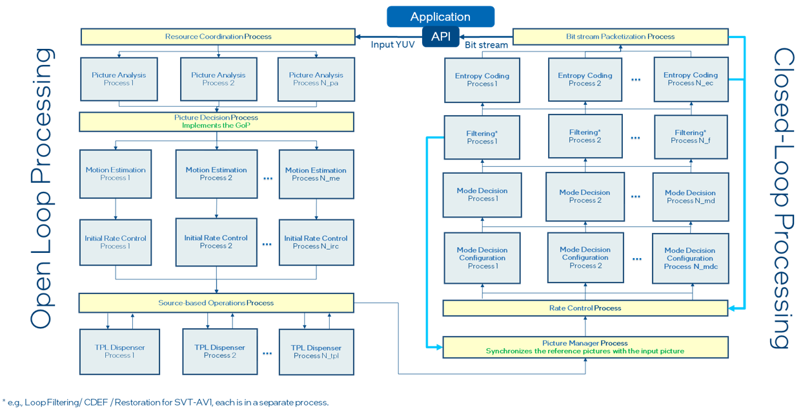
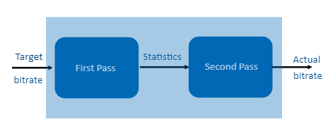
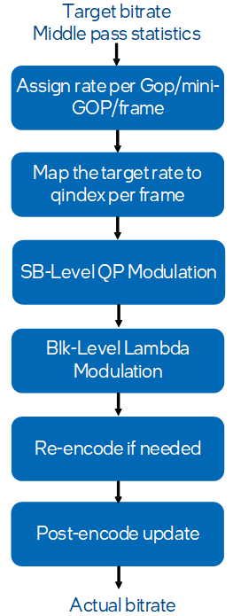
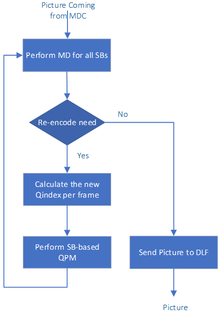
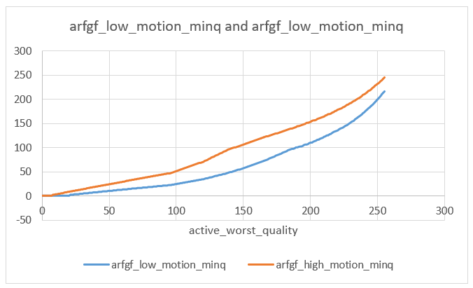

[Top level](../README.md)

# High Level Description of Rate Control in SVT-AV1

## Table of Contents
__[TOC]__

## Introduction

Rate control is responsible for adjusting the size of the encoded bit stream
corresponding to the input video pictures to achieve a certain behavior in the
encoded sequence bitrate. The rate control algorithm adjusts the quantization
parameter qindex per frame and per SB, as well as adjusting the lambda
parameter used in the RD cost calculations per block to achieve a desired
bitrate behavior specified by the application. Using statistics generated based
on the analysis of frames in the look ahead window or from previous encode
passes, the sequence target rate is translated to a target bits per GoP,
mini-GoP and then per frame. The frame rate is then mapped to qindex for each
frame. Feedback from packetization which includes the actual number of bits per
pictures is also used to update the rate control model, correct the target bit
estimates and provide better quantization parameter assignment.

## High Level Idea

In SVT-AV1, the rate control process sits after the Picture Manager and before
Mode Decision Configuration kernels. There are two inputs to the rate control
kernel, one coming from the Picture Manager process (forward) and one from the
Packetization process (feedback) as shown below. Based on the provided inputs,
the rate control algorithm decides on the best QP/qindex for each frame and SB
to match the target rate constraints. In the Mode Decision kernel, there is an
option to perform re-encoding using a new QP to achieve better bit rate
matching. After each frame is completely coded, the packetization kernel sends
the corresponding actual number of bits for the encoded frame back to the rate
control algorithm to update the internal model and decide on future QPs.



###### Figure 1. High-level encoder process dataflow.

The inputs to the rate control algorithm vary based on the application and rate
control mode. In the case of VBR mode, the input could be analysis statistics
from motion estimation processing of frames in the look ahead window, or statistics coming
from previous passes. However, in all cases, the Temporal Dependency Model
(TPL) data is used to calculate the boosts for frame-level QP assignment, SB QP
modulation and lambda modulation per block.

In SVT-AV1, there are different options for VBR encoding based on the
application requirements. These options range from an adjustable latency
algorithm (One-pass + adjustable look ahead) for low to medium latency
applications to a two-pass algorithm for VOD applications. Having access to
more pictures in future, which translates to higher latency, generally helps
the rate control algorithm, however the performance benefits saturate after a
long enough lookahead window. The available options are listed below. In
addition to the VBR mode, for low delay applications, the SVT-AV1 encoder
supports a constant bitrate (CBR) rate control mode where the objective is to
maintain a constant bitrate in the generated bitstream.

### One-Pass VBR + Look Ahead

In this mode, the latency is controlled by the size of the look ahead. The motion estimation is performed for the frames in the look ahead window and the
collected analysis data is used in the rate control algorithm. The default size
of the look ahead is around 2 mini-GoPs (e.g. 32 frames for the case of a
five-layer prediction structure), but it can be increased to 120 frames.

### Two-Pass VBR

The two-pass mode can only be used in applications where latency is not a
concern. This mode is available only using the SVT-AV1 sample application. This
mode provides the best BD-rate and rate matching performance. In the first
pass, the encoder runs in the same prediction structure as the
second pass, but in CRF mode. The collected statistics are stored in memory or file and are passed to the encoder
in the next pass. Using similar prediction structure helps significantly in rate
assignment. Having a first pass with closer rate to the target rate
helps in matching the target rate considerably. The second pass uses the
data from the previous pass to achieve the best performance. A block diagram
of the encoder with three passes is shown in Figure 2.



###### Figure 2. Block diagram of two-pass encoder.

## VBR Rate Control Flow

### First-Pass: CRF Encoding based on the second Prediction Structure

A robust rate control would require accurate statistical information to
properly distribute the rate budget and meet the constraints imposed by the
application. Even though an IPP pass provides useful information for the
subsequent encode passes, the corresponding statistics are not accurate enough
to make good rate distribution decisions in the second encode pass. Using a CRF
pass with the same prediction structure as the second pass provides accurate
enough estimates upon which to base the second encoding pass rate control
decisions. This pass is a fast version of the second pass
with similar prediction structure as the second pass. In order to improve the
accuracy of information, we use the input size, frame rate and the target rate to estimate
the input QP of the first-Pass to get closer to the target rate. This process
results in substantially better rate matching in the two pass rate control.
The first pass stores the following data per frame (See StatStruct structure):
Picture number, total number of bits, qindex for the frame, qindex for the
sequence.

In order to reduce the speed overhead of the first pass, a faster preset of
the encoder is considered in the first pass. For example, if the second pass
preset is set to M5, the preset of the first pass is chosen to be M11. To make
the first pass even faster, some additional speed optimizations are considered
and are briefly described in Appendix B.

### Second Pass

The following presents a very high-level description of the steps involved in
the rate control algorithm in the second encode pass. The flowchart is shown in
Figure 3. A more detailed presentation of these steps is provided in the next
section.

The rate control algorithm in the second pass includes the following main steps:
1) For each GoP/KF_group assign the target number of bits (*kf_group_rate_assingment()*).
2) For each mini-GoP or GF_group assign the target number of bits per frame (*gf_group_rate_assingment()*).
3) Update the target number of bits per frame based on the feedback and internal buffers (*av1_set_target_rate()*).
4) Assign qindex per frame based on tpl boost and the target number of bits (*rc_pick_q_and_bounds()*)
5) SB-level QP modification and block-level lambda generation based on TPL (*sb_qp_derivation_tpl_la()*).
6) Decide to perform re-encode (if applicable) at the end of the Mode Decision process (*recode_loop_decision_maker*).
7) Update post-encode VBR data after receiving the feedback (*av1_rc_postencode_update()*).



###### Figure 3. Flowchart of rate control in the second pass.

## second Pass RC Algorithm in Detail

This section provides a more detailed description of the main steps involved in
the second Pass RC algorithm

### GoP-level Bit Assignment (get_kf_group_bits())

Based on the mode of the VBR algorithm, different GoP bit assignments are used.

#### One-Pass VBR + LAD with Look Ahead Shorter than GoP size

In this case, the look ahead is not long enough to cover the GOP. So, a uniform
rate distribution is used.

___kf_group_bits = number of frames in GoP * avg_bits_per_frame___

where *avg_bits_per_frame* represents the average number of bits per frame.

#### One-Pass VBR + LAD with Look Ahead Longer than GoP size

When first pass statistics are available for one GoP or more, the frame errors
are used to allocate bit for the GoP as follows:

___kf_group_bits = bits left * (kf_group_err / modified_error_left)___

where:
- *bits* left refers to the bit budget left for the clip.
- *kf_group_err* is the calculated error for the GoP as the sum of frame errors in the GoP.
- *modified_error_left* is the calculated error over the remaining frames in the clip.

In the above definitions, error is defined as function of the motion estimation error for each frame.

#### Two-Pass VBR:

In this case, the error is replaced by the actual number of bits in the previous pass.

___kf_group_bits = bits left * (kf_group_rate_in_ref / rate_in_ref_left)___

where *kf_group_rate_in_ref* is the sum over the corresponding frames in the
GoP of the actual number of bits from the previous CRF pass, and where
*rate_in_ref_left* is the sum of the actual bits of the remaining frames.

### Mini-GoP level Bit Assignment (calculate_total_GF_group_bits())

The concept of rate allocation for the mini-GoP is similar to the rate
allocation of the GoP. Based on the VBR mode, we have the following scenarios.

#### One-Pass VBR + LAD

___GF_group_bits = kf_bits_left * (GF_group_err / kf_error_left)___

*kf_bits_left* refers to the remaining bit budget in the GoP. *GF_group_err* is
the calculated error for the gf group as the sum of frame errors in the gf
group and *kf_error_left* is the calculated error for the remaining frames in
the GoP. Error is defined as a function of the motion estimation error for each frame in the mini-GoP.

#### Two-Pass

In this case, the error is replaced by the actual number of bits in the previous pass.

___GF_group_bits = kf_bits left * (GF_group_rate_in ref /
rate_in_ref_kf_left)___

*GF_group_rate_in* ref is the sum over the corresponding frames in the gf group
or mini-GoP of the actual number of bits from the previous CRF pass.
*rate_in_ref_kf_left* is the sum of actual bits of the frames in the remaining
mini-GoPs in the GoP.

### Frame Level Bit Assignment

After calculating the rate per GoP and mini-GoP, the rate control algorithm
computes the base target bits for each frame. The data is stored in
*GF_group->bit_allocation[]* for all pictures in the mini-GoP and then copied
to *base_frame_target* under *PCS* structure.

#### One-Pass VBR + LAD

The total number of bits in each mini-GoP are distributed among all frames
based on the number of frames in each layer and a *layer_fraction* table in
*allocate_GF_group_bits()* function. The main idea behind the distribution is
to allocate more budget to frames in lower temporal layers. For Key and base
layer frames, the boost factor is used as a factor to adjust the number of
bits, where frames with higher boost factor are assigned higher bits
(*calculate_boost_bits()*).

#### Two-Pass

In this case, the actual rate data of each picture from the preceding pass is
used to calculate the bit budget per frame as follows:

___bit_allocation = GF_group_bits * total_num_bits / gf_stats.GF_group_rate___

*total_num_bits (stat_struct[i].total_num_bits)* refers to actual number of
bits for the current frame in the previous pass, and *GF_group_rate
(gf_stats.GF_group_rate)* is the total number of bits allocated in the
preceding pass to the mini-GoP or GF group to which the current frame belongs.

After the base target bits per frame are calculated using the information from
the look ahead or previous passes (base_frame_target), the rate control updates
the target budget based on the feedback received from packetization.

___this_frame_target = base_frame_target + (vbr_bits_off_target >= 0) ?
max_delta : -max_delta___

where this_frame_target is the updated target number of bits and
*vbr_bits_off_target* is calculated as:

___vbr_bits_off_target += base_frame_target - actual_frame_size;___

*vbr_bits_off_target* > 0 means we have extra bits to spend and
*vbr_bits_off_target* < 0 means we are currently overshooting. The *max_delta*
is calculated based on the *vbr_bits_off_target* and the number of remaining
frames (i.e. *max_delta=vbr_bits_off_target* /(number of remaining frames)).

### Frame Level QP assignment

In the following, qindex is 4xQP for most of the QP values and represents the
quantization parameter the encoder works with internally instead of QP. Given
the target bit allocation for a given frame, it is now desired to find a qindex
to use with the frame that would result in an encoded frame size that is as
close as possible to the allocated number of bits for the frame. To achieve
this objective, a range of candidate qindex values is first defined based on
data from TPL, state of the rate control buffers and statistics from the first
pass. Using predefined lookup
tables that relate qindex information to encoding bits, the qindex that yields
the best matching rate is selected for the frame.

#### Identifying the Subset of Qindex Values to work with

The range of qindex values is between the active_worst_quality and the
active_best_quality variables. The calculation of each of those two variables
is outlined in the following.

##### Calculation of Active_Worst_Quality

active_worst_quality refers to the highest qindex that can be assigned in each
mini-GoP and is usually associated with the qindex for the non-reference
frames. It is calculated per mini-GoP using data from the previous pass and is
updated later based on internal rate control buffers. First, the target number
of bits per mini-GoP is calculated and then using the number of frames in the
mini-GoP and the number of 16x16 blocks in each picture, the target number of
bits per 16x16 block is calculated. The algorithm then loops over the *qindex
values* and estimates the number of bits per 16x16 block using predefined
lookup tables that map qindex to number of bits and a *correction_factor*. The
*qindex* that yields the number of bits closest to the target number of bits is
chosen as the final qindex of the picture. (see *av1_rc_regulate_q()* and
*get_twopass_worst_quality()*)

##### Calculation of Active_Best_Quality

The variable active_best_quality represents the lowest qindex that can be
assigned per picture given the value of active_worst_quality. The picture
*qindex* in VBR mode is computed in the *rc_pick_q_and_bounds()* function. The
details of each step are described in this section.

The calculation of active_best_quality is a function of active_worst_quality
and of data collected from TPL. Similar to CRF, ordinary QP scaling based on
TPL is used to improve the performance of a hierarchical prediction structure
where smaller quantization parameters (QP) are assigned to frames in the lower
temporal layers, which serve as reference pictures for the higher temporal
layer pictures. In the TPL algorithm, the propagation factor r0 is used to
improve the base layer picture QP assignment. The main idea is that the lower
r0 is the more improvements the picture would need. A summary of the QPS
adjustment ideas is presented below. For more details, refer to Temporal
Dependency Model (TPL) document.

- Intra pictures: *The active_best_quality* for both Intra Key Frames (IDR) and non-Key frames (CRA) is generated using similar approaches with slightly different tuning. A lower *active_best_quality* is assigned to the pictures with small r0 values. The main idea behind the adjustment of the *active_best_quality* for a given picture is as follows:
  * Compute qstep_ratio based on the r0 for the picture, where qstep_ratio is proportional to the square root of r0.
  * The target quantization step is calculated using the active_worst_quality and the qtep_ratio.
  * The qindex with the closest quantization step to the target is chosen as the qindex of the picture.

- Inter pictures
  * Base layer pictures: The idea for base layer pictures is similar to that described above for intra pictures, except that the qstep_ratio weight is different.
  * Non-base-layer pictures: The tpl data is not used in this case. The active_best_quality is calculated as the average of the active_best_quality of the previous layer frame + 1 and the active_worst_quality.

#### Identifying the Best Qindex

Once the *active_best_quality* and *active_worst_quality* variables are
calculated, the algorithm finds the qindex in the range from
active_worst_quality and active_best_quality that has the closest rate to the
target rate (see *av1_rc_regulate_q()*). First, the target rate per 16x16
blocks is calculated, then the algorithm loops over the qindex values and
estimates the rate per 16x16 block using predefined lookup tables that map
qindex to number of bits and a *correction_factor*. The *qindex* with the
closest rate to the target is chosen as the final *qindex* of the picture.


### SB-based QP-Modulation Algorithm

The SB-based QP-modulation algorithm is based on TPL and is the same between
the VBR and the CRF modes. In TPL, the parameter beta plays the same role at
the SB-level as that of r0 at the picture level. Therefore, a large beta for a
given SB implies that quality of that SB should be improved. For each SB, the
main idea in QP modulation is that a new QP value is determined based on the
corresponding beta value using the following equation:

$`QP'= \frac{QP}{f(beta)}`$

where $`f = sqrt(.)`$ for intra_picture or when $`beta < 1`$, and $`f=sqrt(sqrt(.))`$ otherwise. The idea then behind the TPL QP modulation is as follows:
- If $`beta > 1 \rightarrow rk<r0 \rightarrow`$ SB does not have a good quality as compared to average picture quality $`\rightarrow`$ Reduce QP for the SB, e.g. $`QP'=QP/sqrt(beta)`$ or $`QP'=QP/sqrt(sqrt(beta))`$. Since $`beta > 1`$, $`QP'<QP`$.
- If $`beta <1 \rightarrow rk>r0 \rightarrow`$ SB has better quality than average picture quality $`\rightarrow`$ Can increase the QP for the SB, e.g. $`QP'=QP/sqrt(beta)`$. $`QP'`$ would then be larger than QP since $`beta <1`$.

For the case of $`beta > 1`$, QP modulation for intra pictures and inter pictures is given by $`QP’=QP/sqrt(beta)`$ and $`QP’=QP/sqrt(sqrt(beta))`$, respectively. This implies that for a given beta value, the resulting QP’for intra picture SB is smaller as compared to that for and inter picture SB, i.e. better quality for the intra picture SB. When $`beta < 1`$, $`QP’=QP/sqrt(beta)`$ in both intra and inter pictures.

### Block-based Lambda Modulation Algorithm

The block-based lambda modulation algorithm is based on TPL and is also the same between the VBR and the CRF modes.

- Update the tpl_rdmult_scaling_factors for the 16x16 blocks in a given SB

$`tpl\_sb\_rdmult\_scaling\_factors = (\frac{new\_rdmult}{orig\_rdmult})*(\frac{tpl\_rdmult\_scaling\_factors}{geom\_mean\_tpl\_rdmult\_scaling\_factors})`$

where
  * $`geom\_mean\_tpl\_rdmult\_scaling\_factors`$: Geometric mean of the tpl_rdmult_scaling_factors values for the 16x16 blocks within the SB.
  * $`orig\_rdmult`$: Lambda corresponding to the original frame qindex.
  * $`new\_rdmult`$: Lambda corresponding to the modified SB qindex.
  The above scaling factor is then the original lambda scaling factor $`(\frac{new\_rdmult}{orig\_rdmult})`$ modified using the factor $`(\frac{tpl\_rdmult\_scaling\_factors}{geom\_mean\_tpl\_rdmult\_scaling\_factors})`$. The latter represents the relative size of the original $`tpl\_sb\_rdmult\_scaling\_factors`$ for a 16x16 block as compared to the geometric mean for that variable over the SB.

- Compute the rdmult corresponding to a given block in the SB
  * $`geom\_mean\_of\_scale`$:
    * For blocks that are 16x16 or larger in size : Geometric mean of the tpl_sb_rdmult_scaling_factors values for the 16x16 blocks within the given block (for block that are 16x16 or larger in size),
    * For block sizes smaller than 16x16: The tpl_sb_rdmult_scaling_factors values for the 16x16 block to which belongs the block.
  * $`new\_full\_lambda`$: The updated lambda value for a given block.
  ```math
  new\_full\_lambda = pic\_full\_lambda * geom\_mean\_of\_scale + 0.5
  ```
    where $`pic\_full\_lambda`$ is the original lambda value based on the picture qindex.

### Re-encoding

The re-encoding mechanism is used to achieve the desired bitrate without much
overshoot or undershoot. In SVT-AV1, the re-encoding decision is made at the
end of Mode Decision and after the normative coding of the whole frame. Since
the re-encode decision making takes place before entropy coding, the frame size
is estimated inside Mode Decision instead of getting the actual frame size
information from the packetization kernel. The estimated size is compared to
the target rate and if it does not satisfy the rate constraints, the algorithm
decides to re-encode the frame with a new qindex. In general, re-encoding can
be very costly, however based on the flexible design of the SVT encoder, only
the Mode Decision part is performed again and there is no need to redo other
encoder pipeline tasks such as motion estimation, entropy coding or in-loop
filtering. The flowchart in Figure 4 shows the high-level design of the
re-encode decision mechanism.



###### Figure 4. Re-encode flowchart.

### Post Encode RC Update

After each frame is completely processed in the Packetization process, feedback
information representing the size of the processed frame is sent to the rate
control algorithm to update the internal buffers and variables that are used in
the computation of *qindex* for future frames. Using this mechanism, the
algorithm keeps track of the difference between the target number of bits and
actual number of bits for the encoded frames (*vbr_bits_off_target*).

___vbr_bits_off_target += base_frame_target - projected_frame_size___

where projected_frame_size in this case refers to the actual frame size. Based
on the sign of *vbr_bits_off_target*, a limited adjustment is made to the
target rate of subsequent frames to push *vbr_bits_off_target* back towards its
acceptable range of values. The acceptable range is specified as an input to
the encoder using *undershoot_pct* and *overshoot_pct*, where the latter refer
to the tolerable undershoot and overshoot percentages of deviation from the
target rate.

*extend_minq* and *extend_maxq* are also two important variables that are used
in *active_best_quality* and *active_worst_quality* adjustment. *extend_minq*
and *extend_maxq* are updated by comparing *rate_error_estimate* and
*undershoot_pct* and *overshoot_pct*:

___rate_error_estimate = (vbr_bits_off_target * 100) / total_actual_bits___

The main idea is to update the range of qindex values which is between the
active_best_quality and active_worst_quality using the feedback information
from the packetization. If *rate_error_estimate* > *undershoot_pct*, the
encoder is undershooting, so the lower value of the range is reduced by
extend_minq, hence allowing the encoder to reduce the qindex and increase the
rate. If *rate_error_estimate* < *-overshoot_pct*, the higher value of the
qindex range is increased by extend_maxq to reduce the overall bit rate (see
svt_av1_twopass_postencode_update).

## Constant Bitrate Rate Control

In several rate constrained video coding applications, it is desired to use the
constant bitrate (CBR) mode to maintain a constant bitrate during the encoding
process while allowing the resulting video quality to vary. In SVT-AV1, the CBR
mode is implemented through a qindex adjustment mechanism based on the fullness
status of a virtual buffer. A virtual buffer is used to account for the size of
the encoded frames. Knowing the desired constant bit rate, the size of
previously encoded pictures and the fullness status of the virtual buffer, the
algorithm adjusts the qindex of the frame being encoded to maintain the virtual
buffer fullness at the desired level. Once a frame is completely processed in
the packetization process, feedback information representing the size of the
processed frame is sent to the rate control algorithm to update the buffer
fullness level.

### CBR Data Flow

A high-level description of the steps involved in the CBR mode in SVT-AV1 is as follows:
1) Set the CBR rate control virtual buffer parameters.
2) Determine the target bitrate for the frame being processed based on the buffer status and the packetization process feedback.
3) Determine the range of candidate qindex values and generate the final qindex.
4) Encode the current picture and update the virtual buffer level.

### Setting the virtual buffer parameters (set_rc_buffer_sizes())

The CBR rate control makes use of a virtual buffer and tries to maintain the
buffer fullness close to a desired optimal fullness level. This goal is
achieved by adjusting the encoded frame size through the quantization parameter
qindex. A diagram of a virtual buffer is shown in the Figure 5. The input to
the frame buffer is the desired frame size corresponding to the target bitrate.
The buffer content is incremented by the target frame size every time a new
frame is to be processed. The output is the actual encoded frame size, and is
removed from the buffer content at the same frequency the contents of the
virtual buffer are updated by the target frame size.


###### Figure 5. CBR virtual buffer diagram.

The virtual buffer parameters are initialized once before invoking the CBR rate control for the first frame as follows:

starting_buffer_level = starting_buffer_level_ms* target_bit_rate/ 1000 <br /> optimal_buffer_level = optimal_buffer_level_ms* bandwidth / 1000 <br /> maximum_buffer_size = maximum_buffer_size_ms* target_bit_rate/ 1000

where the following are user-specified input parameters to the encoder:

- starting_buffer_level_ms: Initial delay in milliseconds before the decoder starts removing bits from its buffer.
- optimal_buffer_level_ms: Optimal delay in milliseconds the decoder should maintain.
- maximum_buffer_size_ms: Maximum buffer delay in milliseconds.
- target_bit_rate: Target bitrate.

### Determining the target frame size for the frame being processed (one_pass_rt_rate_alloc())

The target frame size is computed differently for key frames and for other frames.

#### A. Key frame target frame size calculation (calc_iframe_target_size_one_pass_cbr())

First Key Frame

The target frame size for the first key frame is set based on the starting
buffer level multiplied by a weight that depends on the GoP length.

___Target_frame_size = (starting_buffer_level * w)___

where weight = 3/4 if intra period = -1 (only one I) or intra period >128, 1/4 if 0 <intra period < 64, 1/2 if intra 64 <= intra period <=128

Remaining key frames

For the remaining key frames, the target frame size is set based on the average
frame size (avg_frame_size = target_bit_rate/number_of_frames_per_second)
multiplied by a boost factor.

___Target_frame_size = ((16 + kf_boost) \* avg_frame_size)/16___
where
___kf_boost = 2 \* framerate – 16___

#### B.Non-Key frame target frame size calculation (av1_calc_pframe_target_size_one_pass_cbr())

Setting the target frame size for non-key frames involves a first step where an
initial value of the target frame size is set followed by a second step where
an adjustment of the generated target frame size occurs. In the first step, the
initial target frame size is normally set to avg_frame_size. In the second
step, the target frame size is adjusted based on the difference between the
optimal buffer level and the current buffer level. The algorithm tends to lower
the target frame size for the current frame when the computed difference is
positive or increase the target frame size for the current frame if the
difference is negative. Finally, the adjusted target frame size is clipped.

### Determining the final qindex for the frame (rc_pick_q_and_bounds_no_stats_cbr())

After estimating the target frame size for the current frame, the algorithm
proceeds with the selection of the qindex that provides the closest frame size
to the target frame size. This process starts by identifying an interval of
candidate qindex values [best quality qindex, worst quality qindex]. A suitable
qindex that belongs to the set qindex interval is generated based on the frame
type and the estimated frame size corresponding to each qindex in the set
qindex interval.

#### A. Determining the worst quality qindex (calc_active_worst_quality_no_stats_cbr())

The worst quality qindex is the highest allowed qindex value and is initialized
to 255. The worst quality qindex is generated based on the current buffer
level. Initially, the worst quality qindex is first obtained by applying a
factor of 5/4 to the average qindex of the previously coded frames of the same
type (i.e. key frames or non-key frames). The worst quality qindex is further
adjusted based on the fullness of the buffer as follows:

- If the buffer fullness level is greater than the optimal level, then the
  value of the worst quality qindex is reduced (to increase the actual size of
  the encoded frame) in such a way that the expected reduction in buffer level
  does not go beyond 30% of its current level.
- If the buffer fullness level is greater than the critical level and less than
  the optimal level, then the worst quality qindex is increased by a factor
  that is a linear function of the current buffer level and the difference
  between worst_quality and the average qindex mentioned in the initialization
  step above.
- If the buffer level is less than the critical level, the qindex is set to the
  highest possible qindex value worst_qindex. The latter is set to by default
  to 255 or to any value entered by the user.

#### B. Determining the best quality q index (calc_active_best_quality_no_stats_cbr())

In the case of a key frame, the best quality qindex is initially set to a fixed
value (default 4). For reference non-key pictures, the best quality q index is
inherited from the qindex of the previously coded reference pictures. For the
remaining frames (non-referenced) the best qindex is obtained by taking the
smallest of the worst quality qindex and the average of the qindex of the
previously coded non-reference pictures.

#### C. Computing the qindex for the frame

The final qindex for the frame is obtained by looping over all the qindex
values in the interval [worst quality qindex, best quality qindex] and using
the following model to determine an estimate for the frame size:

$`Estimated Frame Size = \frac{\alpha * correction\_factor}{qindex}`$

where $`\alpha`$ is $`1500000`$ for key frames and $`1300000`$ otherwise. The correction_factor
is as in the VBR case. The qindex that provides the closest rate to the target
frame size is considered.

After the final qindex of the frame is calculated, its value might be updated under some conditions. Some of these conditions are:
- Adjust qindex based on source content change to avoid overshoot and undershoot
- Limit the decrease or increase in qindex from previous frames to produce stable video.

### Updating the buffer fullness level

The buffer fullness level is initialized at starting_buffer_level. Following
the encoding of the current frame, the buffer fullness level is updated by
adding the average frame size (avg_frame_size) and removing the encoded frame
size.

## Appendix A: Final-Pass Rate Control Functions

A description of the main relevant functions is shown in following tables:

Picture arriving from Motions Estimation kernel:

| Main Functions                         | Descriptions                                                                                              |
| -------------                          | ------------------------------                                                                            |
| if (pcs->picture_number == 0) {    |                                                                                                           |
| set_rc_buffer_sizes();                 | Buffers initialization at the beginning                                                                   |
| av1_rc_init()                          | RC initialization at the beginning                                                                        |
| }                                      |                                                                                                           |
| restore_param()                        | Populate the required parameters in RATE_CONTROL, TWO_PASS and GF_GROUP structures from other structures |
| process_rc_stat()       | Read the stats, assign bits per KF (GoP), mini-GoP and frames                                             |
| av1_set_target_rate()                  | Update the target rate per frame based on the provided feedback                                           |
| store_param()                          | Store the required parameters from RATE_CONTROL, TWO_PASS and GF_GROUP  structures to other structures   |
| process_tpl_stats_frame_kf_gfu_boost() | Update the KF and GFU boosts based on tpl                                                                 |
| rc_pick_q_and_bounds()                 | Assign qindex per frame                                                                                   |
| sb_qp_derivation_tpl_la()              | QPM: assign delta_qindex per SB and lambda per block based on tpl stat                                    |

Picture arriving from Packetization kernel:

| Main Functions                                                 | Descriptions                                                                     |
| ------------------------------------------------------------   | ------------------------------                                                   |
| av1_rc_postencode_update() svt_av1_twopass_postencode_update() | Update the internal RC and TWO_PASS struct stats based on the received feedback  |

More details for some of the main functions:

| process_rc_stat() {    | Descriptions                                                                                   |
| ------------------------------------- | ------------------------------                                                                 |
| process_first_pass_stats()            | Performed on a frame basis. Parts of it are for initialization at POC0, the rest is per frame. |
| if (key_frame)                        |                                                                                                |
| kf_group_rate_assingment();                | Rate assignment for the next kf group                                           |
| if (pcs->is_new_GF_group)         |                                                                                                |
| gf_group_rate_assingment () }         | Define the GF_group (mini-GoP) bits and assign bits per frame based on the target rate         |

| rc_pick_q_and_bounds() { {                 | Descriptions                                                                                                  |
| ----------------------------------------   | ------------------------------                                                                                |
| if (frame_is_intra)                        |                                                                                                               |
| get_intra_q_and_bounds()                   | Find the active_best_quality (qindex) based on the kf_boost calculated using first pass data                  |
| Else                                       |                                                                                                               |
| get_active_best_quality()                  | Find the active_best_quality (qindex) based on the gf_boost calculated using previous pass data and tpl       |
| adjust_active_best_and_worst_quality_org() | Adjust active best and worse quality based on the rate                                                        |
| get_q() }                                  | Get the qindex in the range of active_best_quality to active_worse_quality based on the target rate per frame |

There are some functions (*restore_param()*, *store_param()*,
*restore_GF_group_param()*) in the rate control kernel that store and restore
data from PCS to/from internal data structures like RATE_CONTROL, TWO_PASS and
GF_GROUP. These functions were added to handle the frame-level parallelism and
out-of-order encoding characteristics of the SVT encoder.

## Appendix B: Speed Optimization of the firt Pass

To make the first pass even faster, the following speed optimizations are done:
- The input video is down-sampled by two in each direction and the first pass
  is performed on a smaller resolution of the input video. Down-sampling
  results in a significant encoder speed up.
- Since the first pass does not output a conformant stream, the encoding of
  non-reference frames is by-passed to speed up the first pass encoding.

## Appendix C: Capped CRF

In some video coding applications, it is desired to use the CRF mode with an
upper limit for the bit rate. This rate control mode is referred to as capped
CRF. In this mode, the algorithm tries to achieve the best quality while
maintaining the overall bit rate below the maximum bit rate specified as an
input to the encoder. If the maximum bit rate is set to a high value, the CRF
and capped CRF might produce the same results.

In SVT-AV1, the capped CRF is implemented using the re-encode mechanism and the
qindex adjustment of frames using a virtual buffer. First, for each base layer
frame, a maximum bit budget is set using the maximum bit rate of the clip. Then
using the re-encode algorithm, as described in section 4, the rate violation of
each frame is identified and corrected. Similar to other rate control modes,
after each frame is completely processed in the Packetization process, feedback
information representing the size of the processed frame is sent to the rate
control algorithm. A virtual buffer is used to keep track of the size of each
frame. Knowing the maximum bit rate and the size of previously encoded
pictures, the algorithm adjusts the qindex of the future frame to prevent bit
rate violation. For more details of the algorithm see
```capped_crf_reencode()``` and ```crf_assign_max_rate```.

## Appendix D: GoP Constrained RC

In some video coding applications, it is desired to encode each segment of the video
at a fixed bit rate and independent of the other parts. These segments are usually
defined using a Key Frame (KF). The frames between two Key Frames, including the
first key frame, form a Group of Picture (GoP). Each GoP can be encoded independent
of other GoPs. In some applications, each GoP is coded at a fixed target rate to be
used in the streaming ladder. In order to support these applications in SVT-AV1 encoder,
the GoP constrained mode should be used.

In this mode, each GoP has its independent internal rate control status and extra or
deficit bits of each GoP are not shared with other GoPs. The overshoot and undershoot
are set to 0% and the internal rate control algorithm is targeted for more constrained
rate matching. To enable this mode --gop-constraint-rc should be set to 1. This feature
is currently supported with VBR mode when GoP size is 120 frames or more.

## Notes

The feature settings that are described in this document were compiled at
v2.1.0 of the code and may not reflect the current status of the code. The
description in this document represents an example showing how features would
interact with the SVT architecture. For the most up-to-date settings, it's
recommended to review the section of the code implementing this feature.
