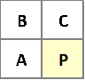
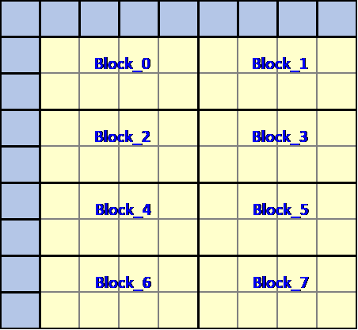
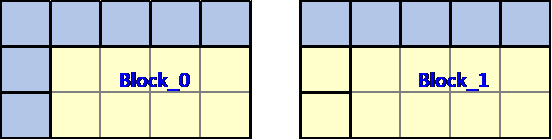
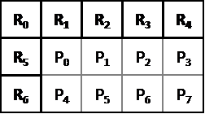
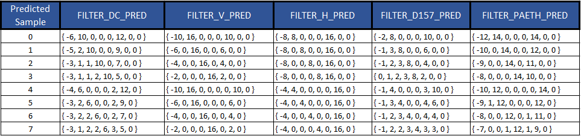
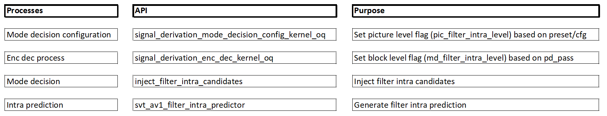

[Top level](../README.md)

# Recursive Intra Prediction

## 1. Description of the algorithm

The recursive intra prediction mode involves generating predictions for intra
samples in a raster scan order based on filtering a set of neighboring
predicted samples. As an illustration of the basic idea consider the sample P
shown in Figure 1 below. The intra prediction for sample P in this case is the
weighted sum of samples A, B and C. The latter could be reference samples for
the current block and/or already predicted samples within the same block.



##### Figure 1. Prediction of the sample P using the neighboring samples A, B and C.

The prediction procedure is outlined as follows:

  - The predicted block is divided into 4x2 sub-blocks.
    See the example of the 8x8 block in Figure 2 below where the 8x8 block is divided into eight 4x2 blocks.



##### Figure 2. Splitting an 8x8 block (in yellow) into 4x2 blocks.

  - For each 4x2 sub-block:

      - An array of 7 reference samples is prepared. For example, as shown
        in Figure 3, the reference samples for Block\_0 are 7 neighboring samples for the 8x8 block.
        For Block\_1, the seven reference samples consist of the above five neighboring samples for the 8x8 block
        and two left neighboring samples that are predicted samples from Block\_0.



##### Figure 3. Example of reference samples for 4x2 blocks.

  - The predicted pixels in the 4x2 sub-block are obtained by filtering the array of seven reference samples.
    To illustrate the procedure, consider the 4x2 block shown in Figure 4 below:



##### Figure 4. Reference sample around a 4x2 block.

The $`k^{th}`$ predicted sample P_k, k=0,…,7, in the 4x2 block is given
by:

av1_filter_intra_taps[mode][k][0] * R0 + av1_filter_intra_taps[mode][k][1] * R1 +\
av1_filter_intra_taps[mode][k][2] * R2 + av1_filter_intra_taps[mode][k][3] * R3 +\
av1_filter_intra_taps[mode][k][4] * R4 + av1_filter_intra_taps[mode][k][5] * R5 +\
av1_filter_intra_taps[mode][k][6] * R6

where mode refers to one of the five supported recursive intra modes listed in the table below:

##### Table 1. Recursive intra modes.

| **filter\_intra\_mode index** | **Filter intra mode** |
| ----------------------------- | --------------------- |
| 0                             | FILTER\_DC\_PRED      |
| 1                             | FILTER\_V\_PRED       |
| 2                             | FILTER\_H\_PRED       |
| 3                             | FILTER\_D157\_PRED    |
| 4                             | FILTER\_PAETH\_PRED   |

The filter coefficients are listed in Table 2 as a function of the intra
prediction mode and predicted sample.

##### Table 2. Filter coefficients as a function of the intra prediction mode and the predicted sample.



The best filtering mode (i.e. set of weights) is selected through, for
example, a rate distortion performance measure.

The 4x2 blocks can be processed in a wavefront manner. For the 8x8 block
example shown in Figure 2, the order of processing the 4x2 blocks could
be: Block\_0 → (Block\_1 and Block\_2) → (Block\_3 and Block\_4) →
(Block\_5 and Block\_6) → Block\_7.

The recursive intra prediction feature is applicable only to luma intra
prediction and to blocks that have width and height less than or equal to 32.

## 2. Implementation of the algorithm

##### Control macros/flags

the control flags associated with the filter intra flag are listed in Table 3 below.

| **Flag**                 | **Level (sequence/picture)** | **Description**                                    |
| ------------------------ | ---------------------------- | -------------------------------------------------- |
| enable\_filter\_intra    | sequence                     | Enable/disable the feature at the sequence header. |
| pic\_filter\_intra\_mode | picture                      | Enable/disable the feature at the picture level.   |
| md_filter_intra_level    | Block                        | Enable/disable the feature at the block level.     |


### Recursive intra prediction API

The interface to the recursive intra prediction feature is described in Table 4
below.

##### Table 4. Interface to the recursive filter intra feature.



### Candidate Injection

The function ```inject_filter_intra_candidates``` is responsible of injecting
all recursive intra candidates in MD. Candidates are injected for a given block
if the flag ```md_filter_intra_level``` is not zero and both the block width
and block height are smaller than or equal to 32.

A total of five intra based candidates are injected where the candidate field
```filter_intra_mode``` is assigned a value from the following list:
```FILTER_DC_PRED``` / ```FILTER_V_PRED``` / ```FILTER_H_PRED``` /
```FILTER_D157_PRED``` / ```FILTER_PAETH_PRED```. For other regular intra
candidates ```filter_intra_mode``` is assigned a special value
(```FILTER_INTRA_MODES```) to make sure it is not a filter intra candidate.

Note that when inter-intra compound is used, no filter intra modes are allowed
in the intra part of the prediction.

### Generation of the filter intra prediction

The generation of the recursive intra prediction is performed in the function
```svt_av1_filter_intra_predictor```. The generation of the prediction is
performed as described above. The block is split into 4x2 blocks and the
predictions for the 4x2 blocks are generated in a raster scan order.

## 3. Optimization of the algorithm

To reduce the complexity associated with the recursive intra prediction
feature, the latter follows the regular intra optimization levels. (e.g.,
number of injected candidates, chroma level, etc..)

## 4. Signaling

At the sequence header the flag enable_filter_intra will enable the recursive
intra prediction in the bit-stream. When the recursive intra prediction mode is
selected:

  - The intra mode that is sent to the decoder is ```DC_PRED```.

  - There is no need to send intra angular information in the block info part of the bit-stream.

  - Palette prediction should be disabled.

## Notes

The feature settings that are described in this document were compiled at
v2.1.0 of the code and may not reflect the current status of the code. The
description in this document represents an example showing how features would
interact with the SVT architecture. For the most up-to-date settings, it's
recommended to review the section of the code implementing this feature.
