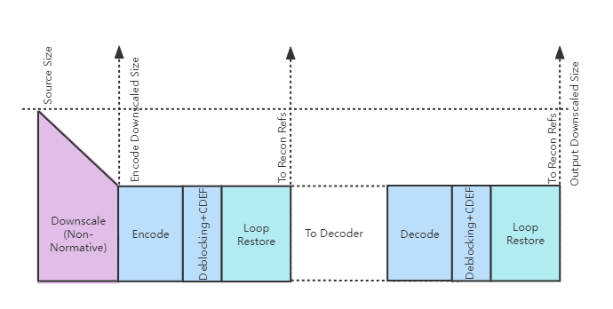
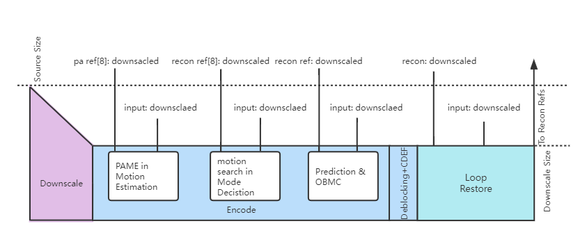
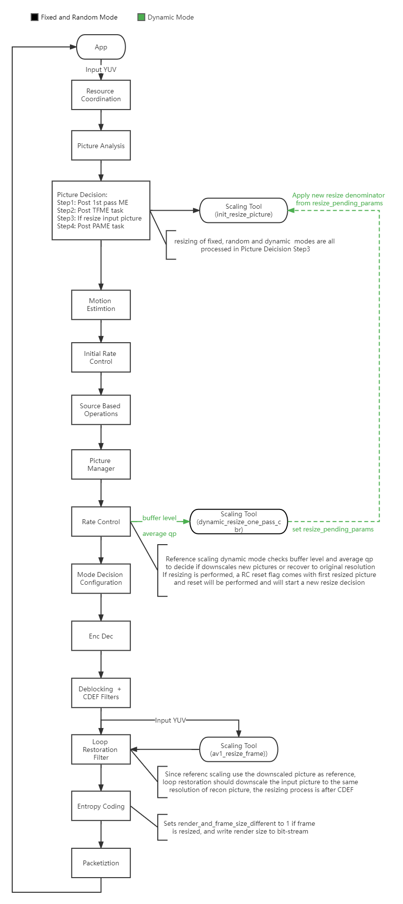
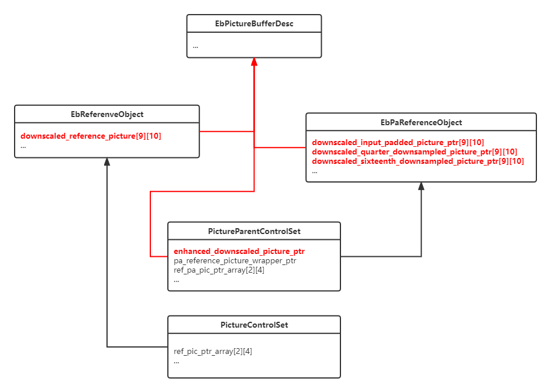

[Top level](../README.md)

# Reference-scaling Appendix

## 1. Description of the algorithm
The AV1 specification allows the input video pictures to be coded at a
lower resolution and then outputs reconstructed reference frames and bitstream
at the same scaled resolution. This coding procedure, referred to as
reference-scaling, is useful in scenarios where bandwidth is restricted with
low bit rate. Figure 1 depicts the architecture of the pipeline using reference
frame scaling.
At the encoder side, the encoding process using the reference-scaling feature
involves the following step: Firstly, the source video is downscaled using a
non-normative process. Secondly, the downscaled version of the input video is
encoded, followed by application of deblocking and CDEF. Then loop restoration
filtering is used with downscaled input pictures to recover part of the lost
high frequency information. This recovered picture is downscaled using the same
non-normative process. At the decoder side, the resulting bitstream is decoded,
and deblocking, CDEF and loop restoration are then applied on the lower
resolution pictures. The downscaling factor is constrained to 8/9 ~ 8/16, i.e.,
maximum 2x.
The downscaling operation can be applied to some of the frames, especially for
frames that are too complex to fit in the target bandwidth. Different frames
can have different downscaling factors. The following sections outline how
pictures with different sizes are processed in the different stages of the
SVT-AV1 encoder pipeline and how the downscaling factor is determined.

##### Figure 1. Processing pipeline when reference scaling is active.

## 2. Implementation of the algorithm
### 2.1. Downscaled and full-size versions of pictures
Figure 2 illustrates how pictures with different sizes are processed in
different coding processes/stages.

##### Figure 2. Processing of the downscaled and full-size pictures in the encoder pipeline.

In Figure 2, downscaled input refers to a downscaled version of the current
input picture.

In the Motion Estimation process (open-loop stage based on using source
pictures as reference pictures), pa ref denotes a list of reference pictures
consisting of input pictures at their original input resolution. When
reference-scaling is active, downscaled versions of reference and input pictures
are used in this process to compute SAD distortion.

In the Mode Decision process (in-loop stage), recon ref denotes reference
picture list which contains the reconstructed pictures. When reference-scaling
is active, downscaled version of the recon references and input pictures are
used in this process to compute SAD and other distortion measures.

In the prediction process, when reference-scaling is active, MotionVectors and
ScaleFactors are used to create downscaled prediction picture from resized
recon ref pictures via convolve_2d_scale() function. Such design follows AV1
spec "Motion vector scaling process". The current downscaled input picture and
resized prediction picture are used to create residual picture for transform
and quantization process.

Reference scaling does not upscale the picture resulted from CDEF filtering,
this is the major difference between scaling reference and super-res. The
downscaled pictures are directly reconstructed and used as reference pictures
in list.

Since the CDEF filter results are not upscaled to original size, the input
reference pictures in original restoration should be downscaled to the same
size of reconstructed pictures with the same non-normative scaling method.

### 2.2. Determination of the downscaling factor
The downscaling factor is constrained to 8/9 ~ 8/16. Since the numerator of the
factor is fixed to 8, only the denominator needs to be determined. There is a
special downscaling factor in dynamic mode, which is described in following
mode description.

Three modes are used to set the denominator namely Fixed, Random and Dynamic
modes, respectively. The mode is set by the user. A brief description of how
each of the above-mentioned modes works is included below.

* Fixed: Two denominator values can be set by the user, one for Key-frames and
  the other for non-key-frames. Downscaling can be applied to all pictures.
* Random: The denominator is set randomly. Downscaling can be applied to all
  pictures. This mode is mainly used for debugging/verification purpose.
* Dynamic: The use of downscaling is decided by evaluating the rate control
  buffer level being underflow. Two stages of downscaling can be applied to new
  input frames after scaling decision. The first stage is downscaling
  three-quarters in both width and height and the second stage is downscaling
  one-half in both width and height. This mode decides downscaling from
  original to stage1 then stage2 when buffer level being underflow and decides
  recovering from stage 2 to stage1 then original if QP level being better than
  worst case.

The following sections explain how these different modes are implemented in the
SVT-AV1 encoder. The high-level dataflow of reference scaling is shown in Figure
3.

##### Figure 3. High-level encoder process dataflow with reference scaling feature.

#### 2.2.1. Fixed and Random mode
Setting the denominator value and the downscaling of the input picture are
performed in the Picture Decision process. The Picture Decision process posts
three types of tasks to Motion Estimation process. They are first pass ME, TFME
(temporal filter) and PAME respectively. Reference scaling is not considered if
it is the first pass of multi-pass encoding process. Downscaling is performed
after TFME and before PAME, i.e. TFME is applied to the full-size picture and
then downscaling is applied to TFME filtered picture. PAME is performed using
downscaled pictures. As shown in Figure 2, PAME requires the input source
pictures and the corresponding reference pictures to be of the same size, so
the references (pa reference pictures) are also downscaled or upscaled in
advance.

#### 2.2.2. Dynamic mode
Dynamic mode only works in 1-pass CBR low-delay mode, it requires a collection
of buffer level and QP (or qindex) to determine which to be used, the original
resolution or downscaling in two stages. In SVT-AV1 encoder, picture buffer
level and QP are determined in the Rate Control process. So, the pictures
already in pipeline should keep their current resolution, the new scaling
denominator will be performed on new input pictures.

### 2.3. Other noticeable changes in code base
In SVT-AV1, data structure pool is widely used. That means many data structures
are used in recycled manner and when a data structure is acquired from pool,
its member variables may contain outdated values. This is not a problem when
all pictures are in the same size, but care should be taken when
reference scaling is enabled. For example, variables related to size and
geometry, like super block count, or extra buffers allocated for downscaled
pictures need to be reset to default (full size) values and memory to be safely
freed. The most noticeable data structures are parent PCS
(PictureParentControlSet) and child PCS (PictureControlSet). They are acquired
in Resource Coordination process and Picture Manager process respectively.

In the dynamic mode, a reset of frame size related information is applied when
the new scaled picture arrives in the Rate Control process, a new watch window
of scaling decision starts after this reset.

### 2.4. Reference Scaling API
Table 1 illustrates the usage of reference scaling functions. Only related
processes are listed.

##### Table 1. Reference Scaling API

## 3. Optimization
How reference Scaling affects the coding speed: The current picture and its
references are downscaled to the same size for motion estimation search.
Considering its interaction with super-res, in current implementation,
pa ref[sr_denom_idx][10] array and recon ref[sr_denom_idx][10] array is used to
hold downscaled reference pictures, to avoid duplicate downscaling on the same
reference picture for different input pictures. The sr_denom_idx and the
resize_denom_idx is calculated from scale_denom - scale_numerator.
E.g., pictures with index 4, 8 and 16 refer to picture 0 and their downscaled
reference frame of reference scaling combined with super-res are as following
table:
| pic index | refer scale ratio | super-res ratio |                      | scaling ref in array  |                      |
|-----------|-------------------|-----------------|----------------------|-----------------------|----------------------|
| 0         | 8/8               | 8/8             | N/A                  | N/A                   | N/A                  |
| 4         | 8/9               | 8/12            | ref_pic_0->downscaled_reference_picture[4][1] | ref_pic_16->downscaled_reference_picture[4][1] | ref_pic_8->downscaled_reference_picture[4][1] |
| 8         | 8/10              | 8/11            | ref_pic_0->downscaled_reference_picture[3][2] | ref_pic_16->downscaled_reference_picture[3][2] | N/A                  |
| 16        | 8/9               | 8/12            | ref_pic_0->downscaled_reference_picture[4][1] | N/A                   | N/A                  |

The duplicated downscaling of ref_pic_0->downscaled_reference_picture[4][1] performs only once.

Reference Scaling also has an impact on memory usage: Extra buffers are
allocated to hold downscaled pictures, including current coding picture, PA
references and reconstructed references as shown in Figure 4.

##### Figure 4. Buffers for downscaled pictures

## 4. Usage recommendation
The Random mode is preferred to be used for validation or testing only because
it consumes more memory. Consider reference scaling is required to interact
with super-res, pa_ref and recon_ref are expended to 2D arrays. The super-res
denom index is up to 9 (mapping from denom 8 to denom 16), and the resize denom
index is up to 10 (mapping from denom 8 to denom 16 and one special index for
3/4 in dynamic mode). The pa_ref and the recon_ref might be fully filled, and
this calls for more CPU time to scale the same reference with different
denominator values, but random mode brings no benefit compared to other modes.

The Fixed mode with constant QP configuration can achieve the target to work
with a narrow bandwidth with acceptable quality. The video quality goes down
with lower scaling ratio, it is recommended to set higher scaling ratio (8/9
or 8/10) for key frames and lower scaling ratio (8/13 to 8/16) for non-key
frames. It can balance between bit-rate and quality. The settings of lower ratio
for key frames and higher ratio for non-key frames are not recommended, because
the smaller key frames will lose too many details in scaling yet they are always
referred by other frames.

The Dynamic mode only works with 1-Pass CBR low-delay configuration, any
settings in conflict with those will make dynamic mode to be rejected. The new
scaling denominator is applied to the next input pictures, the expected bitrate
improvement will be delayed according to how many frames already exist in
encoding pipeline. According to internal tests, dynamic mode can be activated
at about 60% of target bitrate setting compared with the average output
bitrate in common encoding settings.

Random access of Reference Scaling is allowed either on demand or on the fly. User can set the parameters in list through encoder API for the entire stream (please refer to section of Reference Scaling of [Parameter.md](Parameter.md)), or sends frame resize event as private data with each frame buffer, for example:
~~~
  EbPrivDataNode *node = NULL;
  if (start_resize_frame_nums == processed_frame_count) {
    EbPrivDataNode  *new_node = malloc(sizeof(*new_node));
    EbRefFrameScale *data     = malloc(sizeof(*data));
    data->scale_mode          = RESIZE_FIXED;
    data->scale_denom         = resize_denoms;
    data->scale_kf_denom      = resize_kf_denoms;
    new_node->size            = sizeof(EbRefFrameScale);
    new_node->node_type       = REF_FRAME_SCALING_EVENT;
    new_node->data            = data;
    new_node->next            = node;
    node                      = new_node;
  }
  // prepare other private data ...
  buffer_header->p_app_private = node;
~~~

## 5. Notes
The feature settings that are described in this document were compiled at
v1.7.0 of the code and may not reflect the current status of the code. The
description in this document represents an example showing how features would
interact with the SVT architecture. For the most up-to-date settings, it's
recommended to review the section of the code implementing this feature.
