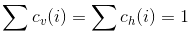
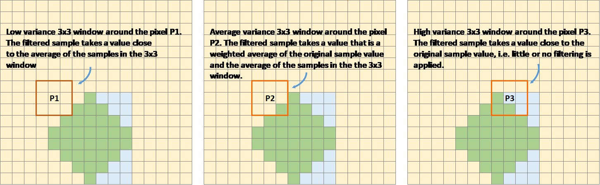
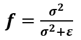
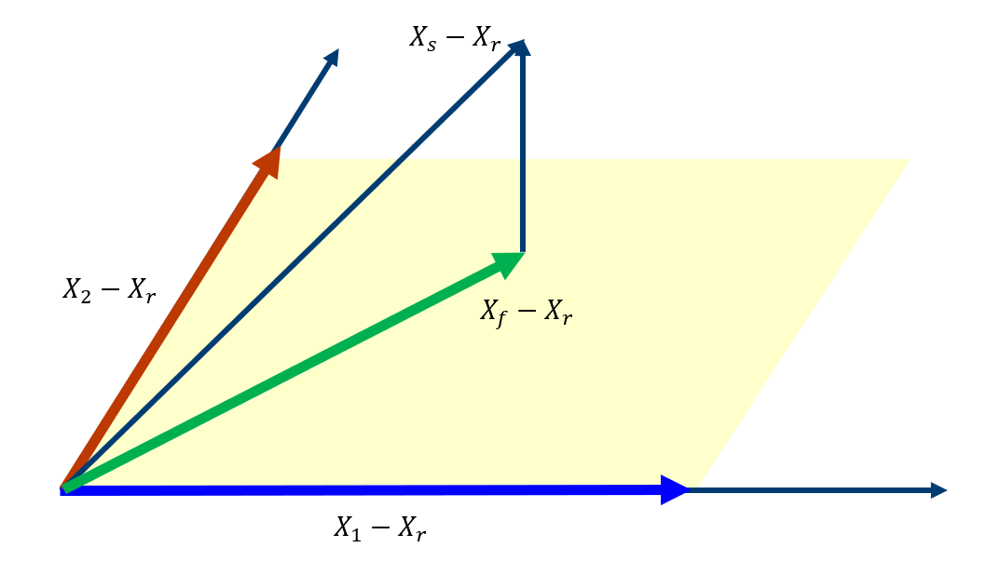
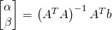
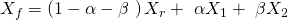
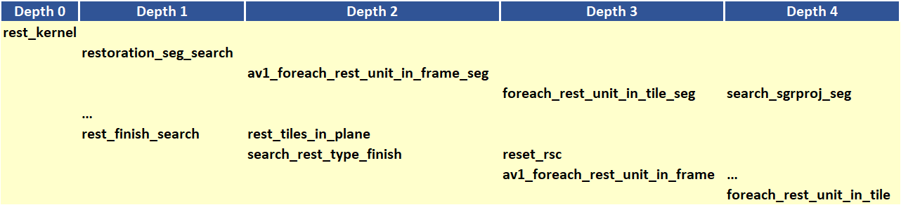
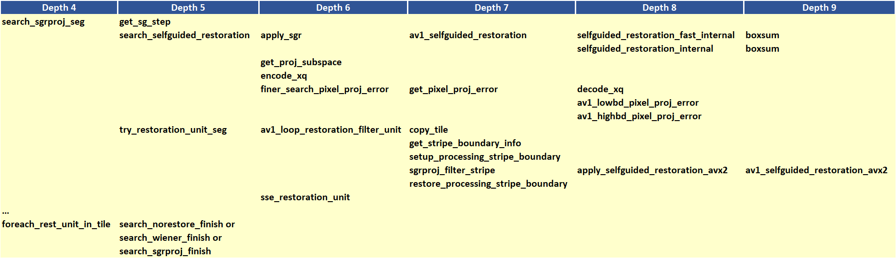
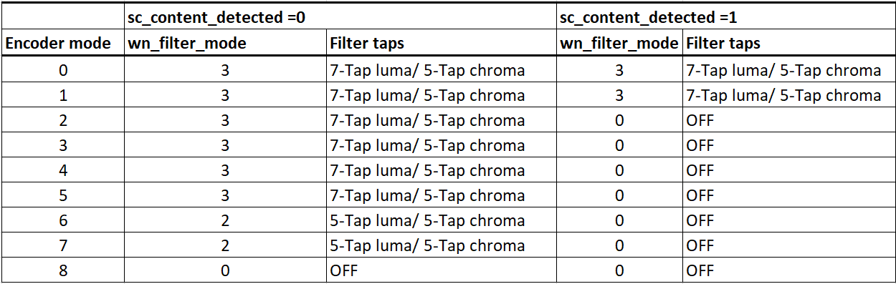
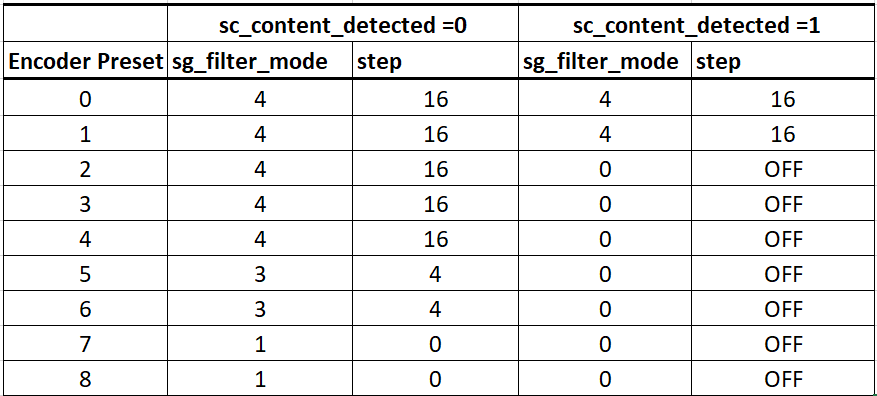

# Restoration Filter Appendix

The restoration filter is applied after the constrained directional
enhancement filter (CDEF) and aims at improving the reconstructed picture by
recovering some of the information lost during the compression process.
The restoration filter involves two main filters, namely a Wiener filter
and a self-guided restoration filter with projection (SGRPROJ).

The processing of a frame by the restoration filter proceeds by
splitting the picture into restoration units. The size of the
restoration units is set in the function `set_restoration_unit_size`
and is set to the maximum restoration unit size
(```RESTORATION_UNITSIZE_MAX```) of 256 for both luma and chroma when
picture\_width\*picture\_height\>352\*288, otherwise it is set to 128.

At the frame level, the restoration filter operates with one of the
following modes: OFF, Wiener filter, SGRPROJ filter for the whole frame,
or switching between those three modes at the restoration unit level.

## I. Wiener Filter

### 1.  Description of the algorithm [To be completed]

The Wiener filter is a separable symmetric filter (7/5/3-tap
filters), where only three, two or one coefficient(s) for the horizontal
and vertical filters are included in the bit stream due to symmetry. The
constraints on the Wiener filter to reduce complexity are as follows:

  - The filter is separable. Let  and  be the
    wx1 vertical and horizontal filter kernels.
  - The filter kernels  and  are symmetric: =c_v(w-1-i)), =c_h(w-1-i)), i=0,1...,r-1.

  - The sum of the coefficients is 1: 

The design of the Wiener filter proceeds in an iterative manner:

  - Starts with initial guess for both the vertical and horizontal
    filters.
  - Design one of the two filters while holding the second filter fixed,
    then repeat the process

The filter is designed over windows of size 64x64 in the reference
picture. The filter taps are either 7, 5, or 3 for luma and 3 or 5 for
chroma.

### 2.  Implementation [To be completed]

**Inputs to rest\_kernel**: Output frame of the CDEF filter.

**Outputs of rest\_kernel**: Restored picture, filter parameters.

**Control macros/flags**:

##### Table 1. Control flags for the Wiener filter.

| **Flag**            | **Level** | **Description**                                                                                                     |
| ------------------- | --------- | ------------------------------------------------------------------------------------------------------------------- |
| enable\_restoration | Sequence  | Indicates whether to use restoration filters for the whole sequence.                                                |
| wn\_filter\_mode    | Picture   | Controls the quality-complexity tradeoff of the filter as a function of the encoder mode.                           |
| allow\_intrabc      | Picture   | Indicates whether to enable intra block copy. The restoration filter is not active when allow\_intrabc is set to 1. |


## II. Self-Guided Restoration Filter with Subspace Projection (SGRPROJ)

### 1.  Description of the algorithm

The main objective behind using the SGRPROJ filter is to smooth the
reconstructed image while preserving edges. The filter consists of two
main components, namely a self-guided filter and a subspace projection
of the reconstructed image.

#### 1.1 Self-guided filter

The self-guided filter feature makes use of a guide image where the
objective is to transfer features in the guide image to the
reconstructed picture. When the guide image is the same as the
reconstructed image, the filter is called a self-guided filter. The
objective in this case is to apply filtering that is a function of the
spatial characteristics (variance) of the immediate neighborhood of the
pixel to be filtered. The main idea behind the filter is outlined below.

A filtered value  of a sample value
 in the reconstructed image is generated as follows:

\mu})

where  is the average of a small window ***w*** around  in the reconstructed picture and 0\<=  \< 1 is a function of the variance of the samples in the window ***w.***

  - When the variance of ***w*** is large, then  is close
    to 1, and the filtered sample value is very close to
     i.e. very little filtering takes place,
    and high frequency features (edges) in ***w*** are preserved.
  - When the variance of ***w*** is very small, then  is
    close to 0, and the filtered sample value is very close to
    , i.e.  is replaced by a
    value close to  and smoothing takes place.

The figure below illustrates the main idea behind the filter.



##### Figure 1. Example of how the variance of the area around the sample to filtered affects the selection of the self-guided restoration filter parameters.

The derivation of the filter parameters is outlined below.

  - Compute the mean  and the square of the variance  of a (2r+1)x(2r+1) window ***w*** around the sample  in the reconstructed image.
  - Define  , \mu}). The parameter  is used to tune the filter.
  - Repeat the same computations above for every sample in the window
    ***w*** (or for a subset of those samples). Define **F** and **G** to be the averages of  and  computed for all samples in the window ***w*** (or for a subset of those samples), respectively.
  - Filtering: 

The performance of the self-guided filter is generally not sufficient to
produce good quality reconstructed images. As a result, a further
restoration step is considered and involves the use of subspace
projection.

### 1.2.  Subspace Projection

The main idea behind subspace projection is as follows:

  - Construct two restored versions of the reference picture generated
    using the self-guided filter using two different (r,
     ) parameter pairs.
  - Consider the difference between each of the two restored versions
    and the reference picture and consider the subspace generated by
    those two differences.
  - Project the difference between the source image and the
    reconstructed image into the constructed subspace.

To illustrate the idea of subspace projection, consider the following column vectorized version of the corresponding pictures:

  -  : Source.
  -  : Reconstructed.
  -  and  : Filtered (i.e. restored) versions of
     using self-guided filter based on parameters ( ) and ( ) respectively.
  -  : Final restored version of . (  ) is obtained by projecting (  ) onto the subspace generated by (  ) and (  )



##### Figure 2. Illustration of the idea of subspace projection in the SGRPROJ filter.

  - =\alpha(X_1-X_r)+\beta(X_2-X_r))
  - 
  - (X_2-X_r)],b=[(X_s-X_r)])
  - 


### 2.  Implementation

**Inputs to rest\_kernel**: Output frame of the CDEF filter.

**Outputs of rest\_kernel**: Restored picture, filter parameters.

**Control macros/flags**:

##### Table 2. Control flags for the SGRPROJ filter.

| **Flag**            | **Level** | **Description**                                                                                                     |
| ------------------- | --------- | ------------------------------------------------------------------------------------------------------------------- |
| enable\_restoration | Sequence  | Indicates whether to use restoration filters for the whole sequence.                                                |
| sg\_filter\_mode    | Picture   | Controls the quality-complexity tradeoff of the filter as a function of the encoder mode.                           |
| allow\_intrabc      | Picture   | Indicates whether to enable intra block copy. The restoration filter is not active when allow\_intrabc is set to 1. |

#### Details of the implementation

The main function calls associated with the SGRPROJ filter as indicated in Figure 3 below.



##### Figure 3. Main function calls associated with the SGRPROJ filter.

The main steps involved in the implementation of the algorithm are
outlined below, followed by more details on some of the important
functions.

#### Step 1 - Splitting the frame into segments

The frame to be filtered is divided into segments to allow for parallel
filtering operations on different parts of the frame. Each segment could
involve more than one restoration unit. The sizes and number of segments
are set as follows (see EbEncHandle.c):

```c
unit_size = 256;

rest_seg_w = MAX((sequence_control_set_ptr->max_input_luma_width /2 + (unit_size >> 1)) / unit_size, 1);

rest_seg_h = MAX((sequence_control_set_ptr->max_input_luma_height/2 + (unit_size >> 1)) / unit_size, 1);

sequence_control_set_ptr->rest_segment_column_count = MIN(rest_seg_w,6);

sequence_control_set_ptr->rest_segment_row_count = MIN(rest_seg_h,4);
```

Each segment may consist of a number of restoration units. Each
restoration unit is split into restoration processing units of size
64x64 for luma (```#define RESTORATION_PROC_UNIT_SIZE 64```(in EbRestoration.h))

#### Step 2 – Restoration filter search. Each segment goes through a search to identify the best SGRPROJ filter parameters for each restoration unit in the segment (```restoration_seg_search```).

Loop over all restoration units in a given tile segment (```foreach_rest_unit_in_tile_seg```)
  - Determine the best filtering parameters for the restoration unit (```search_selfguided_restoration```)
    - Determine the search range for epsilon values \[start\_ep, end\_ep\] for epsilon values to use in optimizing the filter parameters, where epsilon is indicated in the description of the algorithm presented above.
    - Loop over the epsilon values in the range \[start\_ep, end\_ep\]
      - Loop over 64x64 restoration processing units in the restoration
        unit (apply\_sgr)
          - Filter all samples in the 64x64 restoration processing unit (av1\_selfguided\_restoration(\_avx2 or \_c). More
            details on av1\_selfguided\_restoration(\_avx2 or \_c) are
            included below.
      - Generate the projection of the (Source -Reconstructed) onto the
        subspace generated by (Filtered\_recon\_1 - Reconstructed) and
        (Filtered\_recon\_2 - Reconstructed), where Filtered\_recon\_1
        and Filtered\_recon\_2 are two restored version of
        thereconstructed picture, and generate the corresponding
        projection coordinates xq\[0\] and xq\[1\], which correspond to
        \(\alpha\) and \(\beta\) in the description of the algorithm
        outlined above. (```get_proj_subspace```)
      - Compute the following parameters in (encode\_xq)
          - xqd\[0\]: Clamped value of xq\[0\]
          - xqd\[1\]: Clamped value of (128 - xqd\[0\] - xq\[1\])
      - Perform a refinement search around the identified parameters
        xq\[0\] and xq\[1\] to see if any other nearby parameters
        provide a better filtering error.
        (```finer_search_pixel_proj_error```)
      - Keep track of the best filtering error for the restoration unit,
        the corresponding epsilon and (xqd\[0\], xqd\[1\]) parameters.
    - Increment a counter ```sg_frame_ep_cnt[bestep]``` for the identified best epsilon value from the steps above.
    - Return the best epsilon and (xqd\[0\], xqd\[1\]) parameters for the current restoration unit.


- Filter stripes of height 64 (```try_restoration_unit_seg```)
  - Loop over stripes (```av1_loop_restoration_filter_unit```)
    - Loop over the restoration processing units in a stripe and apply filtering to each restoration processing unit using the already identified best filtering parameters for each restoration processing unit. (```sgrproj_filter_stripe```)
- Compute the sse for the filtered restoration unit (```sse_restoration_unit```)

The function calls associated with step 2 above are summarized in the
diagram shown in Figure 4 below.



##### Figure 4. Continuation of Figure 3 showing the function calls associated with SGRPROJ filter parameter search.

#### Step 3 – Identify the best filtering mode for the whole frame

- Loop over the picture planes to identify the best restoration option for
each of the picture planes
  - Loop over all available filtering options (```RESTORE_NONE,
RESTORE_WIENER, RESTORE_SGRPROJ, RESTORE_SWITCHABLE```), compute the
resulting cost for using each of the options over the whole frame, and
choose the best option for the whole frame. The selection is based on
the rate-distortion cost of the different options.
(```rest_finish_search```)

#### Step 4 – Filter each restoration unit in the frame using the identified best option from step 3 above. (```av1_loop_restoration_filter_frame```)

#### More details on av1\_selfguided\_restoration(\_avx2 or \_c).
```c
#define MAX_RADIUS 2 // Only 1, 2, 3 allowed

#define MAX_NELEM ((2 * MAX_RADIUS + 1) * (2 * MAX_RADIUS + 1))
```
For a given 64x64 block in a restoration unit, integral images D and C
corresponding to the sum of elements in the 64x64 block and to the sum
of their squares, respectively, are generated. These two integral images
make is very easy to compute the mean and variance of any block with
arbitrary location and size in the 64x64 block.

The integral images D and C are used to compute the filter parameters
for each sample in the 64x64 block. The filter parameters are stored in
arrays A and B.

To filter a given sample, the filter parameters for neighboring samples
are averaged. The filter parameters are obtained from the arrays A and
B. The neighboring samples are taken from a window of size
(2r+1)\*(2r+1) around the sample to be filtered, where r could be 1 or 2
(r=0 implied SGRPROJ filter is OFF). A weighted average of the
neighboring filtering parameters for the neighboring samples is used in
filtering the current sample, as outlined above in the description of
the filter algorithm. See ```av1_selfguided_restoration_c,
selfguided_restoration_fast_internal and
selfguided_restoration_internal``` for the C implementation, av1_selfguided_restoration_avx2, integral_images, calc_ab_fast, final_filter_fast, calc_ab, final_filter for the avx2 implementation.

### 3.  Optimization of the algorithm

Both the Wiener filter and the SGRPROJ filters involve, at the
restoration unit level, a search procedure for the best Wiener filter
parameters and for the best SGRPROJ filter parameters. The tradeoff
between complexity and quality is achieved by limiting the extent of the
filter parameter search.

**3.1 Wiener filter search**

For the wiener filter, the search could be performed using either 3, 5
or 7 tap filters for luma, or 3 or 5 tap filters for chroma. The
parameter ```cm->wn_filter_mode``` is used to specify the level of filter
complexity, where increasing levels of filter search complexity are
defined by considering an increasing number of filter taps for both luma
and chroma, as given in the table below.

##### Table 3. Description of the Wiener filter settings for the different ```wn_filter_mode``` values.

| **wn\_filter\_mode** | **Settings**             |
| -------------------- | ------------------------ |
| 0                    | OFF                      |
| 1                    | 3-Tap luma/ 3-Tap chroma |
| 2                    | 5-Tap luma/ 5-Tap chroma |
| 3                    | 7-Tap luma/ 5-Tap chroma |

The encoder mode (```picture_control_set_ptr->enc_mode```) is used to
specify the Wiener filter mode (```cm->wn_filter_mode```). The settings of
the filter mode as a function of the encoder mode are given in the table
below.

##### Table 4. Wiener filter settings as a function of encoder mode.



**3.2 SGRPROJ filter search**

The search for the best SGRPROJ filter is normally performed by
evaluating the filter performance for each of the sixteen different
 values in the interval \[0,15\], where
 is used in the outline of SGRPROJ algorithm
presented above. The algorithmic optimization of the filter search
involves restricting the range of  values in the
search operation. The parameter ```cm->sg_filter_mode``` is used to specify
different level of search complexity, where a higher value of
```cm->sg_filter_mode``` would correspond to a wider interval of
 values and a more costly search. The parameter
step is used to control the width of the search interval, and is given
in the following table.

##### Table 5. Step parameter as a function of the sg\_filter\_mode.

| **sg\_filter\_mode** | **step** |
| -------------------- | -------- |
| 0                    | OFF      |
| 1                    | 0        |
| 2                    | 1        |
| 3                    | 4        |
| 4                    | 16       |

The ```sg_filter_mode``` parameter is a function of the encoder mode
(```picture_control_set_ptr->enc_mode```) as indicated in the table
blow.

##### Table 6. Step parameter as a function of the encoder mode.



The optimization proceeds as follows:

1.  The encoder mode ```enc_mode``` specifies the SGRPROJ filter mode
    ```sg_filter_mode```.

2.  The ```sg_filter_mode``` specifies the parameter step through the
    function ```get_sg_step```.

3.  The interval \[start\_ep, end\_ep\] of 
    values to search is specified as follows
    (```search_selfguided_restoration```):

  - The  values sg\_ref\_frame\_ep\[0\] and sg\_ref\_frame\_ep\[1\] of the reference pictures are used to define the center of the interval mid\_ep as follows:
    ```c
    mid_ep = sg_ref_frame_ep[0] < 0 && sg_ref_frame_ep[1] < 0 ? 0 :
    sg_ref_frame_ep[1] < 0 ? sg_ref_frame_ep[0] :
    sg_ref_frame_ep[0] < 0 ? sg_ref_frame_ep[1] :
    (sg_ref_frame_ep[0] + sg_ref_frame_ep[1]) / 2;
    ```
  - The interval limits are given by:
    ```c
    start_ep = sg_ref_frame_ep[0] < 0 && sg_ref_frame_ep[1] < 0 ? 0 : AOMMAX(0, mid_ep - step);
    end_ep = sg_ref_frame_ep[0] < 0 && sg_ref_frame_ep[1] < 0 ? SGRPROJ_PARAMS : AOMMIN(SGRPROJ_PARAMS, mid_ep + step);
    ```
### 4.  Signaling

##### Table 7. Restoration filter signals.

| **Signal**                        | **Description**                                                       |
| --------------------------------- | --------------------------------------------------------------------- |
| **At the frame level**            |                                                                |
| frame\_restoration\_type          | RESTORE\_NONE, RESTORE\_WIENER, RESTORE\_SGRPROJ, RESTORE\_SWITCHABLE |
| restoration\_unit\_size           | Size of restoration unit. For luma: 128x128 or 256x256
| **At the restoration unit level** |                                                                       |
| restoration\_type                 | RESTORE\_NONE, RESTORE\_WIENER, RESTORE\_SGRPROJ                      |
| wiener\_info                      | Vertical and horizontal filter coefficient array vfilter and hfilter. |
| sgrproj\_info                     | epsilon, projection parameters xqd\[0\] and xqd\[1\]                  |

## References

[1] Debargha Mukherjee, Shunyao Li, Yue Chen, Aamir Anis, Sarah Parker and
James Bankoski, “*A Switchable Loop-restoration with Side-information
Framework for the Emerging AV1 Video Coding*,” International Conference
on Image Processing, pp. 265-269, 2017.
