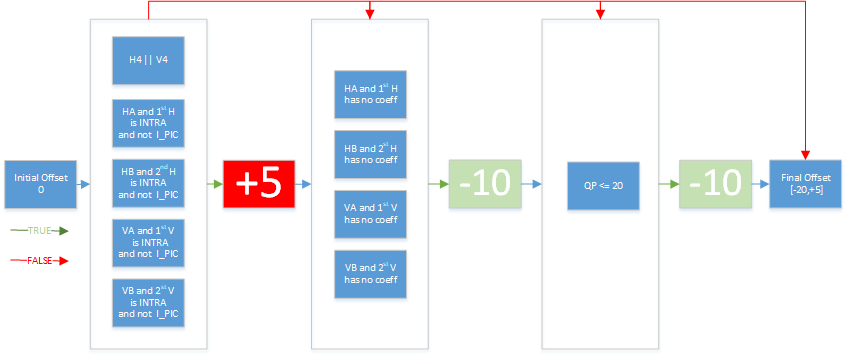
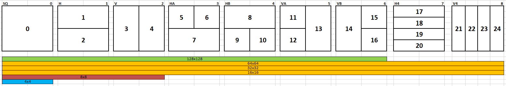

# SQ_Weight Appendix

## Description

SQ\_WEIGHT determines if the evaluation of HA, HB, VA, VB, H4 and V4
shapes could be skipped based on the cost of SQ, H and V shapes.
Specifically:

-   skip HA, HB and H4 if (valid SQ and H) and (H\_COST \>
    (SQ\_WEIGHT \* SQ\_COST) / 100)

-   skip VA, VB and V4 if (valid SQ and V) and (V\_COST \>
    (SQ\_WEIGHT \* SQ\_COST) / 100)

-   `The lower the SQ_WEIGHT, the higher the chance to skip NSQ`

## SQ\_WEIGHT Derivation

SQ\_WEIGHT = **Base** + **Offset**

**Base = f(Preset)**

  **Preset(s)**  | **BASE**
  ---------------| ---------
  MR             | ∞
  M0             | 105
  M1             | 105
  M2             | 100
  M3 & beyond    | 95

**Offset = f (Target Shape, Block/PIC Type, Coeff Info, QP)**

PS.

