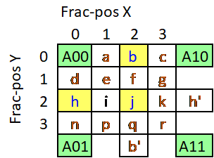
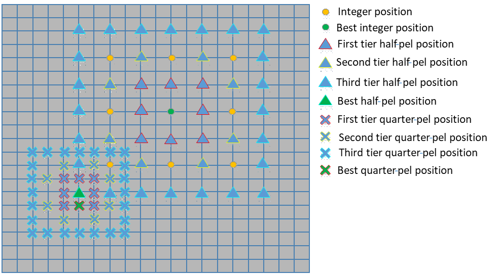

# Subpel Interpolation in the Open-loop Motion Estimation appendix

## 1. Description of the algorithm

The open loop motion estimation (ME) uses source input pictures as
reference pictures and provides motion vectors with up to quarter-pel
precision. The luminance samples at the half-pel positions are generated
first by applying symmetric 4-tap filter F1 = {-4, 36, 36, -4} on the
integer luminance samples. The values of the half-pel samples are
generated for the whole input search region and stored in 3 different
buffers. Then, the luminance samples at the quarter-pel positions are
generated using a bilinear filter F2 = {1,1} that is applied on the
full-pel luminance samples and the already computed half-pel luminance
samples.

In Figure 1 below, A00, A10, A01 and A11 represent the luminance samples
at the integer positions; b, h and j are the luminance samples at the
half-pel positions and a, c, d, e, f, g, i, k, n, p, q and r are the
luminance samples at the quarter-pel positions.

##### Figure 1. Fractional positions.

Table 1 below summarizes the filters used to generate the luminance
samples at the half-pel positions.

##### Table 1. Interpolation filters used in the generation of the half-pel positions in ME.

| **Position** | **Frac-pos Y** | **Frac-pos X** | **Horizontal filter** | **Vertical filter** |
| ------------ | -------------- | -------------- | --------------------- | ------------------- |
| **b**        | 0              | 2              | F1                    | \-                  |
| **h**        | 2              | 0              | \-                    | F1                  |
| **j**        | 2              | 2              | F1                    | F1                  |

Table 2 below summarizes the filters used to generate the luminance
samples at the quarter-pel positions.

#####  2. Interpolation filters used in the generation of the quarter-pel positions in ME.

| **Position** | **Frac-pos Y** | **Frac-pos X** | **Filter**   | **Interpolated sample value** |
| -------------| -------------- | -------------- | ------------ | ----------------------------- |
| **a**        | 0              | 1              | F2           | A00 + b                       |
| **c**        | 0              | 3              | F2           | b + A10                       |
| **d**        | 1              | 0              | F2           | A00 + h                       |
| **e**        | 1              | 1              | F2           | h + b                         |
| **f**        | 1              | 2              | F2           | b + j                         |
| **g**        | 1              | 3              | F2           | b + h'                        |
| **i**        | 2              | 1              | F2           | h + j                         |
| **k**        | 2              | 3              | F2           | j + h'                        |
| **n**        | 3              | 0              | F2           | h + A01                       |
| **p**        | 3              | 1              | F2           | h + b'                        |
| **q**        | 3              | 2              | F2           | j + b'                        |
| **r**        | 3              | 3              | F2           | h' + b'                       |

## 2.  Implementation of the algorithm

The sub-pel search in motion estimation is invoked after the full-pel
search is completed and the best integer position is determined. The
half-pel/quarter-pel search is a refinement stage around the best selected
position in the previous search stage. This refinement area is
configurable depending on the desired quality/complexity tradeoff. For
example, in Figure 2, a first tier of half-pel positions around the best
full-pel position are checked and then a second and third tier of
half-pel positions can be also checked. Similarly, during the
quarter-pel refinement, various tiers of quarter-pel refinement
positions can be checked. The enabling of the multi-tier refinement is
controlled by the half\_pel\_mode flag for half-pel refinement and by
the quarter\_pel\_mode flag for quarter-pel refinement. Moreover, the number
of tiers to be considered in the refinement is determined by the
H\_PEL\_SEARCH\_WIND and the Q\_PEL\_SEARCH\_WIND macros for half-pel and
quarter-pel refinements, respectively.

##### Figure 2. Subpel search refinement positions.

The description of the half-pel and quarter-pel modes is provided
in Table 3 and Table 4, respectively. The half-pel and quarter-pel modes
for the different encoder presets are summarized in Table 5.

##### Table 3. half\_pel\_mode settings and description.

| **half\_pel\_mode**     | **Description**                 |
| ----------------------- | ------------------------------- |
| 0 (EX\_HP\_MODE)        | Exhaustive 1/2-pel search mode. |
| 1 (REFINMENT\_HP\_MODE) | Refinement 1/2-pel search mode. |

##### Table 4. quarter\_pel\_mode settings and description.

| **quarter\_pel\_mode**  | **Description**                 |
| ----------------------- | ------------------------------- |
| 0 ( EX\_QP\_MODE)       | Exhaustive 1/4-pel search mode  |
| 1 (REFINMENT\_QP\_MODE) | Refinement 1/4-pel search mode. |

##### Table 5. Half-pel and quarter-pel search modes as a function of the encoder preset.

| **Encoder Preset** | **half\_pel\_mode**     | **quarter\_pel\_mode**  |
| ------------------ | ----------------------- | ----------------------- |
| 0                  | 0 (EX\_HP\_MODE)        | 1 (REFINMENT\_QP\_MODE) |
| 1 to 8             | 1 (REFINMENT\_HP\_MODE) | 1 (REFINMENT\_QP\_MODE) |
