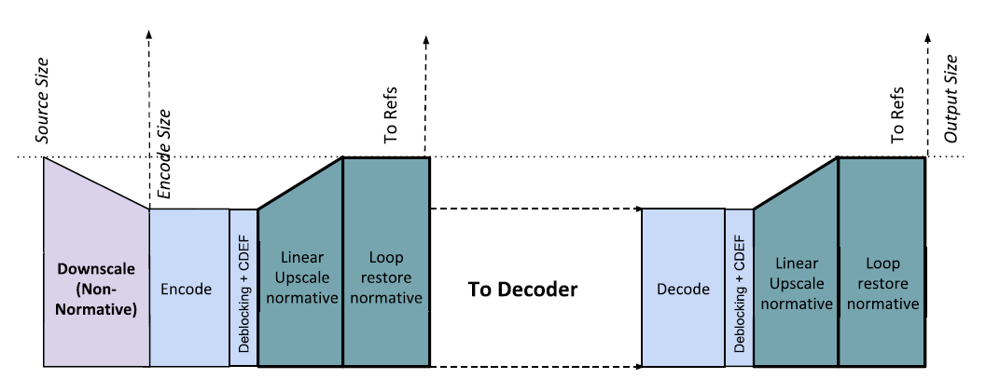
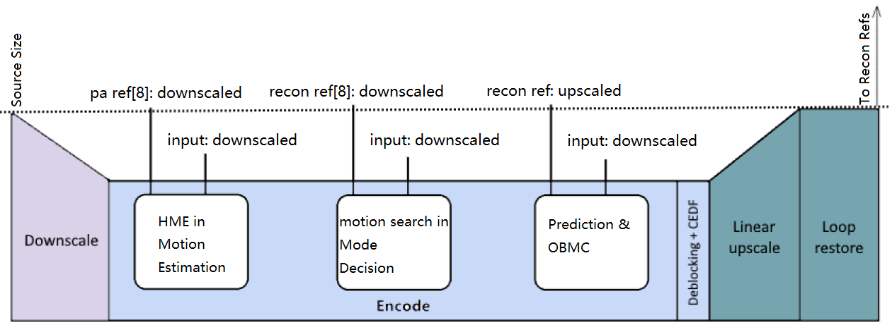
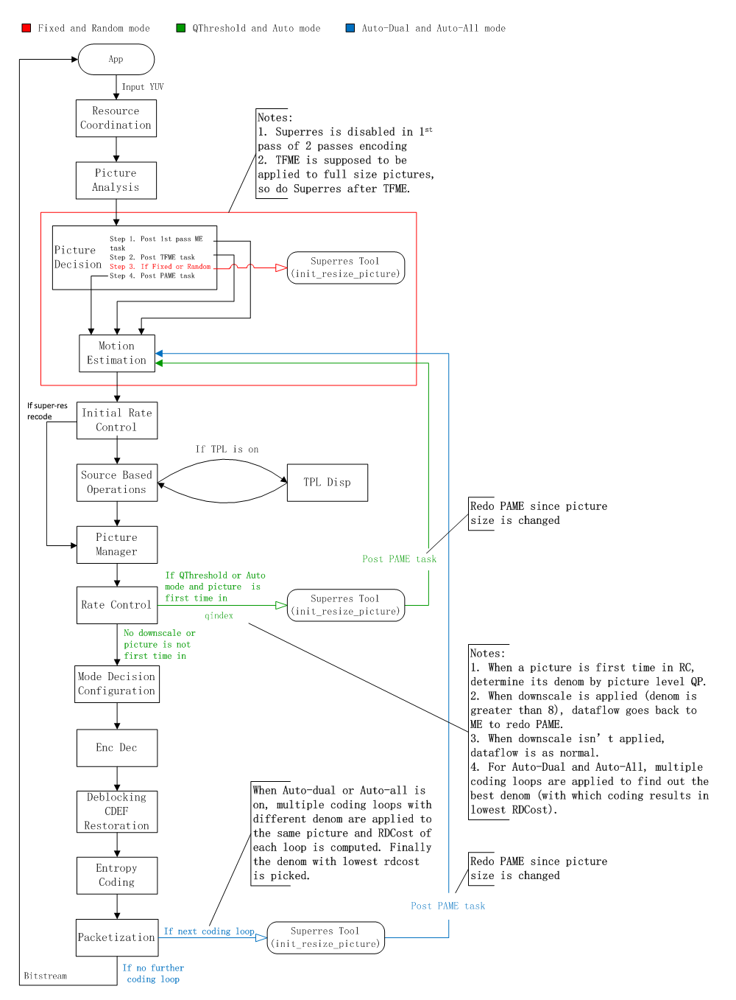
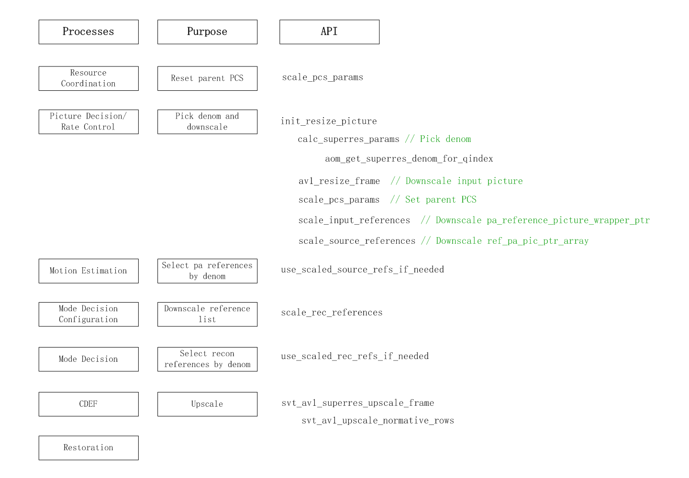
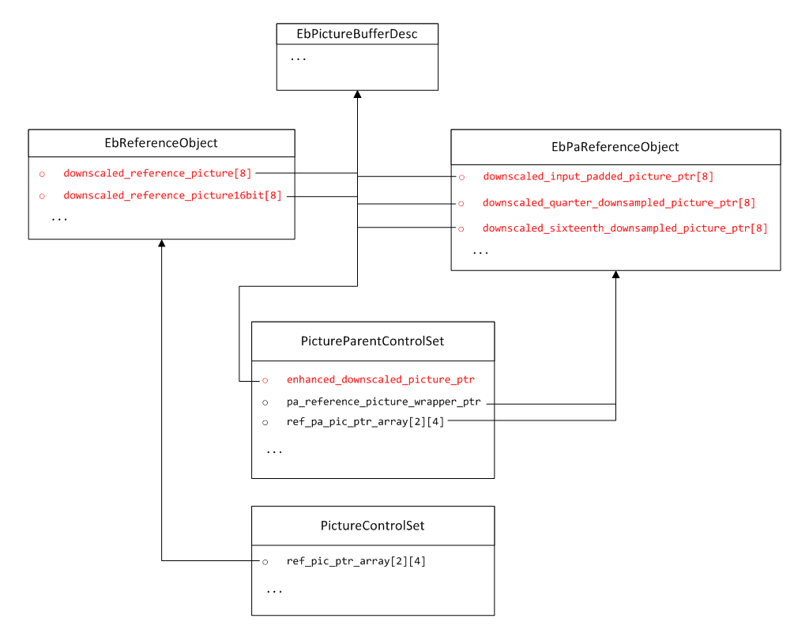

[Top level](../README.md)

# Super-resolution Appendix

## 1. Description of the algorithm
The AV1 specification allows for the input video pictures to be coded at a
lower resolution and then upscaled to the original resolution after
reconstruction. This coding procedure, referred to as super-resolution, is
useful in low bit rate streaming scenarios [1]. Figure 1 depicts the
architecture of the processing pipeline when using super-resolution [2]. At the
encoder side, encoding using the super-resolution feature involves the
following step. First, the source video is downscaled using a non-normative
process. Second, the downscaled version of the input video is encoded, followed
by application of deblocking and CDEF to the reconstructed downscaled version
of the input video. Third, the output pictures from CDEF are upscaled to the
original resolution and loop restoration is applied to the full resolution
pictures to recover part of lost high frequency information. The upscaling and
loop restoration operations are referred to as the super-resolve steps and are
normative. At the decoder side, the resulting bitstream is decoded, and
deblocking and CDEF are then applied on the lower resolution pictures. The
output pictures from CDEF are then super-resolved to original video resolution
[2]. In order to reduce overheads associated with line-buffers in hardware
implementations, the upscaling and downscaling operations are applied to the
horizontal direction only [3]. The downscaling factor is constrained to 8/9 ~
8/16, i.e, maximum 2x. The downscaling operation can be applied to some of the
frames, especially for frames that are too complex to fit in the target
bandwidth. Different frames can have different downscaling factors. The
following sections outline how pictures with different sizes are processed in
the different stages of the SVT-AV1 encoder pipeline and how the downscaling
factor is determined.

##### Figure 1. Processing pipeline when super-resolution is active.

## 2. Implementation of the algorithm
### 2.1. Downscaled and full-size versions of pictures
Figure 2 illustrates how pictures with different sizes are processed in the different coding processes/stages.

##### Figure 2. Processing of the downscaled and full-size pictures in the encoder pipeline.

In Figure 2, downscaled input refers to a downscaled version of the current
input picture.

In the Motion Estimation process (open-loop stage based on using source
pictures as reference pictures), pa ref denotes a list of reference pictures
consisting of input pictures at their original input resolution. When
super-resolution is active, downscaled versions of reference and input pictures
are used in this process to compute SAD distortion.

In the Mode Decision process (in-loop stage), recon ref denotes reference
picture list which contains the reconstructed pictures. When super-resolution
is active, downscaled version of the recon references and input pictures are
used in this process to compute SAD and other distortion measures.

In the prediction process, when super-resolution is active, MotionVectors and
ScaleFactors are used to create downscaled prediction picture from upscaled
recon ref pictures via convolve_2d_scale() function. Such design follows AV1
spec “Motion vector scaling process”. Current downscaled input picture and
downscaled prediction picture are used to create residual picture for transform
and quantization process.

After deblocking and CDEF, current downscaled reconstructed picture is upscaled
for next restoration process.

After restoration, current upscaled reconstructed picture is added to the recon ref list.

### 2.2. Determination of the downscaling factor
The downscaling factor is constrained to 8/9 ~ 8/16. Since the numerator of the
factor is fixed to 8, only the denominator needs to be determined. Four modes
are used to set the denominator namely Fixed, Random, QThreshold and Auto
modes, respectively. The mode is set by the user. Auto mode has three search
types: Auto-Solo, Auto-Dual and Auto-All and is set according to the encoder
Preset. A brief description of how each of the above mentioned modes works is
included below.

* Fixed: Two denominator values can be set by the user, one for Key-frames and the other
  for non-key-frames. Downscaling can be applied to all pictures.
* Random: The denominator is set randomly. Downscaling can be applied to all pictures.
  This mode is mainly used for debugging/verification purpose.
* QThreshold: The use of super-resolution is decided by comparing the QP of the frame
  with a user-supplied QP threshold. Downscaling is applied to Key-frames and ARFs only.
* Auto-Solo: It works similarly to QThreshold mode except that the QP threshold is fixed
  by the encoder.
* Auto-Dual: Both downscaled (the denominator is determined by QP) and full size original
  input pictures are encoded. The output with the better rate-distortion cost is selected.
  Downscaling is applied to Key-frames and ARFs only.
* Auto-All: Both downscaled with all possible denominator values (9~16) and full-size
  original input pictures are encoded. The output with best rate-distortion cost is selected.
  Downscaling is applied to Key-frames and ARFs only.

The following sections explain how these different modes are implemented in the
SVT-AV1 encoder. The high level dataflow of super-resolution is shown in Figure
3.

##### Figure 3. High-level encoder process dataflow with super-resolution feature.

#### 2.2.1. Fixed and Random mode
Setting the denominator value and the downscaling of the input picture are
performed in the Picture Decision process. The Picture Decision process posts
three types of tasks to Motion Estimation process. They are first pass ME, TFME
(temporal filter) and PAME respectively. Super-resolution is not considered if
it is the first pass of two-pass encoding process. Super-resolution downscaling
is performed after TFME and before PAME, i.e. TFME is applied to the full size
picture and then downscaling is applied to TFME filtered picture. PAME is
performed using downscaled pictures. As shown in Figure 2, PAME requires the
input source pictures and the corresponding reference pictures to be of the
same size, so the references (pa reference pictures) are also downscaled in
advance.

#### 2.2.2. QThreshold and Auto-Solo mode
Both modes require QP (or qindex) to determine denominator. In SVT-AV1 encoder,
picture level QP is determined in the Rate Control process. So the denominator
can be decided only if the picture level QP is determined in the Rate Control
process on the original resolution. Because the resolution is changed by new
denominator, PAME must be done again at new resolution. As illustrated in
Figure 3, a PAME task is posted after Rate Control and dataflow goes back to
the Motion Estimation process.

#### 2.2.3. Auto-Dual and Auto-All mode
The Auto-Dual and the Auto-All modes require going through the coding loop
multiple times. The scaling factor denominator for each pass through the coding
loop (including full resolution pass which is represented by special scaling
factor denominator 8) is determined in the rate control process. Once all the
passes through the coding loop are completed, the scaling factor denominator
corresponding to the best rate-distortion cost is selected. The rate-distortion
cost is derived based on the SSE and the rate corresponding to the coded
picture. In SVT-AV1, the SSE is computed in the Restoration process, and the
rate of the coded picture is computed in the Packetization process. So the
rate-distortion cost is computed in the Packetization process. After the
rate-distortion cost is acquired, a PAME task is posted to trigger the next
coding loop as illustrated in Figure 3.

When multiple coding loops are considered, feedback tasks such as RC feedback
and reference list update tasks won’t be posted until the final pass through
the coding loop is finished. The recon output is also delayed.

### 2.3. Other noticeable changes in code base
In SVT-AV1, data structure pool is widely used. That means many data structures
are used in recycled manner and when a data structure is acquired from pool,
its member variables may contain outdated values. This is not a problem when
all pictures are in the same size, but care should be taken when
super-resolution is enabled. For example, variables related to size and
geometry, like super block count, or extra buffers allocated for downscaled
pictures need to be reset to default (full size) values and memory to be safely
freed. The most noticeable data structures are parent PCS
(PictureParentControlSet) and child PCS (PictureControlSet). They are acquired
in Resource Coordination process and Picture Manager process respectively.

When Auto-Dual or Auto-All mode is active, coding state needs to be reset
before each coding loop (Similar to ‘do recode’ in Mode Decision process).

### 2.4. Super-resolution API
Table 1 illustrates the usage of super-resolution functions. Only related
processes are listed.

##### Table 1. Super-resolution API

## 3. Optimization
Super-resolution affects the coding speed: The current picture and its
references are downscaled to the same size for motion estimation search. In
current implementation, pa ref[8] array and recon ref[8] array are used to hold
downscaled reference pictures, to avoid duplicate downscaling on the same
reference picture for different input pictures.

When Auto-Dual or Auto-All is selected, each picture is encoded multiple times
with different denominator values. A rate-distortion cost is produced by each
coding pass. If the last rate-distortion cost is the best, the encoded
bitstream will be used directly. If not, the current picture must be encoded
again with the denominator value of the best rate-distortion cost. Mostly, full
size coding has better rate-distortion cost than the downscaling ones, so full
size coding pass is arranged in the last. Because only key frame and ARF may
enable downscaling, an extra coding pass is barely needed in practice. The
other possible solution is to eliminate the extra coding pass by saving coding
states, but it requires extra memory and it is a bit more complicated to
implement (E.g. At least need an extra special PCS to save all coding state for
the best rate-distortion cost).

Super-resolution also has an impact on memory usage: Extra buffers are
allocated to hold downscaled pictures, including current coding picture, PA
references and reconstructed references as shown in Figure 4.

##### Figure 4. Buffers for downscaled pictures

Whether to enable super-resolution or not is up to the user. If the Auto mode
is selected, the encoder may decide the search type according to specified
encoder preset.

## 4. Usage recommendation
The Random mode is suitable for validation or testing only because it requires
more memory (pa ref[8] and recon ref[8] are fully filled) and more CPU time
(scaling the same reference on all different denominator values) but brings no
benefit as compared to other modes.

The Fixed mode with constant QP configuration can achieve less bandwidth
requirement and acceptable quality.

The Qthreshold or Auto mode with VBR configuration is expected to have better
coding efficiency than other modes because for most natural videos and common
bit rates, enabling super-resolution actually leads to a drop in compression
efficiency. According to internal tests, coding gain is achieved only at very
low bit rates with the Auto mode. With Qthreshold and Auto modes,
super-resolution is only conducted on selected frames. The selection is based
on the frame QP (Qthreshold mode) and rate-distortion cost (Auto mode).

## 5. Notes
The feature settings that are described in this document were compiled at
v1.7.0 of the code and may not reflect the current status of the code. The
description in this document represents an example showing how features would
interact with the SVT architecture. For the most up-to-date settings, it's
recommended to review the section of the code implementing this feature.

## 6. References
[1] Jingning Han, Bohan Li, Debargha Mukherjee, Ching-Han Chiang, Adrian Grange, Cheng Chen, Hui Su, Sarah Parker, Sai Deng, Urvang Joshi, Yue Chen, Yunqing Wang, Paul Wilkins, Yaowu Xu, James Bankoski, “A Technical Overview of AV1”

[2] Y. Chen, D. Murherjee, J. Han, A. Grange, Y. Xu, Z. Liu,... & C.H.Chiang, (2018, June). “An overview of core coding tools in the AV1 video codec.”" In 2018 Picture Coding Symposium (PCS) (pp. 41-45). IEEE.

[3] Alliance for Open Media AV1 Codec Library “Algorithm Description”.
