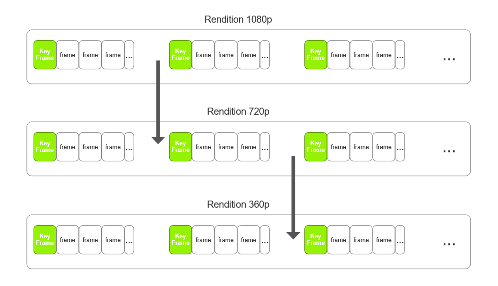

[Top level](../README.md)

# Switch Frame Appendix
## 1. Introduction [1]
In HTTP ABR (adaptive bitrate) streaming, there will be multiple renditions
generated at different bit rate after the encode of a source video to meet
various network status. Each rendition is cut into multiple segments each
starts with a key frame. As the switch of rendition can only happens at the
position of a key frame, there will be a latency of quite a few seconds caused
by the decode of current segment before reaching the next key frame. <br> To
shorten the latency, a possible solution is to insert more key frames into
renditions as to shorten the length of a segment. However, this will inevitably
increase the bits as key frames call for more to encode. Or, an obvious drop of
video quality will happen when the original bitrates is managed to be kept.



To solve this issue, a new type of frame is introduced as Switch Frame(s-frame)
in AV1. Unlike key frame, s-frame requires fewer bits to encode and is more
affordable to be inserted into the segments. It can act like a key frame to
further divide the segments to smaller pieces at a low cost. The spread of
s-frames will shorten the latency to around 1 second or even 0.25 second (when
set the mini GOP size of a 30fps video source to 8).


## 2. Implementation
According to the AV1 spec, the following requirements must be satisfied and so
corresponding changes are made in SVT-AV1 encoder to support s-frame feature.

### At the sequence level
  - max_frame_width and max_frame_height (refer to the AV1 spec 5.5.1.) written in sequence header must be equal to or larger than the dimensions of the largest rendition to be used in the sequence.
Two command line options are added to the encoder to allow user to set these two parameters, they are ‘--forced-max-frame-width’ and ‘--forced-max-frame-height’.
  - frame_width_bits_minus_1 and frame_height_bits_minus_1 (refer to the AV1 spec 5.5.1.) must be equal across all renditions.
SVT-AV1 encoder derives the values of these two parameters from max_frame_width and max_frame_height.
  - All renditions have identical mini GOP size.
In the high level (API), encoder will disable adaptive mini GOP size to ensure aligned mini GOP between all renditions when s-frame feature is on.
  - All renditions have identical super block size.
Super block size is fixed to 64 when s-frame feature is on.

### At the frame level
  - Decide which frames to be made into s-frames.<br>
This is done in the Picture Decision process. For every sframe-dist frames
(controlled by command line option --sframe-dist), the encoder will decide
whether to make the frame into an s-frame. There are two modes to make the
decision (controlled by command line option --sframe-mode):
    * Mode 1. Strict mode<br>
The considered frame will be made into an s-frame only if it is a base layer
inter frame. This mode is supposed to be used for debugging purposes only since
the s-frame interval could be much larger than expected, E.g. Setting s-frame
interval to 30, while mini GOP size is set to 16.
    * Mode 2. Nearest mode<br>
The considered frame will be made into an s-frame if it is a base layer inter
frame. If it’s not, the next base layer inter frame will be made into an
s-frame. This is the default mode.

  - Set s-frame’s refresh_frame_flags to ‘allFrames’. All frames after an s-frame don’t use any reference frame before the s-frame.<br>
This is done in the Picture Decision process. After a frame is decided to be
made into an s-frame, its dependent lists will be updated to ensure frames
after it will not use reference frames before it.

  - Set error resilient flag in s-frames.<br>
This flag is set in the Picture Decision process.

  - Set s-frame’s primary_ref_frame to PRIMARY_REF_NONE.<br>
The parameter is set in the Picture Manager process.

  - Disable reference frame MVs in s-frames.<br>
This parameter is set in the Mode Decision Configuration process. When
reference frame MVs are enabled globally, the encoder will set the feature off
for s-frames.

  - Send reference frame order hints with s-frames. Refer to the AV1 spec 5.9.2.<br>
The hints are updated in the Picture Decision process and written to bitstream
in the Entropy Coding process.

## 3. Usage
In the example below three different resolutions of a video sequence are
encoded with the switch frame feature on. Keyframe interval is set to 150,
s-frame interval is set to 32, prediction structure is set to low delay
(--pred-struct 1), and mini GOP size is set to 8 (--hierarchical-levels 3).

##### Generate a rendition in 1080p
```./SvtAv1EncApp --preset 8 --sframe-dist 32 --sframe-mode 2 --pred-struct 1 --hierarchical-levels 3 --forced-max-frame-width 1920 --forced-max-frame-height 1080 -q 32 --rc 0 --keyint 150 -i dota2_1080p60_600f.y4m -b dota2_1080p60_600f.ivf```

##### Generate a rendition in 720p
```./SvtAv1EncApp --preset 8 --sframe-dist 32 --sframe-mode 2 --pred-struct 1 --hierarchical-levels 3 --forced-max-frame-width 1920 --forced-max-frame-height 1080 -q 32 --rc 0 --keyint 150 -i dota2_720p60_600f.y4m -b dota2_720p60_600f.ivf```

##### Generate a rendition in 360p
```./SvtAv1EncApp --preset 8 --sframe-dist 32 --sframe-mode 2 --pred-struct 1 --hierarchical-levels 3 --forced-max-frame-width 1920 --forced-max-frame-height 1080 -q 32 --rc 0 --keyint 150 -i dota2_360p60_600f.y4m -b dota2_360p60_600f.ivf```
<br><br>
There are a few parameters from the above commands that are important to make renditions ‘switchable’ -- an AV1-spec-compliant decoder can decode sub-segments starting with s-frames from multiple independently-encoded renditions:

  - --sframe-dist<br>
    S-frame interval. All renditions must have identical value.

  - --sframe-mode<br>
    S-frame insertion mode. All renditions must have identical value.

  - --pred-struct<br>
    Set prediction structure type. S-frame feature only supports low delay. All
    renditions must have identical value to align s-frames reference frame
    lists between renditions.

  - --hierarchical-levels<br>
    Set hierarchical levels. All renditions must have identical value to align
    mini GOP size between renditions. Available values are 3, 4 and 5;
    correspond to mini GOP size 8, 16 and 32 respectively.

  - --forced-max-frame-width and --forced-max-frame-height<br>
    Should be set to larger than or equal to the dimensions of the largest
    rendition to be used in the sequence.

  - --keyint<br>
    Set keyframe interval. All renditions must have identical value to align keyframes.

  - Switch between renditions<br>
    According to the AV1 spec chapter “7.11.3.3. Motion vector scaling
    process”, it is a requirement of bitstream conformance that all the
    following conditions are satisfied:<br>
    - 2 * FrameWidth >= RefUpscaledWidth[ refIdx ]<br>
    - 2 * FrameHeight >= RefFrameHeight[ refIdx ]<br>
    - FrameWidth <= 16 * RefUpscaledWidth[ refIdx ]<br>
    - FrameHeight <= 16 * RefFrameHeight[ refIdx ]<br>
    So when switching, dest_resolution / source_resolution must be between 1/2 and 16.

##### Stitch renditions
The above three renditions can be stitched together to simulate the ABR player
behavior mentioned in the introduction section. This requires an ivf parser to
extract frame type and stitch renditions at s-frames. There are players have
already supported such stitched bitstream, such as mpv player, FFmpeg and
Chrome, etc.

## Notes
The feature settings that are described in this document were compiled at
v1.7.0 of the code and may not reflect the current status of the code. The
description in this document represents an example showing how features would
interact with the SVT architecture. For the most up-to-date settings, it's
recommended to review the section of the code implementing this feature.

## References
[1] Tarek Amara (Twitch) - “S-Frame in AV1: Enabling better compression for low latency live streaming”. Presented in the Demuxed 2017.([Video link](https://www.youtube.com/watch?v=o5sJX6VA34o&list=PLkyaYNWEKcOfntbMd6KtHhF7qpL9hj6of&index=3&ab_channel=Demuxed))<br>
[2] AV1 Bitstream & Decoding Process Specification v1.0.0
