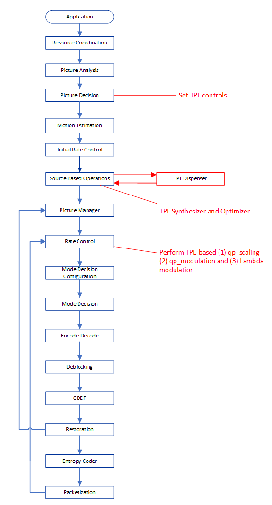
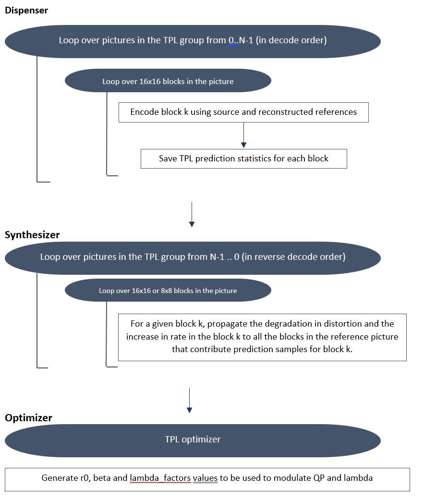
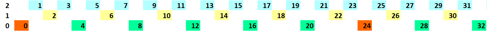
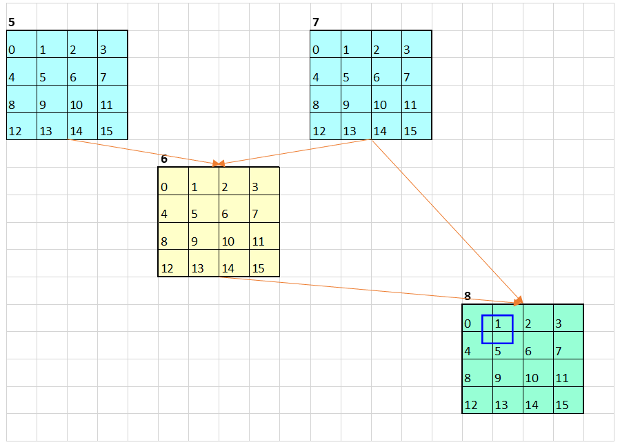

[Top level](../README.md)

# Temporal Dependency Model

## 1. Description of the algorithm

### 1.1 Introduction

The Temporal Dependency Model (TPL) algorithm represents an extension of the
mb_tree algorithm from the x264 encoder. The main purpose of the algorithm is
optimize the encoder settings to reduce the impact reference pictures have on
the degradation in quality/rate in the pictures that reference them directly or
indirectly. In the case of the algorithm presented in this document, the focus
is on reducing the impact of base layer pictures on such degradations. The
algorithm involves two main steps. In the first step, encoding is performed
using an elementary encoder to collect prediction information. The second step
involves using the collected prediction information to optimize the encoder
settings that would be used in the final encoding of the input pictures. The
affected encoder settings include QPS, QPM and the lambda parameter considered
in the RD cost calculations.

### 1.2 High Level Idea

The following concepts are introduced to define the high level operation of the TPL algorithm:

- Degradation measure: This measure would concern both the distortion and the rate variables.
  The degradation is based on the difference between the distortion and rate
  that result from considering source samples as reference samples and similar
  quantities when considering reconstructed samples as reference samples. There
  is an underlying assumption in the development of the algorithm that the
  recon distortion and rate are worse than those based on source samples.

- TPL group of pictures: This represents the largest set of pictures that would be considered
  in collecting prediction data in the first step of the algorithm. The actual
  set of pictures used in the TPL algorithm could, for optimization purposes,
  be a subset of TPL group of pictures.

The main idea of the TPL algorithm is to backpropagate the prediction
degradation information back to the base layer pictures. Therefore, the
accumulation of the backpropagated degradation information is performed by
considering the pictures in the TPL group in reverse of the decode order, i.e.
the last decoded picture is processed first, then the next to last picture… It
should be noted that the prediction for a given block typically involves
samples from multiple contiguous blocks in the reference picture. Therefore,
the degradation measure is backpropagated from a given block to the blocks in
the reference picture that contribute corresponding prediction samples in
proportion to the following:

- The ratio of the (recon-based distortion – source-based distortion)/(recon-based distortion)

- The overlap area of the prediction block with each of the blocks contributing prediction samples in the reference picture.

A given reference picture would collect such backpropagated information from
all pictures that use it as a reference picture. The cycle is then repeated
again when the same operations are considered for all pictures that act as
references to the reference picture that was just considered above. The process
continues until all the degradation information is accumulated in the base
layer pictures. The accumulated degradation information is then used to adjust
encoder parameters for the final encoding of the pictures.

## 2. Implementation of the algorithm

### 2.1 TPL inputs/outputs

*Input to Source-Based Operations*: Source Input pictures.

*Outputs of Source-Based Operations*: Analysis data to adjust QP and lambda.

### 2.2 TPL API

Table 1 below lists the main invoked functions when TPL is enabled.
The process where each function is called is also indicated as well as a brief description of each function.

#### Table 1: TPL API

| **Process** | **Function** | **Purpose** |
| --- | --- | --- |
| Picture Decision Process | set_tpl_extended_controls | Set TPL controls |
| Source Based Operations Process | tpl_mc_flow_dispenser | Perform TPL encoding and collects prediction data |
| EbSourceBasedOperationsProcess | tpl_mc_flow_synthesizer | Collect the data generated by the dispenser over all tpl groups |
| Source Based Operations Process | generate_r0beta (TPL Optimizer) | Generate the r0, beta, and lambda factors to be used in the qp_scaling, qp and lambda modulation functions |
| Rate Control Process | cqp_qindex_calc_tpl_la | Determine the picture qindex based on the tpl information for the case of rate control OFF |
| Rate Control Process | process_tpl_stats_frame_kf_gfu_boost | Determine the picture qindex based on the tpl information for the case of rate control ON |
| Rate Control Process | sb_qp_derivation_tpl_la | Determine the qindex and lambda factor for each super-block within a picture |

### 2.3 Details of the implementation

The TPL feature data flow is summarized in the diagram shown in Figure 1.



##### Figure 1. TPL data flow in the encoder pipeline.

### TPL Flow/Operations

The TPL algorithm consists of three main components: A dispenser, a synthesizer
and an optimizer. A high-level diagram of the algorithm is shown in the figure
below. The functions of the three components are briefly summarized in the
following.

As illustrated in Figure 2 below, the TPL algorithm consists, for each base
picture, of two picture-based loops:



##### Figure 2. High-level diagram of the TPL feature.


### TPL dispenser

For a given TPL group of pictures, the function of the dispenser is to encode
the pictures in the TPL group using a very simple encoder and collect
prediction data. Pictures in the TPL group are divided into 16x16 blocks. The
encoding of the blocks is performed using both source-based references and
reconstructed references. The details of the operation of the dispenser are
outlined in Appendix B. For each 16x16 block, the output of the dispenser
consists of the following variables associated with the best prediction mode
for the block, which could be either an intra or an inter mode:

- srcrf_dist: Distortion based on the source samples.
- recrf_dist: Distortion based on the reconstructed samples.
- srcrf_rate: Rate estimate for the case of source-based prediction.
- recrf_rate: Rate estimate for the case prediction based on reconstructed samples.
- mv: Best motion vector.
- ref_frame_poc: Picture number of the best reference picture

The TPL Dispenser performs the processing on a 16x16 block or 32x32 block or
64x64 block basis. The resulting distortion and rate data listed above is then
normalized (on a 4x4 block basis) and stored on the used block size basis.

Implementation notes:

- When the best prediction mode is an intra mode, then srcrf_dist ← recrf_dist. This would imply that (recrf_dist - srcrf_dist) = 0.
  It follows that the intra coded blocks would not have any impact on the computation of mc_dep_dist in the synthesizer. Similarly,
  srcrf_rate ← recrf_rate, i.e. recrf_rate - srcrf_rate = 0, and the intra coded blocks would not to have any impact on the computation of mc_dep_rate
  in the synthesizer.

- When the best prediction mode is inter, then recrf_dist ← max(recrf_dist, srcrf_dist). Therefore, recrf_dist ← srcrf_dist when recrf_dist < srcrf_dist.
  It follows that (recrf_dist - srcrf_dist) = 0 and such inter blocks would not have any impact on the computation of mc_dep_dist in the synthesizer.
  Similarly, when recrf_rate < srcrf_rate, then recrf_rate ← srcrf_rate, (recrf_rate – srcrf_rate) = 0 and such inter blocks would not have any impact on
  the computation of mc_dep_rate in the synthesizer.

- It follows from the above that the only blocks that would have any impact on the computation of mc_dep_dist in the synthesizer are inter blocks where
  recrf_dist > srcrf_dist. Similarly, the only blocks that would have any impact on the computation of mc_dep_rate in the synthesizer are inter blocks where
  recrf_rate > srcrf_rate.


### TPL Synthesizer

The main function of the synthesizer is to compute for each block in the TPL
group of pictures two quantities:

mc_dep_dist: For a given block, this quantity represents the total contribution
of the block to the degradation in quality (i.e. distortion) in the blocks
whose predictions are either directly or indirectly (through a chain or
references) affected by the quality of the current block.

mc_dep_rate: For a given block, this quantity represents the total contribution
of the block to the increase in rate in the blocks that use the current block
as a direct reference or indirect reference (through a chain or references).

The computations are performed using the prediction information provided by the
dispenser. The main output of the synthesizer are the mc_dep_dist and
mc_dep_rate quantities for the blocks in the base layer picture of interest in
the TPL group. The processing in the Synthesizer is performed on a 16x16 block
or 8x8 block basis.

### TPL Optimizer

The main function of the optimizer is to adjust if necessary the quality of the
base layer picture of interest in the TPL group to minimize the impact that
picture has on other pictures in the TPL group that use it either directly or
indirectly as a reference. The TPL optimizer makes use of the mc_dep_dist,
mc_dep_rate and dispenser prediction data for blocks in the base layer picture
of interest in the TPL group to derive adjustment factors in a number of
encoder setting for the base layer pictures. The adjustment factors are
referred to as r0, beta and lambda factor and are associated mainly with QPS,
QP modulation and Lambda adjustments, respectively.

### Generation of r0, beta and tpl_rdmult_scaling_factors

The TPL synthesizer generates for each block in each TPL group of pictures
values for the distortion propagation variable (mc_dep_dist) and the rate
propagation variable (mc_dep_rate). These two variables are then used to
generate adjustment parameters for a number of encoder settings for base layer
pictures, including QP scaling, QP modulation for the individual blocks and
lambda parameter used in cost calculation.

- r0: A frame-based parameter used to introduce adjustments in QPS. Define the following variables :
    - mc_dep_delta: Represents the RD cost associated with a given 16x16 or 8x8 block based on the corresponding distortion mc_dep_dist and corresponding rate mc_dep_rate.
    - intra_cost_base: Represents an accumulation over the whole frame of recrf_dist for all (16x16 or 8x8) blocks in the frame.
    - mc_dep_cost_base: Represents an accumulation over the whole frame of (recrf_dist + mc_dep_delta) for all (16x16 or 8x8) blocks in the frame.

The r0 value for the base layer picture is given by:
$`r0= intra\_cost\_base / mc\_dep\_cost\_base`$
or

$`r0 =
\frac{(\sum_{blocks\_in\_frame}recrf\_dist)}{(\sum_{blocks\_in\_frame}recrf\_dist)+(\sum_{blocks\_in\_frame}mc\_dep\_delta)}`$

Based on the definitions above, $`r0`$ takes value between `0` and `1`. A large $`r0`$ value implies $`\sum_{blocks\_in\_frame}mc\_dep\_delta)`$ is small and that the
base layer picture is of good quality and is not contributing much to the
degradation in quality in the pictures they use it as a reference.
Consequently, such picture may not need any adjustment in QP. On the other
hand, small $`r0`$ values imply $`\sum_{blocks\_in\_frame}mc\_dep\_delta)`$ is large
and that the base layer picture is contributing significantly to the
degradation in quality in the pictures that use it directly or indirectly as a
reference. Consequently, such picture may need to have its QP reduced.

- beta: The beta parameter is used to adjust the QP per superblock. For the SB
  of interest in the base layer picture, beta is determined by performing the
  same computations performed above for $`r0`$ but restricted only to the SB of
  interest. An SB-based parameter $`rk`$ is then computed as follows:
  ```math
  rk = intra\_cost\_base / mc\_dep\_cost\_base
  ```

  The parameter beta for the SB is defined as:
  ```math
  beta = r0/rk
  ```
  Beta is a measure of how much better or worse $`rk`$ is as compared to $`r0`$. For
  beta >> 1, $`rk`$ is much smaller as compared to $`r0`$, implying that the
  corresponding SB is of low quality as compared to the average quality of the
  frame, and would need a significant QP adjustment. For beta <<1, $`rk`$ is much
  larger than $`r0`$, implying that the corresponding SB is of good quality as
  compared to the average quality of the picture and may not need much in terms
  of QP adjustment or could have its QP increased.

- tpl_rdmult_scaling_factors: The tpl_rdmult_scaling_factors is computed on a 16x16 block basis, regardless of the picture resolution. For each 16x16 block,
  calculations similar to those performed for beta are performed for the 16x16 block. The corresponding tpl_rdmult_scaling_factors is given by:
  ```math
  tpl\_rdmult\_scaling\_factors = rk/r0 + c, c = 1.2
  ```
  tpl_rdmult_scaling_factors >= c, where values close to c imply that $`rk/r0`$ is small and that the block is of worse quality as compared to the average frame
  quality and that there would be more emphasis on distortion for such blocks. Large values of tpl_rdmult_scaling_factors imply that the block has better
  quality as compared to the average frame quality and that more emphasis would be placed on rate in that case.


### QP-Scaling Algorithm

Ordinary QP scaling is used to improve the performance of a hierarchical
prediction structure where lower quantization parameters (QP) are assigned to
frames in the lower temporal layers, which serve as reference pictures for the
higher temporal layer pictures. In the TPL algorithm, the propagation factor r0
is used to improve the base layer picture QP assignment. The main idea is that
the lower $`r0`$ is the more improvements the picture would need.

The picture qindex in CRF mode is computed (in the cqp_qindex_calc_tpl_la()
function) following different methods depending on the picture type, namely
Intra, BASE, REF-NON-BASE and NON-REF. Pictures in the top-layer of the
mini-GOP structure are treated as NON-REF pictures for the QP-scaling algorithm.
A summary of the QPS adjustment ideas is presented below.. In the following,
qindex is 4xQP for most of the QP values and represents the quantization parameter
the encoder works with internally instead of QP. The later is just an input parameter.

- Intra pictures: The qindex for both Intra Key Frames (IDR) and non-Key frames (CRA) is generated using similar approaches with slightly different tuning.
  A lower qindex is assigned to the pictures with small $`r0`$ values. The main idea behind the adjustment of the qindex for a given picture is as follows:

  - Compute qstep_ratio based on the $`r0`$ for the picture, where qstep_ratio is proportional to the square root of $`r0`$.

  - The target quantization step is calculated using the input qindex and the qtep_ratio.

  - The qindex with the closest quantization step to the target is chosen as the qindex of the picture.

- Inter pictures

  - Base layer pictures: The idea for base layer pictures is similar to that described above for intra pictures, except that the qstep_ratio weight is different.

  - Reference non-base-layer pictures: The tpl data is not used in this case. The picture is initially assigned the qindex of one of the two reference index 0 pictures from lists 0 and 1.
    The farther the distance between the reference index 0 pictures and the current picture, the more the qindex is further adjusted towards its original value.

  - Non-reference pictures and top-layer pictures: The qindex is simply set to the input qindex.

### SB-based QP-Modulation Algorithm

In TPL, the parameter beta plays the same role at the SB level as that of r0 at
the picture level. Therefore, a large beta for a given SB implies that quality
of that SB should be improved. For each SB, the main idea in QP modulation is
that a new QP value is determined based on the corresponding beta value using
the following equation:

$`QP' = \frac{QP}{f(beta)}`$

where $`f = sqrt(.)`$ for intra_picture or when $`beta < 1`$, and $`f=sqrt(sqrt(.))`$ otherwise. The idea then behind the TPL QP modulation is as follows:

- If $`beta > 1 \rightarrow rk<r0 \rightarrow`$ SB does not have a good quality as compared to average picture quality $`\rightarrow`$ Reduce QP for the SB, e.g. $`QP’=QP/sqrt(beta)`$ or $`QP’=QP/sqrt(sqrt(beta))`$. Since $`beta > 1, QP’<QP`$.

- If $`beta < 1 \rightarrow rk>r0 \rightarrow`$ SB has better quality than average picture quality $`\rightarrow`$ Can increase the `QP` for the SB, e.g. $`QP’=QP/sqrt(beta)`$. `QP’` would then be larger than `QP` since $`beta <1`$.

For the case of $`beta > 1`$, QP modulation for intra pictures and inter pictures is given by $`QP’=QP/sqrt(beta)`$ and $`QP’=QP/sqrt(sqrt(beta))`$, respectively.
This implies that for a given beta value, the resulting `QP’` for intra picture SB is smaller as compared to that for and inter picture SB,
i.e. better quality for the intra picture SB. When $`beta < 1, QP’=QP/sqrt(beta)`$ in both intra and inter pictures.

### SB-based Lambda Modulation Algorithm

- Update the tpl_rdmult_scaling_factors for the 16x16 blocks in a given SB

  $`tpl\_sb\_rdmult\_scaling\_factors = (\frac{new\_rdmult}{orig\_rdmult})*(\frac{tpl\_rdmult\_scaling\_factors}{geom\_mean\_tpl\_rdmult\_scaling\_factors})`$

  where
  - $`geom\_mean\_tpl\_rdmult\_scaling\_factors`$: Geometric mean of the $`tpl\_sb\_rdmult\_scaling\_factors`$ values for the 16x16 blocks within the SB.
  - $`orig\_rdmult`$: Lambda corresponding to the original frame qindex.
  - $`new\_rdmult`$: Lambda corresponding to the modified SB qindex.

  The above scaling factor is then the original lambda scaling factor
  $`(\frac{new\_rdmult}{orig\_rdmult})`$ modified using the factor
  $`(\frac{tpl\_rdmult\_scaling\_factors}{geom\_mean\_tpl\_rdmult\_scaling\_factors})`$.
  The latter represents the relative size of the original
  $`tpl\_sb\_rdmult\_scaling\_factors`$ for a 16x16
  block as compared to the geometric mean for that variable over the SB.

- Compute the rdmult corresponding to a given block in the SB
  - `geom_mean_of_scale`:
    - For blocks that are 16x16 or larger in size : Geometric mean of the tpl_sb_rdmult_scaling_factors values for the 16x16 blocks within the given block (for block that are 16x16 or larger in size),
    - For block sizes smaller than 16x16: The tpl_sb_rdmult_scaling_factors values for the 16x16 block to which belongs the block.
  - `new_full_lambda`: The updated lambda value for a given block.
    ```math
    new\_full\_lambda = pic\_full\_lambda * geom\_mean\_of\_scale + 0.5
    ```
    where `pic_full_lambda` is the original lambda value based on the picture qindex.

## 3. Optimization of the algorithm

Different quality-complexity trade offs of the TPL algorithm can be achieved by
considering different settings for the flag tpl_level. The latter controls a
set of parameters that are grouped under set_tpl_extended_controls () function.
Table 2 describes the functionality of each of the TPL control parameters.

#### Table 2: Control and optimization flags associated with TPL.

| **Flag** | **Level** | **Description** |
| --- | --- | --- |
| enable_tpl_la | Config parameter | enable/disable TPL |
| tpl_opt_flag | Picture | 0: Optimisation off, 1: Disable the rate term and use only DC in the TPL dispenser |
| enable_tpl_qps | Picture | 0: disable qp_scaling in the TPL dispenser, 1: enable qp_scaling in the TPL dispenser |
| disable_intra_pred_nref | Picture | Disable intra prediction in non-reference pictures |
| disable_intra_pred_nbase | Picture | Disable intra prediction in non-base pictures |
| disable_tpl_nref | Picture | Disable TPL for non-reference pictures in the tpl-group |
| disable_tpl_pic_dist | Picture | Disable the processing of a tpl group picture based on its distance from the base layer picture |
| get_best_ref | Picture | Perform a fast pruning of the reference and select the best reference to be used in the tpl inter search |
| pf_shape | Picture | To specify the partial frequency shape to be used in the Transfor/Quantization in the tpl Dispenser |
| use_pred_sad_in_intra_search | Picture | Use SAD as distortion measure in the intra search |
| use_pred_sad_in_inter_search | Picture | Use SAD as distortion measure in the inter search |
| reduced_tpl_group | Picture | Reduce the number of considered pictures in the tpl group |
| skip_rdoq_uv_qp_based_th | Picture | Bypass rate-distortion optimized quantization of the chroma component in the coding loop based on the TPL statistics |
| r0_adjust_factor | Picture | A factor to adjust the computed r0 factor to generate the final picture qindex in qp scaling |
| modulate_depth_removal_level | Picture | Modulate depth_removal level based on the qp_offset band |
| dispenser_search_level | Picture | Define the block granularity of the dispenser search. 0: 16x16, 1: 32x32, 2: 64x64 |
| subsample_tx | Picture | 0: OFF, use full TX size; 1: subsample the transforms in TPL by 2; 2: subsample the transforms in TPL by 4 |
| 8 synth_blk_size | Picture | Define the block granularity of the synthesizer search. 0: 8x8, 1: 16x16 |
| vq_adjust_lambda_sb | Picture | Adjust lambda based on the delta PQ between the generated QP of the sb and the picture QP 0: OFF, 1: ON |
| qstep_based_q_calc | Picture | Calculate the qindex based on r0 using qstep calculation 0: OFF, 1: ON |
| subpel_depth | Picture | Max subpel depth to search for TPL; FULL_PEL corresponds to subpel off in TPL, QUARTER_PEL is the max precision for TPL subpel |

## Notes

The feature settings that are described in this document were compiled at
v1.1.0 of the code and may not reflect the current status of the code. The
description in this document represents an example showing how features would
interact with the SVT architecture. For the most up-to-date settings, it's
recommended to review the section of the code implementing this feature.


## Appendix A: TPL Group

The TPL group is a collection of N pictures (stored in decode order) that
limits the domain of analysis and application of the TPL algorithm.

The composition of the TPL group depends on the base layer picture of interest.
To illustrate the construction of the TPL group, the case of a three-layer
prediction structure shown below is considered.



- Case of lad_mg = 0:
  - IDR (Delayed intra):
    - TPL group: IDR picture and the following mini-GoP, including the next base layer B picture.
    - Example: IDR picture 0 → TPL group: 0,4,2,1,3.
  - B picture:
    - TPL group: B picture plus preceding pictures in the mini-GoP.
    - Example: B picture 8 → TPL group: 8,6,5,7.
  - CRA picture aligned on the mini-GoP:
    - TPL group: Same as in the case of B picture.
    - Example: CRA picture 24 → TPL group: 24,22,21,23
  - CRA not aligned with mini-GoP:
    - TPL group: Same as in the case of an IDR (delayed intra) picture.

- Case of lad_mg = n>0:
  - IDR (Delayed intra):
    - TPL group: IDR picture and the following (n+1) mini-GoPs, including the next (n+1) base layer B pictures.
    - Example: mg-lad = 1, IDR picture 0 → TPL group: 0,4,2,1,3,8,6,5,7.
  - B picture:
    - TPL group: B picture plus n min-GoPs, including the next n base-layer pictures.
    - Example: mg-lad = 1, B picture 8 → TPL group: 8,6,5,7,12,10,9,11.
  - CRA picture aligned on the mini-GoP:
    - TPL group: Same as in the case of B picture.
    - Example: mg-lad = 1, CRA picture 24 → TPL group: 24,22,21,23,28,26, 25,27
  - CRA not aligned with mini-GoP:
    - TPL group: Same as in the case of an IDR (delayed intra) picture.


## Appendix B: Dispenser Operations

For a given TPL group of pictures, the dispenser operates as follows:

- For each picture in the TPL group (from picture 0 to picture N-1 considered in decode order):
  - For each 64x64 super-block in the picture
    - For each 16x16 block in the super-block
      1. Source based operations
         - Perform intra search using source samples as reference samples.

           For each of the considered intra prediction modes (Currently on the DC prediction mode is considered)

           - Perform intra prediction and compute prediction residuals (RESIDUAL = SRC – PRED)

             Apply WH transform to the residuals and compute INTRA_COST_SRC = SATD(transform coefficients)

             Select the best intra mode based on INTRA_COST_SRC. Note that the INTRA_COST_SRC information itself is not stored

         - For each of the single-ref ME candidates generated using source references:

           Perform a subpel search to refine the ME candidate

           Perform motion compensation and compute residual RESIDUAL = SRC – PRED.

           Apply the DCT_DCT transform to the Residuals and compute INTER_COST_SRC = SATD ( transformed Residual)

           Get the best inter mode candidate, store MV, reference index and best INTER_COST_SRC.

      2. Mode Decision: Select the best between INTRA_COST_SRC and INTER_COST_SRC
         ```
         SRC_COST = MIN(INTRA_COST_SRC and INTER_COST_SRC)
         ```
      3. If the best selected mode is NEWMV
         - If steps 1 and 2 above are based on considering the subsampled residuals, then compute the full residuals.

         - Compute the distortion recon_error which is the sum of the squared differences between the original transform coefficients and their inverse quantized version. Also compute the rate_cost associated with the coefficients.

         - Make the following assignments:
            - srcrf_dist ← recon_error
            - srcrf_rate ← rate_cost

      4. Using the selected best prediction mode, encode the block using reconstructed samples as references.
         - Generate the prediction using reconstructed samples and compute the residuals.
         - Process the residuals through the WH transform, quantization, inverse quantization and inverse transform.
         - Compute the distortion recon_error and the rate_cost, as in step 3.2 above.
         - Generate the block reconstruction and store the reconstructed data to be used for subsequent frames in the dispenser loop.
         - Make the following assignments:
            - recrf_dist ← recon_error
            - recrf_rate ← rate_cost

      5. Store final TPL prediction data:
         - srcrf_dist: Distortion based on the source samples.
         - recrf_dist: Distortion based on the reconstructed samples.
         - srcrf_rate: Estimate rate based on the source samples.
         - recrf_rate: Estimate rate based on the reconstructed samples.
         - mv: Best motion vector.
         - ref_frame_poc: Picture number of the best reference picture

      6. Further manipulation of the stored TPL data in preparation of the synthesizer operations leads to the following distortion and rate data that is stored for the intra and inter candidates:
         |**Variable**|**Intra Candidate**|**Inter Candidate**|
         | --- | --- | --- |
         | srcrf_dist | Same as recrf_dist | Unchanged |
         | recrf_dist | Unchanged | max(recrf_dist, srcrf_dist) |
         | srcrf_rate | Same as recrf_rate | Unchanged |
         | recrf_rate | Unchanged | max(recrf_rate, srcrf_rate) |

## Appendix C: Example of Synthesizer Operations

To illustrate the operations of the Synthesizer, consider the case of a three
layer prediction structure and assume lad_mg = 0 and the TPL group size is 4.
As an example, assume picture 8 is being processed by the TPL algorithm and
that the Dispenser has completed its operations for the pictures prior to and
including picture 8. The corresponding TPL group consists of pictures 8, 6, 5
and 7, listed in decode order. At the Synthesizer, the pictures are processed
in reverse decode order: 7,5,6,8.


To illustrate the Synthesizer operations, it is assumed the picture size is
64x64. The TPL group associated with picture 8 is show below, where each
picture is split into 16x16 blocks (in the code the block size would be set to
8x8 since the considered resolution <720p. the 16x16 block size is used here
for illustration purposes). The blocks are indexed in raster scan order from 0
to 15 in each picture. A block is identified using the pair (i,j), where i is
the picture number and j is the block index in picture i.



The list of references to be considered for each picture is given in the table below.

|**Picture**|**References**|
| --- | --- |
| 7 | 6 and 8 |
| 5 | 6 |
| 6 | 8 |

The operations of the synthesizer relies on distortion and rate related
quantities. Let Bc denote the index for the current block in the current
picture Pc for which predictions samples are obtained from block Br in
reference picture Pr. The three distortion related quantities needed in the
Synthesizer are:

- Distortion ratio DistRatio: For a given 16x16/8x8 block to be encoded,
  let recrf_dist and srcrf_dist denote the recon-based and source-based
  prediction distortions, respectively. Then
  ```
  DistRatio(Pc,Bc) = (recrf_dist(Pc,Bc) - srcrf_dist(Pc,Bc)) / recrf_dist(Pc,Bc)
  ```
  srcrf_dist could be assumed to be the smallest distortion we could have.
  Therefore (recrf_dist - srcrf_dist) is a measure how much worse the
  recon-based prediction is as compared to the source based prediction. When
  DistRatio is close to zero (i.e. recrf_dist is very close to srcrf_dist), the
  recon based prediction is considered to be very accurate and would not need
  to be improved. On the other hand, when DistRatio is close to 1, it implies
  the recon based prediction is very inaccurate and should be improved.

  Note: For intra coded blocks, srcrf_dist was set at the Dispenser to be equal
  to recrf_dist. It follows that recrf_dist - srcrf_dist = 0 and DistRatio for
  intra coded blocks is zero. Similarly, for inter coded blocks where
  recrf_dist < srcrf_dist in the dispenser, srcrf_dist was set in the Dispenser
  to be equal to recrf_dist resulting in DistRatio = 0.

- Area ratio AreaRatio: For a given 16x16/8x8 block to be encoded, the
  corresponding prediction in the reference picture could involve samples from
  up to four contiguous blocks, as in the case of the blue block in the picture
  above. Each of the up to four blocks in the reference picture contributing
  prediction samples has associated with it an area ratio defined as
  ```
  AreaRatio = overlap_area / number_of_samples_in_block
  ```
  where the overlap_area is the overlap between the block in the reference
  picture and the prediction block.

- Motion-compensation-dependent Distortion mc_dep_dist: For each 16x16/8x8
  block in any given reference picture, mc_dep_dist is a measure of the quality of
  the predictions generated based on that block. The mc_dep_dist variable for a
  given block Br in a reference picture Pr is computed based on:
  - mc_dep_dist(Pc,Bc) for the block Bc that uses prediction samples from the block Br in the reference picture Pr. mc_dep_dist(Pc,Bc) is set to zero for all blocks in non-reference pictures.
  - The difference (recrf_dist(Pc,Bc) - srcrf_dist(Pc,Bc)) for the block Bc that uses prediction samples from the block Br in the reference picture Pr.

  In general:
  ```
  mc_dep_dist(Pr,Br) += ((recrf_dist(Pc,Bc) - srcrf_dist(Pc,Bc)) +
                                               (mc_dep_dist(Pc,Bc) x DistRatio(Pc,Bc))) x AreaRatio(Pr,Br)
                                          += (recrf_dist(Pc,Bc) x DistRatio(Pc,Bc) +
                                               mc_dep_dist(Pc,Bc) x DistRatio(Pc,Bc)) x AreaRatio(Pr,Br)
                                          += (recrf_dist(Pc,Bc) + mc_dep_dist(Pc,Bc)) x DistRatio(Pc,Bc) x AreaRatio(Pr,Br)
  ```
  In a given TPL group, we are ultimately interested in the impact each of the
  16x16/8x8 blocks in the base layer picture has on the quality of predictions
  for the other pictures in the TPL group, whether the base layer picture is
  used as a direct reference or as indirect reference. Therefore, the
  backpropagation of mc_dep_dist is performed for all pictures in the TPL
  group, starting from the first picture in reverse decode order, to the base
  layer picture.

  The rate-related quantities are:

  - delta_rate: Let recrf_rate and srcrf_rate denote the rate associated with the recon-based and source-based prediction candidates, respectively. For the current block in the current picture Pc
    ```
    delta_rate(Pc,Bc) = recrf_rate(Pc,Bc) - srcrf_rate(Pc,Bc)
    ```
    As in the case of the distortion ratio, delta_rate is set to 0 for intra blocks and for blocks where recrf_rate < srcrf_rate.

  - Motion-compensated-dependent rate mc_dep_rate: As in the case of the distortion discussed above, for each 16x16/8x8 block in a given picture, mc_dep_rate
    is a measure of the rate impact associated with predictions generated based on that block. mc_dep_rate is generated for every block in every reference
    picture. The mc_dep_rate variable for a given block Br in a reference picture Pr is computed based on:
    - mc_dep_rate(Pc,Bc) for the block Bc that uses prediction samples from the block Br in the reference picture Pr. mc_dep_dist(Pc,Bc) is set to zero for all blocks in non-reference pictures.

      mc_dep_rate(Pr,Br) = delta_rate_cost(mc_dep_rate(Pr,Br), recrf_dist, srcrf_dist, number_of_samples_in_16x16_block)

    - The difference delta_rate(Pc,Bc) for the block Bc that uses prediction samples from the block Br in the reference picture Pr.

    In general,

    reference mc_dep_rate(Pr,Br) += (delta_rate(Pc,Bc) + mc_dep_rate(Pc,Bc)) * AreaRatio(Pr,Br)
    where AreaRatio is as defined above.

    The backpropagation of mc_dep_rate is performed for all pictures in the TPL group, starting with the first picture in reverse decode order, to the base layer picture.

The Synthesizer processes the pictures in the TPL group in reverse of the
decode order, so that the impact of the base layer picture on the other
pictures in the TPL group is evaluated through the chain of references starting
with the last picture to be decoded, the next to last picture to be decoded and
so on. To illustrate this process for the example presented above, consider the
reverse of the decode order of the pictures in the TPL group, which is 7, 5, 6
and 8.

- Start with picture 7.
  - For block (7,0), assume picture 8 instead of picture 6 is the reference picture, since only unipred candidates are considered:
    - DistRatio(7,0) = (recrf_dist(7,0) - srcrf_dist(7,0)) / recrf_dist(7,0)
    - mc_dep_dist(8,i) += (recrf_dist(7,0) + mc_dep_dist(7,0))* DistRatio(7,0)* AreaRatio(8,i), i=0, 1, 4, 5. In this case the blue block in the Figure above is assumed to represent the prediction block for block (7,0). The prediction block overlaps with blocks (8,0), (8,1), (8,4) and (8,5). It should be noted that mc_dep_dist(7,0) is set to zero since picture 7 is a non-reference picture.
    - delta_rate(7,0) = recrf_rate(7,0) - srcrf_rate(7,0)
    - mc_dep_rate(7,0) = delta_rate_cost(mc_dep_rate(7,0), recrf_dist(7,0), srcrf_dist(7,0), number_of_samples_in_16x16_block)
    - mc_dep_rate(8,i) += (delta_rate(7,0) + mc_dep_rate(7,0)) * AreaRatio(8,i), i=0, 1, 4, 5.
  - Repeat similar operations for blocks (7,i), i=1,…, 15. Depending on the block, the reference picture could be either picture 8 or picture 6.
- Repeat the above with picture 5 and consider reference picture 6
- Repeat the above with picture 6 and consider reference picture 8

At the end of the process, each of the sixteen 16x16 blocks in base layer
picture 8 will have associated with it an mc_dep_dist value and an mc_dep_rate
value. A high value of mc_dep_dist indicates the block is not contributing high
quality predictions for the pictures that reference it directly or indirectly
and that the quality of the block should be improved. The opposite is true when
mc_dep_dist is small. The same applies to mc_dep_rate.

## Appendix D: QP scaling based on r0

### 1. Case of Intra Pictures

Main idea: The smaller the r0 value, the more improvements the picture would need.
The square root of r0 is used to calculate a variable called qstep_ratio. Then, a
target DC quantization step is calculated using the input qindex and qstep_ratio.
The qindex corresponding to the target DC quantization step is chosen as the qindex
of the picture. The larger the r0 value is, the larger the resulting qindex for the
picture would be.

- Adjust r0: r0_adjust_factor is set in the TPL controls, and is based on the lookahead, mini-GOP structure, and size of the TPL group.  When a lookahead is used, the factor is set to 0 for Intra pictures, so the following scaling is not performed.
  ```
  r0 = r0 / (used_tpl_frame_num x r0_adjust_factor)
  ```
  Further adjustments in r0 are introduced to account for the prediction structure by dividing r0 by tpl_hl_islice_div_factor in the case of an I_SLICE,
  or by tpl_hl_base_frame_div_factor in the case of a base layer picture, where tpl_hl_islice_div_factor and tpl_hl_base_frame_div_factor are given in the
  table below.

  |**Hierarchical level**|**0**|**1**|**2**|**3**|**4**|**5**|
  | --- | --- | --- | --- | --- | --- | --- |
  |**tpl_hl_islice_div_factor**| 1 | 1 | 2 | 1 | 1 | 0.7 |
  |**tpl_hl_base_frame_div_factor**| 1 | 1 | 3 | 2 | 1 | 0.5 |

- qstep_ratio:
  ```
  qstep_ratio = sqrt(r0) x weight
  ```
  where the weight is set 0.7 for Intra pictures.

- target_qstep:
  ```
  target_qstep = DC qstep of the input qindex x qstep_ratio
  ```

- active_best_quality: Represents the adjusted qindex value for the picture and is set to the qindex with the closest dc qstep to the target_qstep.

### 2. Case of Inter Pictures

- Adjust r0: r0_adjust_factor is set in the TPL controls, and is based on the lookahead, mini-GOP structure, and size of the TPL group.

  ```
  r0 = r0 / (used_tpl_frame_num x r0_adjust_factor)
  ```

*Case of base layer pictures*

- The Qindex computation is the same as the Intra picture case, except that the weight used in calculation of qstep_ratio is set to 0.9 for the base layer pictures

*Case of non-base-layer reference pictures*

- Main idea: Assign a reference qindex to the current picture, then adjust the
- assigned qindex value closer to the original qindex of the picture depending
  on the temporal layer difference between the current picture and it
  references. The farther the references are from the current picture in terms
  of temporal layer distance, the smaller the difference between the adjusted
  qindex value and the input qindex value for the picture, i.e. the adjusted
  value is moved farther away from the reference qindex value and closer to the
  input qindex value.

- Define:
  ```
  active_best_quality = max ((QP for index 0 ref. picture from list 0)*4 + 2, (QP for index 0 ref. picture from list 1)*4 + 2)
  ```

- Let TLI denote the temporal layer index. Define:

  TLI_ref = max (TLI for index 0 ref. picture from list 0, TLI for index 0 ref. picture from list 1)

  ```
  TLI_delta = TLI for current picture – TLI_ref.
  ```

- For the case where rf_level = GF_ARF_LOW, recursively apply the following TLI_delta times:

  ```
  active_best_quality = (active_best_quality + cq_level + 1)/2
  ```

  to bring the qindex value that is adjusted based on the reference picture qindex values closer to the input qindex value for the picture.

*Adjust active_worst_quality*

- Main idea: Applies only to base layer pictures and reference non-base-layer
  pictures. From the code “For alt_ref and GF frames (including internal arf
  frames) adjust the worst allowed quality as well. This ensures that even on
  hard sections we do not clamp the Q at the same value for arf frames and leaf
  (non arf) frames. This is important to the TPL model which assumes Q drops
  with each arf level.”

  ```
  active_worst_quality = (active_best_quality + (3 * active_worst_quality) + 2) / 4
  ```

*Case of non-reference pictures and top-layer pictures*

- The qindex for the picture remains unchanged.


### 3. Final active_best_quality and active_worst_quality, qindex

- Clamp active_best_quality to between 0 and 255.
- Clamp active_worst_quality to between active_best_quality and 255.

Final qindex for the picture:
```
qindex = active_best_quality
```

## Notes

The feature settings that are described in this document were compiled at
v1.7.0 of the code and may not reflect the current status of the code. The
description in this document represents an example showing how features would
interact with the SVT architecture. For the most up-to-date settings, it's
recommended to review the section of the code implementing this feature.

