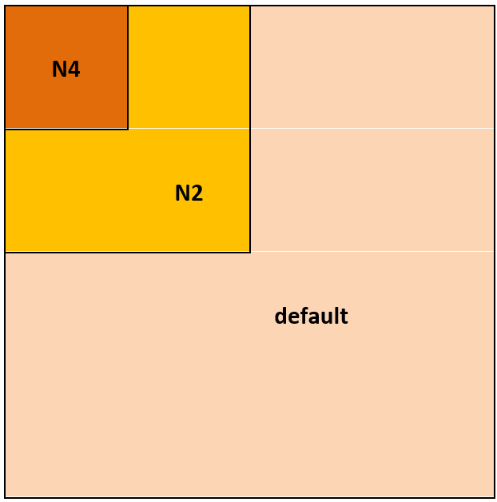

[Top level](../README.md)

# Transform Type and Transform Size Search

## Transform Search
AV1 provides multiple transform (Tx) type options to work with.
Moreover, transform block size could be the same or smaller than the prediction block size.
In the following Tx type search and Tx size search are discussed in detail.

## Tx Type Search

### Description of the algorithm

The AV1 specifications indicate that four transform options could be
considered, namely DCT, Asymmetric Discrete Sine Transform (ADST),
Flipped (reverse) ADST and the Identity transform. A total of 16
transform combinations with independent horizontal & vertical 1D
transform selection are available as shown in Table 1.

##### Table 1. List of the 16 transform combinations available in AV1.

| **Transform Type**     | **Vertical** | **Horizontal** |
| ---------------------- | ------------ | -------------- |
| DCT\_DCT               | DCT          | DCT            |
| ADST\_DCT              | ADST         | DCT            |
| DCT\_ADST              | DCT          | ADST           |
| ADST\_ADST             | ADST         | ADST           |
| FLIPADST\_DCT          | FLIPADST     | DCT            |
| DCT\_FLIPADST          | DCT          | FLIPADST       |
| FLIPADST\_FLIPADST     | FLIPADST     | FLIPADST       |
| ADST\_FLIPADST         | ADST         | FLIPADST       |
| FLIPADST\_ADST         | FLIPADST     | ADST           |
| IDTX                   | IDTX         | IDTX           |
| V\_DCT                 | DCT          | IDTX           |
| H\_DCT                 | IDTX         | DCT            |
| V\_ADST                | ADST         | IDTX           |
| H\_ADST                | IDTX         | ADST           |
| V\_FLIPADST            | FLIPADST     | IDTX           |
| H\_FLIPADST            | IDTX         | FLIPADST       |

For best performance, all the applicable transform options would be
evaluated for a given candidate prediction and the transform option that
results in the best cost would be selected. Given that the exhaustive
search option can be computationally expensive, it is desired to find
approaches to evaluate the least number of transform options without
incurrent a significant loss in compression performance. The options
considered in the following are listed below:

  - To use a subset of the transform options.

  - To exploit already computed information (e.g. distortion, previous stage coeffs, etc.)
    to decide whether to skip (or reduce) the Tx search for the current candidate.

<!-- end list -->

### 2. Implementation of the algorithm

**Inputs**: Prediction candidate.

**Outputs**: Transform type to use.

**Control macros/flags**:

##### Table 2. Tx type search control flags.

| **Flag**          | **Level (sequence/Picture)** | **Description**                                                                                                        |
| ----------------- | ---------------------------- | ---------------------------------------------------------------------------------------------------------------------- |
| tx\_level         | Picture                      | Indicates whether Tx search is to be performed, and if so, what level of optimizations to use in the search.           |

#### Details of the implementation

TX type search happens in the function tx_type_search(). The luma transform for
each TX type (or a subset of TX types – see optimization section) is tested and
the associated cost is computed. The TX type with the lowest cost is selected.

For the looping, the transform types (see Table 1) are split into groups based
on how likely each transform is to be selected (on average). This allows for
only certain groups of transforms to be tested (see optimization section). All
transforms in Group 0 will be tested, then all transforms in Group 1 will be
tested, then all transforms in Group 2 will be tested, and so on. The groups
area as follows:

##### Table 3. Groupings of transform options.

| **Group**              | **TX Types in Non-SC Encoder**                                                                   | **TX Types in the SC Encoder**                                                                   |
| ---------------------- | ------------                                                                                     | --------------                                                                                   |
| 0                      | DCT\_DCT                                                                                         | DCT\_DCT, IDTX                                                                                   |
| 1                      | V_DCT, H_DCT                                                                                     | V_DCT, H_DCT                                                                                     |
| 2                      | ADST_ADST                                                                                        | ADST_ADST                                                                                        |
| 3                      | ADST_DCT, DCT_ADST                                                                               | ADST_DCT, DCT_ADST                                                                               |
| 4                      | FLIPADST_FLIPADST, IDTX                                                                          | FLIPADST_FLIPADST                                                                                |
| 5                      | FLIPADST_DCT, DCT_FLIPADST, ADST_FLIPADST, FLIPADST_ADST, V_ADST, H_ADST, V_FLIPADST, H_FLIPADST | FLIPADST_DCT, DCT_FLIPADST, ADST_FLIPADST, FLIPADST_ADST, V_ADST, H_ADST, V_FLIPADST, H_FLIPADST |


### 3. Optimization of the algorithm

#### Reducing Tested TX Types

The search for the transform type is controlled by the **txt_level** signal.

The txt_level signal controls the number of TX groups to test in the TX type
search. The number of TX groups to be tested are reduced based on block size
and block type. The search can exit early if the distortion and/or resulting
number of coefficients is sufficiently low.

##### Table 4. Groupings of transform options.

| **Signal**     | **Description** |
| -------------- | --------------- |
| enabled | 1: TX type search enabled; 0: TX type search disabled (use DCT_DCT) |
| txt_group_inter_lt_16x16 | Max group to use when inter and tx block < 16x16 |
| txt_group_inter_gt_eq_16x16 | Max group to use when inter and tx block >= 16x16 |
| txt_group_intra_lt_16x16 | Max group to use when intra and tx block < 16x16 |
| txt_group_intra_gt_eq_16x16 | Max group to use when intra and tx block >= 16x16 |
| early_exit_dist_th | Per unit distortion TH; if best TX distortion is below the TH, skip remaining TX types (0 OFF, higher = more aggressive) |
| early_exit_coeff_th | If best TX number of coeffs is less than the TH, skip remaining TX types (0 OFF, higher = more aggressive) |

#### Tx Type Search Shortcuts Based on Block Characteristics

This type of optimization is controlled by the **tx_shortcut_level** signal.
Shortcuts to speedup the search can be used based on results from previous MD
stages and neighbouring blocks.

##### Table 5. Optimization signals for Tx type search controlled by the tx_shortcut_level.

| **Signal**            | **Description**                                                                                                              |
| --------------        | ---------------                                                                                                              |
| bypass_tx_when_zcoeff | Skip TX at MD_Stage_3 if the MD_Stage_1 TX did not yield any non-zero coefficients                                           |
| apply_pf_on_coeffs    | Apply partial frequency transform (PF) based on the number of coefficients                                                   |
| use_mds3_shortcuts_th | if (best MD_Stage_0 distortion/QP < TH) use shortcuts for candidates at MD_Stage_3; 0: OFF, higher settings: More aggressive |
| use_neighbour_info    | if true, use info from neighbouring blocks to use more aggressive Thresholds/actions                                         |

#### Residual Subsampling

The residuals can be subsampled before the transform is performed to reduce the
computations spent in the transform loop. When enabled, only every 2nd line (or
4th line, depending on settings) is used to compute the transform. Subsampling
will change the size of the TX according to the table below; subsampling more
than every 4th line is not permitted since there is no corresponding TX size
(e.g. no 8x64).

##### Table 6. Tx block size for different subsampling levels.

| **TX size (width x height)**     | **2x subsampled TX size**    | **4x subsampled TX size**    |
| -------------------------------- | -------------------------    | -------------------------    |
| 128x128                          | Not supported                | Not supported                |
| 64x64                            | 64x32                        | 64x16                        |
| 32x32                            | 32x16                        | 32x8                         |
| 16x16                            | 16x8                         | 16x4                         |
| 8x8                              | 8x4                          | Not allowed (no 8x2 TX size) |
| 4x4                              | Not allowed (no 4x2 TX size) | Not allowed (no 4x1 TX size) |

When computing the reconstructed block from a subsampled TX, the rows that were
skipped in the transform coefficient calculations will be filled with the copy
of the previous line. Subsampling cannot be used when computing a conformant
transform because the reconstructed block will not be the correct size.

Subsampling the residual is controlled with the **subres_level** signal.

#### Partial Frequency Transforms

Instead of computing the transform for the entire block area, partial frequency
transforms (PF) considers the computations necessary to generate only transform
coefficients in an upper left area of the transform coefficient block. Table 7
and Figure 1 below summarize the available PF sizes.

##### Table 7. Description for PF shapes.

| **PF Shape**        | **Block Size Used in TX**                     |
| ----------------    | -------------------------                     |
| ```DEFAULT_SHAPE``` | Full Block (regular TX)                       |
| ```N2_SHAPE```      | Quarter block (half width x half height)      |
| ```N4_SHAPE```      | Eighth block (quarter width x quarter height) |
| ```ONLY_DC_SHAPE``` | DC position only – not recommended            |




##### Figure 1. A Summary of the Tx search optimization approaches.

PF is controlled through the **pf_level** signal.

## Tx Size Search

### Description of the Algorithm

For a given block, Tx size (TxS) search is used to determine the transform
block size that yields the best rate-distortion cost for the block under
consideration. Block transform size can be either the same as, one depth or two
depths below the current block size. The maximum allowable depth change for
each block size is specified below, where a depth change of 2 means a TX size
two depths more than the current block size, and 0 means the default TX size.

##### Table 8. Maximum change in block depth in transform size search as a function of the block size.

| **Block size**                                                                                    | **Max transform block depth change beyond current block depth** |
| ------------------                                                                                | --------------------------------------------------------------- |
| 64X64, 32X32, 16X16, 64X32, 32X64, 16X32, 32X16, 16X8, 8X16, 64X16, 16X64, 32X8, 8X32, 16X4, 4X16 | 2                                                               |
| 8X8                                                                                               | 1                                                               |

### Implementation of the Algorithm

## 2. Implementation of the algorithm

**Inputs**: Prediction candidate.

**Outputs**: Transform block size to use.

**Control macros/flags**:

##### Table 9. Control flags associated with Tx size search.

| **Flag**               | **Level (sequence/Picture)** | **Description**                                                                    |
| ---------------------- | ---------------------------- | ---------------------------------------------------------------------              |
| tx_size_search_mode    | Picture                      | When set, it allows transform block size search.                                   |
| frm_hdr->tx_mode       | Picture                      | Frame-based signal used to signal that TX size search is allowed in a given frame. |
| txs_level              | Picture                      | Indicates the level of optimization to use in the TX size search.                  |

#### Details of the implementation

The function tx_partitioning_path performs the Tx size search in MD. The flow
of the evaluation depends on whether the block is an inter-coded block or an
intra-coded block, as outlined below.

1. In the case of an inter block (i.e. the candidate type is INTER or Intra
   Block Copy), the residual block can be computed for the whole block based on
   the already computed prediction (computed in MD_Stage_0 in the function
   full_loop_core) through the call to the function residual_kernel.
2. Loop over the depths to be evaluated (up to 2 depths, if block size allows – see
   optimization section for signals limiting number of TX depths to search).
    1. The function tx_reset_neighbor_arrays is used to reset the neighbor arrays. Initialize the neighbor arrays using tx_initialize_neighbor_arrays. The neighbour arrays are needed to store the data from all TX depths until a decision on the best depth can be made.
    2. Loop over the Tx blocks in the depth being evaluated.
       - If the block is an intra block, then:
         - Perform luma intra prediction in av1_intra_luma_prediction.
         - Compute the luma resulting residuals in residual_kernel.
       - Perform Tx search for the current Tx block in tx_type_search
       - Perform Tx, quantization, inverse quantization, and if spatial SSE is needed,
         inverse transform. Compute the cost of the current transform type for
         the transform block size under consideration.
       - If the block is an intra block, update both the recon sample neighbor array
         and the transform-related neighbor array tx_update_neighbor_array. Otherwise,
         update only the transform-related neighbor array in the same function.
    3. Estimate the rate associated with signaling the Tx size in get_tx_size_bits.
    4. Update best_cost_search and best_tx_depth based on the depths evaluated so far.

#### Optimization of the Algorithm

The optimization of the TX size search focuses on two areas:
- Reducing the number of depths tested
- Reducing the cost of testing each depth (by reducing the number of transforms searched for depths 1 and 2).

##### Table 10. Optimization signals for Tx size search.

| **Signal**              | **Description**                                                                   |
| --------------          | ---------------                                                                   |
| enabled                 | 1: Ts size search enabled; 0: Tx size search disabled (use default TX size)       |
| prev_depth_coeff_exit   | Skip current depth if previous depth has zero coeffs                              |
| intra_class_max_depth   | Max number of depth(s) for INTRA classes                                          |
| inter_class_max_depth   | Max number of depth(s) for INTER classes                                          |
| depth1_txt_group_offset | Offset to be subtracted from default txt-group to derive the txt-group of depth-1 |
| depth2_txt_group_offset | Offset to be subtracted from default txt-group to derive the txt-group of depth-2 |
| min_sq_size             | Min. square size to use Tx size for                                               |

## Notes

The feature settings that are described in this document were compiled at
v1.7.0 of the code and may not reflect the current status of the code. The
description in this document represents an example showing how features would
interact with the SVT architecture. For the most up-to-date settings, it's
recommended to review the section of the code implementing this feature.
