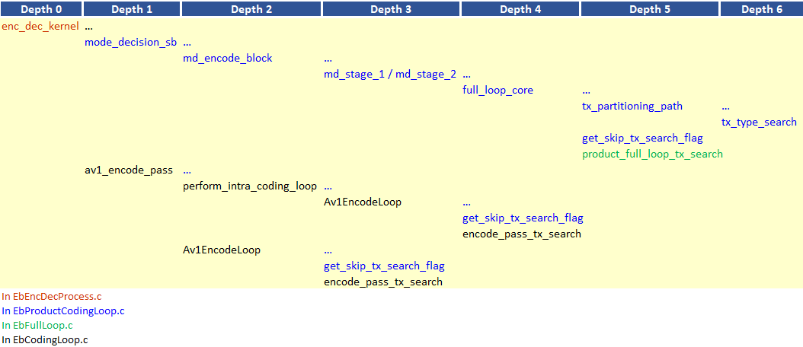
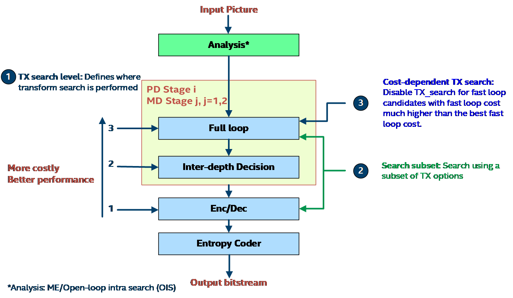
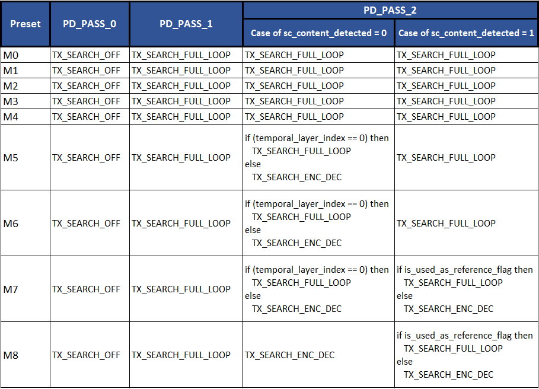
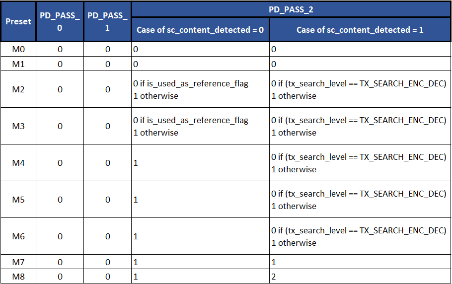
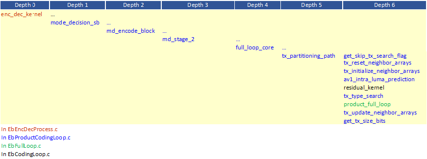

# TX Search Appendix

## Transform Search
AV1 provides multiple transform (Tx) type options to work with. Moreover, transform block size could
be the same of smaller than the prediction block size. In the following Tx type search and Tx size search
are discussed in detail.

## I. Tx Type Search

### 1.  Description of the algorithm

The AV1 specifications indicate that four transform options could be
considered, namely DCT, Asymmetric Discrete Sine Transform (ADST),
Flipped (reverse) ADST and the Identity transform. A total of 16
transform combinations with independent horizontal & vertical 1D
transform selection are available as shown in Table 1.

##### Table 1. List of the 16 transform combinations available in AV1.

| **Transform Type**     | **Vertical** | **Horizontal** |
| ---------------------- | ------------ | -------------- |
| DCT\_DCT           | DCT      | DCT        |
| ADST\_DCT          | ADST     | DCT        |
| DCT\_ADST          | DCT      | ADST       |
| ADST\_ADST         | ADST     | ADST       |
| FLIPADST\_DCT      | FLIPADST | DCT        |
| DCT\_FLIPADST      | DCT      | FLIPADST   |
| FLIPADST\_FLIPADST | FLIPADST | FLIPADST   |
| ADST\_FLIPADST     | ADST     | FLIPADST   |
| FLIPADST\_ADST     | FLIPADST | ADST       |
| IDTX               | IDTX     | IDTX       |
| V\_DCT             | DCT      | IDTX       |
| H\_DCT             | IDTX     | DCT        |
| V\_ADST            | ADST     | IDTX       |
| H\_ADST            | IDTX     | ADST       |
| V\_FLIPADST        | FLIPADST | IDTX       |
| H\_FLIPADST        | IDTX     | FLIPADST   |

For best performance, all the applicable transform options would be
evaluated for a given candidate prediction and the transform option that
results in the best cost would be selected. Given that the exhaustive
search option can be computationally expensive, it is desired to find
approaches to evaluate the least number of transform options without
incurrent a significant loss in compression performance. The options
considered in the following are listed below:

  - Deciding whether to perform Tx search, and if so where in the
    pipeline to perform the search.

  - To use a subset of the transform options.

  - To exploit already computed cost information for different
    prediction candidates for the same block to decide whether to skip
    the Tx search for the current candidate based on the cost difference
    between the current candidate and the best candidate.

<!-- end list -->

### 2.  Implementation of the algorithm

**Inputs**: Prediction candidate.

**Outputs**: Transform type to use.

**Control macros/flags**:

##### Table 2. Tx type search control flags.

| **Flag**          | **Level (sequence/Picture)** | **Description**                                                                                                        |
| ----------------- | ---------------------------- | ---------------------------------------------------------------------------------------------------------------------- |
| tx\_search\_level | Picture                      | Indicates whether Tx search is to be performed, and if so, whether it would be considered in MD or in the encode pass. |

#### Details of the implementation

The main function calls associated with Tx search in MD and in the
encode pass are outlined in Figure 1 below.



##### Figure 1. Main function calls associated with TX search in MD and in the encode pass.


Tx type search is performed using the functions ```tx_type_Search``` and ```product_full_loop_tx_search```
in MD and the function ```encode_pass_tx_search``` in the encode pass.

### 3.  Optimization of the algorithm

A summary of the different optimization approaches considered in Tx
search is presented in Figure 2 below.



##### Figure 2. A Summary of the Tx search optimization approaches.


The optimization of the Tx search is performed using different
approaches as outlined in the following.

**Tx search level**: The Tx search level indicates where in the encoder
pipeline the Tx search would be performed. The three candidate
components of the encoder where Tx search could be performed are the
full-loop in MD, inter-depth decision in MD, and the encode pass.
The flag tx\_search\_level is used to indicate where Tx search
would be performed. Table 3 summarized the values and associated
descriptions of the flag. The settings for tx\_search\_level as a
function of the encoder preset and other settings are given in Table 4.

##### Table 3. tx\_search\_level values and description.

| **tx\_search\_level**    | **Value** | **Description**                                                     |
| ------------------------ | --------- | ------------------------------------------------------------------- |
| TX\_SEARCH\_OFF          | 0         | Tx search OFF                                                       |
| TX\_SEARCH\_ENC\_DEC     | 1         | Tx search performed only in the encode pass, the lowest complexity option.  |
| TX\_SEARCH\_INTER\_DEPTH | 2         | Tx search performed only in inter-depth decision in MD, intermediate complexity level. |
| TX\_SEARCH\_FULL\_LOOP   | 3         | Tx search performed only in the full-loop in MD, highest complexity level.      |

##### Table 4. tx\_search\_level settings as a function of encoder settings.



**Cost-dependent Tx search**

If Tx search is to be performed in the full-loop in MD, the decision
on whether to perform Tx search could be further refined based on the
difference between the fast loop cost of the current candidate and the
best fast loop cost for the block. If the difference is greater than a
given threshold, Tx search is skipped. The threshold value is specified
by the variable tx\_weight. The values of tx_weight and corresponding
descriptions are given in Table 5. The settings for tx\_weight as a
function of the encoder preset and other settings are given in Table
6.

##### Table 5. tx\_weight values and description.

| **tx\_weight**          | **Value**           | **Description**                            |
| ----------------------- | ------------------- | ------------------------------------------ |
|                         | 0                   | Always skip.                               |
| FC\_SKIP\_TX\_SR\_TH010 | 110                 | Skip if difference in cost is 10% or more. |
| FC\_SKIP\_TX\_SR\_TH025 | 125                 | Skip if difference in cost is 25% or more. |
| MAX\_MODE\_COST         | 13616969489728 \* 8 | No skipping                                |

##### Table 6. tx\_weight as a function of encoder settings.

|**Preset**|**PD_PASS_0**|**PD_PASS_1**|**PD_PASS_2**|
|--- |--- |--- |--- |
|M0|MAX_MODE_COST|FC_SKIP_TX_SR_TH025|if (tx_search_level == TX_SEARCH_ENC_DEC) then MAX_MODE_COST else FC_SKIP_TX_SR_TH025|
|M1|MAX_MODE_COST|FC_SKIP_TX_SR_TH025|if (tx_search_level == TX_SEARCH_ENC_DEC) then MAX_MODE_COST else FC_SKIP_TX_SR_TH025|
|M2 - M8|MAX_MODE_COST|FC_SKIP_TX_SR_TH025|if is_used_as_reference_flag then FC_SKIP_TX_SR_TH025 else FC_SKIP_TX_SR_TH010|


**Search subset**: If Tx search is performed in either full-loop in MD or
in encode pass in enc/dec, a Tx search subset could be considered
instead of the full Tx search set. The use of a reduced search subset is
specified by the flag ```tx_search_reduced_set```. The values of ```tx_search_reduced_set```
and the corresponding descriptions are given in Table 7. The
settings for ```tx_search_reduced_set``` as a function of the encoder
preset and other settings are given in Table 8.

##### Table 7. tx\_search\_reduced\_set values and description.

| **tx\_search\_reduced\_set** | **Description** |
| ---------------------------- | --------------- |
| 0                            | Full Tx set     |
| 1                            | Reduced Tx set  |
| 2                            | Two Tx          |

##### Table 8. tx\_search\_reduced\_set settings as a function of encoder settings.



## II. Tx Size Search

## 1.  Description of the algorithm

For a given block, Tx size search is used to determine the transform
block size that yields the best rate-distortion cost for the block
under consideration. In the current implementation of the Tx size
search feature, only one depth below the current block depth is
considered, as determined by the function ```get_end_tx_depth```. This
is true for inter and intra blocks and for the following block
sizes: 8X8, 8X16, 16X8, 16X16, 16X32, 32X16, 32X32, 32X64, 64X32,
64X64, 4X16, 16X4, 8X32, 32X8, 16X64, 64X16.

## 2.  Implementation of the algorithm

**Inputs**: Prediction candidate.

**Outputs**: Transform block size to use.

**Control macros/flags**:

##### Table 9. Control flags associated with Tx size search.
| **Flag**               | **Level (sequence/Picture)** | **Description**                                                       |
| ---------------------- | ---------------------------- | --------------------------------------------------------------------- |
| md\_atb\_mode          |                              | When set, it allows transform block size search.                      |
| md\_staging\_skip\_atb |                              | When set, transform block size search is skipped.                     |
| use\_intrabc           | Block                        | When set it indicates that Intra Block Copy prediction could be used. |

**Details of the implementation**

The main function calls associated with Tx size search in MD are
outlined in Figure 3 below.




##### Figure 3. Main function calls associated with Tx size search in MD.

Tx size search is enabled currently only in ```MD_stage_2``` since in
```MD_Stage_1``` we have ```md_staging_skip_atb == EB_TRUE```.

The function ```tx_partitioning_path``` performs the Tx size search in MD.
Currently, only the original transform block and the corresponding
one-depth below partitioning transform blocks are evaluated, i.e. only
the original block depth and one depth below are evaluated. The flow of
the evaluation depends on whether the block is an inter coded block or
an intra coded block, as outlined below.

1. In the case of an inter block (i.e. the candidate type is INTER or Intra Block Copy),
    the residual block can be computed for the whole
    block based on the already computed prediction. This is done in the
    function `full_loop_core` through the call to the function
    `residual_kernel`.

2. Determine the setting for the flag `tx_search_skip_flag`, which
    indicates whether transform type search would be performed or not.
    The function `get_skip_tx_search_flag` is used to determine the
    setting for the flag.

3. The function `tx_reset_neighbor_arrays` is used to reset the
    neighbor arrays.

4. Loop over the depths to be evaluated (i.e. current depth and thenext depth).

   a. Initialize the neighbor arrays using `tx_initialize_neighbor_arrays`

   b. Loop over the Tx blocks in the depth being evaluated.

      1. If the block is not an inter block, then:
         * Perform luma intra prediction in av1_intra_luma_prediction.
         * Compute the luma resulting residuals in residual_kernel.

      2. Perform Tx search for the current Tx block in `tx_type_search`

      3. Perform Tx, quantization, inverse quantization, and if spatialSSE, inverse transform. Compute the cost of the current transform type for the transform block size under consideration. All these operations are performed in `product_full_loop`

      4. If the block is not an inter block, update both the recon sample neighbor array and the transform-related neighbor array `tx_update_neighbor_array`. Otherwise, update only the transform-related neighbor array in the same function.

   c. Estimate the rate associated with signaling the Tx size in `get_tx_size_bits`.

   d. Update `best_cost_search` and `best_tx_depth` based on the depths evaluated so far.

<!-- end list -->

## 3.  Optimization of the algorithm

The Tx size search optimization is based on checking whether the
parent transform block for the current transform block has all zero
coefficients. If the parent Tx block does not have any non-zero
coefficients, then no further Tx size search is considered. The feature
is controlled by the flag ```tx_size_early_exit```. The flag is used in
```tx_partitioning_path``` to exit the Tx size search if the flag is set. A
description of the flag settings is given in Table 10.

##### Table 10. Description of the tx\_size\_early\_exit settings.

| **tx\_size\_early\_exit** | **Description** |
| ------------------------- | --------------- |
| 0                         | Feature OFF     |
| 1                         | Feature ON      |

The flag ```tx_size_early_exit``` is set to 1.
