[Top level](../README.md)

# Variance Boost

## Overview

Variance boost is a Variance-based Adaptive Quantization (VAQ) implementation for SVT-AV1 that addresses inadequate quantization in low-contrast areas. It accomplishes this by "boosting" the quality (decreasing the qindex) of superblocks (64x64 pixel regions) that have lower variance, which helps increase the consistency of:

- **Low-contrast areas**: clouds, skin, and delicate textures
- **Low-contrast scenes**: night, foggy, and overexposed shots

## High-level Idea

The human eye is able to perceive detail in low-contrast areas as well as it can in high-contrast areas. A fixed-quantization encoding strategy tends to introduce noticeable artifacts into low-contrast areas such as blurring, loss of high-frequency detail, and transform-basis patterns. In the most extreme cases, superblocks may be collapsed into single colors.

All of the aforementioned artifacts are shown in the example below, which displays two filesize-matched encodes of a rock. The rock's texture progressively fades out to solid white, beige, and black:

| Without Variance Boost (QP 50)           | With Variance Boost (QP 53)       |
|------------------------------------------|-----------------------------------|
| 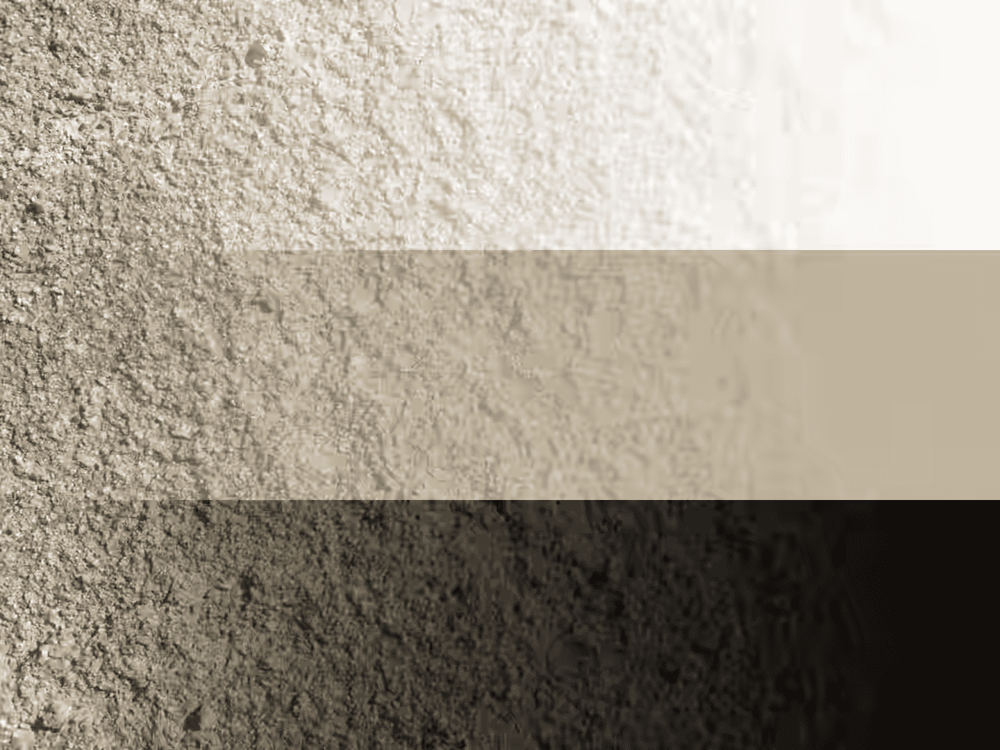     | 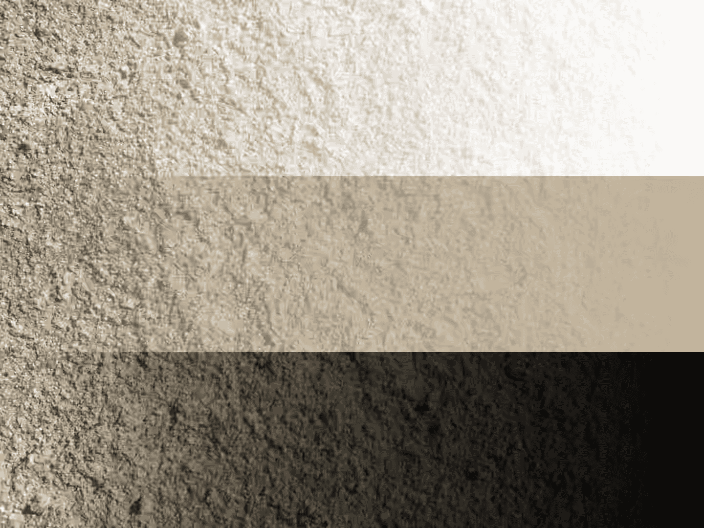  |
| 22,848 bytes                             | 22,352 bytes                      |

Through this example, we can observe that the quality appears uneven without variance boost. The high-contrast left side of the image retains detail with minimal artifacting, but as the image moves across the low-contrast right side, visual quality progressively worsens until there are no recognizable features left. The texture is distorted into low-frequency basis patterns and solid blocks on the right side.

The image encoded with variance boost has significantly more balanced visual energy. Rock features remain consistent throughout the image, independent of contrast. Variance boost allows for a smarter allocation of bits. The image size is also a bit smaller (97.8% of the size of the fixed QP image).

**Note:** The example images were transcoded to lossy (dithered) PNG format from their original AVIFs for markdown viewer compatibility and file size reasons. This process has not compromised the positive effects of variance boost in any way.

## Parameters

### `--enable-variance-boost [0-1]`

Enables variance boost, the feature described in this document.

### `--variance-boost-strength [1-4]`

Controls how much low-contrast superblocks are boosted. Higher strength allows for proportionally greater bit allocation into preserving low-contrast areas. Raising strength excessively can cause unnecessary bitrate inflation and inconsistent film grain preservation.

The default value is 2.

- **Strength 1** tends to be best for simple, untextured, or smooth animation.
- **Strength 2** is a highly compatible curve, great for most live-action content and animation with detailed textures.
- **Strength 3** is best for still images or videos with a balanced mix of very high-contrast and low-contrast scenes (like traditional horror or thriller movies).
- **Strength 4** is very aggressive and only useful under very specific circumstances where low-contrast detail retention is an extremely high priority.

#### Example of varying strength at QP 55

|    Strength 1    |    Strength 2    |
| ---------------- | ---------------- |
| 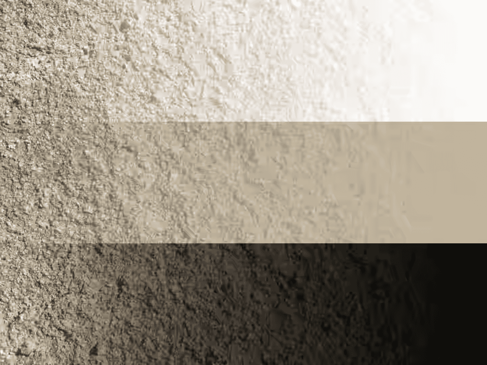 |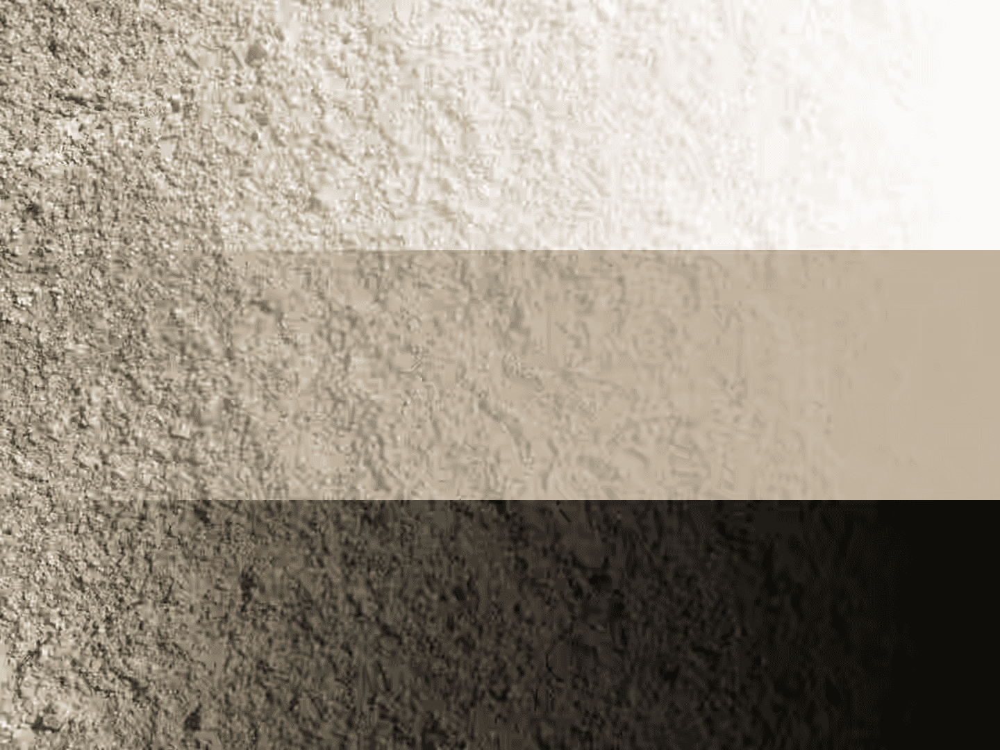 |
| 14,767 bytes     | 16,403 bytes     |

|    Strength 3    |    Strength 4    |
| ---------------- | ---------------- |
 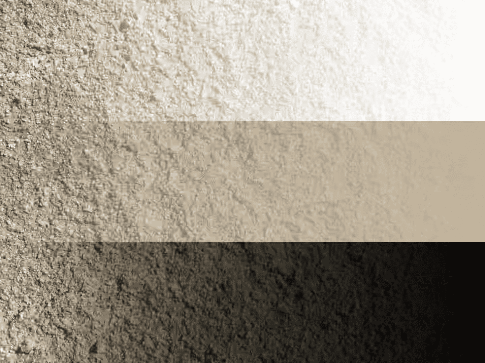 |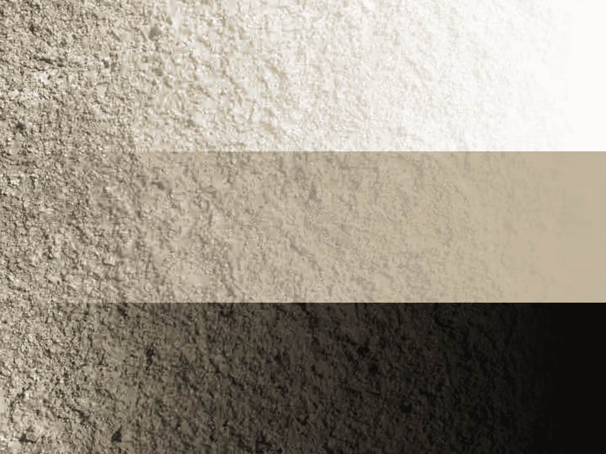 |
16,826 bytes     | 21,351 bytes     |

### `--variance-octile [1-8]`

This option controls how many superblocks are boosted. It determines this based on the internal low-contrast/high-contrast ratio in each superblock. A value of 1 means only 1/8 of the superblock needs to be low-contrast to boost it, while a value of 8 requires the entire superblock to be low-contrast for a boost to be applied.

Lower octile values are less efficient (more high contrast areas are boosted alongside low contrast areas, which inflates bitrate), while higher values are less visually consistent (fewer low contrast areas are boosted, which can create low quality area "holes" within superblocks).

The default value is 6. Recommended values are between 4 and 7.

#### Example of varying the octile at QP 50

|    Octile 1    |    Octile 2    |    Octile 4    |    Octile 6    |    Octile 8    |
| -------------- | -------------- | -------------- | -------------- | -------------- |
|  |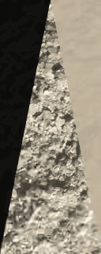 | 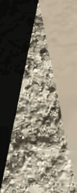 |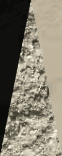 | 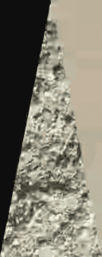|
| 4,810 bytes    | 4,186 bytes    | 2,507 bytes    | 1,878 bytes    | 1,584 bytes    |

## Description of the Algorithm

|Image|Description|
|-|-|
|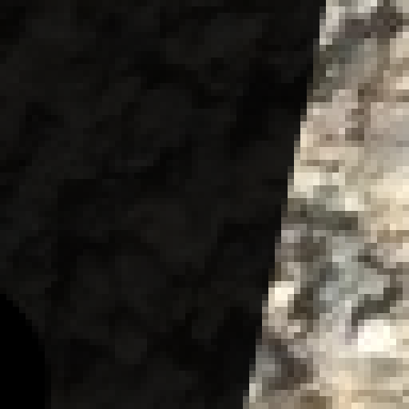  | 1. Variance boost (`svt_variance_adjust_qp()`) loops over all 64x64 superblocks; first horizontally, then vertically. |
|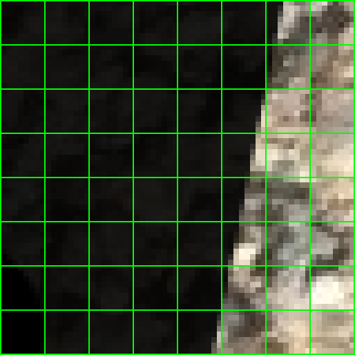  | 2. The algorithm then splits each superblock into 8x8 subblocks and calculates the variance of each one of them, receiving 64 values in total. |
|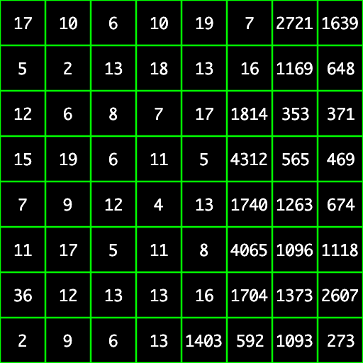    | 3. Each subblock's variance correlates to how much contrast there is for that area. Lower values equate to less contrast, and any value below 256 is considered *low variance*. In the superblock pictured, more than half of its subblocks are considered low variance.  |
|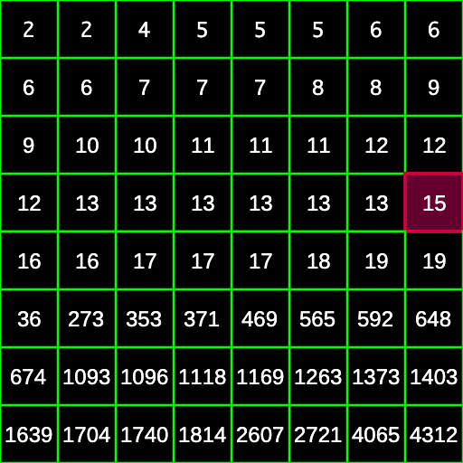| 4. In `av1_get_deltaq_sb_variance_boost()`, these values are then ranked from lowest to highest variance. Then, one of these values is picked at the specified octile; in this case, octile 4 (the value at the end of the 4th row highlighted in magenta). |
|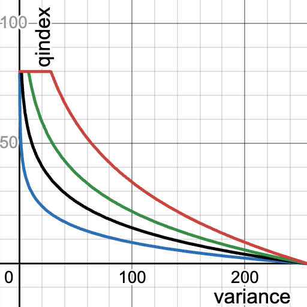  | 5. This value is plugged into one of the four boost formulas, which then outputs a delta-q offset. More aggressive curves result in bigger offsets and thus bigger resulting adjustments. Quantization index boosts can range from 0 (for high variance areas) to 80 (for very low variance areas). |
|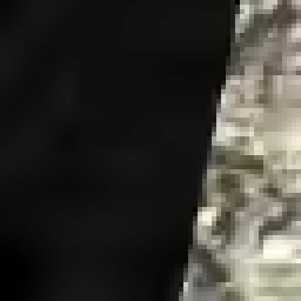    | 6. Finally, the offset is applied to the superblock's qindex and the same process is repeated for the remaining superblocks. Once complete, other parts of the encoding process can run. |

## References

- \[1\] https://en.wikipedia.org/wiki/Variance_Adaptive_Quantization
- \[2\] https://people.xiph.org/~xiphmont/demo/theora/demo9.html
- \[3\] https://x264-devel.videolan.narkive.com/eFxZMbt1/variance-based-adaptive-quantization
- \[4\] https://gitlab.com/AOMediaCodec/SVT-AV1/-/issues/2105

## Notes

The feature settings that are described in this document were compiled at
v2.1.0 of the code and may not reflect the current status of the code. The
description in this document represents an example showing how features would
interact with the SVT architecture. For the most up-to-date settings, it's
recommended to review the section of the code implementing this feature.
