# Decoder Design for SVT-AV1 (Scalable Video Technology for AV1)

## Table of Contents

- [Introduction](#introduction)
- [High-level decoder architecture](#high-level-decoder-architecture)
  * [Bit-Stream Parse](#bit-stream-parse)
  * [Reconstruction](#reconstruction)
  * [Loop Filter](#loop-filter)
  * [CDEF](#cdef)
  * [Loop Restoration](#loop-restoration)
- [Multi-Threaded Architecture](#multi-threaded-architecture)
  * [Tile level Parallelism](#tile-level-parallelism)
  * [Tile Row-level Parallelism](#tile-row-level-parallelism)
  * [Frame Row-level Parallelism](#frame-row-level-parallelism)
  * [Job Selection and Sync Points in MT](#job-selection-and-sync-points-in-mt)
- [Frame Level Buffers](#frame-level-buffers)
- [Appendix](#appendix)
  * [High-level Data Structures](#high-level-data-structures)

## List of Figures

- [Figure 1](#figure-1): High-Level Decoder Architecture
- [Figure 2](#figure-2): Parse stage Flow
- [Figure 3](#figure-3): Reconstruction stage Flow
- [Figure 4](#figure-4): Loop Filter stage Flow
- [Figure 5](#figure-5): LF Vertical Stage
- [Figure 6](#figure-6): LF Horizontal Stage
- [Figure 7](#figure-7): CDEF stage Flow
- [Figure 8](#figure-8): CDEF Filter Flow
- [Figure 9](#figure-9): Loop Restoration stage Flow
- [Figure 10](#figure-10): Main Thread Flow Chart
- [Figure 11](#figure-11): Worker Thread Flow Chart
- [Figure 12](#figure-12): Tile Parallelism (L > T)
- [Figure 13](#figure-13): Tile Parallelism (L < T)
- [Figure 14](#figure-14): Illustration for Tile Row MT for 4 Tiles and 9 Threads
- [Figure 15](#figure-15): Frame\_i with 5 Threads
- [Figure 16](#figure-16): Sample SB with Blocks numbered (BlockModeInfo)
- [Figure 17](#figure-17): Map with offset for each Block (p\_mi\_offset)

## List of Tables

- [Table 1](#table-1): Important Frame level buffers

## Introduction

This document describes the Intel SVT-AV1 decoder design. In particular, the decoder block diagram and multi-threading aspects are described. Besides, the document contains brief descriptions of the SVT-AV1 decoder modules such as parse, reconstruction, etc. This document is meant to be an accompanying document to the &quot;C Model&quot; source code, which contains the more specific details of the inner working of the decoder.

## High-level decoder architecture

The high-level decoder pipeline is shown in Figure 1. Further details on individual stages are given in subsequent sections. The multi-threading aspect of the decoder is also explained in detail in a separate section. The details of high-level data structures and frame buffers used in the decoder are also covered briefly later.

The major modules of the SVT-AV1 decoder are:

1. Parse
2. Reconstruction
3. Loop filter
4. CDEF
5. Loop Restoration

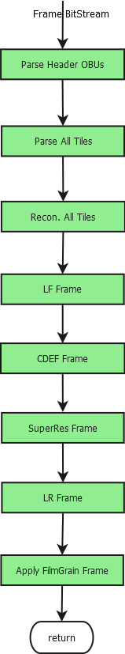

##### Figure 1: High-Level Decoder Architecture

### Bit-Stream Parse

The Parse stage does all tasks related to OBU reading, arithmetic decoding and related mv prediction (such as find\_warp\_samples, etc.) that produce the necessary mode info and residual data info.

The header level parsing of sequence parameters and frame parameters happens separately via read\_sequence\_header\_obu andread\_frame\_header\_obufunctions. Parse Tile module does the parsing of tile group obu data. Figure 2 shows a typical flow of the parse stage.

**Input** : Bitstream buffer

**Output** : ModeInfo buffer, TransformInfo buffer, Coeff buffer
   Picture buffer with predicted values filled for blocks with palette mode
   Reconstructed picture buffer without applying post-processing filters for single-thread mode

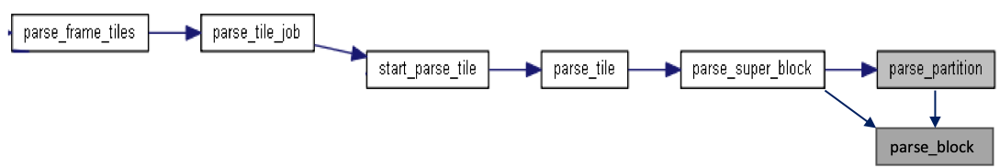

##### Figure 2: Parse stage Flow

parse\_frame\_tiles() is the function that will trigger the parsing module in SVT-AV1 decoder. Parsing for each tile will be called by start\_parse\_tile(). Then parsing happen for each superblock in a tile by calling the function parse\_super\_block().

Note: The prediction for palette mode happens during the Parse stage itself.

### Reconstruction

This stage performs prediction, coefficient inverse scan, residual inverse quantization, inverse transform and finally generated the reconstructed data without applying post-processing filters. Figure 3 shows a typical flow of the reconstruction stage.

**Input** : ModeInfo buffer, TransformInfo buffer, Coeff buffer

**Output** : Reconstructed picture buffer without applying the post-processing filters.

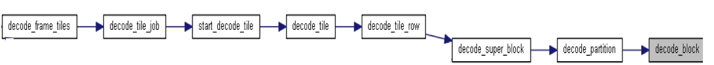

##### Figure 3: Reconstruction stage Flowdecode\_frame\_tiles() function starts reconstruction at frame level. Then decode\_tile\_job()  is called for each tile.

For each Superblock in a tile, decode\_super\_block() function will be called.

The total number of blocks inside a superblock and their corresponding **mode\_info** structure are stored while parsing. This helps to avoid calling of decode\_block() function recursively.

Note: The prediction for palette mode happens during the Parse stage itself.

Note: In single thread mode, decode\_super\_block() will be called immediately after every parse\_super\_block() for better cache efficiency. In this mode decode\_frame\_tiles() will be completely avoided.

### Loop Filter

The loop filter function is to eliminate (or at least reduce) visually objectionable artifacts associated with the semi-independence of the coding of super blocks and their constituent sub-blocks as per section 7.14 of AV1 spec. This stage applies the loop filter for the entire frame. Flow diagram for Loop Filter is below in Figure 4.

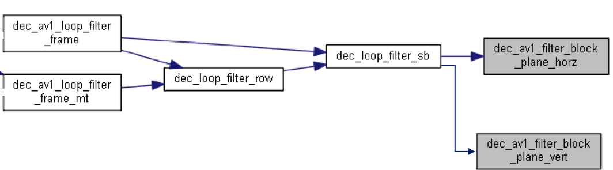

##### Figure 4: Loop Filter stage Flow

**Input** : Reconstructed picture buffer

**Output** : Loop Filtered frame.

1. eb\_av1\_loop\_filter\_frame\_init() Initialization of loop filter parameters is performed  here.
2. Dec\_loop\_filter\_sb()
  1. Apply dec\_av1\_filter\_block\_plane\_vert()
    * Loop through each block in SB.
      + Loop through each TUs in a block.
        1. Calculate the LF params.
        2. Apply LF for each vertical TU edge.
  2. Then applydec\_av1\_filter\_block\_plane\_horz().
    * Loop through each block in SB.
      + Loop through each TUs in a block.
        1. Calculate the LF params.
        2. Apply LF for each horizontal  TU edge.

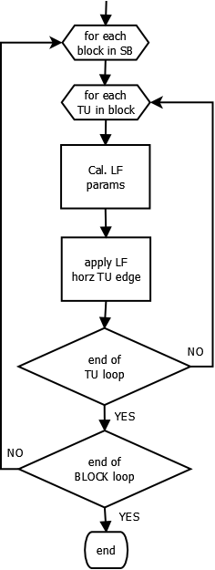

##### Figure 5: LF Vertical Stage

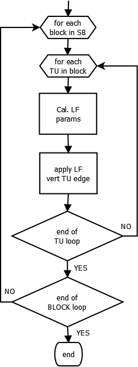

##### Figure 6: LF Horizontal Stage

### CDEF

The CDEF performs deringing based on the detected direction of blocks as per section 7.15 of AV1 spec. This stage applies the CDEF for the entire frame. The flow diagram for the CDEF is shown in Figure 7.

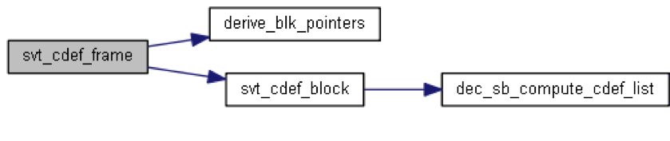

##### Figure 7: CDEF stage Flow

**Input:** Output of Loop filtered buffer.

**Output** : CDEF filtered buffer.

Steps involved in CDEF:

1. svt\_cdef\_frame()function will be called to start CDEF for a frame.
2.  For each 64x64 superblock function svt\_cdef\_block()will be called.
  1. The number of non-skip 8x8 blocks calculated.
  2. Store the 3-pixel rows of next SB&#39;s in line and column buffer to do CDEF in original pixels.
  3. Call eb\_cdef\_filter\_fb()  for each 8x8 non-skip block
    * Find the direction of each 8x8 block.
    * Filter the 8x8 block according to the identified direction- eb\_cdef\_filter\_block\_c().
    * Store the results in the destination buffer

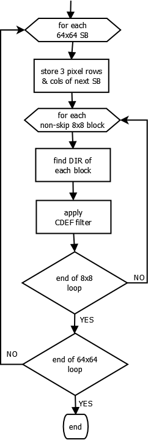

##### Figure 8: CDEF Filter Flow

### Loop Restoration

This stage applies the Loop Restoration for the entire frame and the process is defined as per section 7.17 of AV1 spec. The flow diagram for the LR is shown in Figure 9.

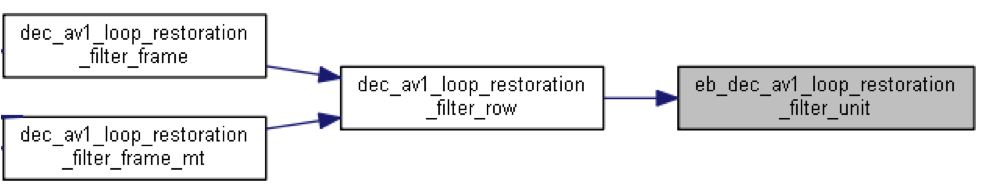

##### Figure 9: Loop Restoration stage Flow

**Input** : CDEF filtered reconstructed buffer

**Output** : LR filtered reconstructed buffer

Loop Restoration for a frame starts from the function dec\_av1\_loop\_restoration\_filter\_frame ().

The steps involved are:

1. Call dec\_av1\_loop\_restoration\_filter\_row() for each row of height sb\_size.
  * call eb\_dec\_av1\_loop\_restoration\_filter\_unit()  for each LR unit of size 64x64
    1. Use the  stored CDEF/ LF above/below boundaries form neighbor block based on processing row is outer or inner row respectively by calling the function setup\_processing\_stripe\_boundary() .
    2. Apply the LR filter (stripe\_filter) based on the type of unit\_lrtype.
    3. Restore the LR filtered data back to stripe\_buffer by function restore\_processing\_stripe\_boundary().

## Multi-Threaded Architecture

Parallelism in the decoder could be achieved at multiple levels. Each thread could, for example, be performing a different task in the decoding pipeline. The decoder will use tile level parallelism for tile parsing jobs. Decoder reconstruction jobs will use tile row-level parallelism, whereas all the post-processing filter jobs will use frame row-level parallelism.

Let **N** be the number of threads configured for the decoder. The decoder library created **(N-1)** threads, which are called **worker threads**. The application thread which calls the decode process is called in the **main thread**. Together the decoder will have **N** working threads.

The main thread will perform the following inside the decoder:

1. **Parse** all OBUs completely other than OBU\_TILE\_GROUP
2. Do **MV Projection** Frame Row job if anything is pending
  - Wait till all threads have finished the stage
3. **Parse** Tile data if any tile parsing is pending
4. Do **Reconstruct** Tile Row job if anything is pending
5. Do **Loop Filter** Frame Row job if anything is pending
6. Do **CDEF** Frame Row job if anything is pending
  - If upscale is enabled, wait till all threads have finished the stage
7. Do **LR** Frame Row job if anything is pending
  - Wait till all threads have finished the stage
8. Return the control back to the caller (application)

Figure 10 shows the flow chart of the main thread.

The worker thread will perform the following:

1. Wait for the start frame processing flag
2. Do **MV Projection** Frame Row job if anything is pending
  - Wait till all threads have finished the stage
3. **Parse** Tile data if any tile parsing is pending
4. Do **Reconstruct** Tile Row job if anything is pending
5. Do **Loop Filter** Frame Row job if anything is pending
6. Do **CDEF** Frame Row job if anything is pending
  - If upscale is enabled, wait till all threads have finished the stage
7. Do **LR** Frame Row job if anything is pending
  - Wait till all threads have finished the stage

Figure 11 shows the flow chart of the worker thread.

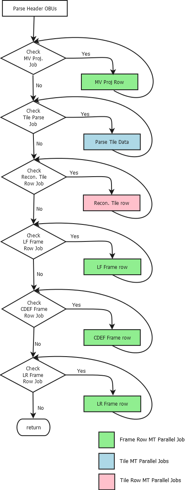

##### Figure 10: Figure 10 Main Thread Flow Chart

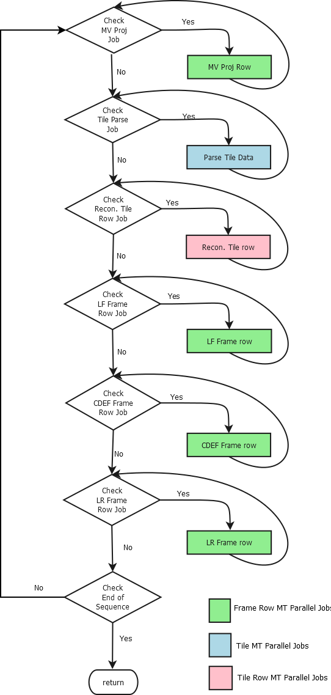

##### Figure 11: Worker Thread Flow Chart

### Tile level Parallelism

The decoder will use tile level parallelism for tile parsing jobs. Let **T** be the number of tiles present in Frame\_i and let **L** be the number of threads working on this frame. Each thread will try to pick up a tile parsing job and execute it as shown in Figure 12 and Figure 13 below.

Please note that the thread number and tile number need not match. Each thread can pick any tile based on job availability. The pictures are just for understanding purpose only.

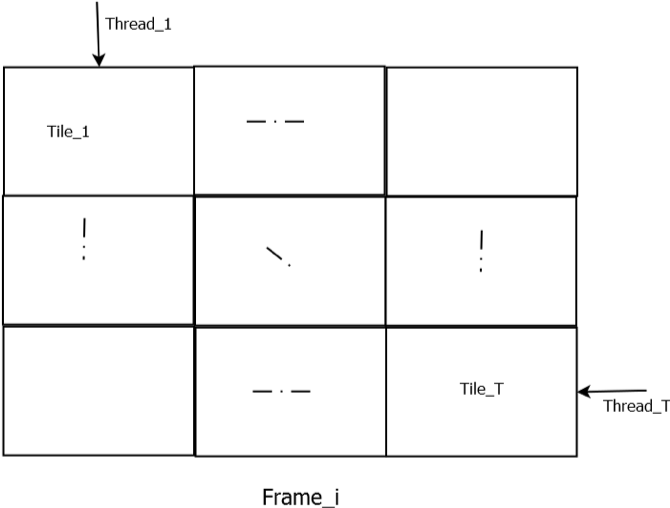

##### Figure 12: Tile Parallelism (L < T)

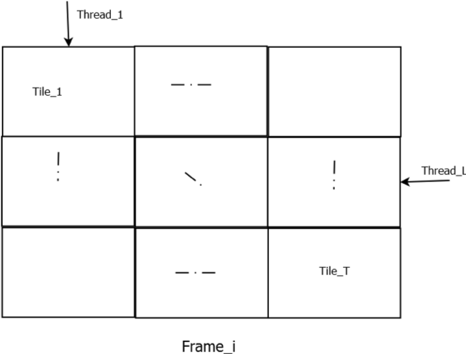

##### Figure 13: Tile Parallelism (L > T)

### Tile Row-level Parallelism

Decoder reconstruction uses tile row-level parallelism. Wavefront Processing (WPP) will be used to handle data dependencies. Figure 14 shows 9 threads reconstructing 4 Tiles in Frame\_i with Tile Row-level parallelism. Each thread picks a Tile row MT job and works in a WPP manner.

Each thread will try to pick a unique tile that has not yet processed any row and continues to pick the tile-row jobs from the same tile until no more jobs are present in the same tile. If all the jobs in current tile are picked, it switches to the new tile with maximum number of jobs to be processed. If a unique tile that has not yet processed any row is not found, it picks the tile with maximum number of jobs to be processed.

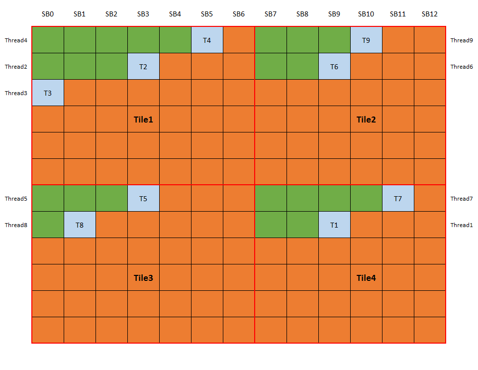

##### Figure 14: Illustration for Tile Row MT for 4 Tiles and 9 Threads

### Frame Row-level Parallelism

All the post-processing filter jobs will use frame row-level parallelism. Wavefront Processing (WPP) will be used to handle data dependencies if required. LF, CDEF, and LR may work with different unit sizes depending on the available parallelism unit instead of SB.

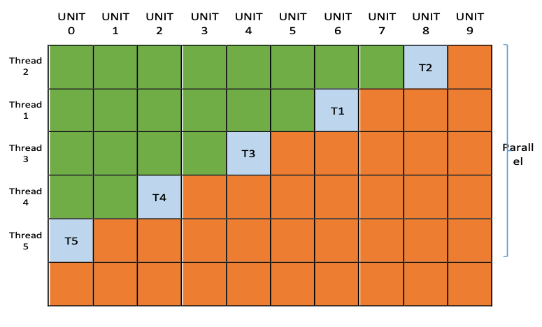

##### Figure 15: Frame\_i with 5 Threads

Figure 15 shows 5 threads applying post-processing filters on Frame\_i. Each thread picks a Frame row MT job and works in a WPP manner.

### Job Selection and Sync Points in MT

The job selection is controlled using shared memory and mutex. DecMtRowInfo (for Parse Tile, Recon Tile, CDEF Frame, LR Frame), DecMtMotionProjInfo (for Motion Projection), DecMtParseReconTileInfo (for Frame Recon) and DecMtlfFrameInfo (for LF Frame) data structures hold these memory for job selection.

The sync points are controlled using shared memory and mutex. The following are the shared memory used for various syncs inside the decoder stages, like top-right sync.

1. sb\_recon\_row\_parsed: Array to store SB Recon rows in the Tile that have completed the parsing. This will be used for sb decode row start processing. It will be updated after the parsing of each SB row in a tile finished. If the value of this variable is set, the recon of an SB row starts. This check is done before decoding of an SB row in a tile starts inside decode\_tile().
2. sb\_recon\_completed\_in\_row: Array to store SBs completed in every SB row of Recon stage. Used for top-right sync. It will be updated with number of SBs being reconstructed after a recon of SB finished. If recon of &#39;Top SB&#39; and &#39;top right SB&#39; is done in the previous row, then only decoding of current SB starts. This check is done before the decoding of SB starts inside the function decode\_tile\_row().
3. sb\_recon\_row\_map: This map is used to store whether the recon of SB row of a tile is finished. Its value is updated after recon of a tile row is done inside decode\_tile() function.  If the recon of &#39;top, top right, current and bottom  SB row&#39; is done, then only LF  of current row starts. This check is done before starting LF inside the function dec\_av1\_loop\_filter\_frame\_mt().
4. lf\_row\_map: This is an array variable of  SB rows to store whether the LF of the current row is done or not. It will be set after the LF of the current row is done. If the LF of the current and next row is done, then only we start CDEF of the current row. This check is done before CDEF of current row starts inside the function svt\_cdef\_frame\_mt().
5. cdef\_completed\_for\_row\_map: Array to store whether CDEF of the current row is done or not. It will be set after the CDEF of the current row is done. If the CDEF of current is done, then only we start LR of the current row. This check is done before LR of current row starts inside the function dec\_av1\_loop\_restoration\_filter\_frame\_mt().
6. Hard-Syncs: The Following are the points where hard syncs, where all threads wait for the completion of the particular stage before going to the next stage, are happening in the decoder.
  1. Hard Sync after **MV Projection**. svt\_setup\_motion\_field() is the function where this hard-sync happens.
  2. Hard Sync after **CDEF** only when the upscaling flag is present. svt\_cdef\_frame\_mt() is the function where this hard-sync happens.
  3. Hard Sync after **LR**. Function where this hard-sync happens is dec\_av1\_loop\_restoration\_filter\_frame\_mt().

## Frame Level Buffers

The following are some important buffers used in the decoder.

| **Structure Description** | **Granularity** |
| --- | --- |
| BlockModeInfo | 4x4 |
| SB info | SB |
| TransformInfo | 4x4 |
| Coeff | 4x4 |
| Delta Q &amp; Delta LF Params | SB |
| cdef\_strength | 64x64 |
| p\_mi\_offset | 4x4 |

Table 1 Important Frame level buffers

### BlockModeInfo

This buffer contains block info required for **Recon**. It is allocated for worst-case every 4x4 block for the entire frame.

Even though the buffer is allocated for every 4x4 in the frame, the structure is not replicated for every 4x4 block. Instead, each block has associated with only one structure even if the block size is more than 4x4. A map with an offset from the start is used for neighbor access purposes. This reduced the need for replication of data structure and better cache efficient usage.

Figure 15 shows a sample superblock split to multiple blocks, numbered from 0 to 18. So 19 BlockModeInfo structures are **continuously populated** from SB start location, corresponding to each block (Instead of replicating the structures for all the 1024 4x4 blocks).  Assume this is the first SB in the picture, then Figure 16 shows the map with offset for each location in the SB and stored in p\_mi\_offset buffer. This map will be used for deriving neighbor BlockModeInfo structure at any location if needed.

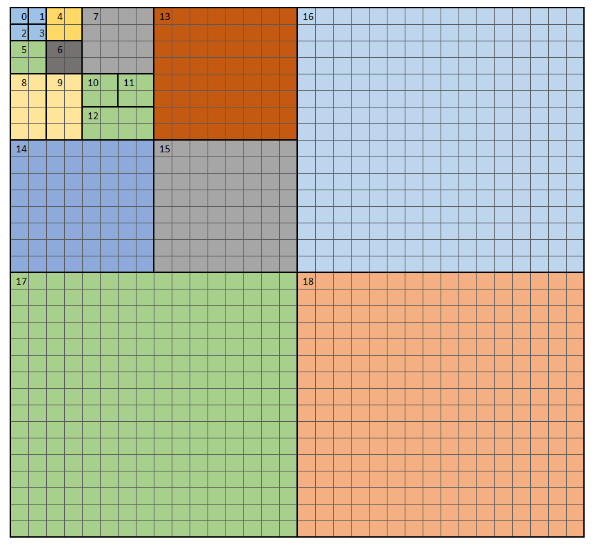

##### Figure 16: Sample SB with Blocks numbered (BlockModeInfo)

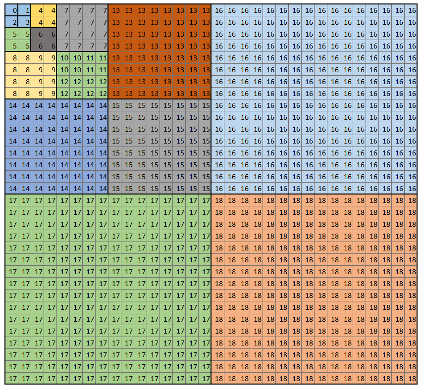

##### Figure 17: Map with offset for each Block (p\_mi\_offset)­

### SB info

This buffer stores SB related data. It is allocated for each SB for the entire frame.

### TransformInfo

Transform info of a TU unit is stored in this buffer. It is allocated for each TU unit, the worst case for each 4x4 in a frame.

### Coeff

This buffer contains coeff of each mi\_unit (4x4). Each mi\_unit contains 16 coeffs. For ST, it is allocated for each 4x4 unit for an SB, whereas for MT it is at each 4x4 for the entire frame.

### delta\_q

 This buffer is used to store delat\_q params and is allocated at the SB level for the entire frame.

### Delta\_lf

This buffer is allocated at the SB level for the entire frame.

### cdef\_strength

This is allocated at the 64x64 level for the entire frame.

## Appendix

### High-level Data Structures

The following are the high-level data structures in the decoder. Major elements in the structure are explained below.

1. **DecConfiguration :**
  * **uint32\_t active\_channel\_count**
  * **uint32\_t channel\_id** ID assigned to each channel when multiple instances are running within the same application.
  * **uint32\_t compressed\_ten\_bit\_format** Offline packing of the 2bits: requires two bits packed input. Default is 0.
  * **EbBool eight\_bit\_output** Outputs 8-bit pictures even if the bitstream has higher bit depth. Ignored if the bitstream is 8-bit. Default is 0.
  * **uint64\_t frames\_to\_be\_decoded** Maximum number of frames in the sequence to be decoded. 0 = decodes the full bitstream. Default is 0.
  * **EbBitDepth max\_bit\_depth**
  * **EbColorFormat max\_color\_format**
  * **uint32\_t max\_picture\_height** Picture parameters -height
  * **uint32\_t max\_picture\_width** Picture parameters -width
  * **uint32\_t num\_p\_frames** Number of frames that can be processed in parallel. Default is 1.
  * **int32\_t operating\_point** Default is -1, the highest operating point present in the bitstream. A value higher than the maximum number of operating points present returns the highest available operating point.
  * **uint32\_t output\_all\_layers** When set to 1, returns output pictures from all scalable layers present in the bitstream. Default is 0, only one output layer is returned, defined by operating\_point parameter
  * **EbBool skip\_film\_grain** Skip film grain synthesis if it is present in the bitstream. Can be used for debugging purpose. Default is 0.
  * **uint64\_t skip\_frames** Skip N output frames in the display order. 0 : decodes from the start of the bitstream. Default is 0.
  * **uint32\_t stat\_report**
  * **uint32\_t threads** Number of threads used by the decoder. Default is 1.

2. **SeqHeader :**
  * **EbColorConfig color\_config** Colour Configuration structure
  * **DecoderModelInfo decoder\_model\_info** Decoder Mode Information structure
  * **uint8\_t decoder\_model\_info\_present\_flag** Specifies whether decoder model information is present in the coded video sequence
  * **uint8\_t delta\_frame\_id\_length** Specifies the number of bits used to encode delta\_frame\_id syntax elements
  * **uint8\_t enable\_cdef** 1: Specifies that cdef filtering may be enabled. 0: specifies that cdef filtering is disabled
  * **uint8\_t enable\_dual\_filter**
    + 1: Indicates that the inter prediction filter type may be specified independently in the horizontal and vertical directions.
    + 0: Indicates only one filter type may be specified, which is then used in both directions.
  * **uint8\_t enable\_filter\_intra**
    + 1: Specifies that the use\_filter\_intra syntax element may be present.
    + 0: Specifies that the use\_filter\_intra syntax element will not be present
  * **uint8\_t enable\_interintra\_compound**
    + 1: Specifies that the mode info for inter blocks may contain the syntax element interintra.
    + 0: Specifies that the syntax element interintra will not be present
  * **uint8\_t enable\_intra\_edge\_filter** Specifies whether the intra edge filtering process should be enabled
  * **uint8\_t enable\_masked\_compound**
    + 1: Specifies that the mode info for inter blocks may contain the syntax element compound\_type
    + 0: Specifies that the syntax element compound\_type will not be present
  * **uint8\_t enable\_restoration**
    + 1: Specifies that loop restoration filtering may be enabled.
    + 0: Specifies that loop restoration filtering is disabled
  * **uint8\_t enable\_superres**
    + 1: Specifies that the use\_superres syntax element will be present in the uncompressed header.
    + 0: Specifies that the use\_superres syntax element will not be present
  * **uint8\_t enable\_warped\_motion**
    + 1: Indicates that the allow\_warped\_motion syntax element may be present
    + 0: Indicates that the allow\_warped\_motion syntax element will not be present
  * **uint8\_t film\_grain\_params\_present** Specifies whether film grain parameters are present in the coded video sequence
  * **uint8\_t frame\_height\_bits**  Specifies the number of bits minus 1 used for transmitting the frame height syntax elements
  * **uint8\_t frame\_id\_length** Used to calculate the number of bits used to encode the frame\_id syntax element.
  * **uint8\_t frame\_id\_numbers\_present\_flag** Specifies whether frame id numbers are present in the coded video sequence
  * **uint8\_t frame\_width\_bits** Specifies the number of bits minus 1 used for transmitting the frame width syntax elements
  * **uint8\_t initial\_display\_delay\_present\_flag** Specifies whether initial display delay information is present in the coded video sequence.
  * **uint16\_t max\_frame\_height** Specifies the maximum frame height minus 1 for the frames represented by this sequence header
  * **uint16\_t max\_frame\_width** Specifies the maximum frame width minus 1 for the frames represented by this sequence header
  * **EbAv1OperatingPoint operating\_point[MAX\_NUM\_OPERATING\_POINTS]** Operating Point Param structure
  * **uint8\_t operating\_points\_cnt\_minus\_1** Indicates the number of operating points minus 1 present in the coded video sequence
  * **OrderHintInfo order\_hint\_info** Order Hint Information structure
  * **uint8\_t reduced\_still\_picture\_header** Specifies that the syntax elements not needed by a still picture are omitted
  * **uint8\_t sb\_mi\_size** Superblock size in 4x4 MI unit
  * **BlockSize sb\_size**
  * **uint8\_t sb\_size\_log2** Superblock size inlog2 unit
  * **uint8\_t seq\_force\_integer\_mv**
    + Equal to SELECT\_INTEGER\_MV indicates that the force\_integer\_mv syntax element will be present in the frame header (providing allow\_screen\_content\_tools is equal to 1).
    + Otherwise, seq\_force\_integer\_mv contains the value for force\_integer\_mv
  * **uint8\_t seq\_force\_screen\_content\_tools**
    + Equal to SELECT\_SCREEN\_CONTENT\_TOOLS, indicates that the allow\_screen\_content\_tools syntax element will be present in the frame header.
    + Otherwise, seq\_force\_screen\_content\_tools contains the value for allow\_screen\_content\_tools
  * **EbAv1SeqProfile seq\_profile** Specifies the features that can be used in the coded video sequence
  * **uint8\_t still\_picture**
    + 1: Specifies that the coded video sequence contains only one coded frame
    + 0: Specifies that the coded video sequence contains one or more coded frames
  * **EbTimingInfo timing\_info** Timing Information structure
  * **uint8\_t use\_128x128\_superblock**
    + 1: Indicates that superblocks contain 128x128 luma samples
    + 0: Indicates that superblocks contain 64x64 luma samples.

3. **FrameHeader :**
  * **uint8\_t all\_lossless** Indicates that the frame is fully lossless at the upscaled resolution
  * **uint8\_t allow\_high\_precision\_mv**
    + 0: Specifies that motion vectors are specified to quarter pel precision
    + 1: Specifies that motion vectors are specified to eighth pel precision
  * **uint8\_t allow\_intrabc**
    + 1: Indicates that the Intra block copy may be used in this frame.
    + 0: Indicates that the Intra block copy is not allowed in this frame
  * **uint8\_t allow\_screen\_content\_tools**
    + 1: Indicates that intra blocks may use palette encoding
    + 0: Indicates that palette encoding is never used
  * **uint8\_t allow\_warped\_motion**
    + 1: Indicates that the syntax element motion\_mode may be present
    + 0: Indicates that the syntax element motion\_mode will not be present
  * **uint32\_t buffer\_removal\_time[MAX\_NUM\_OPERATING\_POINTS]** Specifies the frame removal time in units of DecCT clock ticks counted from the removal time of the last random access point for operating point op\_num
  * **uint8\_t buffer\_removal\_time\_present\_flag**
    + 1: Specifies that buffer\_removal\_time is present.
    + 0: Specifies that buffer\_removal\_time is not present
  * **CdefParams cdef\_params** Constrained Directional Enhancement Filter
  * **uint8\_t coded\_lossless** Indicates that the frame is fully lossless at the coded resolution of FrameWidth by FrameHeight
  * **uint32\_t current\_frame\_id** Specifies the frame id number for the current frame
  * **DeltaLfParams delta\_lf\_params** Delta Loop Filter Parameters
  * **DeltaQParams delta\_q\_params** Delta Quantization Parameters
  * **uint8\_t disable\_cdf\_update** Specifies whether the CDF update in the symbol decoding process should be disabled
  * **uint8\_t disable\_frame\_end\_update\_cdf**
    + 1: Indicates that the end of frame CDF update is disabled
    + 0: Indicates that the end of frame CDF update is enabled
  * **uint8\_t error\_resilient\_mode**
    + 1: Indicates that error resilient mode is enabled
    + 0: Indicates that error resilient mode is disabled
  * **AomFilmGrain film\_grain\_params** Film Grain Parameters
  * **uint8\_t force\_integer\_mv**
    + 1: Specifies that motion vectors will always be integers
    + 0: Specifies that motion vectors can contain fractional bits
  * **uint32\_t frame\_presentation\_time** Specifies the presentation time of the frame in clock ticks DispCT counted from the removal time of the last random access point for the operating point that is being decoded
  * **int32\_t frame\_refs\_short\_signaling**
  * **FrameSize frame\_size** Frame Size structure
  * **FrameType frame\_type** Specifies the type of the frame
  * **InterpFilter interpolation\_filter** Specifies the filter selection used for performing inter prediction
  * **uint8\_t is\_motion\_mode\_switchable**
    + 0: Specifies that only the SIMPLE motion mode will be used
  * **struct LoopFilter loop\_filter\_params** Loop Filter Parameters
  * **uint8\_t lossless\_array[MAX\_SEGMENTS]** Indicates the flag to set coded\_lossless variable
  * **LrParams lr\_params[MAX\_MB\_PLANE]** Loop Restoration Parameters
  * **uint32\_t mi\_cols**
  * **uint32\_t mi\_rows**
  * **uint32\_t mi\_stride**
  * **uint32\_t order\_hint** Used to compute OrderHint
  * **uint32\_t order\_hints[REF\_FRAMES]** Specifies the expected output order for each reference frame
  * **uint8\_t primary\_ref\_frame** Specifies which reference frame contains the CDF values and other states that should be loaded at the start of the frame
  * **QuantizationParams quantization\_params** Quantization Parameters
  * **uint8\_t reduced\_tx\_set**
    + 1: specifies that the frame is restricted to a reduced subset of the full set of transform types
  * **uint8\_t ref\_frame\_idx[REF\_FRAMES]** Specifies which reference frames are used by inter frames
  * **uint32\_t ref\_frame\_sign\_bias[TOTAL\_REFS\_PER\_FRAME]**
    + 1: Indicates that the end of frame CDF update is disabled
    + 0: Indicates that the end of frame CDF update is enabled
  * **uint32\_t ref\_order\_hint[REF\_FRAMES]** Specifies the expected output order hint for each reference frame
  * **uint32\_t ref\_valid[REF\_FRAMES]** An array which is indexed by a reference picture slot number
    + 1: Signifies that the corresponding reference picture slot is valid for use as a reference picture
    + 0: Signifies that the corresponding reference picture slot is not valid for use as a reference picture
  * **ReferenceMode reference\_mode** Reference Mode structure
  * **uint8\_t refresh\_frame\_flags** Specifies the length of the buffer\_removal\_time syntax element
  * **SegmentationParams segmentation\_params** Segmentation Parameters
  * **uint8\_t show\_existing\_frame**
    + 1: Indicates the frame indexed by frame\_to\_show\_map\_idx is to be output.
    + 0: Indicates that further processing is required
  * **uint8\_t show\_frame**
    + 1: Specifies that this frame should be immediately output once decoded
    + 0: Specifies that this frame should not be immediately output
  * **uint8\_t showable\_frame**
    + 1: Specifies that the frame may be output using the show\_existing\_frame mechanism
    + 0: Specifies that this frame will not be output using the show\_existing\_frame mechanism
  * **SkipModeInfo skip\_mode\_params** Skip Mode Parameters
  * **TilesInfo tiles\_info** Tile information
  * **TxMode tx\_mode** Specifies how the transform size is determined
  * **uint8\_t use\_ref\_frame\_mvs**
    + 1: Specifies that motion vector information from a previous frame can be used when decoding the current frame
    + 0: Specifies that this information will not be used

4. **DecHandle :**
  * **struct Av1Common cm**
  * **EbDecPicBuf\* cur\_pic\_buf[DEC\_MAX\_NUM\_FRM\_PRLL]**
  * **uint32\_t dec\_cnt**
  * **EbSvtAv1DecConfiguration dec\_config**
  * **EbHandle\* decode\_thread\_handle\_array**
  * **FrameHeader frame\_header**
  * **uint8\_t is\_lf\_enabled**
  * **MasterFrameBuf master\_frame\_buf** Master Frame Buf containing all frame level bufs like ModeInfo for all the frames in parallel
  * **int32\_t mem\_init\_done** Flag to signal decoder memory init is done
  * **EbMemoryMapEntry\* memory\_map**
  * **uint32\_t memory\_map\_index**
  * **EbMemoryMapEntry\* memory\_map\_init\_address**
  * **EbDecPicBuf\* next\_ref\_frame\_map[REF\_FRAMES]**
  * **int32\_t num\_frms\_prll** Num frames in parallel
  * **void\* pv\_dec\_mod\_ctxt**
  * **void\* pv\_lf\_ctxt**
  * **void\* pv\_lr\_ctxt**
  * **void\* pv\_master\_parse\_ctxt**
  * **void\* pv\_pic\_mgr** Pointer to Picture manager structure
  * **EbDecPicBuf\* ref\_frame\_map[REF\_FRAMES]**
  * **struct ScaleFactors ref\_scale\_factors[REF\_FRAMES]**
  * **int32\_t remapped\_ref\_idx[REF\_FRAMES]**
  * **uint8\_t seen\_frame\_header**
  * **SeqHeader seq\_header**
  * **int32\_t seq\_header\_done** Flag to signal seq\_header done
  * **struct ScaleFactors sf\_identity** Scale of the current frame with respect to itself.
  * **uint8\_t show\_existing\_frame**
  * **uint8\_t show\_frame**
  * **uint8\_t showable\_frame**
  * **uint32\_t size**
  * **EbBool start\_thread\_process**
  * **struct DecThreadCtxt\* thread\_ctxt\_pa**
  * **EbHandle thread\_semaphore**
  * **uint64\_t total\_lib\_memory**
