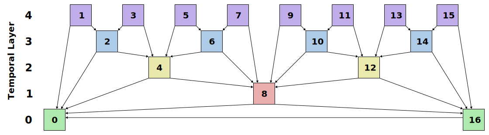
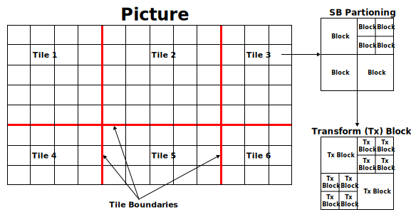
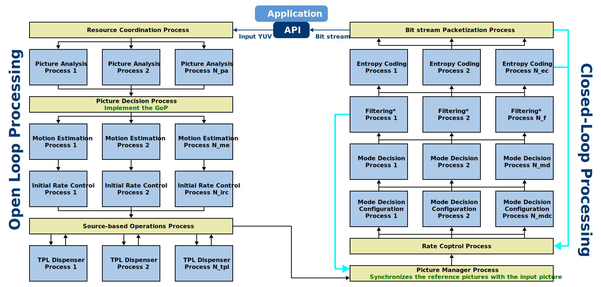
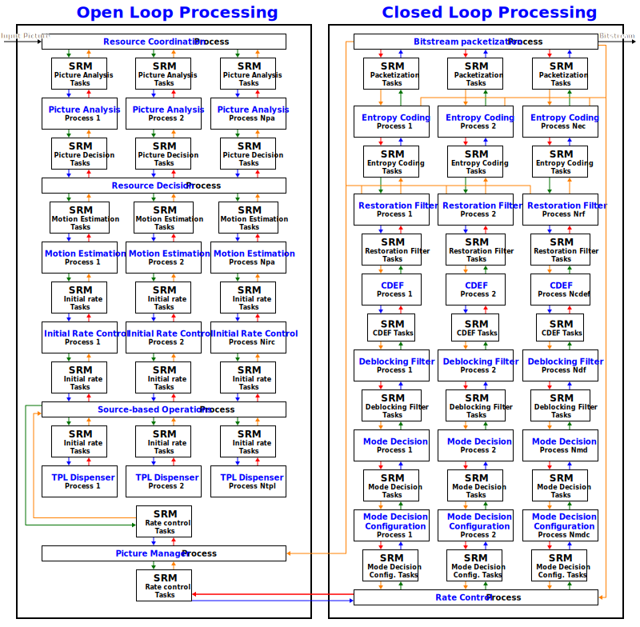
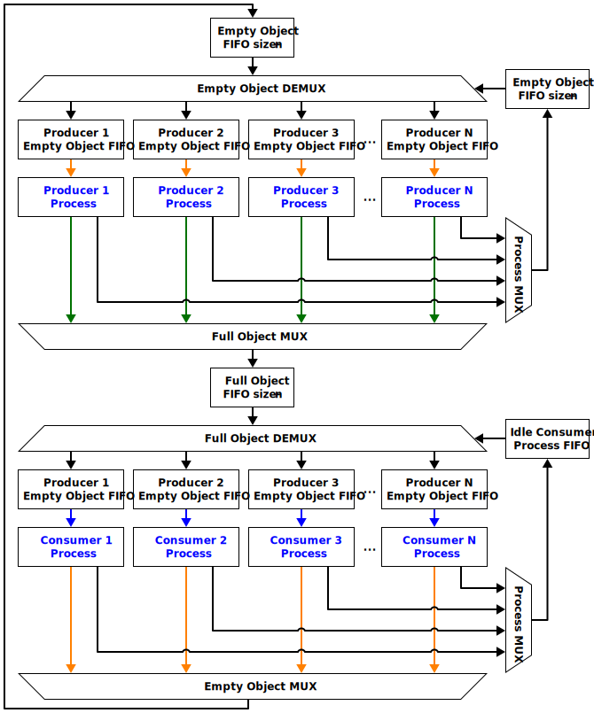
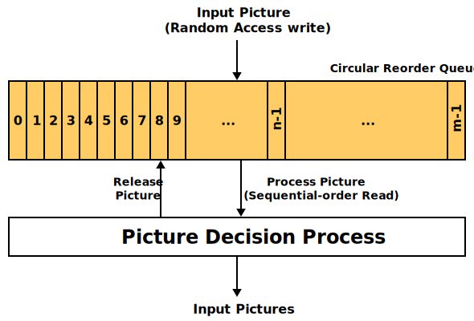
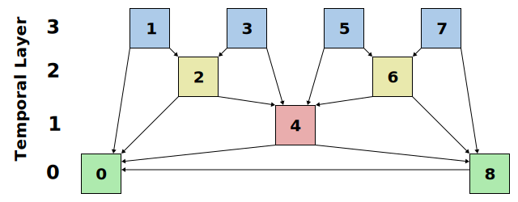
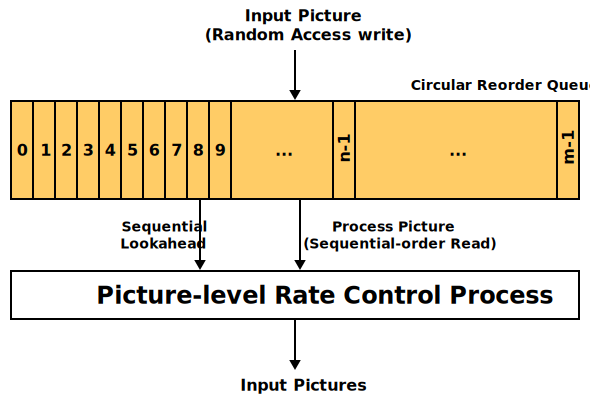
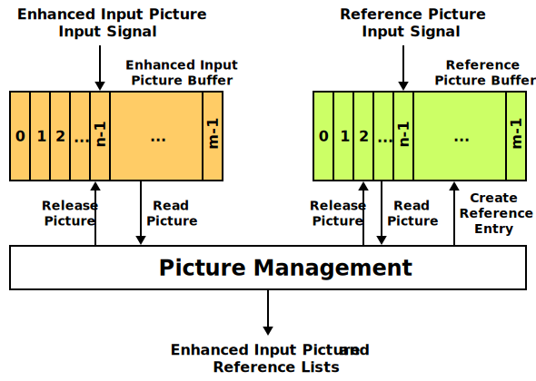

[Top level](../README.md)

# Encoder Design for SVT-AV1 (Scalable Video Technology for AV1 Encoder)

## Table of Contents
__[TOC]__

## List of Figures
- [Figure 1](#figure-1): Five-layer prediction structure used in the SVT-AV1 encoder with one reference picture in each direction.
- [Figure 2](#figure-2): Picture partitioning diagram.
- [Figure 3](#figure-3): High-level encoder process dataflow.
- [Figure 4](#figure-4): Detailed encoder process dataflow.
- [Figure 5](#figure-5): Illustration of segment-based processing: The squares in the picture represent segments. Light yellow segments
                         have already been processed. Dark yellow segments are being processed in a parallel manner.
- [Figure 6](#figure-6): System resource manager dataflow.
- [Figure 7](#figure-7): Picture decision process dataflow.
- [Figure 8](#figure-8): An example of a four-layer prediction structure.
- [Figure 9](#figure-9): Initial Rate Control Process Dataflow.
- [Figure 10](#figure-10): Picture Management Dataflow.

## List of Tables
- [Table 1](#table-1): Examples of Configuration Set Members.
- [Table 2](#table-2): Examples of Sequence Control Set Members.
- [Table 3](#table-3): Examples of Picture Parent Control Set Members.
- [Table 4](#table-4): Examples of Picture Descriptor Members.
- [Table 5](#table-5): Settings for the show_frame and Show_existing_frame flags when encoding
                       one mini-GoP in a 4-layer prediction structure.

# Introduction

This document describes the Intel SVT-AV1 encoder design. In particular, the
encoder block diagram and the system resource manager are described. A brief
description of the various processes involved in the encoder pipeline is also
presented. Details on the encoder processes are included in appendices. This
document is meant to be an accompanying document to the “C Model” source code,
which contains the more specific details of the inner workings of each
algorithm.

# Definitions

This section contains definitions used throughout this design document.

### General Definitions

| **Term**                 | **Definition**                                                                                                        |
| ---                      | ---                                                                                                                   |
| Picture                  | Collection of luma and chroma samples assembled into rectangular regions with a width, height and sample bit-depth.   |
| Super block (SB)         | A square block of luma and chroma samples defined to have a size of either 64x64 or 128x128 luma samples.             |
| Block                    | A square or rectangular region of data that is part of a SB and that is obtained through the partitioning of the SB.  |
| Transform block          | A square or rectangular region of data whose size is the same as or smaller than the size of the corresponding block. |
| Bitstream                | A collection of bits corresponding to entropy coded data.                                                             |
| Syntax elements          | Pre-entropy coder encoded symbols used during the decoding reconstruction process.                                    |
| Tiles                    | A rectangular collection of SBs which are independently decodable.                                                    |
| Groups-of-Pictures (GoP) | A collection of pictures with a particular referencing structure.                                                     |
| SAD                      | Sum of absolute differences, representing the sum of absolute values of sample differences; distortion measurement.   |
| SSE                      | Sum of squared sample error; distortion measurement.                                                                  |

### Source Partitioning

The source video is partitioned into various groupings of various spatial and
temporal divisions. The following partitions and nomenclature are used
extensively within this document and the source code. Furthermore, the
following partitioning scheme determines data flow and influences algorithmic
designs. At the highest level, pictures in the source video are grouped into
groups of pictures (GoPs) that are defined according the prediction structure.
Figure 1 shows an example of the relationship between pictures contained in a
five-layer prediction structure where each frame references only one picture in
each direction. In a prediction structure, each picture is of a particular
prediction type and belongs to a specific temporal layer. Also, each picture
might reference other pictures depending on its picture type and it might be
referenced itself multiple times or not at all depending on the Prediction
Structure used and the picture’s relative position within the period. In the
example shown in Figure 1, Pictures 0 and 16 are said to belong to temporal
layer 0 or base layer, whereas pictures 1, 3, 5, 7, 9, 11, 13 and 15 are said
to belong to the non-reference layer or temporal layer 4.

##### Figure 1: Five-layer prediction structure used in the SVT-AV1 encoder with one reference picture in each direction.

Figure 2 shows the relationship between Pictures, Tiles, SBs, blocks and
transform blocks.

##### Figure 2: Picture partitioning diagram.

## High-level encoder architecture

The encoder is designed around *processes*. A process is an execution
thread in software or an IP core in hardware. Processes execute one or
more encoder tasks (e.g., motion estimation, rate control, deblocking
filter, etc.). Processes are either control oriented and picture
based, or are data processing oriented. An example of a control process
is the Picture Manager Process, which determines the prediction
structure and when input pictures are available to start encoding
depending on the state of the decoded reference picture buffer. An
example of a data processing process is the Motion Estimation Process,
which performs Motion Estimation on the input picture data. Only one
process of each control process is allowed since control decisions
cannot be made independently of each other without risking data leakage
and deadlock scenarios.

To facilitate parallel processing on a variety of compute platforms
(e.g., multi-core general purpose CPUs, GPUs, DSPs, FPGAs, etc.),
inter-process communication should be minimized. One important design
feature of the SVT-AV1 encoder architecture is that processes are
stateless. All information related to process states is conveyed via
inter-process control and data information. System resource managers
manage inter-process control and data information coherence through FIFO
buffers and are discussed in detail later.

The architecture is flexible enough to support an implementation in which
one superblock (SB) at a time is encoded through the entire pipeline.
Alternatively, a single encoder task might process all SBs in a picture
before moving on to the next task. In the latter case for example, motion
estimation might be performed on all SBs within a picture before moving
to the next task. Statistics about each picture important for rate control
are gathered early in the processing pipeline and used in subsequent tasks.
To allow for low-delay, the rate control process may proceed before all motion
estimation picture processes are complete. The picture QP value is derived using
information available to it at the time the QP is derived. The QP may be varied on a
SB basis within the coding loop process. The next major processing step involves
the processes associated with the coding loop. The latter includes encoding
tasks such as intra prediction, mode decision, transform and quantization.
Subsequent processing would involve filtering operations that include the
in-loop deblocking filter, CDEF and restoration filter; followed by entropy
coding and packetization.

In the SVT-AV1 encoder, a picture could be divided into segments.
Parallelism in the encoder could be achieved at multiple levels. At the
process level, different processes could be running simultaneously,
where each process could, for example, be performing a different task in
the encoding pipeline. At the picture level, multiple instances of the
same process could process different pictures simultaneously. At the
segment level, multiple instances of a given process could process
different segments from the same picture simultaneously.

A high-level diagram of the encoder pipeline is shown in Figure 3, with
more details provided in Figure 4. An illustration of the segment level
processing is shown in Figure 5.

##### Figure 3. High-level encoder process dataflow (*Filtering processes refer to the filtering processes related to the deblocking filter, CDEF and restoration filter).

##### Figure 4. Detailed encoder process dataflow.

##### Figure 5. Illustration of segment-based processing. The squares in the picture represent segments. Light yellow segments have already been processed. Dark yellow segments are being processed in a parallel manner.

## Inter-process data and control management

*System resource managers* perform inter-process data and control management.
They manage *objects* and connect processes to one another by controlling how
objects are passed. Objects encapsulate data and control information and are
organized into four types: results, sequence control sets, picture control
sets, and picture descriptors. Objects are described later in this section.

Figure 6 shows a block diagram of a system resource manager. As depicted in the
diagram, the empty object path begins when an empty object from the empty
object FIFO is assigned to one of N producer processes. The producer process
fills the empty object with data and control information and queues the now
full object onto the full object FIFO. In a similar manner, the full object
path begins when a full object from the full object FIFO is assigned to one of
M consumer processes. The consumer process uses the information in the full
object and completes the data path by queuing the now empty object back onto
the original empty object FIFO. To better understand how the encoder block
diagram in Figure 4 and the system resource manager block diagram in Figure 6
relate to one another, we have used matching line colors to indicate
corresponding object flow. It is important to note that each encoder process
acts as both a producer and consumer of objects to processes occurring later,
and respectively, earlier in the encoder pipeline.

The system resource manager dynamically assigns objects to processes to
minimize idle process time. In addition, separate coordination of the empty and
full object paths allows a great deal of configuration flexibility. This
flexibility is important when, for example, producer and consumer processes
require differing amounts of computational resources. In this case, a system
resource manager may have N producers and M consumers where N is not equal to
M.

##### Figure 6: System resource manager dataflow.

### Objects

Objects encapsulate inter-process data and control information. While
the term object may have a wide variety of meanings, in this document
object shall be used exclusively to refer to four types of data and
control information: *sequence control sets, picture control sets,
picture descriptors, and results*. The objects are described in detail
below.

#### Sequence Control Set

The sequence control set object contains a mixture of system resources
(e.g., system resource managers, a picture descriptor pool, API callback
functions, etc.) and encoder configuration parameters that may apply to
more than one picture (e.g., GOP length, prediction structure, number of
reference pictures, motion estimation search range, target bit rate,
etc.).

The data structures associated with sequence control set objects are
defined in sequence_control_set.h.

#### Picture Control Set

The picture control set object contains encoder configuration parameters
that apply to a single picture (e.g., picture descriptors, reference
lists, SB motion and mode information, etc.). The information carried by
the results object has a lifetime of at most one picture time interval.

The data structures associated with picture control set objects are
defined in pcs.h.

#### Picture Descriptors

The picture descriptor object contains data and control information that
describe picture attributes. The input, enhanced, motion compensated
prediction, reconstructed, and reference pictures all have associated
picture descriptor objects. In addition, transform coefficients
generated in the coding loop process and consumed by the entropy coding
process have an associated picture descriptor. Examples of data and
control information conveyed by picture descriptor objects include:
color space, bit depth, picture dimensions, and pointers to memory
locations containing the picture data.

The data structures associated with picture descriptor objects are
defined in pic_buffer_desc.h.

#### Results

The results object is used to convey data and control information
between two processes. Producer processes fill results objects while
consumer processes use the information conveyed in those objects. A
consumer process waits (i.e., blocks) for a results object to arrive
from the preceding producer process before commencing execution. Results
objects convey process state information explicitly in the case of
encoder parameters (e.g., bit depth, color space, etc.) and implicitly
in the case of system timing (e.g., when to begin execution).

The data structures associated with results objects are defined in
results header files, e.g, rc_results.h.

## System Resource Manager (SRM)

The system resource managers manage objects and connect processes to one
another by controlling how objects are passed. They provide the link
between processes through which nearly all inter-process communication
takes place. The encoder block diagram shows only system
resource manager associated with results objects. It is important to
understand that the encoder block diagram does not depict system
resource managers associated with other objects.

### Resource manager components

As shown in Figure 6, the system resource managers comprise many
individual components. These components are described in this
subsection.

#### Empty object FIFO

The empty object FIFO contains empty objects that have not yet been
assigned to a producer process. When an object is released, it is placed
back into the empty object FIFO. As with all objects, empty objects are
not restricted to use within the context of a single resource manager.
For example, sequence control set objects are passed throughout the full
encoder pipeline.

#### Producer empty object FIFO

The $`\mathrm{i^{th}}`$ producer empty object FIFO contains empty objects
that have been assigned to the $`\mathrm{i^{th}}`$ producer process. The
$`\mathrm{i^{th}}`$ producer process requires an empty object from the
$`\mathrm{i^{th}}`$ producer empty object FIFO in order to begin execution.
The $`\mathrm{i^{th}}`$ producer empty object FIFO is hardcoded to the
$`\mathrm{i^{th}}`$ producer process.

#### Producer process

The producer process works to convert empty objects provided by its
producer empty object FIFO into full objects. The producer process
queues recently filled objects onto the full object FIFO. It is
important to understand that a process that is a producer process in a
system resource manager can simultaneously be a consumer process in a
different system resource manager. When a producer process completes its
task, it places itself on the producer process FIFO.

#### Producer process FIFO

The producer process FIFO contains producer processes waiting to be
assigned an empty object on which to work. Without the producer process
FIFO, producer processes would have to poll the empty object FIFO that
can lead to inefficiencies when the empty object FIFO contains no empty
objects.

#### Full object FIFO

The full object FIFO contains full objects that have not yet been
assigned to a consumer process. Only system resource managers that
manage results objects have full object FIFOs.

#### Consumer full object FIFO

The $`\mathrm{j^{th}}`$ consumer full object FIFO contains full objects that
have been assigned to the $`\mathrm{j^{th}}`$ consumer process. The
$`\mathrm{j^{th}}`$ consumer process requires an empty object from the
$`\mathrm{j^{th}}`$ consumer full object FIFO in order to begin execution.
The $`\mathrm{j^{th}}`$ consumer full object FIFO is hardwired to the
$`\mathrm{j^{th}}`$ consumer process.

#### Consumer process

The consumer process uses full objects provided by its consumer full
object FIFO. The consumer process queues used objects onto the empty
object FIFO. It is important to understand that a process that is a
consumer process in a system resource manager can simultaneously be a
producer process in a different system resource manager. When a consumer
process completes its task, it places itself on the consumer process
FIFO. System resource managers managing results objects are the only
resource managers with an associated consumer process. Sequence control
set, picture control set, and picture descriptor objects do not have
consumer processes.

#### Consumer process FIFO

The consumer process FIFO contains consumer processes waiting to be
assigned a full object to use. Without the consumer process FIFO,
consumer processes would have to poll the full object FIFO which can
lead to inefficiencies when the full object FIFO contains no full
objects.

#### Resource manager execution flow snapshot

This subsection contains an execution flow snapshot whose purpose is to
show how the individual components of the system resource manager
interact with one another. Refer to Figure 6.

1.  The producer process produces a full object (dark green arrows)

2.  The full object demux queues the object in the full object FIFO

3.  The full object MUX checks the status of the consumer process FIFO.
    If the consumer process FIFO

    1.  is not empty then the first object in the full object FIFO is
        assigned to the first process identified in the consumer process
        FIFO. The assignment wakes the first process in the consumer
        process FIFO.

    2.  is empty, then the producer process requests an empty object
        from its empty object FIFO and continues to step 1

4.  The consumer process awoken in step 3a begins to work and consumes
    the full object (blue arrows)

5.  The consumer releases its used full object whereupon it is returned
    to the Empty Object FIFO (red arrows)

Note the following:
- Steps 1 and 2 are carried out by the producer process. Step 3 is
carried out in the system resource code, while steps 4 and 5 are
executed by the consumer process.

- The $`\mathrm{i^{th}}`$ producer process will not become active if the
$`\mathrm{i^{th}}`$ producer empty object FIFO contains no objects

- The $`\mathrm{i^{th}}`$ consumer process will not become active if the
$`\mathrm{i^{th}}`$ consumer full object FIFO contains no objects

- The tangerine arrows depict the producer processes’ acquisition of
empty objects and are not described in the execution flow snapshot
above.

## High-level Data Structures

There are many signals that are used throughout the encoder at various
stages and for various amounts of time. The following groups of signals
are used extensively throughout the encoder.

### Configuration Set

The configuration sets (EbSvtAv1EncConfiguration) are general settings that can be used to control
the encoder externally.

##### <a name = "table-1"> Table 1: Examples of Configuration Set Members. </a>

| **Signal**            | **Description**                                               |
| --------------------- | ------------------------------------------------------------- |
| frame\_rate           | Input frame rate                                              |
| intra\_period\_length | Interval between successive I-pictures                        |
| hierarchical\_levels  | The number of levels of hierarchy in the Prediction Structure |

### Sequence Control Set (SCS)

The Sequence Control Set contains information specific to the whole
sequence. The relevant data structure is SequenceControlSet\_s.

##### <a name = "table-2"> Table 2: Examples of Sequence Control Set Members </a>

| **Signal**               | **Description**              |
| ------------------------ | ---------------------------- |
| max\_input\_luma\_width  | Width of picture             |
| max\_input\_luma\_height | Height of picture            |
| profile\_idc             | Defines the encoding profile |
| level\_idc               | Defines the encoding level   |

### Picture Control Set (PCS)

The Picture Control Set contains the information for individually coded
pictures. The information is split between Picture Parent Control Set and
Picture Control Set. Picture Parent Control Set is used in the first few
processes in the pipeline (from Resource Coordination process to Source-Based
Operations process) and lasts the whole time the picture is in the encoder
pipeline. The Picture control set includes a pointer to the Picture Parent
Control Set and includes also additional information needed in the subsequent
processes starting at the Picture Manager process (i.e. in the closed loop).
The relevant data structures are PictureParentControlSet\_s and
PictureControlSet\_s.

##### <a name = "table-3"> Table 3: Examples of Picture Parent Control Set Members </a>

| **Signal**                 | **Description**                                                               |
| -------------------------- | ----------------------------------------------------------------------------- |
| av1\_frame\_type           | 0 (KEY\_FRAME) to 3 (S\_FRAME)                                                |
| show\_frame                | 1/0: Display or not decoded frame                                             |
| is\_skip\_mode\_allowed    | 1/0: sets whether using skip modes is allowed within the current frame or not |
| allow\_high\_precision\_mv | 1/0 Enable/disable eighth pel MV precision                                    |
| base\_qindex               | quantization base index for the picture                                       |

### Picture Descriptors

Picture descriptors provide information on the various picture buffers
used in the encoder. The relevant data structure is
EbPictureBufferDesc\_s.

##### <a name = "table-4"> Table 4: Examples of Picture Descriptor Members </a>

| **Signal**              | **Description**                                                                          |
| ----------------------- | ---------------------------------------------------------------------------------------- |
| buffer\_y               | Address of the luma buffer                                                               |
| buffer\_cb              | Address of the Cb chroma buffer                                                          |
| buffer\_cr              | Address of the Cr chroma buffer                                                          |
| origin\_x               | Contains the x-padding offset of the picture buffer (luma)                               |
| origin\_y               | Contains the y-padding offset of the picture buffer (luma)                               |
| width                   | Luma picture width excluding padding                                                     |
| height                  | Luma picture height excluding padding                                                    |
| bit\_depth              | The bitdepth of the buffers                                                              |
| luma\_size              | The size (bytes) of the luma buffers                                                     |
| chroma\_size            | The size (bytes) of the chroma buffers                                                   |
| stride\_y               | The number of luma samples to increment a position to the next line (includes padding)   |
| stride\_cb / stride\_cr | The number of chroma samples to increment a position to the next line (includes padding) |

## Encoder Processes and Algorithms

The following section describes the processes and algorithms used in the
SVT-AV1 encoder. The first-level subsections describe the operation of
each concurrent process found in Figure 4.

### Resource Coordination Process

The Resource Coordination Process performs two functions, namely it
gathers input data and distributes encoder-setting changes properly into
the encoder pipeline. Input data is passed to the encoder in packets
that can contain varying amounts of data from partial segments of one
input pictures to multiple pictures. The Resource Coordination Process
assembles the input data packets into complete frames and passes this
data along with the current encoder settings to the Picture Analysis
Processes. Encoder settings include, but are not limited to Bitrate
Settings, Rate Control Mode of operation, etc.

### Picture Analysis Process

The Picture Analysis processes perform the first stage of encoder
pre-processing analysis as well as any intra-picture image conversion
procedures, such as resampling, color space conversion, or tone mapping.
The Picture Analysis processes can be multithreaded and as such can
process multiple input pictures at a time. The encoder pre-analysis
includes creating an n-bin histogram for the purpose of scene change
detection, gathering the $`\mathrm{1^{st}}`$ and $`\mathrm{2^{nd}}`$ moment
statistics for each 8x8 block in the picture which are used to compute
variance, input subsampling and screen content detection. All
image-modifying functions should be completed before any
statistics-gathering functions begin.

### Picture Decision Process

The Picture Decision process performs multi-picture level decisions,
including setting of the prediction structure, setting the picture type,
and scene change detection. Since the prior Picture Analysis process
stage is multithreaded, inputs to the Picture Decision Process can
arrive out-of-display-order, so a reordering queue is used to enforce
processing of pictures in display order. The algorithms employed in the
Picture Decision process are dependent on prior pictures’ statistics, so
the order in which pictures are processed must be strictly enforced.
Additionally, the Picture Decision process uses the reorder queue to
hold input pictures until they can be started into the Motion Estimation
process while following the proper prediction structure. The data flow
in the picture decision process is show in Figure 7.

##### Figure 7: Picture decision process dataflow.

**Setting up the prediction structure**. To illustrate the process by
which a prediction structure is implemented, an example showing a
four-layer prediction structure is shown in Figure 8. The prediction
structure is implemented using the Show\_frame and Show\_existing\_frame
flags, as shown in the table below.

##### Figure 8. An example of a four-layer prediction structure.

##### <a name = "table-5"> Table 5: Settings for the show\_frame and Show\_existing\_frame flags when encoding one mini-GoP in a 4-layer prediction structure.</a>

| **PicNumber** | **Show\_frame** | **Show\_existing\_frame** | **DPB**        |
| --------- | ----------- | --------------------- | ---------- |
| 0         | 1           | 0                     | 0          |
| 8         | 0           | 0                     | 8-0        |
| 4         | 0           | 0                     | 4-8-0      |
| 2         | 0           | 0                     | 2-4-8-0    |
| 1         | 1           | 0                     | 2-4-8-0    |
| 2e        | 0           | 1                     | 2-4-8-0    |
| 3         | 1           | 0                     | 2-4-8-0    |
| 4e        | 0           | 1                     | 2-4-8-0    |
| 6         | 0           | 0                     | 6-2-4-8-0  |
| 5         | 1           | 0                     | 6-2-4-8-0  |
| 6e        | 0           | 1                     | 6-2-4-8-0  |
| 7         | 1           | 0                     | 6-2-4-8-0  |
| 8e        | 0           | 1                     | 6-2-4-8-0  |
| 16        | 0           | 0                     | 6-2-4-8-16 |

### Motion Estimation Process

The Motion Estimation (ME) process performs motion estimation. This process has
access to the current input picture as well as to the input pictures the
current picture uses as references according to the prediction structure
pattern. The Motion Estimation process is multithreaded, so pictures can be
processed out of order as long as all inputs are available. More details are
available in the motion estimation appendix.

### Initial Rate Control Process

The Initial Rate Control process determines the initial bit budget for
each picture depending on the data gathered in the Picture Analysis and
Motion Estimation processes as well as the settings determined in the
Picture Decision process. The Initial Rate Control process also employs
a sliding window buffer to analyze multiple pictures if a delay is
allowed. Note that through this process, until the subsequent Picture
Manager process, no reference picture data has been used. The data flow
in the Initial Rate Control process is illustrated in Figure 9.

##### Figure 9: Initial Rate Control Process Dataflow.

### Source-based Operations Process

Source-based operations process involves several analysis algorithms to
identify spatiotemporal characteristics of the input pictures. Additional
analysis is performed using the Temporal Dependency Model algorithm discussed
in the TPL appendix.

### Picture Manager Process

The Picture Manager Process performs the function of managing both the
Enhanced (Input) Picture and Reference Picture buffers and subdividing
the Input Picture into Tiles. Both the Enhanced Picture and Reference
Picture buffers particular management depends on the GoP structure
currently in use. The Picture Manager Process uses the Enhanced Picture
and Reference Picture buffers to implement Pyramidal B GoP structures.
Figure 10 shows the interaction of the Picture Management algorithm with
the Enhanced Input Picture and Reference Picture buffers.

##### Figure 10: Picture Management Dataflow.

The Picture Manager Processes runs in an asynchronous mode of operation
where the Picture Management algorithm is run whenever an Enhanced Input
Picture or Reference Picture input are received. For both Enhanced Input
Pictures and Reference Picture inputs, the Picture is first placed in
the appropriate picture buffer. Then the Picture Management algorithm is
run.

The Picture Management algorithm walks the Enhanced Input Picture Buffer
and for each entry checks if the necessary Reference Pictures are
available in the Reference Picture Buffer. If all the References are
available, the encoding of the picture can start. Additionally, an
entry is made in the Reference Picture Buffer for the
now active Input Picture where the Input Picture’s finished Reference
Picture will be stored for future reference. This entry contains a
descriptor to the Reference Picture data and a count of the Expected
References by subsequent pictures in coding order. Finally, for each
Reference Picture in the Reference Lists, the expected reference count
for the Reference Picture’s corresponding Reference Picture Buffer entry
is decremented by one. Once the expected reference count is decremented
to zero, the Reference Picture’s entry is removed from the Reference
Picture Buffer. When the Picture Manager Process receives a Key\_Frame
flag or prediction structure reset, the Reference Picture Buffer entries
must be decremented properly to avoid memory leakage. All buffer
management actions are triggered by either receiving a Key\_Frame,
prediction structure reset, or upon the successful start of an Input
Picture into the pipeline.

### Rate Control Process

The Rate Control process uses the distortion and image statistics generated in
previous processes, the current picture’s bit budget, and previous picture
statistics to set the QP and the bit budget for each picture. The encoder
currently supports VBR -type of rate control. Details of the rate control
algorithm are discussed in the rate control appendix.

### Mode Decision Configuration Process

The Mode Decision Configuration Process operates at the picture-level, and
involves several initialization steps, such as setting flags for some features
(e.g. OBMC, warped motion, etc.). Examples of the initializations include
initializations for picture chroma QP offsets, CDEF strength, self-guided
restoration filter parameters, quantization parameters, lambda arrays, and
syntax, mv and coefficient rate estimation arrays.

### Mode Decision

The mode decision (MD) process involves selecting the partitioning and coding
modes for each SB in the picture. The process acts on each SB and produces AV1
conformant reconstructed samples for the picture, as well as all mode
information used for coding each block. More details on the Mode Decision
process are included in the mode decision appendix.

### Deblocking Loop Filter Process

The deblocking filter is used to address blocking artifacts in
reconstructed pictures. The filter was developed based on VP9 deblocking
filter and switches between two types of filters: Narrow filters and
Wide filters. Filtering is applied to all vertical edges first, then to
all horizontal edges.

The steps involved in the deblocking filter are as follows:

1. Determine the loopfilter level and sharpness. Both are frame level parameters.
    * The level takes value in \[0, 63\] and can be set using different methods:

      * 0 to disable filtering,

      * Can be set as a function of the AC quantization step size, or

      * Can be set through evaluation of filtering using multiple levels and selecting the level with the lowest distortion in the filtered frame.

    * The sharpness takes value in \[0, 7\]. For keyframes, sharpness=0, else sharpness is set to the input sharpness setting.

2. Identify edges to filter.

3. Determine adaptive filter strength parameters: lvl, limit, blimit
    and thresh. These are block level properties. They build on the
    frame level settings and include refinements based on segmentation,
    coding mode, reference picture and loop filter data.

4. Determine filter masks: High edge variance mask (hevMask),
    fiterMask, flatMask and flatMask2.

5. Select and apply filters.

A more detailed description of the deblocking loop filter is presented in the Appendix.

### Constrained Directional Enhancement Filter Process

The constrained directional enhancement filter (CDEF) is applied after
the deblocking filter and aims at improving the reconstructed picture.
CDEF is a combination of the directional de-ringing filter from the
Daala codec and the Constrained Low Pass Filter (CLPF) from the Thor
codec, and provides directional de-ringing filtering and constrained low-pass filtering (CLPF).
The filtering is applied on an 8x8 block level.

The filtering algorithm involves the following steps:

  1. Identify the direction of the block (i.e. direction of edges). Eight
     directions (0 to 7) could be identified. The search is performed on an 8x8
     block basis. The search is performed for the luma component and the
     direction is assumed to be the same for the chroma components.

  2. Apply a nonlinear filter along the edge in the identified direction.
      * Primary filtering: Filter taps are aligned in the direction of the block. The main goal is to address ringing artifacts.

      * Secondary filtering: Mild filter along a 45 degrees direction from the edge.

The filtering operation is a function the pixel value difference between
the pixel being filtered and a neighboring pixel, the filter strength
and the filter damping. The strength determines the maximum difference
allowed. Damping determines where filtering would not be considered.

More details on the CDEF algorithm and its implementation in SVT-AV1 are
included in the CDEF Appendix.

### Restoration Filter Process

The restoration filter is applied after the constrained directional
enhancement filter and aims at improving the reconstructed picture. Two
types of filters are involved:

  * Separable Symmetric Wiener Filter where only half of the filter coefficients are included in the bit stream due to symmetry.

  * Self-guided restoration filter with subspace projection that has the effect of edge preserving smoothing.

Switching between OFF, Wiener filter and the self-guided restoration
filter can be performed on a restoration unit basis.

A more detailed description of the restoration filter is presented in the restoration filter Appendix

### Entropy Coding Process

The Entropy Coding process is responsible for producing an AV1
conformant bitstream for each frame. It takes as input the coding
decisions and information for each block and produces as output the
bitstream for each frame. The entropy coder is a frame-based process and
is based on multi-symbol arithmetic range coding.

### Packetization Process

The Packetization process gathers the bitstreams from each frame, codes
the Temporal Delimiter (TD) as well as the sequence and frame headers,
and serves as an end-point for the encoder pipeline. The Packetization
process takes as input the bitstreams for each frame as well as sequence
and picture level coding settings and produces the final bitstream in
picture-decoding order.

## Detailed Feature Implementation Design Appendices

The following appendices highlight the design and implementation of features in
much greater detail than this document.

- [Adaptive Prediction Structure Appendix](Appendix-Adaptive-Prediction-Structure.md)
- [Altref and Overlay Pictures Appendix](Appendix-Alt-Refs.md)
- [CDEF Appendix](Appendix-CDEF.md)
- [CfL Appendix](Appendix-CfL.md)
- [Compliant Subpel Interpolation Filter Search Appendix](Appendix-Compliant-Subpel-Interpolation-Filter-Search.md)
- [Compound Mode Prediction Appendix](Appendix-Compound-Mode-Prediction.md)
- [Deblocking Loop Filter (LF) Appendix](Appendix-DLF.md)
- [Film Grain Synthesis](Appendix-Film-Grain-Synthesis.md)
- [Global Motion Appendix](Appendix-Global-Motion.md)
- [Intra Block Copy Appendix](Appendix-Intra-Block-Copy.md)
- [IPP Pass Appendix](Appendix-IPP-Pass.md)
- [Local Warped Motion appendix](Appendix-Local-Warped-Motion.md)
- [Mode Decision Appendix](Appendix-Mode-Decision.md)
- [Motion Estimation Appendix](Appendix-Open-Loop-Motion-Estimation.md)
- [Overlapped Block Motion Compensation Appendix](Appendix-Overlapped-Block-Motion-Compensation.md)
- [Palette Prediction Appendix](Appendix-Palette-Prediction.md)
- [Rate Control Appendix](Appendix-Rate-Control.md)
- [Recursive Intra Appendix](Appendix-Recursive-Intra.md)
- [Restoration Filter Appendix](Appendix-Restoration-Filter.md)
- [SQ Weight Appendix](Appendix-SQ-Weight.md)
- [Super-resolution Appendix](Appendix-Super-Resolution.md)
- [Temporal Dependency Model](Appendix-TPL.md)
- [Transform Search Appendix](Appendix-TX-Search.md)
- [Reference Scaling Appendix](Appendix-Reference-Scaling.md)
- [Dynamic Mini-GoP](Appendix-Dynamic-Mini-GoP.md)

## Notes

The information in this document was compiled at <mark>v1.5.0</mark> may not
reflect the latest status of the encoder design. For the most up-to-date
settings and implementation, it's recommended to visit the section of the code
implementing the feature / section in question.
