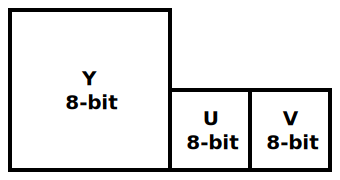
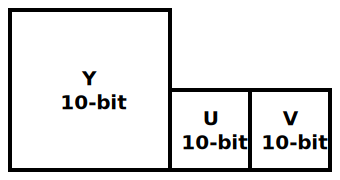
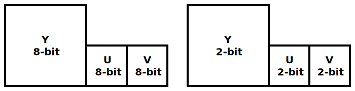
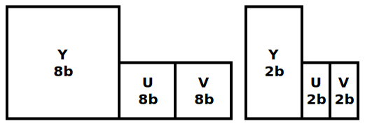

[Top level](../README.md)

See also, the [list of all parameters](Parameters.md)

# Scalable Video Technology for AV1 Encoder (SVT-AV1 Encoder) User Guide

## Table of Contents

__[TOC]__

## Introduction

This document describes how to use the Scalable Video Technology for AV1
Encoder (SVT-AV1). In particular, this user guide describes how to run the
sample application with the respective dynamically linked library.

## Sample Application Guide

This section describes how to run the sample encoder application that uses the
SVT-AV1 Encoder library. It describes the input video format, the command line
input parameters and the resulting outputs.

### Input Video Format

The SVT-AV1 Encoder supports the following input formats:

_8-bit yuv420p_\

_10-bit yuv420p10le_\

### Compressed 10-bit format

In order to reduce the size of the input original YUV file, the SVT-AV1 Encoder
uses a compressed 10-bit format allowing the software to achieve a higher speed
and channel density levels. The conversion between the 10-bit yuv420p10le and
the compressed 10-bit format is a lossless operation and is performed using the
following steps.

#### Unpack the 10-bit picture

This step consists of separating the 10 bit video samples into 8 bit and 2 bit
planes so that each 10-bit picture will be represented as two separate pictures
as shown in the figure below. As a result of the operation, the 2 least
significant bits of the 10 bits will be written into a full byte.

_10-bit yuv420p10le unpacked_\

#### Compress the 2 bit Plane

The unpacking steps separates the 10bits into a group of 8 bits and a group of
2 bits, where the 2 bits are stored in a byte. In this step, every group of
consecutive 4 bytes, each containing 2bits from the unpacking step, are
compressed into one byte. As a result, each 10bit picture will be represented
as two separate pictures as shown in the figure below.

_10-bit yuv420p10le compressed_\

### Running the encoder

This section describes how to run the sample encoder application
`SvtAv1EncApp.exe` (on Windows\*) or `SvtAv1EncApp` (on Linux\*) from the
command line, including descriptions of the most commonly used input parameters
and outputs.

The sample application typically takes the following command line parameters:

`-c filename` **[Optional]**

A text file that contains encoder parameters such as input file name,
quantization parameter etc. Refer to the comments in the Config/Sample.cfg for
specific details. The list of encoder parameters are also listed below. Note
that command line parameters take precedence over the parameters included in
the configuration file when there is a conflict.

`-i filename` **[Required]**

A YUV file (e.g. 8 bit 4:2:0 planar) containing the video sequence that will be
encoded. The dimensions of each image are specified by `-w` and `-h` as
indicated below.

`-b filename` **[Optional]**

The resulting encoded bit stream file in binary format. If none specified, no
output bit stream will be produced by the encoder.

`-w integer` **[Required]**

The width of each input image in units of picture luma pixels, e.g. 1920

`-h integer` **[Required]**]

The height of each input image in units of picture luma pixels, e.g. 1080

`-n integer` **[Optional]**

The number of frames of the sequence to encode. e.g. 100. If the input frame
count is larger than the number of frames in the input video, the encoder will
loopback to the first frame when it is done.

`--keyint integer` **[Optional]**

The keyint defines the display order location at which the encoder would insert
a keyframe. It is recommended to use a value that is (a multiple of the mini
GOP size `(default 16)) + 1` so that the keyframe does not break a mini GOP
formation. When using forward frame, it is recommended that the keyint value is
placed at a multiple of mini-gop size. The mini-gop size is measured by `1 <<
hierarchical-levels`.

SvtAv1EncApp only: optionally accepts a `s` suffix to indicate to use `keyint *
frame-rate` as the keyint value. e.g. `--keyint 5s` for 5 seconds

`--rc integer` **[Optional]**

The rc token sets the bitrate control encoding mode [0: Constant QP OR Constant
Rate Factor, 1: Variable Bitrate, 2: Constant Bitrate].

With `--rc` set to 0, CQP (fixed qp offsets regardless of the content) mode is
enabled using `--aq-mode 0`, else CRF mode (default) will be used. If `--crf`
is set, then aq-mode will be forced to 2, however, if `-q`/`--qp` is set, then
the encoder will use whatever is set for aq-mode.

If a qp/crf value is not specified, a default value is assigned (35).

### Sample command lines

Here are some sample encode command lines

#### 1 pass CRF at maximum speed from 24fps yuv 1920x1080 input
`SvtAv1EncApp -i input.yuv -w 1920 -h 1080 --fps 24 --crf 30 --preset 12 -b output.ivf`

#### 1 pass VBR 1000 Kbps at medium speed from 24fps yuv 1920x1080 input
`SvtAv1EncApp -i input.yuv -w 1920 -h 1080 --fps 24 --rc 1 --tbr 1000 --preset 5 -b output.ivf`

#### Multi-pass VBR 1000 Kbps at maximum quality from 24fps yuv 1920x1080 input
Single command line :

`SvtAv1EncApp -i input.yuv -w 1920 -h 1080 --fps 24 --rc 1 --tbr 1000 --preset 0 --passes 2 --stats stat_file.stat -b output.ivf`

or

Multiple command lines :

`SvtAv1EncApp -i input.yuv -w 1920 -h 1080 --fps 24 --rc 1 --tbr 1000 --preset 0 --pass 1 --stats stat_file.stat`
`SvtAv1EncApp -i input.yuv -w 1920 -h 1080 --fps 24 --rc 1 --tbr 1000 --preset 0 --pass 2 --stats stat_file.stat`
`SvtAv1EncApp -i input.yuv -w 1920 -h 1080 --fps 24 --rc 1 --tbr 1000 --preset 0 --pass 3 --stats stat_file.stat -b output.ivf`

#### 1 pass CRF at maximum speed from 24fps yuv 1920x1080 input with full range video signal
`SvtAv1EncApp -i input.yuv -w 1920 -h 1080 --fps 24 --crf 30 --preset 12 --color-range full -b output.ivf`

#### 1 pass CRF at maximum speed from 24fps yuv 1920x1080 input with colorimetry set to BT.709
`SvtAv1EncApp -i input.yuv -w 1920 -h 1080 --fps 24 --crf 30 --preset 12 --color-primaries bt709 --transfer-characteristics bt709 --matrix-coefficients bt709 -b output.ivf`
