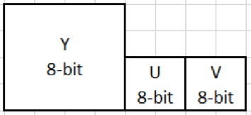
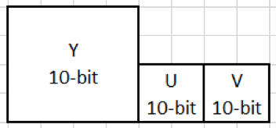
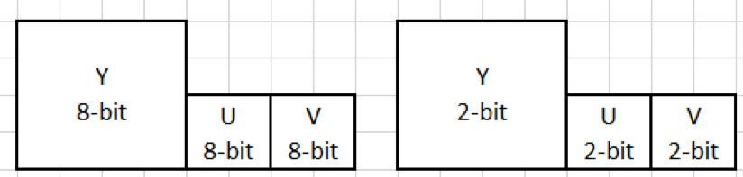
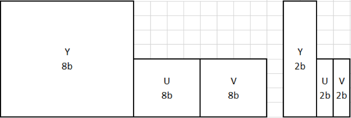
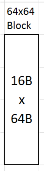
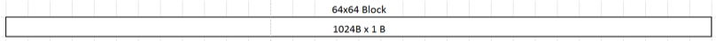

# Scalable Video Technology for AV1 Encoder (SVT-AV1 Encoder) User Guide

## Table of Contents

1. [Introduction](#introduction)
2. [Sample Application Guide](#sample-application-guide)
    - [Input Video Format](#input-video-format)
    - [Compressed 10-bit format](#compressed-10-bit-format)
    - [Running the encoder](#running-the-encoder)
    - [Sample command lines](#sample-command-lines)
    - [List of all configuration parameters](#list-of-all-configuration-parameters)
3. [Legal Disclaimer](#legal-disclaimer)

## Introduction

This document describes how to use the Scalable Video Technology for AV1 Encoder (SVT-AV1). In particular, this user guide describes how to run the sample application with the respective dynamically linked library.

## Sample Application Guide

This section describes how to run the sample encoder application that uses the SVT-AV1 Encoder library. It describes the input video format, the command line input parameters and the resulting outputs.

### Input Video Format

The SVT-AV1 Encoder supports the following input formats:

_8-bit yuv420p_\

_10-bit yuv420p10le_\

### Compressed 10-bit format

In order to reduce the size of the input original YUV file, the SVT-AV1 Encoder uses a compressed 10-bit format allowing the software to achieve a higher speed and channel density levels. The conversion between the 10-bit yuv420p10le and the compressed 10-bit format is a lossless operation and is performed using the following steps.

#### Unpack the 10-bit picture

This step consists of separating the 10 bit video samples into 8 bit and 2 bit planes so that each 10-bit picture will be represented as two separate pictures as shown in the figure below. As a result of the operation, the 2 least significant bits of the 10 bits will be written into a full byte.

_10-bit yuv420p10le unpacked_\

#### Compress the 2 bit Plane

The unpacking steps separates the 10bits into a group of 8 bits and a group of 2 bits, where the 2 bits are stored in a byte. In this step, every group of consecutive 4 bytes, each containing 2bits from the unpacking step, are compressed into one byte. As a result, each 10bit picture will be represented as two separate pictures as shown in the figure below.

_10-bit yuv420p10le compressed_\

#### Unroll the 64x64

Now for a faster read of the samples, every 64x64 block of the 2 bit picture should be written into a one dimensional array. Therefore, the top left 64x64 sample block which is now written into a 16 bytes x 64 bytes after the compression of the 2bit samples, will be written into a 1024 bytes x 1 byte array as shown in the picture below.

_64x64 block after 2 bit compression_\

_64x64 block after unrolling_\

### Running the encoder

This section describes how to run the sample encoder application `SvtAv1EncApp.exe` (on Windows\*) or `SvtAv1EncApp` (on Linux\*) from the command line, including descriptions of the most commonly used input parameters and outputs.

The sample application typically takes the following command line parameters:

`-c filename` **[Optional]**

A text file that contains encoder parameters such as input file name, quantization parameter etc. Refer to the comments in the Config/Sample.cfg for specific details. The list of encoder parameters are also listed below. Note that command line parameters take precedence over the parameters included in the configuration file when there is a conflict.

`-i filename` **[Required]**

A YUV file (e.g. 8 bit 4:2:0 planar) containing the video sequence that will be encoded. The dimensions of each image are specified by `–w` and `–h` as indicated below.

`-b filename` **[Optional]**

The resulting encoded bit stream file in binary format. If none specified, no output bit stream will be produced by the encoder.

`-w integer` **[Required]**

The width of each input image in units of picture luma pixels, e.g. 1920

`-h integer` **[Required]**]

The height of each input image in units of picture luma pixels, e.g. 1080

`-n integer` **[Optional]**

The number of frames of the sequence to encode. e.g. 100. If the input frame count is larger than the number of frames in the input video, the encoder will loopback to the first frame when it is done.

`-intra-period integer` **[Optional]**

The intra period defines the interval of frames after which you insert an Intra refresh. It is strongly recommended to use (multiple of 8) -1 the closest to 1 second (e.g. 55, 47, 31, 23 should be used for 60, 50, 30, (24 or 25) respectively). When using closed gop (-irefresh-type 2) add 1 to the value above (e.g. 56 instead of 55).

`-rc integer` **[Optional]**

This token sets the bitrate control encoding mode [1: Variable Bitrate, 0: Constant QP]. When `-rc` is set to 1, it is best to match the `–lad` (lookahead distance described in the next section) parameter to the `-intra-period`. When `–rc` is set to 0, a qp value is expected with the use of the `–q` command line option otherwise a default value is assigned (25).

For example, the following command encodes 100 frames of the YUV video sequence into the bin bit stream file. The picture is 1920 luma pixels wide and 1080 pixels high using the `Sample.cfg` configuration. The QP equals 30 and the md5 checksum is not included in the bit stream.

`SvtAv1EncApp.exe -c Sample.cfg -i CrowdRun\_1920x1080.yuv -w 1920 -h 1080 -n 100 -q 30 -intra-period 31 -b CrowdRun\_1920x1080\_qp30.bin`

It should be noted that not all the encoder parameters present in the `Sample.cfg` can be changed using the command line.

### Sample command lines

Here are some sample encode command lines

#### 1 pass fixed QP at maximum speed from 24fps yuv 1920x1080 input
`SvtAv1EncApp -i input.yuv -w 1920 -h 1080 -fps 24 -rc 0 -q 30 -enc-mode 8 -b output.ivf`

#### 1 pass VBR 10000 Kbps at medium speed from 24fps yuv 1920x1080 input
`SvtAv1EncApp -i input.yuv -w 1920 -h 1080 -fps 24 -rc 2 -tbr 10000 -enc-mode 5 -b output.ivf`

#### 2 pass fixed QP at maximum quality from 24fps yuv 1920x1080 input
`SvtAv1EncApp -i input.yuv -w 1920 -h 1080 -fps 24 -rc 0 -q 30 -enc-mode 8 -b output.ivf -output-stat-file stat_file.stat`
`SvtAv1EncApp -i input.yuv -w 1920 -h 1080 -fps 24 -rc 0 -q 30 -enc-mode 0 -b output.ivf -input-stat-file stat_file.stat`

### List of all configuration parameters

The encoder parameters present in the `Sample.cfg` file are listed in this table below along with their status of support, command line parameter and the range of values that the parameters can take.

#### Options
| **Configuration file parameter** | **Command line** | **Range** | **Default** | **Description** |
| --- | --- | --- | --- | --- |
| **InputFile** | -i | any string | None | Input file path; "stdin" to take input from standard input stream |
| **StreamFile** | -b | any string | null | Output bitstream file path; "stdout" to emit output to standard output stream |
| **ConfigFile** | -c | any string | null | Configuration file path |
| **ErrorFile** | --errlog | any string | stderr | error log displaying configuration or encode errors |
| **ReconFile** | -o | any string | null | Recon file path. Optional output of recon. |
| **StatFile** | --stat-file | any string | Null | Path to statistics file if specified and StatReport is set to 1, per picture statistics are outputted in the file|
| **NoProgress** | --no-progress | [0,1] | 0 | Use `--no-progress 1` to disable printing of frame processed when encoding |

#### Encoder Global Options
| **Configuration file parameter** | **Command line** | **Range** | **Default** | **Description** |
| --- | --- | --- | --- | --- |
| **SourceWidth** | -w | [64 - 4096] | None | Input source width |
| **SourceHeight** | -h | [0 - 2304] | None | Input source height |
| **FrameToBeEncoded** | -n | [0 - 2^64 -1] | 0 | Number of frames to be encoded, if number of frames is > number of frames in file, the encoder will loop to the beginning and continue the encode. Use -1 to not buffer. |
| **BufferedInput** | --nb | [-1, 1 to 2^31 -1] | -1 | number of frames to preload to the RAM before the start of the encode If -nb = 100 and -n 1000 -- > the encoder will encode the first 100 frames of the video 10 times |
| **EncoderColorFormat** | --color-format | [1 for default] | 1 | Set encoder color format(EB_YUV400, EB_YUV420, EB_YUV422, EB_YUV444) |
| **Profile** | --profile | [0-2, 0 for default] | 0 | Bitstream profile number to use (0: main profile[default], 1: high profile, 2: professional profile) |
| **FrameRate** | --fps | [0 - 2^64 -1] | 25 | If the number is less than 1000, the input frame rate is an integer number between 1 and 60, else the input number is in Q16 format (shifted by 16 bits) [Max allowed is 240 fps] |
| **FrameRateNumerator** | --fps-num | [0 - 2^64 -1] | 0 | Frame rate numerator e.g. 6000 |
| **FrameRateDenominator** | --fps-denom | [0 - 2^64 -1] | 0 | Frame rate denominator e.g. 100 |
| **EncoderBitDepth** | --input-depth | [8 , 10] | 8 | specifies the bit depth of the input video |
| **Encoder16BitPipeline** | --16bit-pipeline | [0 , 1] | 0 | Bit depth for enc-dec(0: lbd[default], 1: hbd) |
| **HierarchicalLevels** | --hierarchical-levels | [3 - 4] | 4 | 0 : Flat4: 5-Level HierarchyMinigop Size = (2^HierarchicalLevels) (e.g. 3 == > 7B pyramid, 4 == > 15B Pyramid) |
| **PredStructure** | --pred-struct | [0-2, 2 for default] | 2 | Set prediction structure( 0: low delay P, 1: low delay B, 2: random access [default]) |
| **HighDynamicRangeInput** | --enable-hdr | [0-1, 0 for default] | 0 | Enable high dynamic range(0: OFF[default], ON: 1) |
| **Asm** | --asm |  [0 - 11] or [c, mmx, sse, sse2, sse3, ssse3, sse4_1, sse4_2, avx, avx2, avx512, max] | 11 or max | Limit assembly instruction set ("0" is equivalent to "c", "1" is "mmx" etc, max value is "11" or "max"), by default select highest assembly instruction that is supported by CPU |
| **LogicalProcessorNumber** | --lp | [0, total number of logical processor] | 0 | The number of logical processor which encoder threads run on.Refer to Appendix A.1 |
| **UnpinSingleCoreExecution** | --unpin-lp1 | [0, 1] | 1 | Unpin the execution . If logical_processors is set to 1, this option does not set the execution to be pinned to core #0 when set to 1. this allows the execution of multiple encodes on the CPU without having to pin them to a specific mask  0=OFF, 1= ON |
| **TargetSocket** | --ss | [-1,1] | -1 | For dual socket systems, this can specify which socket the encoder runs on.Refer to Appendix A.1 |

#### Rate Control Options
| **Configuration file parameter** | **Command line** | **Range** | **Default** | **Description** |
| --- | --- | --- | --- | --- |
| **RateControlMode** | --rc | [0 - 2] | 0 | 0 = CQP , 1 = VBR , 2 = CVBR |
| **TargetBitRate** | --tbr | [1 - 4294967] | 7000 | Target bitrate in kilobits per second when RateControlMode is set to 1, or 2 |
| **UseQpFile** | --use-q-file | [0 - 1] | 0 | When set to 1, overwrite the picture qp assignment using qp values in QpFile |
| **QpFile** | --qpfile | any string | Null | Path to qp file |
| **MaxQpAllowed** | --max-qp | [0 - 63] | Null | Maximum (worst) quantizer[0-63] |
| **MinQpAllowed** | --min-qp | [0 - 63] | Null | Minimum (best) quantizer[0-63] |
| **AdaptiveQuantization** | --adaptive-quantization | [0 - 2] | 0 | 0 = OFF , 1 = variance base using segments , 2 = Deltaq pred efficiency (default) |
| **VBVBufSize** | --vbv-bufsize | [1 - 4294967] | 1 second TargetBitRate | VBV Buffer Size when RateControl is 2. |

#### Twopass Options
| **Configuration file parameter** | **Command line** | **Range** | **Default** | **Description** |
| --- | --- | --- | --- | --- |
| **OutputStatFile** | --output-stat-file | any string | Null | Output stat file for first pass|
| **InputStatFile** | --input-stat-file | any string | Null | Input stat file for second pass|
| **EncoderMode2p** | --enc-mode-2p | [0 - 8] | 8 | Encoder Preset [0,1,2,3,4,5,6,7,8] 0 = highest quality, 8 = highest speed. Passed to encoder's first pass to use the ME settings of the second pass to achieve better bdRate|

#### Keyframe Placement Options
| **Configuration file parameter** | **Command line** | **Range** | **Default** | **Description** |
| --- | --- | --- | --- | --- |
| **IntraPeriod** | --keyint | [-2 - 255] | -1 | Intra period interval(frames) -2: No intra update, -1: default intra period or [0-255] |
| **IntraRefreshType** | --irefresh-type | [1 - 2] | 1 | 1: CRA (Open GOP)2: IDR (Closed GOP) |

#### AV1 Specific Options
| **Configuration file parameter** | **Command line** | **Range** | **Default** | **Description** |
| --- | --- | --- | --- | --- |
| **EncoderMode** | --preset | [0 - 8] | 8 | Encoder Preset [0,1,2,3,4,5,6,7,8] 0 = highest quality, 8 = highest speed |
| **CompressedTenBitFormat** | --compressed-ten-bit-format | [0 - 1] | 0 | Offline packing of the 2bits: requires two bits packed input (0: OFF, 1: ON) |
| **TileRow** | --tile-rows | [0-6] | 0 | log2 of tile rows |
| **TileCol** | --tile-columns | [0-6] | 0 | log2 of tile columns |
| **QP** | -q | [0 - 63] | 50 | Quantization parameter used when RateControl is set to 0 |
| **LookAheadDistance** | --lookahead | [0 - 120] | 33 | When Rate Control is set to 1 it&#39;s best to set this parameter to be equal to the Intra period value (such is the default set by the encoder) [this value is capped by the encoder to its maximum need e.g. 33 for CQP, 2*fps for rate control] |
| **LoopFilterDisable** | --disable-dlf | [0-1, 0 for default] | 0 | Disable loop filter(0: loop filter enabled[default] ,1: loop filter disabled) |
| **CDEFMode** | --cdef-mode | [0-5, -1 for default] | -1 | CDEF Mode, 0: OFF, 1-5: ON with 2,4,8,16,64 step refinement, -1: DEFAULT|
| **RestorationFilter** | --enable-restoration-filtering | [0/1, -1 for default] | -1 | Enable restoration filtering , 0 = OFF, 1 = ON, -1 = DEFAULT|
| **SelfGuidedFilterMode** | --sg-filter-mode | [0-4,  -1 for default] | -1 | Self-guided filter mode (0:OFF, 1: step 0, 2: step 1, 3: step 4, 4: step 16, -1: DEFAULT)|
| **WienerFilterMode** | --wn-filter-mode | [0-3,  -1 for default] | -1 | Wiener filter mode (0:OFF, 1: 3-Tap luma/ 3-Tap chroma, 2: 5-Tap luma/ 5-Tap chroma, 3: 7-Tap luma/ 7-Tap chroma, -1: DEFAULT)|
| **Mfmv** | --enable-mfmv | [0/1, -1 for default] | -1 | Enable motion field motion vector, 0 = OFF, 1 = ON, -1 = DEFAULT|
| **RedundantBlock** | --enable-redundant-blk | [0/1, -1 for default] | -1 | Enable redundant block skipping same neighbors non-square partitions, 0 = OFF, 1 = ON, -1 = DEFAULT|
| **SpatialSSEfl** | --enable-spatial-sse-fl | [0/1, -1 for default] | -1 | Enable spatial sse full loop, 0 = OFF, 1 = ON, -1 = DEFAULT|
| **Subpel** | --subpel | [0/1, -1 for default] | -1 | Enable subpel, 0 = OFF, 1 = ON, -1 = DEFAULT|
| **OverBoundryBlock** | --enable-over-bndry-blk | [0/1, -1 for default] | -1 | Enable over boundary block mode, 0 = OFF, 1 = ON, -1 = DEFAULT|
| **NewNearestCombInjection** | --enable-new-nrst-near-comb | [0/1, -1 for default] | -1 | Enable new nearest near comb injection, 0 = OFF, 1 = ON, -1 = DEFAULT|
| **PruneUnipredMe** | --enable-prune-unipred-me | [0/1, -1 for default] | -1 | Enable prune unipred at me, 0 = OFF, 1 = ON, -1 = DEFAULT|
| **PruneRefRecPart** | --enable-prune-ref-rec-part | [0/1, -1 for default] | -1 | Enable prune prune ref frame for rec partitions, 0 = OFF, 1 = ON, -1 = DEFAULT|
| **NsqTable** | --enable-nsq-table-use | [0/1, -1 for default] | -1 | Enable nsq table, 0 = OFF, 1 = ON, -1 = DEFAULT|
| **FrameEndCdfUpdate** | --enable-framend-cdf-upd-mode | [0/1, -1 for default] | -1 | Enable frame end cdf update mode, 0 = OFF, 1 = ON, -1 = DEFAULT|
| **ChromaMode** | --chroma-mode | [0-3, -1 for default] | -1 | Chroma Mode  -1 = DEFAULT 0 = Full chroma search @ MD   1 = Fast chroma search @ MD   2 = Chroma blind @ MD + CFL @ EP  3 = Chroma blind @ MD + no CFL @ EP |
| **DisableCfl** | --disable-cfl | [0/1, -1 for default] | -1 | Disable chroma from luma (CFL), 0 = OFF (do not disable), 1 = ON (disable), -1 = DEFAULT|
| **LocalWarpedMotion** | --enable-local-warp | [0 - 1] | 0 | Enable warped motion use , 0 = OFF, 1 = ON |
| **GlobalMotion** | --enable-global-motion | [0-1, 1 for default] | 1 | Enable global motion (0: OFF, 1: ON [default]) |
| **CombineClass12** | --enable-class-12 | [0/1, -1 for default] | -1 | Enable combine Mode decision Classes 1 and 2 (inter classes), 0 = OFF, 1 = ON, -1 = DEFAULT|
| **EdgeSkipAngleIntra** | --enable-intra-edge-skp | [0/1, -1 for default] | -1 | Enable skip angle intra based on edge, 0 = OFF, 1 = ON, -1 = DEFAULT|
| **PicBasedRateEst** | --enable-pic-based-rate-est | [0/1, -1 for default] | -1 | Enable picture based rate estimation. Only active with lp 1 (0: OFF, 1: ON, -1: DEFAULT)|
| **IntraAngleDelta** | --enable-intra-angle-delta | [0/1, -1 for default] | -1 | Enable intra angle delta filtering (0: OFF, 1: ON, -1 = DEFAULT |
| **InterIntraCompound** | --enable-interintra-comp | [0/1, -1 for default] | -1 | Enable inter intra compound, 0 = OFF, 1 = ON, -1 = DEFAULT|
| **Paeth** | --enable-paeth | [0/1, -1 for default] | -1 | Enable Intra Paeth pred, 0 = OFF, 1 = ON, -1 = DEFAULT|
| **Smooth** | --enable-smooth | [0/1, -1 for default] | -1 | Enable Intra Smooth pred, 0 = OFF, 1 = ON, -1 = DEFAULT|
| **Obmc** | --enable-obmc | [0-1, 1 for default] | 1 | Enable OBMC(0: OFF, 1: ON[default]) |
| **RDOQ** | --enable-rdoq | [0/1, -1 for default] | -1 | Enable RDOQ, 0 = OFF, 1 = ON, -1 = DEFAULT |
| **FilterIntra** | --enable-filter-intra | [0-1, 1 for default] | 1 | Enable filter intra prediction mode (0: OFF, 1: ON [default]) |
| **IntraEdgeFilter** | --enable-intra-edge-filter | [0/1, -1 for default] | -1 | Enable intra edge filter (0: OFF, 1: ON, -1: DEFAULT)|
| **PredMe** | --pred-me | [0-5, -1 for default] | -1 | Closed loop motion search. Set predictive me level:  -1 = DEFAULT 0 = OFF  1 = 7x5 full-pel search + sub-pel refinement off  2 = 7x5 full-pel search +  (H + V) sub-pel refinement only = 4 half-pel + 4 quarter-pel = 8 positions + pred_me_distortion to pa_me_distortion deviation on  3 = 7x5 full-pel search +  (H + V + D only ~ the best) sub-pel refinement = up to 6 half-pel + up to 6  quarter-pel = up to 12 positions + pred_me_distortion to pa_me_distortion deviation on  4 = 7x5 full-pel search +  (H + V + D) sub-pel refinement = 8 half-pel + 8 quarter-pel = 16 positions + pred_me_distortion to pa_me_distortion deviation on  5 = 7x5 full-pel search +  (H + V + D) sub-pel refinement = 8 half-pel + 8 quarter-pel = 16 positions + pred_me_distortion to pa_me_distortion deviation off |
| **Bipred3x3** | --bipred-3x3 | [0-2, -1 for default] | -1 | Set bipred3x3 injection, 0 = OFF, 1 = ON FULL, 2 = Reduced set, -1 = DEFAULT|
| **CompoundLevel** | --compound | [0-2, -1 for default] | -1 | Set compound mode:  -1 = DEFAULT 0 = OFF: No compond mode search : AVG only  1 = ON: compond mode search: AVG/DIST/DIFF  2 = ON: AVG/DIST/DIFF/WEDGE |
| **UseDefaultMeHme** | --use-default-me-hme | [0 - 1] | 1 | 0 : Overwrite Default ME HME parameters1 : Use default ME HME parameters, dependent on width and height |
| **HME** | --hme | [0 - 1] | 1 | Enable HME, 0 = OFF, 1 = ON |
| **HMELevel0** | --hme-l0 | [0 - 1] | 1 | Enable HME Level 0 , 0 = OFF, 1 = ON |
| **HMELevel1** | --hme-l1 | [0 - 1] | Depends on input resolution | Enable HME Level 1 , 0 = OFF, 1 = ON |
| **HMELevel2** | --hme-l2 | [0 - 1] | Depends on input resolution | Enable HME Level 2 , 0 = OFF, 1 = ON |
| **ExtBlockFlag** | --ext-block | [0 - 1] | Depends on --preset | Enable the non-square block 0=OFF, 1= ON |
| **SearchAreaWidth** | --search-w | [1 - 256] | Depends on input resolution | Search Area in Width |
| **SearchAreaHeight** | --search-h | [1 - 256] | Depends on input resolution | Search Area in Height |
| **NumberHmeSearchRegionInWidth** | --num-hme-w | [1 - 2] | Depends on input resolution | Search Regions in Width |
| **NumberHmeSearchRegionInHeight** | --num-hme-h | [1 - 2] | Depends on input resolution | Search Regions in Height |
| **HmeLevel0TotalSearchAreaWidth** | --hme-tot-l0-w | [1 - 256] | Depends on input resolution | Total HME Level 0 Search Area in Width |
| **HmeLevel0TotalSearchAreaHeight** | --hme-tot-l0-h | [1 - 256] | Depends on input resolution | Total HME Level 1 Search Area in Width |
| **ScreenContentMode** | --scm | [0 - 2] | 0 | Enable Screen Content Optimization mode (0: OFF, 1: ON, 2: Content Based Detection) |
| **IntraBCMode** | --intrabc-mode | [0 - 3], -1 for default] | -1 | IntraBC mode (0 = OFF, 1 = ON slow, 1 = ON faster, 2 = ON fastest, -1 = DEFAULT) |
| **HighBitDepthModeDecision** | --hbd-md | [0-2, 1 for default] | 1 | Enable high bit depth mode decision(0: OFF, 1: ON partially[default],2: fully ON) |
| **PaletteMode** | --palette | [0 - 6] | -1 | Enable Palette mode (-1: DEFAULT (ON at level6 when SC is detected), 0: OFF 1: ON Level 1, ...6: ON Level6 ) |
| **UnrestrictedMotionVector** | --umv | [0-1] | 1 | Enables or disables unrestriced motion vectors, 0 = OFF(motion vectors are constrained within tile boundary), 1 = ON. For MCTS support, set -umv 0 |
| **Injector** | --inj | [0-1, 0 for default] | 0 | Inject pictures at defined frame rate(0: OFF[default],1: ON) |
| **InjectorFrameRate** | --inj-frm-rt | Null | Null | Set injector frame rate |
| **SpeedControlFlag** | --speed-ctrl | [0-1, 0 for default] | 0 | Enable speed control(0: OFF[default], 1: ON) |
| **FilmGrain** | --film-grain | [0-50, 0 for default] | 0 | Enable film grain(0: OFF[default], 1 - 50: Level of denoising for film grain) |
| **HmeLevel0SearchAreaInWidth** | --hme-l0-w | [1 - 256] | Depends on input resolution | HME Level 0 Search Area in Width for each region, separated in spaces, the number of input search areas must equal to NumberHmeSearchRegionInWidth, and the sum must equal toHmeLevel0TotalSearchAreaWidth |
| **HmeLevel0SearchAreaInHeight** | --hme-l0-h | [1 - 256] | Depends on input resolution | HME Level 0 Search Area in Height for each region, separated in spaces, the number of input search areas must equal to NumberHmeSearchRegionInHeight, and the sum must equal toHmeLevel0TotalSearchAreaHeight |
| **HmeLevel1SearchAreaInWidth** | --hme-l1-w | [1 - 256] | Depends on input resolution | HME Level 1 Search Area in Width for each region, separated in spaces, the number of input search areas must equal to NumberHmeSearchRegionInWidth |
| **HmeLevel1SearchAreaInHeight** | --hme-l1-h | [1 - 256] | Depends on input resolution | HME Level 1 Search Area in Height for each region, separated in spaces, the number of input search areas must equal to NumberHmeSearchRegionInHeight |
| **HmeLevel2SearchAreaInWidth** | --hme-l2-w | [1 - 256] | Depends on input resolution | HME Level 2 Search Area in Width for each region, separated in spaces, the number of input search areas must equal to NumberHmeSearchRegionInWidth |
| **HmeLevel2SearchAreaInHeight** | --hme-l2-h | [1 - 256] | Depends on input resolution | HME Level 2 Search Area in Height for each region, separated in spaces, the number of input search areas must equal to NumberHmeSearchRegionInHeight |
| **EnableAltRefs** | --enable-altrefs | [0-1, 1 for default] | 1 | Enable automatic alt reference frames(0: OFF, 1: ON[default]) |
| **AltRefStrength** | --altref-strength | [0-6, 5 for default] | 5 | AltRef filter strength([0-6], default: 5) |
| **AltRefNframes** | --altref-nframes | [0-10, 7 for default] | 7 | AltRef max frames([0-10], default: 7) |
| **EnableOverlays** | --enable-overlays | [0-1, 0 for default] | 0 | Enable the insertion of an extra picture called overlayer picture which will be used as an extra reference frame for the base-layer picture(0: OFF[default], 1: ON) |
| **SquareWeight** | --sqw | 0 for off and any whole number percentage | 100 | Weighting applied to square/h/v shape costs when deciding if a and b shapes could be skipped. Set to 100 for neutral weighting, lesser than 100 for faster encode and BD-Rate loss, and greater than 100 for slower encode and BD-Rate gain|
| **ChannelNumber** | -nch | [1 - 6] | 1 | Number of encode instances |
| **MDS1PruneClassThreshold** | --mds-1-class-th | 0 for off and any whole number percentage | 100 | Deviation threshold (expressed as a percentage) of an inter-class class pruning mechanism before MD Stage 1 |
| **MDS1PruneCandThreshold** | --mds-1-cand-th | 0 for off and any whole number percentage | 75 | Deviation threshold (expressed as a percentage) of an intra-class candidate pruning mechanism before MD Stage 1 |
| **MDS23PruneClassThreshold** | --mds-2-3-class-th | 0 for off and any whole number percentage | 25 | Deviation threshold (expressed as a percentage) of an inter-class class pruning mechanism before MD Stage 2/3 |
| **MDS23PruneCandThreshold** | --mds-2-3-cand-th | 0 for off and any whole number percentage | 15 | Deviation threshold (expressed as a percentage) of an intra-class candidate pruning mechanism before MD Stage 2/3 |
| **StatReport** | --enable-stat-report | [0 - 1] | 0 | When set to 1, calculates and outputs average PSNR values |

## Appendix A Encoder Parameters

### 1. Thread management parameters

LogicalProcessorNumber (`-lp`) and TargetSocket (`-ss`) parameters are used to management thread affinity on Windows and Ubuntu OS. These are some examples how you use them together.

If LogicalProcessorNumber and TargetSocket are not set, threads are managed by OS thread scheduler.

`SvtAv1EncApp.exe -i in.yuv -w 3840 -h 2160 –lp 40`

If only LogicalProcessorNumber is set, threads run on 40 logical processors. Threads may run on dual sockets if 40 is larger than logical processor number of a socket.

NOTE: On Windows, thread affinity can be set only by group on system with more than 64 logical processors. So, if 40 is larger than logical processor number of a single socket, threads run on all logical processors of both sockets.

`SvtAv1EncApp.exe -i in.yuv -w 3840 -h 2160 –ss 1`

If only TargetSocket is set, threads run on all the logical processors of socket 1.

`SvtAv1EncApp.exe -i in.yuv -w 3840 -h 2160 –lp 20 –ss 0`

If both LogicalProcessorNumber and TargetSocket are set, threads run on 20 logical processors of socket 0. Threads guaranteed to run only on socket 0 if 20 is larger than logical processor number of socket 0.

## Legal Disclaimer

### Optimization Notice

Intel compilers may or may not optimize to the same degree for non-Intel microprocessors for optimizations that are not unique to Intel microprocessors. These optimizations include SSE2, SSE3, and SSSE3 instruction sets and other optimizations. Intel does not guarantee the availability, functionality, or effectiveness of any optimization on microprocessors not manufactured by Intel. Microprocessor-dependent optimizations in this product are intended for use with Intel microprocessors. Certain optimizations not specific to Intel microarchitecture are reserved for Intel microprocessors. Please refer to the applicable product User and Reference Guides for more information regarding the specific instruction sets covered by this notice.

### Notice Revision #20110804

Intel technologies features and benefits depend on system configuration and may require enabled hardware, software or service activation. Performance varies depending on system configuration. No computer system can be absolutely secure. Check with your system manufacturer or retailer.

No license (express or implied, by estoppel or otherwise) to any intellectual property rights is granted by this document.

Intel disclaims all express and implied warranties, including without limitation, the implied warranties of merchantability, fitness for a particular purpose, and non-infringement, as well as any warranty arising from course of performance, course of dealing, or usage in trade.

The products and services described may contain defects or errors known as errata which may cause deviations from published specifications. Current characterized errata are available on request.  ** ** No product or component can be absolutely secure.

This document contains information on products, services and/or processes in development. All information provided here is subject to change without notice. Contact your Intel representative to obtain the latest forecast, schedule, specifications and roadmaps.

Intel, Intel Xeon, Intel Core, the Intel logo and others are trademarks of Intel Corporation and its subsidiaries in the U.S. and/or other countries.

\*Other names and brands may be claimed as the property of others.

Copyright 2019 Intel Corporation.
